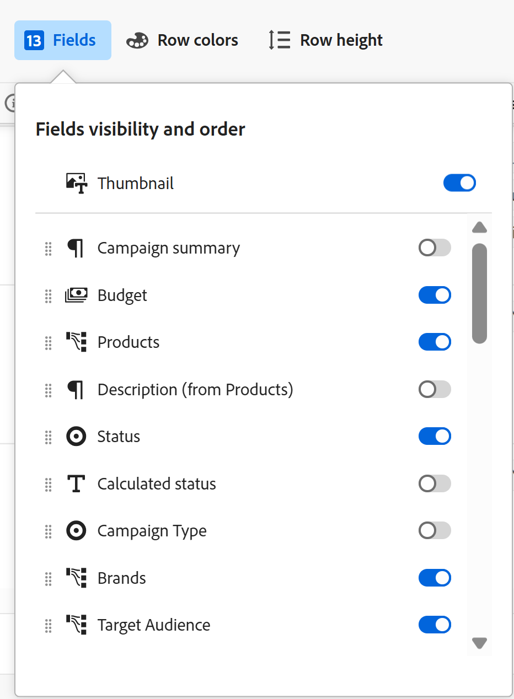

# Gérer la vue de tableau

<!--
title: Manage the table view
description: You can display records in a table view when using Adobe Workfront Planning. 
hidefromtoc: yes
author: Alina
feature: Work Management
role: User
hide: yes
-->

<!--update the metadata with real information when making this available in TOC and in the left nav-->

{{planning-important-intro}}

Vous pouvez afficher les enregistrements et leurs champs dans la vue de tableau lors de l’accès à la page du type d’enregistrement dans Adobe Workfront Planning.

Pour plus d’informations sur les vues d’enregistrement et leur gestion, consultez la section [Gérer les vues d’enregistrement](/help/quicksilver/planning/views/manage-record-views.md).

## Conditions d’accès

Vous devez disposer des accès suivants pour effectuer les étapes de cet article :

<!--at GA the plan below will change to Prime, Select and Ultimate only-->

<table style="table-layout:auto">
 <col>
 </col>
 <col>
 </col>
 <tbody>
    <tr>
<tr>
<td>
   
 Produit
 </td>
   <td>
   
 Adobe Workfront
 </td>
  </tr>  
 <td role="rowheader">
Accord Adobe Workfront
</td>
   <td>

Votre entreprise doit être inscrite à l’étape d’accès anticipé pour la planification Workfront 

   </td>
  </tr>
  <tr>
   <td role="rowheader">
Forfait Adobe Workfront
</td>
   <td>

N’importe quelle

   </td>
  </tr>
  <tr>
   <td role="rowheader">
Licence Adobe Workfront*
</td>
   <td>
   
Nouvelle : standard

   Ou
   
Actuelle : formule 
 
  </td>
  </tr>

<tr>
   <td role="rowheader">
Configurations du niveau d’accès
</td>
   <td> Il n’existe aucun contrôle d’accès pour Adobe Workfront Planning
  
</td>
  </tr>

<tr>
   <td role="rowheader">
Autorisations
</td>
   <td> 
Autorisations de gestion d’une vue
  
   
Afficher les autorisations d’une vue pour modifier temporairement les paramètres d’affichage

</td>
  </tr>

<tr>
   <td role="rowheader">
Modèle de disposition
</td>
   <td> 
Toutes les personnes, y compris les administrateurs et administratrices de Workfront, doivent se voir attribuer un modèle de mise en page incluant la zone Planning dans le menu principal. 
 
Pour plus d’informations, voir <a href="/help/quicksilver/planning/access/access-overview.md">Vue d’ensemble des accès</a>. 
 
</td>
  </tr>
 </tbody>
</table>

*Pour plus d’informations, voir [Conditions d’accès requises dans la documentation Workfront](/help/quicksilver/administration-and-setup/add-users/access-levels-and-object-permissions/access-level-requirements-in-documentation.md).

## Gérer une vue de tableau {#manage-a-table-view}

<!--insert screen shot of table view-->

Lors de la création d&#39;une vue de tableau, tous les enregistrements du type sélectionné s’affichent dans un tableau. Chaque ligne est un enregistrement unique et chaque colonne est un champ d’enregistrement. Tous les champs et tous les enregistrements s’affichent par défaut.

Pour gérer une vue de tableau, procédez comme suit :

1. Créez une vue de tableau, comme décrit dans l’article [Gérer les vues d’enregistrement](/help/quicksilver/planning/views/manage-record-views.md).

   

1. (Facultatif) Cliquez sur **Hauteur de ligne**, puis sélectionnez l’une des options suivantes pour modifier la hauteur des lignes du tableau :
   * Court
   * Moyen
   * Grand

1. Mettez à jour les éléments de vue suivants comme décrit dans les sous-sections ci-dessous :
   * [Colonnes (ou champs)](#add-columns-or-fields)
   * [Lignes (ou enregistrements)](#add-rows-or-records)
   * [Filtres](#add-filters)
   * [Regroupement ](#add-groupings)
   * [Tri](#add-a-sort)

### Ajouter des colonnes (ou des champs) {#add-columns}

Les en-têtes de colonne d’une vue de tableau affichent les champs associés aux enregistrements de la vue. Les mêmes champs affichés dans la vue de tableau s’affichent également dans la section Détails d’un enregistrement. Pour plus d’informations, consultez la section [Modifier les enregistrements](/help/quicksilver/planning/records/edit-records.md).

<!--this is not available yet:You can display record fields (or columns) in both a table and a timeline view. However, the number of columns displayed in the table of the timeline view is limited and you cannot add columns in addition to those selected by default.-->

L’ajout de colonnes à une vue est identique à l’ajout de champs à un type d’enregistrement.

Vous pouvez ajouter jusqu’à 500 champs (ou colonnes) dans une vue de tableau.

1. Accédez à une page d’un type d’enregistrement et sélectionnez une vue de **Tableau** dans le menu déroulant de la vue.

   <!-- replace above with this when view redesign: Go to a record type page and click a table view tab, or click **+ View **to add a new view, then choose **Table**. -->
1. Commencez à ajouter des champs (ou des colonnes), comme décrit dans l’article [Créer des champs](/help/quicksilver/planning/fields/create-fields.md).

   Les colonnes que vous ajoutez sont visibles par toutes les personnes qui accèdent au type d’enregistrement et sont ajoutées en tant que nouveaux champs sur la page de l’enregistrement.

1. Pour réorganiser les colonnes du tableau, effectuez l’une des opérations suivantes :

   * Faites glisser l’en-tête de colonne et déposez-le à l’emplacement souhaité. La colonne que vous avez déplacée s’affiche brièvement avec un arrière-plan bleu jusqu’à ce que vous apportiez d’autres ajustements au tableau.

   * Cliquez sur **Champs** dans la barre d’outils du tableau, effectuez une opération de glisser-déposer pour placer les champs dans l’ordre souhaité, puis cliquez en dehors de la zone **Visibilité et ordre des champs** pour la fermer.

     

     >[!TIP]
     >
     >* Par défaut, le champ Nom est toujours le premier champ de la vue de tableau. Il s’agit d’un champ principal.
     >
     >* Vous ne pouvez pas déplacer le champ Nom vers un autre emplacement, sauf si vous désigner un autre champ comme champ principal. Pour plus d’informations, passez à l’étape 4. <!--accurate?-->
     >
     >

   * Remplacez le champ de la première colonne par un autre champ en modifiant le champ principal. Pour plus d’informations, passez à l’étape 4. <!--accurate?-->

1. (Facultatif) Pointez sur un nom de champ dans l’en-tête de colonne d’un champ qui ne s’affiche pas dans la première colonne du tableau, cliquez sur la flèche vers le bas située à droite du nom du champ, puis sur **Définir comme champ principal**.

   

1. Cliquez sur **Définir le champ** pour confirmer l’opération.

   Le champ devient un champ principal, ce qui signifie qu’il s’affiche comme la première colonne de la vue de tableau. Le champ principal précédent est déplacé dans la seconde colonne.

   Les champs de Principal deviennent le titre et s’affichent dans la zone d’en-tête de la page de l’enregistrement, et partout où les enregistrements s’affichent. Par exemple, le titre de l’enregistrement s’affiche dans les champs connectés et dans toutes les vues. Pour plus d’informations sur les champs principaux, voir [Champ Principal - Aperçu](/help/quicksilver/planning/fields/primary-field-overview.md).

1. Cliquez et faites glisser les lignes de séparation des colonnes et déposez-les à l’emplacement souhaité pour augmenter la largeur des colonnes.

   >[!TIP]
   >
   >Les modifications apportées à la largeur et à l’ordre des colonnes sont permanentes et visibles par toutes les personnes qui accèdent au type d’enregistrement.

1. Pointez sur l’en-tête de colonne, puis cliquez sur la flèche vers le bas et sur **Masquer le champ**.

   Ou

   Cliquez sur **Champs** dans la barre d’outils du tableau et désactivez le bouton (bascule) associé aux champs (ou colonnes) à masquer. La zone **Visibilité et ordre des champs** s’affiche.

   >[!TIP]
   >
   >Le nombre de champs masqués s’affiche à gauche de l’icône Champs de la barre d’outils.

1. Cliquez sur l’icône **Champs** et activez le bouton (bascule) associé aux champs que vous souhaitez afficher dans les colonnes du tableau. Tous les champs s’affichent par défaut.

1. Procédez comme suit pour rechercher rapidement les enregistrements correspondant à un mot-clé :

   1. Cliquez sur l’icône **Rechercher**  et commencez à saisir un mot-clé associé à n’importe quel champ d’un enregistrement qui s’affiche à l’écran. Le nombre de correspondances correctes s’affiche en regard de l’élément de recherche et le champ avec la correspondance correcte est mis en surbrillance.

      

      Vous pouvez utiliser n’importe quel mot ou caractère spécial visible à l’écran.

      Vous ne pouvez pas utiliser de mots-clés associés à des champs masqués dans la vue de tableau.

   1. Appuyez sur **Entrée** avec votre clavier pour accéder au champ suivant trouvé.

   1. (Facultatif) S’il existe plusieurs correspondances, cliquez sur les flèches haut et bas situées à droite du mot-clé de recherche pour trouver toutes les correspondances dans le tableau.

   1. Cliquez sur l’icône **x** dans la zone de recherche pour effacer le mot-clé de recherche.

### Ajouter des lignes (ou des enregistrements) {#add-rows}

Les lignes d’une vue de tableau affichent des enregistrements individuels du type d’enregistrement sélectionné.

Vous pouvez avoir jusqu’à 50 000 enregistrements (ou lignes) pour un type d’enregistrement.

1. Accédez à une page du type d’enregistrement et sélectionnez une vue de **Tableau** dans le menu déroulant de la vue.

<!-- replace above with this when view redesign: Go to a record type page and click a table view tab, or click **+ View **to add a new view, then choose **Table**. -->
1. Commencez à ajouter des enregistrements (ou des lignes), comme décrit dans l’article [Créer des enregistrements](/help/quicksilver/planning/records/create-records.md).

   Les enregistrements que vous ajoutez dans la vue de tableau sont immédiatement enregistrés et visibles par toutes les personnes disposant d’autorisations d’affichage ou supérieures à l’espace de travail.

1. (Facultatif) Ajoutez une miniature à chaque enregistrement, cliquez sur **Champs** dans le coin supérieur droit du tableau, puis sélectionnez le bouton (bascule) du champ **Miniature** pour l’afficher à gauche du champ principal. Cette option est désélectionnée par défaut.

   Pour plus d’informations, consultez la section [Ajouter une miniature à un enregistrement](/help/quicksilver/planning/records/add-thumbnails-to-records.md).

1. (Facultatif) Sélectionnez un ou plusieurs enregistrements dans une ligne, puis faites glisser et déposez le **handle** icon  à gauche de l’enregistrement pour réorganiser les lignes.

   >[!NOTE]
   >
   >Vous ne pouvez pas réorganiser les lignes si vous appliquez au moins un tri à la vue de tableau.

   <!-- this is not possible right now:

    1. To reorder the rows, click the row header, drag and drop it in the desired location. 

        The changes you make to the row order are permanent and visible to all users who access the record type
    -->

<!-- this section below links from the timeline view; consider splitting them if they become different-->

### Ajouter des filtres {#add-filters}

Les filtres permettent de réduire la quantité d’informations affichées à l’écran.

Tenez compte des points suivants lorsque vous utilisez des filtres dans la vue de tableau :<!-- this list is almost identical to the one for the table view - update both-->

* Les filtres que vous créez pour la vue de tableau fonctionnent indépendamment des filtres de la vue de chronologie lorsqu’ils sont appliqués au même type d’enregistrement.

* Les filtres sont propres à la vue que vous sélectionnez. Des filtres différents peuvent être appliqués à deux vues de tableau d’un même type d’enregistrement. Deux personnes qui visualisent la même vue de tableau voient le même filtre actuellement appliqué.

* Vous ne pouvez pas nommer les filtres que vous créez et appliquez à une vue de tableau.

* Le fait de supprimer des filtres les supprime de toute personne accédant au même type d’enregistrement et utilisant la même vue que vous.

* L’ajout de filtres à la vue de tableau est identique à l’ajout de filtres à la vue chronologique.

* Vous pouvez filtrer par champ d’enregistrement ou champ de recherche connecté.

* Vous pouvez filtrer par champs de recherche qui affichent plusieurs valeurs.

* Vous pouvez référencer un champ situé à 4 niveaux au maximum du type d’enregistrement actif. Par exemple, si vous créez un filtre pour un type d’enregistrement Activité et que l’activité est connectée au type d’enregistrement Produit connecté au type d’enregistrement Campagne connecté à un projet Workfront, vous pouvez référencer le budget du projet dans le filtre que vous créez pour le type d’enregistrement Activité .

Pour ajouter un filtre à une vue de tableau, procédez comme suit :

1. Créez une vue de tableau pour une page d’un type d’enregistrement, comme décrit dans l’article [Gérer les vues d’enregistrement](/help/quicksilver/planning/views/manage-record-views.md).
1. Sélectionnez une vue de tableau, puis cliquez sur **Filtres** dans le coin supérieur droit du tableau.
1. Cliquez sur **Ajouter une condition** et ajoutez les informations suivantes :

   * **Sélection d’un champ** que vous souhaitez filtrer <!-- the tip below might change-->

   * **Sélection d’une option** (ou un modificateur de filtre) pour définir le type de condition que le champ doit remplir

     Le tableau ci-dessous présente les modificateurs disponibles pour chaque type de champ.

     <table>
        <thead>
        <tr>
            <th><b>Type de champ</b></th>
            <th><b>Modificateurs</b></th>
        </tr>
        </thead>
        <tbody>
        <tr>
            <td>Une seule ligne, Paragraphe, Formule </td>
            <td>
Contient

            
Ne contient pas

            
Est

            
N’est pas

            
Est vide

            
N’est pas vide
</td>
        </tr>
        <tr><td>Sélection unique</td>
            <td>
Est

            
N’est pas

            
Est l’un des

            
N’est aucun de

            
Est vide

            
N’est pas vide
</td>
        </tr>
        <tr>
            <td>Sélection multiple, Personnes</td>
            <td>
A l’un des

            
Dispose de tous les

            
Est exactement

            
N’a aucun(e) des

            
Est vide

            
N’est pas vide
</td>
        </tr>
        <tr>
            <td>Nombre, Pourcentage, Devise</td>
            <td>
=

            
≠

            
 &lt; 

            
&gt;

            
≤

            
≥

            
Est vide

            
N’est pas vide
</td>
        </tr>
        <tr>
            <td>Date</td>
            <td>
Est

            
N’est pas

            
Est après

            
Est avant

            
Est compris entre

N’est pas compris entre

            
Est vide

N’est pas vide
</td>
        </tr>

     <tr>
            <td>Case à cocher</td>
            <td>
Est

        </tr>
        </tbody>
        </table>

   * Sélectionnez une valeur pour le champ sélectionné.

   

   Le nombre de conditions de filtrage que vous pouvez ajouter est illimité.

1. (Facultatif) Cliquez sur **Ajouter une condition** pour ajouter une autre option de filtrage et répétez les étapes ci-dessus. Le nombre de filtres appliqués s’affiche à gauche de l’icône Filtres.
1. Cliquez sur les opérateurs suivants pour indiquer comment les conditions de filtrage sont jointes et doivent être appliquées :

   * **Et** : toutes les conditions spécifiées doivent être remplies.
   * **Ou** : l’une des conditions spécifiées doit être remplie. Il s’agit de l’option par défaut.

   La liste des enregistrements est filtrée automatiquement.  <!--at this time, you can't name and save the filter - but will this change?!-->
   <!-- asked on the task for the simple filters whether there is a limitation for how many statements a filter can have?!-->

1. (Facultatif) Cliquez sur **Filtres**, puis cliquez sur l’icône **x** pour supprimer un filtre. <!--right now you cannot "clear all" for filters, but this might come later-->

### Ajouter des regroupements {#add-groupings}

<!--this section exists in the timeline view too, but the display is slightly different, so I kept both steps; consider updating both sections if any updates to groupings are introduced-->

Vous pouvez regrouper des enregistrements selon des informations similaires lors de l’application d’un regroupement à une vue.

L’ajout de regroupements dans la vue de tableau est similaire à l’ajout de regroupements à la vue chronologique.

Tenez compte des points suivants :

* Vous pouvez appliquer des regroupements dans les vues de tableau et chronologique. Les regroupements de la vue de tableau sont indépendants de ceux de la vue chronologique du même type d’enregistrement.
* Vous pouvez appliquer 3 niveaux de regroupement dans une vue. Les enregistrements sont regroupés dans l’ordre des regroupements que vous sélectionnez.
&lt;!--* Vous pouvez appliquer jusqu’à 4 niveaux de regroupement lors de l’utilisation de l’API. --point à vérifier—>
* Les regroupements sont propres à la vue sélectionnée. Deux vues de tableau d’un même type d’enregistrement peuvent avoir des regroupements différents. Deux personnes qui consultent le même tableau voient le même regroupement appliqué actuellement.
* Vous ne pouvez pas nommer les regroupements que vous créez pour une vue de tableau.
* La suppression de regroupements les supprime pour toute personne accédant au même type d’enregistrement que vous et qui affiche la même vue que vous.
* Vous pouvez modifier les enregistrements répertoriés sous un regroupement.
* Vous pouvez regrouper par champs d’enregistrement ou de recherche connectés.
* Lorsque vous effectuez un regroupement par champs de recherche avec plusieurs valeurs (qui n’ont pas été résumées par un agrégateur), les enregistrements sont regroupés selon chaque combinaison unique de valeurs de champ.
* Vous pouvez référencer un champ situé à 4 niveaux au maximum du type d’enregistrement actif. Par exemple, si vous créez un regroupement pour un type d’enregistrement Activité et que l’activité est connectée au type d’enregistrement Produit connecté au type d’enregistrement Campagne connecté à un projet Workfront, vous pouvez référencer l’état du projet dans le regroupement que vous créez pour le type d’enregistrement Activité .
<!--checking into this: * You can apply up to 4 levels of grouping when using the API. -->
<!-- checking also into this: * You cannot group by a Paragraph-type field.-->

Pour ajouter un regroupement, procédez comme suit :

1. Créez une vue chronologique pour un type d’enregistrement, comme décrit dans l’article [Gérer les vues d’enregistrement](/help/quicksilver/planning/views/manage-record-views.md).
1. Cliquez sur **Regroupement** dans le coin supérieur droit de la vue de tableau.

   

1. Cliquez sur l’un des champs proposés ou cliquez sur **Choisir un autre champ**, recherchez un autre champ, puis cliquez dessus lorsqu’il s’affiche dans la liste.

   Le regroupement est appliqué automatiquement au tableau et les enregistrements s’affichent sous la ligne de séparation du regroupement.

1. (Facultatif) Cliquez sur **Ajouter une condition** et répétez les étapes ci-dessus pour ajouter jusqu’à 3 regroupements.

   Le nombre de champs sélectionnés pour le regroupement s’affiche en regard de l’icône Regroupement.

   

1. (Facultatif) Dans la zone **Regrouper les enregistrements par**, cliquez sur l’icône **x** en regard d’un champ sélectionné pour le regroupement afin de supprimer le regroupement.

   Ou

   Cliquez sur **Effacer tout** pour supprimer tous les champs.

1. Cliquez en dehors de la zone **Regrouper les enregistrements par** pour la fermer.
1. (Facultatif) Cliquez sur **+ Nouvel enregistrement** à la fin d’un groupement pour ajouter de nouveaux enregistrements, actualisez votre page afin d’ajouter le nouvel enregistrement au groupement approprié. <!--this might need to be changed when they add the Refresh button on the toolbar of the table view-->

### Appliquer un tri {#sort-information}

En appliquant un tri, vous pouvez organiser les informations dans un ordre donné.

Vous pouvez trier les informations suivantes :

* Tous les enregistrements dans une vue de tableau. <!--or timeline view. ***********verify this is the case for the timeline view*********************-->
  <!--* All groupings. - this is not available yet-->

Tenez compte des points suivants lors du tri des enregistrements dans la vue de tableau :

<!-- if this is available for the timeline view, update both when you update one-->

* Le tri est spécifique à la vue que vous sélectionnez. Des critères de tri différents peuvent être appliqués à deux vues de tableau d’un même type d’enregistrement. Deux personnes qui consultent le même tableau voient le même tri appliqué actuellement.

* Vous ne pouvez pas nommer les tris que vous créez et appliquez à une vue de tableau.

* Le tri que vous créez est conservé lorsque vous quittez la page.

* Vous pouvez trier par autant de champs que comporte la vue de tableau d’un type d’enregistrement.

* Vous ne pouvez pas trier par champ d’enregistrement connecté, mais vous pouvez trier par champ de recherche à partir des types d’enregistrement connectés.

* Lorsque vous triez par champs de recherche avec plusieurs valeurs (qui n’ont pas été résumées par un agrégateur), la première valeur est utilisée pour le tri.

* Le fait de supprimer des critères de tri les supprime de toute personne accédant au même type d’enregistrement et utilisant la même vue que vous.

* Vous pouvez référencer un champ situé à 4 niveaux au maximum du type d’enregistrement actif. Par exemple, si vous créez un tri pour un type d’enregistrement Activité et que l’activité est connectée au type d’enregistrement Produit connecté au type d’enregistrement Campagne connecté à un projet Workfront, vous pouvez référencer l’état du projet dans le type que vous créez pour le type d’enregistrement Activité .

Pour trier les enregistrements <!--ungrouped (add this when sorting for groupings will be available-->, procédez comme suit :

1. Créez une vue de tableau, comme décrit dans l’article [Gérer les vues d’enregistrement](/help/quicksilver/planning/views/manage-record-views.md).
1. Sélectionnez l’icône **Tri**  dans le coin supérieur droit du tableau.

   Ou

   Pointez sur le nom d’une colonne dans la vue de tableau, cliquez sur la flèche vers le bas située à droite du nom de l’en-tête de colonne, puis cliquez sur **Trier sur la base de ce champ**. Le champ est ajouté en tant que sélection de tri dans l’icône Tri située dans le coin supérieur droit de la vue de tableau.

1. (Conditionnel) Dans la variable **Tri des enregistrements par** , cliquez sur l’un des champs proposés ou cliquez sur **Choisir un champ différent** et recherchez un autre champ, puis cliquez dessus lorsqu’il s’affiche dans la liste.

   Le tri est appliqué automatiquement à la vue de tableau et les enregistrements s’affichent selon les critères de tri que vous avez spécifiés

   <!-- add a step that you can rearrange the sorting fields here, when this will be possible-->

1. (Facultatif) Cliquez sur **Ajouter une condition** et répétez les étapes ci-dessus pour trier en fonction de champs supplémentaires.

   Le nombre de champs spécifiés pour le tri s’affiche à gauche de l’icône Tri dans le coin supérieur droit de la barre d’outils. Vous ne pouvez sélectionner que les champs qui s’affichent dans les colonnes de la vue de tableau.

1. (Facultatif) Dans la zone **Trier les enregistrements par**, sélectionnez l’icône **x** en regard d’un champ de tri pour supprimer le tri.

   Ou

   Cliquez sur **Effacer tout** pour supprimer tous les champs du tri.

1. Cliquez en dehors de la zone **Trier les enregistrements par** pour la fermer.

   

   Les informations affichées dans le tableau sont triées selon les critères que vous avez sélectionnés.

   Les champs sélectionnés pour le tri affichent une icône de tri suivie d’un nombre indiquant l’ordre dans lequel le tri est appliqué.

<!-- this is not available yet: 

To sort grouped records: 

1. Create a view, as described in [Create or edit record views](#create-or-edit-record-views). 
1. ************************* add steps here for sorting grouped records****************

-->
