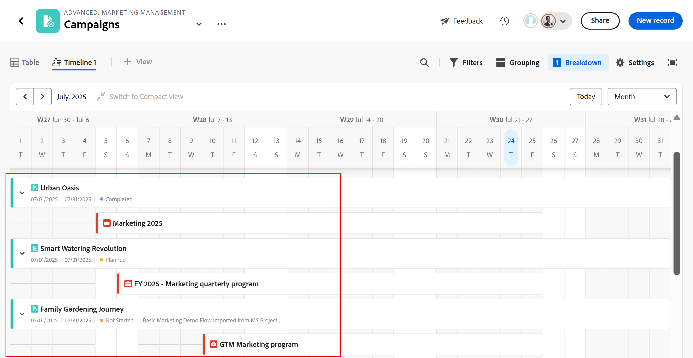

# Gérer la vue chronologique

<!--The highlighted information on this page refers to functionality not yet generally available. It is available only in the Preview environment for all customers. After the monthly releases to Production, the same features are also available in the Production environment for customers who enabled fast releases.    

For information about fast releases, see [Enable or disable fast releases for your organization](/help/quicksilver/administration-and-setup/set-up-workfront/configure-system-defaults/enable-fast-release-process.md). -->

{{planning-important-intro}}

Vous pouvez afficher les enregistrements dans une vue chronologique lors de l’accès à la page du type d’enregistrement dans Adobe Workfront Planning.

Pour plus d’informations sur les vues d’enregistrement, consultez la section [Gérer les vues d’enregistrement](/help/quicksilver/planning/views/manage-record-views.md).

## Conditions d’accès

+++ Développez pour afficher les conditions d’accès requises pour la fonctionnalité de cet article. 

<table style="table-layout:auto"> 
<col> 
</col> 
<col> 
</col> 
<tbody> 
    <tr> 
<tr> 
</tr>   
<tr> 
   <td role="rowheader">
Package Adobe Workfront
</td> 
   <td> 

Tout Workfront et tout package Planning

Tout workflow et tout package Planning

Pour plus d’informations sur les composants inclus dans chaque package Workfront Planning, contactez votre représentant de compte Workfront. 
 
   </td> 
  <tr> 
   <td role="rowheader">
Licence Adobe Workfront
</td> 
   <td>
 Standard pour créer et supprimer des vues

   
Contributeur ou version ultérieure pour mettre à jour les éléments d’affichage

  </td> 
  </tr> 
  <tr> 
   <td role="rowheader">
Autorisations d’objet
</td> 
   <td>   
Gérer les autorisations pour une vue
  
   
Autorisations d’affichage d’une vue pour modifier temporairement les paramètres d’affichage ou la dupliquer
 </td> 
  </tr> 
<tr>
   <td role="rowheader">
Modèle de mise en page
</td>
   <td> Les utilisateurs disposant d'une licence light ou contributor doivent se voir attribuer un modèle de mise en page incluant Planning.
   
Les zones Planning sont activées par défaut pour les utilisateurs standard et les administrateurs système.

</li></ul>
</td>
  </tr> 
</tbody> 
</table>

Pour plus d’informations sur les exigences d’accès à Workfront, voir [Exigences d’accès dans la documentation de Workfront](/help/quicksilver/administration-and-setup/add-users/access-levels-and-object-permissions/access-level-requirements-in-documentation.md).

+++ 

<!--Old:
<table style="table-layout:auto"> 
<col> 
</col> 
<col> 
</col> 
<tbody> 
    <tr> 
<tr> 
<td> 
   
 Products
 </td> 
   <td> 
   <ul><li>
 Adobe Workfront
</li> 
   <li>
 Adobe Workfront Planning
</li></ul></td> 
  </tr>   
<tr> 
   <td role="rowheader">
Adobe Workfront plan*
</td> 
   <td> 

Any of the following Workfront plans:
 
<ul><li>Select</li> 
<li>Prime</li> 
<li>Ultimate</li></ul> 

Workfront Planning is not available for legacy Workfront plans
 
   </td> 
<tr> 
   <td role="rowheader">
Adobe Workfront Planning package*
</td> 
   <td> 

Any 
 

For more information about what is included in each Workfront Planning plan, contact your Workfront account manager. 
 
   </td> 
 <tr> 
   <td role="rowheader">
Adobe Workfront platform
</td> 
   <td> 

Your organization's instance of Workfront must be onboarded to the Adobe Unified Experience to be able to access Workfront Planning.
 

For more information, see <a href="/help/quicksilver/workfront-basics/navigate-workfront/workfront-navigation/adobe-unified-experience.md">Adobe Unified Experience for Workfront</a>. 
 
   </td> 
   </tr> 
  </tr> 
    <td role="rowheader">
Adobe Workfront license*
</td> 
   <td>
 Standard to create and delete views

   
Contributor or higher to update view elements

   
Workfront Planning is not available for legacy Workfront licenses
 
  </td> 
  </tr> 
  <tr> 
   <td role="rowheader">
Access level configuration
</td> 
   <td> 
There are no access level controls for Adobe Workfront Planning
   
</td> 
  </tr> 
<tr> 
   <td role="rowheader">
Object permissions
</td> 
   <td>   
Manage permissions to a view
  
   
View permissions to a view to temporarily change the view settings or to duplicate it
 </td> 
  </tr> 
<tr>
   <td role="rowheader">
Layout template
</td>
   <td> Users with a Light or Contributor license must be assigned a layout template that includes Planning.
   
Standard users and System Administrators have the Planning areas enabled by default.

</li></ul>
</td>
  </tr>
</tbody> 
</table> -->

## Gérer une vue chronologique {#manage-a-timeline-view}

Lors de la création d’une vue chronologique, tous les enregistrements du type sélectionné s’affichent dans un ordre chronologique.

Tenez compte des points suivants :

* Vous ne pouvez créer une vue chronologique que si vous avez au moins deux champs de date associés à un type d’enregistrement. Lorsque vous avez un ou plusieurs champs de date associés à un type d’enregistrement, l’option de vue chronologique est grisée.

  Vous pouvez effectuer un choix parmi les champs de date suivants lors de la création d’une vue chronologique :

   * Dates d’enregistrement
   * Enregistrer les champs générés par le système : date de création, date de dernière modification
   * Dates de recherche des types d&#39;objet ou d&#39;enregistrement connectés (uniquement lorsque vous avez ajouté un agrégateur pour eux lorsque vous avez connecté les types d&#39;objet ou d&#39;enregistrement)
* En fonction des dates associées aux enregistrements, certains enregistrements peuvent ne pas s’afficher dans la vue chronologique dans les scénarios suivants :

   * Lorsque les dates de début et de fin n’ont pas de valeur.
   * Lorsque les dates de début ou de fin n’ont pas de valeur.
   * Lorsque la date de début est postérieure à la date de fin.

Pour gérer une vue chronologique :

1. Accédez à la page du type d’enregistrement pour lequel vous souhaitez consulter la chronologie.
1. Créez une vue chronologique, comme décrit dans l’article [Gérer les vues d’enregistrement](/help/quicksilver/planning/views/manage-record-views.md).

   

   Les enregistrements associés au type d’enregistrement que vous avez sélectionné s’affichent sous forme de barres dans une chronologie et sont triés par ordre chronologique de leur date de début, par défaut.

   >[!TIP]
   >
   >    Le tri des enregistrements dans la chronologie n’est pas visible dans la vue compacte.

1. (Sous condition) Si votre administrateur a activé les trimestres personnalisés et que Workfront détecte des problèmes liés à la configuration des trimestres personnalisés, il se peut que vous receviez un avertissement lors de l’ouverture de la vue chronologique.

   Les scénarios suivants sont possibles :

   * Si des écarts ou des chevauchements ont été détectés entre les dates des trimestres, vous pouvez recevoir une notification indiquant que les trimestres personnalisés peuvent désormais être configurés et qu’ils doivent être modifiés.

     

     >[!TIP]
     >
     >Ce message ne doit s&#39;afficher qu&#39;immédiatement après l&#39;activation des trimestres Planning et personnalisés par votre organisation avant l&#39;achat. Les chevauchements et les écarts entre les trimestres ne sont pas autorisés après l’activation de Workfront Planning pour votre organisation.

   * Si des trimestres ont été partiellement configurés et qu&#39;il manque certains mois de la même année, vous pouvez recevoir une notification lorsque vous faites défiler l&#39;écran pour afficher les trimestres manquants. Ainsi, le reste de l&#39;année doit être configuré avec les trimestres manquants.

   

   Les messages d’avertissement relatifs aux trimestres personnalisés s’affichent une fois par utilisateur.

   >[!NOTE]
   >
   >Si le trimestre personnalisé n’est pas correctement enregistré, la vue chronologique affiche les trimestres classiques.
   >Après avoir configuré les trimestres personnalisés dans la zone Configuration , la vue chronologique affiche les trimestres personnalisés au lieu des trimestres classiques.
   >Pour plus d’informations, voir [Activer les trimestres personnalisés](/help/quicksilver/administration-and-setup/set-up-workfront/configure-system-defaults/enable-custom-quarters-projects.md).

1. (Conditionnel) Si vous êtes un administrateur Workfront, cliquez sur **Accéder à la configuration** pour configurer vos trimestres. Si ce n’est pas le cas, cliquez sur **OK** et demandez à votre administrateur Workfront de configurer les trimestres personnalisés.

   >[!TIP]
   >
   >Le bouton Accéder à la configuration s’affiche uniquement pour l’administrateur Workfront.

1. (Facultatif et conditionnel) Lorsque le nom d’enregistrement est tronqué, passez la souris sur une barre d’enregistrement pour afficher le nom complet de l’enregistrement et des informations supplémentaires. Pour plus d’informations sur la configuration de la troncature de la barre d’enregistrement dans la chronologie, consultez la section [Modifier les paramètres d’affichage de la chronologie](#edit-the-timeline-view-settings) dans cet article.

1. Effectuez l’une des opérations suivantes pour naviguer dans la chronologie :

   * Cliquez sur les icônes gauche et droite dans le coin supérieur gauche ou utilisez le défilement horizontal pour vous déplacer vers l’arrière et l’avant dans le montage. L’actualisation de la page conserve la période sélectionnée.
   * Cliquez sur **Aujourd’hui** dans le coin supérieur droit pour centrer la chronologie sur la date d’aujourd’hui.
   * Sélectionnez l’une des options suivantes dans le menu déroulant Période pour mettre à jour les incréments de temps et mettre à jour la vue :

      * **Année** : affiche les trimestres et les mois avec l’indication de l’année.
      * **Trimestre** : affiche les mois et les semaines avec l’indication du trimestre.
      * **Mois** : affiche les semaines et les jours.
1. (Facultatif) Cliquez sur **Basculer vers la vue compacte** pour afficher les enregistrements dont les dates ne se coupent pas sur la même ligne. <!--check to see if they updated the name of the setting here-->
1. (Conditionnel) Si vous avez modifié votre mode en **Compact**, cliquez sur **Passer à la vue Standard** pour afficher les enregistrements sur des lignes distinctes. L’option **Standard** est la valeur par défaut.  <!--check to see if they updated the name of the setting here-->

1. Procédez comme suit pour trouver rapidement les enregistrements correspondant à un mot-clé :

   1. Cliquez sur l’icône **Rechercher**  et commencez à saisir un mot-clé associé à n’importe quel champ d’un enregistrement qui s’affiche à l’écran. Le nombre de correspondances correctes s’affiche à côté de l’élément de la recherche et l’enregistrement correspondant est surligné.

      

      Vous pouvez utiliser n’importe quel mot ou caractère spécial visible à l’écran.

      Vous ne pouvez pas utiliser de mots-clés associés à des champs qui ne s’affichent pas dans la vue chronologique.

   1. Appuyez sur la touche Entrée de votre clavier pour passer au champ suivant.
   1. (Facultatif) S’il y a plus d’une correspondance, cliquez sur les flèches haut et bas situées à droite du mot-clé de recherche pour accéder à l’ensemble des correspondances dans le tableau.
   1. Cliquez sur l’icône **x** dans le champ de recherche pour effacer le mot-clé de recherche.

   1. (Facultatif) Cliquez sur l’icône **Plein écran**  pour ouvrir l’affichage en plein écran, puis sur l’icône **Quitter le plein écran**  ou sur la touche Échap du clavier pour quitter le plein écran.

1. (Facultatif) Cliquez sur **Répartition** pour afficher les enregistrements connectés sur le journal.

   Pour plus d’informations, reportez-vous à la section [Utilisation de la fonction Répartition pour afficher les enregistrements connectés en mode Chronologie](#break-down-connected-records-in-the-timeline-view) de cet article.
1. Pour créer des enregistrements dans la vue Chronologie ou modifier leurs dates, effectuez l’une des opérations suivantes :

   * Double-cliquez n’importe où sur la chronologie pour créer un enregistrement.

     Pour plus d’informations, voir [Créer des enregistrements](/help/quicksilver/planning/records/create-records.md).

   >[!TIP]
   >
   >Un double-clic pour créer des enregistrements dans la chronologie n’est pas possible à l’intérieur d’un regroupement.

   * Cliquez sur la marge gauche ou droite d’une barre d’enregistrement, puis faites-la glisser et déposez-la à un nouvel emplacement. Le redimensionnement des barres des enregistrements met immédiatement à jour leurs dates de début ou de fin.

   * Effectuez un glisser-déposer des enregistrements pour mettre à jour leur position et leurs dates dans la chronologie. Le déplacement des barres des enregistrements met immédiatement à jour leurs dates de début et de fin.

     Pour plus d’informations, voir [Modifier des enregistrements](/help/quicksilver/planning/records/edit-records.md).

   >[!TIP]
   >
   >Le redimensionnement et le glisser-déposer d’enregistrements n’est pas possible dans la chronologie pour les types d’objets Workfront et AEM Assets affichés dans les répartitions.

1. Mettez à jour les éléments de vues suivants, comme décrit dans les sous-sections ci-dessous :
   * [Filtres](#add-filters)
   * [Regroupement ](#add-grouping)
   * [Paramètres](#edit-the-timeline-view-settings)
     <!--* [Sort](#add-sort) not yet in timeline; also check the anchor and make sure it's correct-->

### Ajouter des filtres

Vous pouvez réduire la quantité d’informations affichées à l’écran en utilisant des filtres.

Tenez compte des points suivants lorsque vous utilisez des filtres dans la vue chronologique :

<!-- this list is almost identical to the one for the table view - update both-->

* Les filtres que vous créez pour une vue chronologique fonctionnent indépendamment des filtres de toute autre vue appliquée au même type d’enregistrement.

* Les filtres sont propres à la vue que vous sélectionnez. Des filtres différents peuvent être appliqués à deux vues chronologiques du même type d’enregistrement.

* Deux personnes qui consultent la même vue chronologique voient le même filtre actuellement appliqué.

* Vous ne pouvez pas nommer les filtres que vous créez pour une vue chronologique.

* En supprimant les filtres, vous les supprimez pour toutes les personnes qui accèdent au même type d’enregistrement que vous et qui consultent la même vue que vous.

* Vous pouvez filtrer par champs d’enregistrement connectés ou champs de recherche.
* Vous pouvez filtrer par champs de recherche qui affichent plusieurs valeurs.

Pour ajouter un filtre à une vue chronologique :

1. Créez une vue chronologique pour une page de type enregistrement, comme décrit dans l’article [Gérer les vues d’enregistrement](/help/quicksilver/planning/views/manage-record-views.md).
1. Sélectionnez une vue chronologique, puis cliquez sur **Filtres** dans le coin supérieur droit du tableau.
1. Cliquez sur **Ajouter une condition** et ajoutez les informations suivantes :

   * **Sélectionnez un champ** pour rechercher un champ ou et le sélectionner dans la liste.

   * **Sélectionnez une option** (ou un modificateur de filtre) pour définir le type de condition auquel le champ doit répondre.

     Le tableau ci-dessous présente les modificateurs disponibles pour chaque type de champ.

     <table>
        <thead>
        <tr>
            <th><b>Type de champ</b></th>
            <th><b>Modificateurs</b></th>
        </tr>
        </thead>
        <tbody>
        <tr>
            <td>Ligne unique, paragraphe, formule </td>
            <td>
Contient

            
Ne contient pas

            
Est

            
N’est pas

            
Est vide

            
N’est pas vide
</td>
        </tr>
        <tr><td>Sélection unique</td>
            <td>
Est

            
N’est pas

            
Est l’un des

            
N’est aucun de

            
Est vide

            
N’est pas vide
</td>
        </tr>
        <tr>
            <td>Multi-sélection, personnes</td>
            <td>
A l’un des

            
Dispose de tous les

            
Est exactement

            
N’a aucun(e) des

            
Est vide

            
N’est pas vide
</td>
        </tr>
        <tr>
            <td>Nombre, pourcentage, devise</td>
            <td>
=

            
≠

            
 &lt; 

            
&gt;

            
≤

            
≥

            
Est vide

            
N’est pas vide
</td>
        </tr>
        <tr>
            <td>Date</td>
            <td>
Est

            
N’est pas

            
Est après

            
Est avant

            
Est compris entre

N’est pas compris entre

            
Est vide

N’est pas vide
</td>
        </tr>

     <tr>
            <td>Case à cocher</td>
            <td>
Est

        </tr>
        </tbody>
        </table>

   * Choisissez une valeur pour le champ sélectionné.

   

   Il n’y a pas de limite au nombre de conditions de filtrage que vous pouvez ajouter.

1. (Facultatif) Cliquez sur **Ajouter une condition** pour ajouter une autre option de filtrage et répétez les étapes ci-dessus. Le nombre de filtres appliqués s’affiche à gauche de l’icône **Filtres**.
1. Cliquez sur les opérateurs ci-dessous à gauche pour indiquer comment les conditions de filtrage sont liées et doivent être appliquées :

   * **AND** : toutes les conditions spécifiées doivent être remplies.
   * **OR** : l’une des conditions spécifiées doit être remplie.
Il s’agit de l’option par défaut.

   1. (Facultatif) Ajoutez des regroupements de filtres supplémentaires et joignez-les par des opérateurs **AND** ou **OR**.

      

   La liste des enregistrements est filtrée automatiquement en fonction de vos critères de filtrage.  <!--at this time, you can't name and save the filter - but will this change?!-->
   <!-- asked on the task for the simple filters whether there is a limitation for how many statements a filter can have?!-->

1. (Facultatif) Cliquez sur l’icône **x** pour supprimer une condition de filtre.
1. (Facultatif) Cliquez sur **Filtres** ou n’importe où sur la page pour fermer la zone des filtres. <!--right now you cannot "clear all" for filters, but this might come later-->

### Ajouter un regroupement

<!-- groupings are almost identical between this view and table  but they display a little differently, so I kept the steps for both; update in both places if they make changes to groupings-->

Vous pouvez regrouper des enregistrements par des informations similaires lorsque vous appliquez un regroupement à une vue.

Tenez compte des points suivants lorsque vous utilisez des regroupements dans la vue chronologique :

* Vous pouvez utiliser des regroupements à la fois dans la vue tableau et dans la vue chronologique. Les regroupements de la vue de tableau sont indépendants de ceux de la vue chronologique du même type d’enregistrement.
* Vous pouvez appliquer 3 niveaux de regroupement dans une vue. Les enregistrements sont regroupés dans l’ordre des regroupements que vous sélectionnez.
&lt;!--* Vous pouvez appliquer jusqu’à 4 niveaux de regroupement lorsque vous utilisez l’API. --vérifier celui-ci pour l’instant-->
* Les regroupements sont propres à la vue que vous sélectionnez. Vous pouvez appliquer des regroupements différents à deux vues de tableau du même type d’enregistrement. Deux utilisateurs ou utilisatrices qui consultent la même vue de tableau voient le regroupement qui est actuellement appliqué.
* Vous ne pouvez pas nommer les regroupements que vous créez pour une vue de tableau.
* En supprimant les regroupements, vous les supprimez pour toutes les personnes qui accèdent au même type d’enregistrement que vous et qui consultent la même vue que vous.
* Vous pouvez modifier les enregistrements répertoriés dans un regroupement.
* Vous pouvez effectuer un regroupement par champs d’enregistrement connectés ou champs de recherche.
* Lorsque vous regroupez des champs de recherche avec plusieurs valeurs (qui n’ont pas été résumées par un agrégateur), les enregistrements sont regroupés selon chaque combinaison unique de valeurs de champ.
* Vous pouvez référencer un champ qui se trouve à jusqu’à 4 niveaux du type d’enregistrement actuel. Par exemple, si vous créez un regroupement pour un type d’enregistrement Activité et que l’Activité est connectée au type d’enregistrement Produit connecté au type d’enregistrement Campagne connecté à un projet Workfront, vous pouvez référencer le statut du projet dans le regroupement que vous créez pour le type d’enregistrement Activité.
* Les regroupements sont répertoriés dans l’ordre alphabétique de leurs valeurs.
<!--checking into this: * You can apply up to 4 levels of grouping when using the API. -->
<!-- checking also into this: * You cannot group by a Paragraph-type field.-->

Pour ajouter un regroupement dans la vue chronologique :

1. Créez une vue chronologique pour un type d’enregistrement, comme décrit dans l’article [Gestion des vues d’enregistrement](/help/quicksilver/planning/views/manage-record-views.md).
1. Cliquez sur **Regroupement** dans le coin supérieur droit de la vue chronologique.

   

1. Cliquez sur l&#39;un des champs suggérés ou cliquez sur **Choisir un autre champ** et recherchez un autre champ, puis cliquez dessus lorsqu&#39;il s&#39;affiche dans la liste.

   Le regroupement est appliqué automatiquement à la chronologie et les enregistrements s’affichent à l’intérieur de la zone de regroupement.

1. (Facultatif) Répétez les étapes ci-dessus pour ajouter jusqu’à 3 regroupements.

   Le nombre de champs sélectionnés pour le regroupement s’affiche à côté de l’icône de regroupement.

   

1. Dans la zone **Regrouper les enregistrements par**, effectuez un glisser-déposer des regroupements dans l’ordre approprié.

1. (Facultatif) Dans la zone **Regrouper les enregistrements par**, cliquez sur l’icône **x** à droite d’un champ sélectionné pour le regroupement pour le supprimer.

   Ou

   Cliquez sur **Tout effacer** pour supprimer tous les champs.

1. Cliquez en dehors de la zone **Regrouper les enregistrements par** pour la fermer.
1. (Facultatif) Cliquez sur **Paramètres**, puis sur **Couleur** pour attribuer des couleurs aux regroupements. Pour plus d’informations, consultez la section [Modifier les paramètres de la vue chronologique](#edit-the-timeline-view-settings) dans cet article.

<!-- 

### Add sort

this is not possible right now; if this is the same functionality as the table view, document it there and link from here. 

-->

### Modifier les paramètres de la vue chronologique {#edit-the-timeline-view-settings}

Mettez à jour les paramètres de la vue chronologique pour indiquer le type d’informations qui s’affichent dans la section chronologique de la vue et la façon dont elles s’affichent.

1. Créez une vue chronologique pour un type d’enregistrement, comme décrit dans l’article [Gérer les vues d’enregistrement](/help/quicksilver/planning/views/manage-record-views.md).
1. Cliquez sur **Paramètres**.
1. Cliquez sur **Date et heure** dans le panneau de gauche, puis sélectionnez une **Date de début** et une **Date de fin** à afficher sur la chronologie. Vous pouvez choisir les dates de début et de fin par défaut, ou tout champ de date disponible.

   Les barres représentant les enregistrements commencent à la date que vous indiquez pour la date de début et se terminent à la date correspondant à la date de fin.

   >[!NOTE]
   >
   >* Les enregistrements qui n’ont pas de valeurs pour les dates de début ou de fin ou dont la date de début est postérieure à la date de fin ne s’affichent pas dans la vue chronologique.
   >
   >* Si vous affichez des enregistrements supplémentaires à l&#39;aide de l&#39;option Répartition , les dates de Début et de Fin sont celles de l&#39;enregistrement principal. Vous ne pouvez pas choisir les dates de début et de fin pour les enregistrements connectés dans cette zone.

1. (Conditionnel et facultatif) Si vous êtes un administrateur Workfront, cliquez sur **Accéder à la configuration** dans la zone **Utiliser des trimestres personnalisés** pour accéder à la zone Configuration et configurer des trimestres personnalisés. Après avoir configuré les trimestres personnalisés, vous pouvez les afficher dans la vue chronologique au lieu des trimestres classiques. Si vous n’êtes pas administrateur Workfront, vous pouvez demander à un administrateur d’activer les trimestres personnalisés pour votre organisation.

   Pour plus d’informations, voir [Activer les trimestres personnalisés](/help/quicksilver/administration-and-setup/set-up-workfront/configure-system-defaults/enable-custom-quarters-projects.md).

   

   >[!TIP]
   >
   >Le bouton Accéder à la configuration s’affiche uniquement pour l’administrateur Workfront.

1. Cliquez sur **Style de barre** dans le panneau de gauche pour indiquer les informations à afficher sur les barres d’enregistrement.

   Vous pouvez définir le style de barre de l&#39;enregistrement principal ainsi que des enregistrements connectés, lors de l&#39;utilisation de l&#39;option Répartition dans la vue Standard.

   Le champ principal (ou titre) de l&#39;enregistrement, tel que défini dans la vue Tableau de l&#39;enregistrement, est sélectionné par défaut.
   <!--adjust this when the primary field is released??-->

1. (Facultatif et conditionnel) Si vous avez ajouté des miniatures aux enregistrements, sélectionnez l’option **Miniature** pour afficher l’image associée aux enregistrements dans leur barre d’enregistrement.

   >[!NOTE]
   >
   >    Vous devez d’abord ajouter les miniatures dans la vue de tableau, avant de pouvoir les afficher dans la vue chronologique. Pour plus d’informations, voir [Ajouter une miniature à un enregistrement](/help/quicksilver/planning/records/add-thumbnails-to-records.md).

1. Cliquez sur **Ajouter un champ**, puis dans la zone **Rechercher des champs**, et cliquez sur le champ à ajouter.

   >[!TIP]
   >
   >   * Vous devez créer les champs avant de les ajouter aux barres d’enregistrement.
   > 
   >   * Vous devez disposer d’au moins un champ sélectionné. Le **nom** est sélectionné par défaut.
   >
   >   * Vous pouvez ajouter jusqu’à 5 champs.

   Un aperçu de l’aspect des barres sur la chronologie s’affiche à droite.

   

1. (Facultatif et conditionnel) Si vous affichez la frise chronologique en mode Standard, sélectionnez le paramètre **Tronquer les détails de la barre**. Lorsque cette option est sélectionnée, les informations des barres d’enregistrement sont tronquées et ne s’affichent entièrement que lorsque vous pointez sur les barres. Ce paramètre est désélectionné par défaut et les informations d’enregistrement sont entièrement affichées sur les barres.

   

   >[!TIP]
   >
   >Le paramètre Tronquer les détails de la barre n’est pas disponible lors de l’affichage de la chronologie en mode Compact.
   >

1. Cliquez sur **Couleur** dans le panneau de gauche pour personnaliser les couleurs des enregistrements et des regroupements dans la chronologie.

   

   Vous pouvez définir la couleur de l&#39;enregistrement principal ainsi que des enregistrements connectés, lors de l&#39;utilisation de l&#39;option Répartition dans la vue Standard.

1. (Le cas échéant et facultatif) Si vous avez ajouté un regroupement à la vue chronologique, sélectionnez l’une des options suivantes pour définir une couleur pour le regroupement dans la section **Définir la couleur du regroupement** :

   * **Par défaut (gris)** : la couleur des regroupements est le gris. Il s’agit de la valeur par défaut.
   * **Valeurs de champ** : la couleur des regroupements correspond à celle du champ que vous regroupez.

     >[!NOTE]
     >
     >    * Vous ne pouvez faire correspondre la couleur qu’aux champs avec des options codées par couleur. Par exemple, vous pouvez associer la couleur aux champs État ou aux champs avec des options associées aux couleurs.
     >    
     >    * Vous ne pouvez pas faire correspondre la couleur aux champs de recherche à partir d&#39;enregistrements liés ou de types d&#39;objets.

   Par exemple, les champs à sélection multiple ou unique peuvent avoir des options codées par couleur.

   Si vous effectuez un regroupement par champs sans les options de codage par couleur, la couleur du regroupement reste grise.

   >[!TIP]
   >
   >Si vous n’avez pas ajouté de regroupements à la vue chronologique, cette section ne s’affiche pas.

1. Dans la section **Définir la couleur de l’enregistrement**, sélectionnez l’une des options suivantes pour définir la couleur des enregistrements :

   * **Type d’enregistrement** : la couleur des enregistrements correspond à la couleur du type d’enregistrement que vous avez sélectionné. Il s’agit de l’option par défaut.
   * **Valeurs des champs** : la couleur des enregistrements correspond à la couleur d’un champ que vous spécifiez. Passez à l’étape 10. <!--ensure this stays accurate-->
   * **Regroupement** : la couleur des enregistrements correspond à la couleur que vous avez indiquée pour les regroupements. Cette option est grisée lorsqu’aucun regroupement n’est appliqué à la vue chronologique.
   * **Aucune** : les enregistrements s’affichent dans une barre blanche.

1. (Le cas échéant) Si vous avez sélectionné **Valeurs de champ** pour les couleurs des enregistrements, sélectionnez un champ dans le menu déroulant **Faire correspondre la couleur de l’enregistrement à**.

   

   Seuls les champs dont les options sont codées en couleur s’affichent dans le menu déroulant.

   Par exemple, les champs à sélection multiple ou unique peuvent avoir des options codées par couleur.

   Si vous n’avez pas de champ avec des options codées par couleur pour le type d’enregistrement sélectionné, cette option est grisée.

1. (Facultatif) Si vous utilisez l’option **Répartition**, répétez les étapes commençant par l’étape 4 pour chaque enregistrement connecté affiché dans le journal.

1. Cliquer sur **Enregistrer**.

   Les enregistrements s’affichent dans la vue chronologique avec les spécifications que vous avez sélectionnées.

### Répartir les enregistrements connectés dans la vue chronologique

Vous pouvez afficher les enregistrements connectés dans la vue chronologique d&#39;un enregistrement à l&#39;aide de la fonction Répartition. La répartition des enregistrements en fonction de leurs connexions vous permet d&#39;afficher la chronologie d&#39;autres enregistrements connectés et de comprendre comment ils peuvent affecter les performances et les échéances de vos enregistrements.

#### Remarques concernant l’utilisation de la fonction Répartition

Tenez compte des points suivants lors de la répartition de la chronologie des enregistrements en fonction de leurs types d’enregistrements connectés :

* Vous pouvez afficher les enregistrements ou les objets connectés sous les enregistrements du type d&#39;enregistrement sélectionné dans la vue chronologique.
* Vous ne pouvez afficher les enregistrements connectés en mode Chronologie que lorsque vous affichez les enregistrements en mode Standard. Vous ne pouvez pas utiliser l’option Répartition en mode Compact de la vue chronologique.
* Vous pouvez afficher les éléments suivants dans la vue Chronologie à l’aide de la fonction Répartition :
   * Enregistrements Workfront Planning connectés au type d&#39;enregistrement sélectionné.
   * Types d’objet Workfront ou ressources Experience Manager connectées au type d’enregistrement sélectionné.
   * Enregistrements ou objets Workfront Planning d&#39;une autre application connectés à des enregistrements connectés au type d&#39;enregistrement sélectionné.

     Par exemple, vous pouvez lier des campagnes à des portfolios. En outre, vous pouvez connecter un autre type d’enregistrement, products, à des projets, ainsi qu’à des campagnes. Lorsque vous créez la vue chronologique de la campagne, vous pouvez répartir les campagnes par portfolios, produits et projets.

* Vous ne pouvez pas afficher les types d&#39;objets qui sont connectés uniquement aux objets Workfront dans Workfront, mais qui ne sont pas connectés à un type d&#39;enregistrement Workfront Planning. Vous ne pouvez afficher que les types d&#39;objet ou d&#39;enregistrement connectés dans Workfront Planning.

  Par exemple, les tâches sont liées à des projets dans Workfront. Grâce à la fonction Répartition, vous pouvez afficher les projets connectés aux campagnes dans Planning, mais pas les tâches connectées aux projets dans Workfront.

  Si vous souhaitez afficher à la fois les portefeuilles et les projets dans la vue chronologique d&#39;un type d&#39;enregistrement Planning Workfront, les portefeuilles et les projets doivent être connectés à l&#39;enregistrement Planning ou à un enregistrement connecté à l&#39;enregistrement Planning dont vous gérez la vue chronologique.
* Vous ne pouvez pas afficher les marques Adobe GenStudio connectées à des types d&#39;enregistrements Planning.
Pour plus d’informations, consultez la section [Connecter des types d’enregistrements](/help/quicksilver/planning/architecture/connect-record-types.md).
* Vous pouvez uniquement afficher les types d’enregistrements associés à au moins deux champs de date.
* Les champs de date des types d’enregistrement que vous souhaitez afficher dans la vue chronologique doivent être visibles dans la vue Tableau du type d’enregistrement sélectionné, sous la forme de champs de recherche.
* Les dates de début et de fin des types d’enregistrements à afficher dans la vue chronologique doivent être dans l’ordre chronologique. Par exemple, si un enregistrement a une date de Début fixée au 31 janvier et une date de Fin fixée au 1er janvier, il ne s&#39;affiche pas dans la vue chronologique. Pour plus d’informations, consultez la section [Gérer une vue chronologique](#manage-a-timeline-view) de cet article.
* Vous pouvez inclure une limite de 5 types d’enregistrements dans la répartition d’un enregistrement.

#### Répartir les enregistrements connectés

1. Créez une vue chronologique pour un type d’enregistrement, comme décrit dans l’article [Gérer les vues d’enregistrement](/help/quicksilver/planning/views/manage-record-views.md).
1. En mode **Standard** ou **Compact**, cliquez sur **Répartition** dans le coin supérieur droit de la vue chronologique.
1. Développez la zone **Sélectionner un type d’enregistrement lié** et sélectionnez un type d’enregistrement connecté. <!--add a new screen shot - submitted a bug to remove the "the"-->

   

   >[!TIP]
   >
   >    Si vous n&#39;avez aucun enregistrement connecté ou si les enregistrements connectés n&#39;ont pas au moins deux champs de date, la zone **Sélectionner un type d&#39;enregistrement lié** n&#39;est pas disponible.

1. Choisissez un **Date de début** et un **Champ de date de fin**.

   >[!TIP]
   >
   >    Les dates de début et de fin doivent être séquentielles. Si la date de fin est antérieure à la date de début, aucun enregistrement ne s’affiche dans le journal.

   Une flèche pointant vers la droite s&#39;affiche sur la barre de l&#39;enregistrement sélectionné dans la chronologie, s&#39;ils sont connectés à d&#39;autres enregistrements.
1. Cliquez sur la flèche pointant vers la droite pour développer un type d’enregistrement et afficher ses connexions. <!--update screen shot at production-->

   

   >[!IMPORTANT]
   >
   >    Lorsque vous affichez plusieurs enregistrements connectés dans la répartition, ils ne sont pas dans l’ordre hiérarchique.
   >
   >Par exemple, si vous affichez la chronologie des campagnes et que vous ajoutez ensuite Produits et Programmes à la répartition, les Programmes ne sont pas nécessairement connectés en premier aux Produits.
   >
   >Les produits et programmes doivent être connectés aux campagnes pour s’afficher en tant que choix pour l’option de répartition et vous pouvez les ajouter à la répartition dans n’importe quel ordre.

1. (Conditionnel) Si vous affichez la frise chronologique en mode Compact, cliquez sur **Basculer**. La répartition n’est pas visible en mode **Compact**.

   >[!TIP]
   >
   >Sélectionnez **Ne plus afficher ce message** dans le **Passer à la vue standard ?**, avant de changer de vue.
   >
   >Cette préférence est mémorisée uniquement pour le navigateur actuel. Si vous changez de navigateur ou d&#39;ordinateur, vous devrez sélectionner à nouveau cette préférence.
   >
   >Vous ne pouvez pas revenir au mode Compact après avoir basculé la vue vers le mode Standard et avoir affiché les enregistrements connectés dans la vue.
1. (Facultatif) Répétez les étapes ci-dessus pour ajouter d’autres enregistrements connectés.

