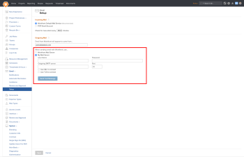

# Supprimer le serveur SMTP personnalisé en tant qu’option d’e-mail sortant

>[!NOTE]
>
>Les fonctionnalités décrites dans cet article ne sont plus disponibles et l’article sera supprimé prochainement.

Avec la version 20.3 (prévue pour août 2020), Adobe Workfront passe à un nouveau système de messagerie qui améliorera considérablement la fiabilité de votre diffusion d’e-mail pour les mises à jour et notifications Workfront. De ce fait, les clientes et clients ne pourront plus utiliser leur propre serveur de messagerie SMTP pour relayer leurs e-mails de la plateforme Workfront vers le ou la destinataire prévu. Tous les e-mails seront envoyés directement à partir du serveur de messagerie Workfront.

Pour accéder à cette fonction, connectez-vous en tant qu’administrateur ou administratrice système et accédez à Configuration > E-mail > Configuration. Voici une capture d’écran mettant en évidence cette fonctionnalité :

Le paramètre mis en évidence dans cette capture d’écran est automatiquement migré pour utiliser l’option du serveur de messagerie Workfront avec la version 20.3.

Si vous avez configuré un serveur de messagerie SMTP personnalisé, **nous vous recommandons vivement de contacter votre équipe informatique** pour vous assurer que les e-mails de notifications@my.workfront.com ne seront pas bloqués pour les e-mails entrants sur votre système. Vous pouvez également vous reporter à Configuration de votre pare-feu pour plus d’informations sur les adresses IP d’où viennent notre trafic et nos e-mails.

Si vous avez d’autres questions, veuillez contacter l’[équipe d’assistance Workfront](https://experienceleague.adobe.com/?support-tab=home&lang=fr#support).
