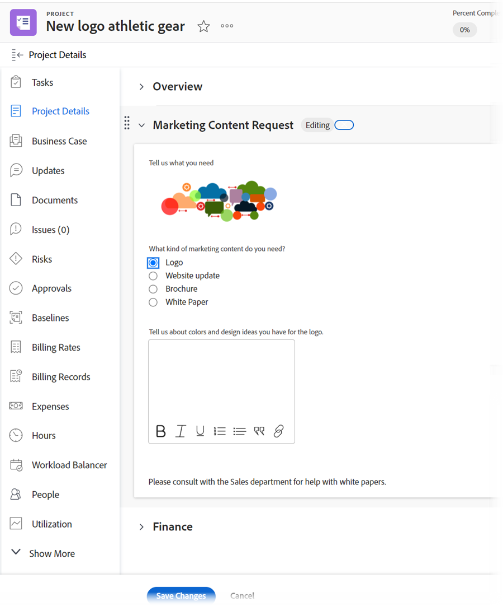
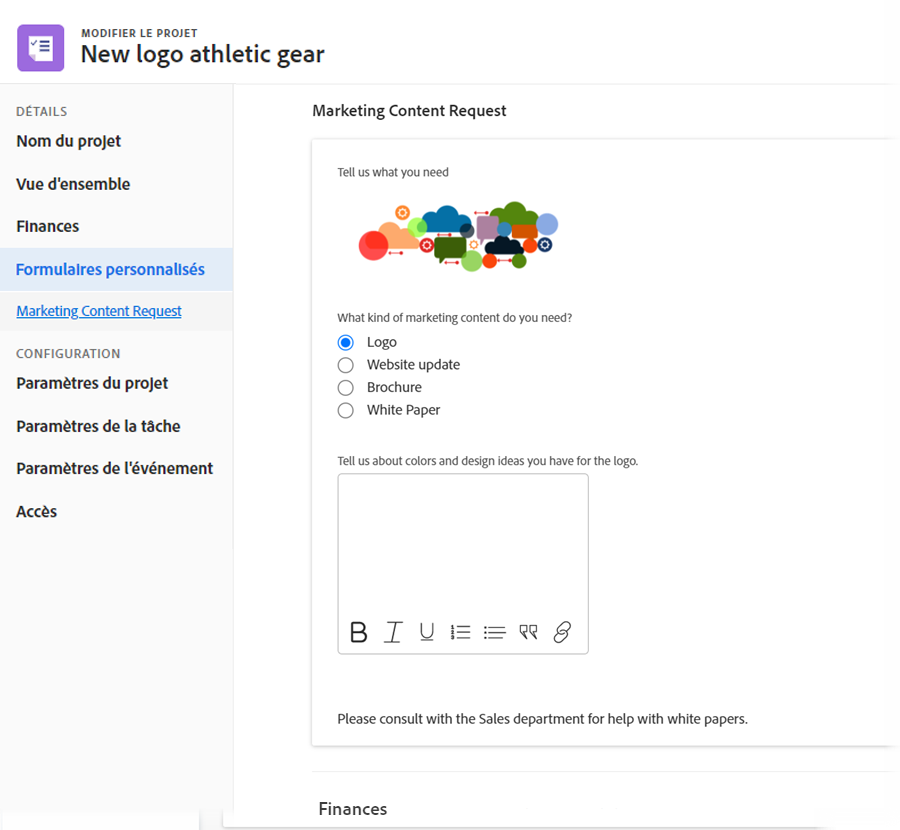
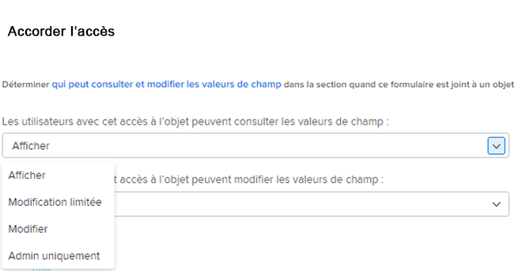

# Améliorations des formulaires personnalisés

Les améliorations significatives suivantes ont été apportées à la gestion des formulaires personnalisés dans la version 22.2.

## Ajout de widgets de ressource

Vous pouvez incorporer une image dans vos formulaires personnalisés. Vous pouvez ainsi communiquer avec les utilisateurs de formulaires personnalisés de manière plus interactive et visuelle. D’autres types de widgets seront bientôt disponibles.


Lorsqu’un formulaire personnalisé contenant un widget est associé à un objet, les utilisateurs qui travaillent avec l’objet peuvent le voir dans les zones suivantes :

* La zone Détails de l’objet (par exemple, pour un projet, la zone Détails du projet) &#x200B;

   

* La zone Modifier de l’objet, si l’apparence de l’expérience Adobe Workfront est nouvelle (par exemple, les zones Modifier le projet et Modifier la tâche) &#x200B;

   

Actuellement, les utilisateurs ne peuvent pas voir le widget dans les zones suivantes : &#x200B;

* Listes et rapports
* Accueil et Récapitulatif
* La zone Modifier de l’objet, s’il ne présente pas l’apparence de la nouvelle expérience Adobe Workfront (par exemple, la zone Modifier les dépenses)
* &#x200B; l’application mobile Workfront

Pour plus d’informations sur l’ajout de widgets à des formulaires personnalisés, voir [Ajout ou modification d’une image ou d’un autre widget de ressource dans un formulaire personnalisé](/help/quicksilver/administration-and-setup/customize-workfront/create-manage-custom-forms/add-widget-or-edit-its-properties-in-a-custom-form.md).

## Associer un formulaire personnalisé à plusieurs types d’objets

Vous pouvez associer plusieurs types d’objet à n’importe quel nouveau formulaire personnalisé :


Ou tout formulaire personnalisé existant :


Vous pouvez ainsi créer un formulaire personnalisé unique à utiliser sur les projets, les tâches, les problèmes et tout autre type d’objet pris en charge pour les formulaires personnalisés.

Cela s’avère particulièrement utile lorsque vous convertissez un problème ou une tâche, car vous pouvez transférer un formulaire personnalisé et ses données vers l’objet converti. Vous n’avez plus besoin de créer et de gérer des copies exactes d’un même formulaire personnalisé pour différents types d’objets. Ajoutez manuellement le formulaire personnalisé au projet.

>[!INFO]
>
>**Exemple:**
>
>Quelqu’un envoie une demande informatique interne (problème) et fournit des détails sur ce qui est nécessaire dans un formulaire personnalisé joint.
>
>Vous convertissez le problème en projet pour les utilisateurs qui y travailleront.
>
>Comme le formulaire personnalisé contenant les détails de l’auteur est associé aux types d’objet Problème et Projet , le formulaire personnalisé et tous ces détails sont transmis au projet pendant la conversion.

>[!NOTE]
>
>Lorsque la conversion a lieu, le formulaire personnalisé doit déjà être associé au type d’objet que vous convertissez.

Pour plus d’informations sur l’ajout d’un widget de ressource à un formulaire personnalisé, voir [Ajout ou modification d’une image ou d’un autre widget de ressource dans un formulaire personnalisé](/help/quicksilver/administration-and-setup/customize-workfront/create-manage-custom-forms/add-widget-or-edit-its-properties-in-a-custom-form.md).

Tenez compte des points suivants lorsque vous créez ou modifiez un formulaire personnalisé à plusieurs objets :

* [Options d’autorisation pour les sauts de section](#permission-options-for-section-breaks)
* [Compatibilité des champs personnalisés calculés](#calculated-custom-field-compatibility)
* [Attention à la suppression d’un type d’objet d’un formulaire personnalisé](#caution-about-deleting-an-object-type-from-a-custom-form)

### Options d’autorisation pour les sauts de section

L’ensemble des options d’autorisation de saut de section disponibles pour les types d’objets Problème, Tâche, Projet et Utilisateur comporte une option d’autorisation supplémentaire que l’ensemble des options d’autorisation pour tous les autres types d’objets : Modification limitée.


L’ensemble des autorisations de coupure de section disponibles pour tous les autres types d’objets (Portfolio, Document, Programme, Dépenses, Société, Itération, Enregistrement de facturation et Groupe) n’inclut pas l’option Modification limitée :



Dans un formulaire personnalisé associé aux types d’objets de ces deux groupes, le système utilise un jeu commun d’autorisations de saut de section qui fonctionne pour tous les types d’objets. En particulier, au lieu d’utiliser l’option d’autorisation Modification limitée , ce jeu commun remplace l’option d’autorisation Modifier par l’option d’autorisation Modification limitée . L’option Modifier est compatible avec tous les types d’objets.

Lorsque vous associez un type d’objet qui utilise des options d’autorisation différentes des autres types d’objet déjà présents sur un formulaire personnalisé, un message s’affiche et vous permet de passer à l’ensemble commun d’options d’autorisation sera utilisé pour le formulaire. Cette modification s’applique à tous les champs, même s’ils ne sont pas sous un saut de section.

Pour plus d’informations, voir [Ajout d’un saut de section à un formulaire personnalisé](/help/quicksilver/administration-and-setup/customize-workfront/create-manage-custom-forms/add-a-section-break-to-a-custom-form.md).

### Compatibilité des champs personnalisés calculés

Dans un formulaire personnalisé à plusieurs objets, si un champ calculé fait référence à des champs pouvant être utilisés avec tous les types d’objets associés au formulaire (tels que {name}, {description} et {entryDate}, disponibles pour plusieurs types d’objets), les données sont correctement calculées, quel que soit l’objet auquel vous le joignez.

Par exemple, si vous disposez d’un formulaire multi-objet pour les projets et les problèmes et que vous ajoutez un champ calculé contenant l’expression {name}, le champ affiche le nom du projet lorsque vous ajoutez le formulaire à un projet et le nom de la tâche que vous ajoutez le formulaire à une tâche.

Cependant, si un champ calculé du formulaire fait référence à un champ non compatible avec tous les types d’objets du formulaire, un message vous invite à effectuer des ajustements.

>[!INFO]
>
>**Exemple :** Dans un formulaire personnalisé associé au type d’objet Tâche , vous créez un champ personnalisé calculé qui référence le champ intégré Affecté à : Nom afin qu’il puisse afficher le nom de la personne désignée Principale chaque fois que le formulaire est joint à une tâche :
>
>
```
>Assigned To: Name{assignedTo}.{name}
>```
>
>Par la suite, vous ajoutez le type d’objet Projet au formulaire personnalisé. Un message d’avertissement vous indique que le type d’objet Projet est incompatible avec le champ personnalisé calculé. En effet, le champ Affecté à n’est pas disponible pour les projets.

Dans ce cas, vous pouvez effectuer l’une des opérations suivantes :

* Supprimez l’un des deux éléments incompatibles du formulaire personnalisé : le type d’objet ou le champ référencé.
* Conserver les deux éléments et utiliser la variable de filtre de caractères génériques `$$OBJCODE` comme condition dans une expression IF pour créer deux versions différentes du champ En charge . Cela permet au champ de fonctionner correctement, quel que soit le type d’objet auquel le formulaire est associé.

   En reprenant l’exemple ci-dessus, bien qu’il n’y ait pas d’attribution intégrée à : Champ Nom des projets, il existe un champ Propriétaire intégré (qui renseigne automatiquement le nom de la personne qui a créé le projet, sauf si quelqu’un modifie manuellement ce champ). Ainsi, dans votre champ personnalisé En charge , vous pouvez utiliser `$$OBJCODE` comme illustré ci-dessous pour faire référence au champ Propriétaire lorsque le formulaire personnalisé est joint à un projet, et le champ Affecté à : Champ Nom lorsque le formulaire est joint à une tâche :

   ```
   IF($$OBJCODE="PROJ",{owner}.{name},{assignedTo}.{name})
   ```

>[!NOTE]
>
>  Si vous ajoutez un type d’objet devant un nom de champ, il fait référence à l’objet parent de l’objet. Vous ne pouvez donc pas utiliser `{project}.{name}` avec un projet, mais vous pouvez l’utiliser avec une tâche.

Pour plus d’informations sur l’ajout d’un champ personnalisé calculé à un formulaire personnalisé, voir [Ajout de données calculées à un formulaire personnalisé](/help/quicksilver/administration-and-setup/customize-workfront/create-manage-custom-forms/add-calculated-data-to-custom-form.md).

Pour plus d’informations sur les variables telles que `$$OBJCODE`, voir [Variables de filtre génériques](/help/quicksilver/reports-and-dashboards/reports/reporting-elements/understand-wildcard-filter-variables.md).

### Attention à la suppression d’un type d’objet d’un formulaire personnalisé

Vous pouvez à tout moment supprimer un type d’objet sur un formulaire personnalisé, mais cela doit être effectué avec précaution. Si les utilisateurs ont déjà joint le formulaire personnalisé à des objets du type que vous souhaitez supprimer et y ont ajouté des données, ces données sont définitivement supprimées lorsque vous supprimez ce type d’objet sur le formulaire.

En outre, il n’existe aucun système de notification pour avertir les personnes qui utilisent le formulaire personnalisé qu’il a été supprimé.

Pour plus d’informations, voir [Suppression d’un champ ou d’un widget personnalisé du système](/help/quicksilver/administration-and-setup/customize-workfront/create-manage-custom-forms/delete-a-custom-field.md).
