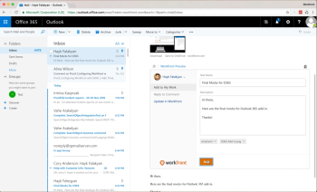

# Version R1 de Workfront

## GARANTISSEZ L’ENGAGEMENT ET L’EFFICACITÉ DU PERSONNEL

Workfront publie trois fois par an de nouvelles fonctionnalités pour toutes les lignes de produits (versions 1, 2 et 3). Dans la première version de l’année 2017 (R1,), plusieurs améliorations des fonctionnalités principales de Workfront, de ProofHQ et de la gestion des ressources numériques de Workfront permettent aux travailleurs du savoir d’être plus productifs, plus engagés et de passer moins de temps à gérer le travail et plus de temps à accomplir des tâches.

## QUELLES SONT LES NOUVEAUTÉS DE LA DERNIÈRE VERSION ?

* [AMÉLIORATIONS DE WORKFRONT](#workfront-enhancements)
* [AMÉLIORATIONS DE PROOFHQ](#proofhq-enhancements)
* [AMÉLIORATIONS DE WORKFRONT DAM](#workfront-dam-enhancements)

## AMÉLIORATIONS DE WORKFRONT {#workfront-enhancements}

\
**Gérer le travail directement depuis votre email**
L&#39;intégration directe dans Outlook 365 vous permettra d&#39;éliminer le travail en double lorsque vous mettez à jour Workfront directement à partir d&#39;Outlook 365. Convertissez des e-mails en tâches, envoyez des conversations par e-mail et des pièces jointes en tant que mises à jour et répondez aux commentaires, sans jamais quitter Outlook.

Pour plus d’informations, voir : [Fonctionnalités disponibles dans l’environnement de prévisualisation en 2016](../../../../product-announcements/product-releases/quarterly-release-archive/r1-release-activity/available-in-preview-in-2016.md)

\
**Maintenir les projets sur la bonne voie et respecter le budget**
Gérez vos ressources et leur utilisation, en maintenant les projets sur la bonne voie et dans le respect du budget, à l&#39;aide du nouveau rapport d&#39;utilisation. Affichez les heures prévues par rapport aux heures effectives par projet et rôle, et comparez régulièrement les ressources et services.

Pour plus d’informations, voir : [Prévisualisation 3 de la version R 1](../../../../product-announcements/product-releases/quarterly-release-archive/r1-release-activity/r1-preview-3.md).

\
**Personnalisation de la terminologie et des notifications**
Rendez Workfront plus pertinent pour votre équipe en exploitant la fonctionnalité de terminologie personnalisée pour modifier des termes tels que « Portfolio » ou « Projet » en fonction de votre langage préféré, quel que soit le secteur d’activité. En outre, tous les utilisateurs et toutes les utilisatrices peuvent désormais personnaliser les types de notifications qu’ils reçoivent en régulant la fréquence des résumés.

Pour plus d’informations, voir : [Prévisualisation 3 de la version R 1](../../../../product-announcements/product-releases/quarterly-release-archive/r1-release-activity/r1-preview-3.md)

**Vue Jalon**
Les nouvelles icônes de statut de progression vous permettent de tirer le meilleur parti de vos rapports jalonnés. En outre, vous pouvez désormais modifier le pourcentage terminé directement dans la vue de jalon.

Pour plus d’informations, voir : [Prévisualisation 5 de la version R 1](../../../../product-announcements/product-releases/quarterly-release-archive/r1-release-activity/r1-preview-5.md)

**Corbeille Workfront**
La nouvelle Corbeille Workfront vous permet de restaurer les projets, les tâches, les événements, ainsi que tous les documents, formulaires et mises à jour associés dans les 30 jours suivant leur suppression.

Pour plus d’informations, voir : [Prévisualisations 1 et 2 de la version R 1](../../../../product-announcements/product-releases/quarterly-release-archive/r1-release-activity/r1-peview-1-and-2.md)

### AMÉLIORATIONS DE PROOFHQ {#proofhq-enhancements}

\
**Recherche et recherche d&#39;épreuve**
La nouvelle fonctionnalité de recherche de ProofHQ vous permet de rechercher et de trouver rapidement et facilement toutes les instances d&#39;un mot ou d&#39;une expression directement dans les BAT au fur et à mesure que vous les examinez. Cela s’applique à tous les documents texte, y compris les fichiers PDF et Microsoft Word.

Pour plus d’informations, voir : [Version R 1 finale](../../../../product-announcements/product-releases/quarterly-release-archive/r1-release-activity/r1-final.md)

\
**Rapports visuels et vues personnalisées améliorées**
De nouvelles mesures de rapports dans ProofHQ vous permettent de suivre les délais d’exécution, les pourcentages de retard, le nombre de commentaires et le délai jusqu’à la première activité. De nouvelles vues personnalisées créent une logique de filtre avancée afin d’obtenir les données exactes, au moment où vous en avez besoin.

Pour plus d’informations, voir : [Version R 1 finale](../../../../product-announcements/product-releases/quarterly-release-archive/r1-release-activity/r1-final.md)

Aperçu de **ProofHQ**
ProofHQ vous permet désormais de tester de nouvelles fonctionnalités dans un environnement de prévisualisation avant de les diffuser à tous vos utilisateurs.

## AMÉLIORATIONS DE WORKFRONT DAM {#workfront-dam-enhancements}

\
**Liens incorporés DAM**
Pour les équipes marketing qui ont besoin d’un meilleur moyen de gérer, de publier et de suivre l’utilisation des ressources numériques sur des plateformes externes, la fonctionnalité de liens incorporés offre le contrôle dont vous avez besoin pour gérer le processus de partage du contenu approprié au bon moment.

**Champs de métadonnées requis pour la gestion des ressources numériques (DAM)**
Améliorez la catégorisation des ressources numériques avec les champs de métadonnées requis pour un meilleur contrôle du partage des ressources.

**Garantissez l’engagement et l’efficacité de votre personnel grâce à Workfront.**
Workfront est une solution de gestion du travail d’entreprise qui permet aux travailleurs et aux cadres du savoir moderne de :

* Adapter le travail aux employés et aux préférences de l’entreprise et augmenter l’adoption
* Travailler de manière efficace, où que vous soyez
* Avoir une meilleure visibilité des ressources, des budgets et des personnes
* Effectuer le travail approprié plus rapidement qu’auparavant

**EN SAVOIR PLUS**

* Pour obtenir la liste complète des améliorations disponibles dans la version R 1 : [Vue d’ensemble de l’activité de la version R 1](../../../../product-announcements/product-releases/quarterly-release-archive/r1-release-activity/r1-release-activity-overview.md)

Workfront Parce que le travail est important.
