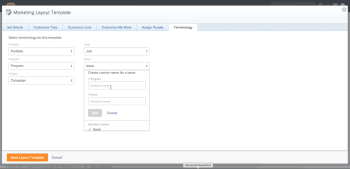

# Version Workfront R1

## GARDER TOUS LES GENS ENGAGÉS ET EFFICACES

Workfront publie de nouvelles fonctionnalités de produit sur toutes les lignes de produits trois fois par an (version 1, version 2 et version 3). Dans la première version de l’année 2017 (R1,), plusieurs améliorations apportées aux fonctionnalités de base de Workfront, ProofHQ et Workfront DAM permettent aux professionnels du savoir d’être plus productifs, engagés et de passer moins de temps à gérer le travail et à accomplir davantage.

## NOUVEAUTÉS DE LA DERNIÈRE VERSION ?

* [AMÉLIORATIONS DE Workfront](#workfront-enhancements)
* [AMÉLIORATIONS DE PROOFHQ](#proofhq-enhancements)
* [AMÉLIORATIONS DE LA GESTION DES ACTIFS NUMÉRIQUES Workfront](#workfront-dam-enhancements)

## AMÉLIORATIONS DE Workfront {#workfront-enhancements}

\
**Gérer le travail directement à partir de votre email**
L’intégration directe dans Outlook 365 vous permet d’éliminer les doublons lorsque vous mettez à jour Workfront directement à partir d’Outlook 365. Convertissez des emails en tâches, envoyez des conversations électroniques et des pièces jointes en tant que mises à jour et répondez aux commentaires, sans jamais quitter Outlook.

Pour plus d’informations, voir :  [Fonctionnalités disponibles dans l’aperçu en 2016](../../../../product-announcements/product-releases/quarterly-release-archive/r1-release-activity/available-in-preview-in-2016.md)

\
**Suivi et budget des projets**
Gérez vos ressources et leur utilisation, en assurant le suivi et le budget des projets à l’aide du nouveau rapport Utilisation. Afficher les heures prévues par rapport aux heures réelles par projet et rôle, et comparer régulièrement les ressources et services.

Pour plus d’informations, voir :  [R1 Preview 3](../../../../product-announcements/product-releases/quarterly-release-archive/r1-release-activity/r1-preview-3.md)

\
**Terminologie et personnalisation des notifications**
Rendez Workfront plus pertinent pour votre équipe en utilisant la fonction terminologique personnalisée pour modifier des termes tels que &quot;Portfolio&quot; ou &quot;Projet&quot; afin qu’ils s’adaptent au jargon de votre choix, quel que soit le secteur industriel. En outre, chaque utilisateur peut désormais personnaliser les types de notifications qu’il reçoit en régulant sa fréquence de résumé.

Pour plus d’informations, voir :  [R1 Preview 3](../../../../product-announcements/product-releases/quarterly-release-archive/r1-release-activity/r1-preview-3.md)

**Vue Milestone**
Les nouvelles icônes d’état de progression vous permettent d’exploiter davantage vos rapports de jalon. En outre, vous pouvez désormais modifier le pourcentage terminé directement à partir de la vue de jalon.

Pour plus d’informations, voir :  [R1 Preview 5](../../../../product-announcements/product-releases/quarterly-release-archive/r1-release-activity/r1-preview-5.md)

**Bannière de recyclage Workfront**
La nouvelle Corbeille de Workfront permet de restaurer des projets, des tâches, des problèmes et tous les documents, formulaires et mises à jour associés dans les 30 jours suivant la suppression.

Pour plus d’informations, voir :  [R1 Aperçu 1 et 2](../../../../product-announcements/product-releases/quarterly-release-archive/r1-release-activity/r1-peview-1-and-2.md)

### AMÉLIORATIONS DE PROOFHQ {#proofhq-enhancements}

\
**Recherche et recherche de BAT**
La nouvelle fonctionnalité de recherche de ProofHQ vous permet de rechercher rapidement et facilement toutes les instances d’un mot ou d’une expression directement dans les bons à tirer au fur et à mesure que vous passez en revue. Cela s’applique à tous les documents texte, y compris les fichiers PDF et Microsoft Word.

Pour plus d’informations, voir :  [R1 Final](../../../../product-announcements/product-releases/quarterly-release-archive/r1-release-activity/r1-final.md)

\
**Création de rapports visuels et vues personnalisées améliorées**
Les nouvelles mesures de création de rapports dans ProofHQ vous permettent de suivre le temps d’exécution, les pourcentages de retard, le nombre de commentaires et le temps jusqu’à la première activité. De nouvelles vues personnalisées créent une logique de filtre avancée afin d’obtenir les données exactes, au moment où vous en avez besoin.

Pour plus d’informations, voir :  [R1 Final](../../../../product-announcements/product-releases/quarterly-release-archive/r1-release-activity/r1-final.md)

**Aperçu du BAT**
ProofHQ vous permet désormais de tester de nouvelles fonctionnalités dans un environnement de prévisualisation avant de les publier pour tous vos utilisateurs.

## AMÉLIORATIONS DE LA GESTION DES ACTIFS NUMÉRIQUES Workfront {#workfront-dam-enhancements}

\
**Liens incorporés DAM**
Pour les équipes marketing qui ont besoin d’un meilleur moyen de gérer, publier et suivre l’utilisation des ressources numériques sur des plateformes externes, la fonction de liens incorporés offre le contrôle dont vous avez besoin pour gérer le processus de partage du contenu approprié au bon moment.

**Champs de métadonnées requis par la gestion des actifs numériques**
Améliorez la catégorisation des ressources numériques avec les champs de métadonnées requis qui permettent un meilleur contrôle du partage des ressources.

**Maintenez l’engagement de tous et l’efficacité de Workfront.**
Workfront est une solution de gestion du travail d’entreprise qui permet aux professionnels et aux cadres du savoir d’effectuer les opérations suivantes :

* Adapter les préférences individuelles et organisationnelles et augmenter l’adoption
* Travailler de manière efficace, où que vous soyez
* Avoir une meilleure visibilité des ressources, des budgets et des personnes de façon plus significative
* Effectuez le bon travail plus rapidement qu’auparavant.

**EN SAVOIR PLUS**

* Téléchargez la feuille de données R1 ici :  [https://resources.workfront.com/data-sheets/r1-release-datasheet](https://resources.workfront.com/data-sheets/r1-release-datasheet)
* Téléchargez la FAQ sur la version R1 ici : [https://resources.workfront.com/data-sheets/r1-faq-for-customers](https://resources.workfront.com/data-sheets/r1-faq-for-customers)
* Pour obtenir la liste complète des améliorations disponibles dans R1 : [Présentation de l’activité de version R1](../../../../product-announcements/product-releases/quarterly-release-archive/r1-release-activity/r1-release-activity-overview.md)

Workfront. Parce Que Le Travail Est Important.
