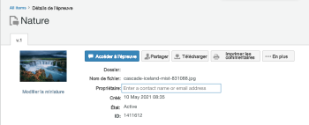

# Activité Publication de Workfront Proof : semaine du 17 mai 2021

Cette page décrit les modifications apportées à Workfront Proof (application de vérification autonome). Les modifications décrites ici ne s’appliquent pas à la fonctionnalité de vérification de l’application Adobe Workfront.

## Les menus de profil utilisateur dans Workfront Proof utilisent désormais des champs de saisie anticipée pour rechercher des utilisateurs.

>[!NOTE]
>
>Cette fonctionnalité a été ajoutée à l’environnement Aperçu le 20 mai 2021. Il sera publié dans l’environnement de production le 16 septembre 2021.

Pour vous aider à gérer les menus déroulants volumineux répertoriant tous les utilisateurs du système, nous avons remplacé tous les menus de recherche de profil utilisateur par une recherche de type dans le modèle autonome Adobe Workfront BAT. Voici quelques exemples de menus de recherche de profil utilisateur :

* Propriétaires de BAT
* Contacts en absence du bureau
* Propriétaires de modèles

Auparavant, toutes les listes déroulantes de recherche de profil répertoriaient tous les utilisateurs du système, ce qui générait un menu volumineux.

