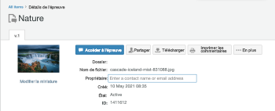

# Activité de publication Workfront Proof : semaine du 17 mai 2021

Cette page décrit les modifications apportées à Workfront Proof (application de relecture autonome). Les modifications décrites ici ne s’appliquent pas à la fonctionnalité de relecture de l’application Adobe Workfront.

## Les menus de profil utilisateur/utilisatrice dans Workfront Proof utilisent désormais des champs de caractères avancés pour rechercher des utilisateurs et utilisatrices.

>[!NOTE]
>
>Cette fonctionnalité a été ajoutée à l’environnement Aperçu le 20 mai 2021. Il sera publié dans l’environnement de production le 16 septembre 2021.

Pour vous aider à gérer les menus déroulants volumineux répertoriant tous les utilisateurs et utilisatrices du système, nous avons remplacé tous les menus de recherche de profil utilisateur/utilisatrice par une recherche de type dans le modèle autonome Adobe Workfront Proof. Voici quelques exemples de menus de recherche de profil utilisateur/utilisatrice :

* Propriétaires d’épreuve
* Contacts hors du bureau
* Propriétaires de modèles

Auparavant, toutes les listes déroulantes de recherche de profil répertoriaient l’ensemble des utilisateurs et utilisatrices du système, ce qui générait un menu volumineux.

