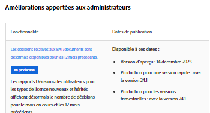

# Calendrier des versions d’Adobe Workfront et processus

## Calendrier des mises à jour pour l’aperçu

L’environnement d’aperçu est mis à jour une fois par semaine avec de nouvelles fonctionnalités. Ces fonctionnalités sont communiquées dans les notes de mise à jour de la version trimestrielle à venir.

Les mises à jour sont généralement disponibles aux alentours de 20 à 22 h, heure des Rocheuses.

## Calendrier des mises à jour pour la production

### Fonctionnalités du produit

Adobe Workfront dispose de deux modèles pour la publication de nouvelles fonctionnalités et mises à jour. Votre organisation peut choisir de recevoir les nouvelles fonctionnalités sur une base trimestrielle ou une fréquence plus élevée.

Sauf indication contraire, les versions mensuelles et trimestrielles sont prévues pour être disponibles le jeudi de la deuxième semaine complète du mois. Pour les dates à venir, reportez-vous à la [Vue d’ensemble de version](/help/quicksilver/product-announcements/product-releases/product-releases.md) la plus récente.

Les mises à jour sont généralement disponibles entre 20 et 22 h, heure des Rocheuses, le soir précédant la date de publication.

En règle générale, les fonctionnalités de l’aperçu sont mises à disposition dans votre environnement de production avec la prochaine version. Cependant, dans certains cas, des fonctionnalités sont disponibles dans l’environnement de production en dehors d’une version planifiée. Ces modifications restent généralement dans la Prévisualisation pendant au moins 2 semaines afin que vous ayez le temps de vous familiariser avec elles.

Pour plus d’informations sur les processus de versions trimestrielles et rapides, consultez [Activer ou désactiver les versions rapides pour votre organisation](/help/quicksilver/administration-and-setup/set-up-workfront/configure-system-defaults/enable-fast-release-process.md).

### Mises à jour de maintenance

Des correctifs pour le produit Adobe Workfront sont mis à disposition dans l’environnement de production chaque semaine. Consultez la page [Mises à jour de maintenance pour Workfront](https://experienceleague.adobe.com/fr/docs/workfront-known-issues/releases/current-updates) pour voir les problèmes qui ont été corrigés récemment.

## Fonctionnalités supprimées d’une version planifiée

Toutes les fonctionnalités associées à une version donnée (mensuelle ou trimestrielle) peuvent faire l’objet de tests dans l’aperçu pendant au moins 2 à 4 semaines avant que la version finale soit disponible pour la production. Si des fonctionnalités sont supprimées de la version planifiée avant cette date, les clients et les clientes en sont informés de la façon suivante :

* Les notes de mise à jour de la version planifiée (disponibles sur la page [Versions de produit](../../product-announcements/product-releases/product-releases.md)) sont modifiées pour indiquer que la fonctionnalité a été supprimée.

Si des fonctionnalités sont supprimées de la version planifiée une fois que toutes les fonctionnalités sont disponibles pour le test dans l’aperçu, les clients et les clientes en sont informés de la façon suivante :

* Les notes de mise à jour de la version (disponibles sur la page [Versions de produit](../../product-announcements/product-releases/product-releases.md)) sont modifiées pour indiquer que la fonctionnalité a été supprimée.
* Une publication est ajoutée à la communauté Workfront pour indiquer que la fonctionnalité a été supprimée.
* Un message indiquant que la fonctionnalité a été supprimée est envoyé à l’ensemble des clients et clientes par l’intermédiaire du centre d’annonces. (Le centre d’annonces est le centre de notifications in-app de Workfront. Pour plus d’informations, consultez [Envoyer des annonces](../../administration-and-setup/get-started-wf-administration/view-send-announcements.md).)

## Versions bêta

Parfois, Workfront publie de nouvelles fonctionnalités dans le cadre d’un programme bêta.
Les informations spécifiques à chaque version bêta, y compris la manière de participer, les versions au lancement de chaque programme bêta et tous les programmes bêta, sont différentes.

Les programmes bêta suivants sont disponibles pour Workfront :

* **Version bêta fermée ou privée** : caractéristiques d’une version bêta fermée ou privée :

   * Les fonctionnalités sont disponibles pour un petit groupe de clients et clientes, soigneusement sélectionnés par Workfront.
   * Les participants et participantes travaillent généralement avec un chef ou une cheffe de produit et fournissent régulièrement des commentaires.
   * Les nouvelles fonctionnalités qui font partie de la version bêta peuvent être publiées dans l’environnement d’aperçu ou de production, ou dans un environnement distinct mis à disposition dans le cadre du programme bêta. Les fonctionnalités de versions bêta fermées sont publiées à intervalles aléatoires et sans avertissement.
   * Il n’existe aucune information de mise à jour pour les versions bêta fermées sur les pages de mise à jour du produit.

* **Version bêta ouverte ou publique** : caractéristiques d’une version bêta publique ou ouverte :

   * Les fonctionnalités sont disponibles pour l’ensemble des clients et clientes Workfront, mais le sont en version bêta. Elles ne sont peut-être pas toujours entièrement fonctionnelles et les commentaires sont toujours bienvenus.
   * La participation à une version bêta publique est facultative et les clients et clientes peuvent décider d’activer les fonctionnalités bêta eux-mêmes.
   * Les nouvelles fonctionnalités qui font partie de la version bêta peuvent être publiées dans l’environnement d’aperçu ou de production.
   * Les fonctionnalités peuvent être publiées plus souvent que les modèles de version standard pour Workfront.
   * Des informations sur la date de publication des fonctionnalités dans une version bêta publique sont incluses dans les pages de version du produit.

Pour plus d’informations sur les notes de mise à jour des produits, voir [Versions de produit](../../product-announcements/product-releases/product-releases.md).

## Autres versions

Parfois, Workfront peut publier des fonctionnalités qui peuvent ne pas être documentées dans les notes de mise à jour, les mises à jour de maintenance ou dans l’un des articles de documentation. Cela se produit dans le but de tester de nouvelles fonctionnalités avant de les rendre permanentes. En règle générale, ces tests sont publiés pour un nombre limité de clientes et clients, mais il peut arriver qu’ils soient publiés pour toutes les personnes. Ils peuvent être publiés dans les environnements de prévisualisation ou de production.

Si vous rencontrez dans le système quelque chose qui ne correspond pas à la documentation et sur laquelle vous avez des questions, nous vous invitons à contacter notre équipe d’assistance clientèle. Pour plus d’informations, voir [Contacter l’assistance clientèle](../../workfront-basics/tips-tricks-and-troubleshooting/contact-customer-support.md).

## Notes de mise à jour

Utilisez les notes de mise à jour de la prochaine version planifiée pour découvrir les nouvelles fonctionnalités disponibles dans la prévisualisation et quand elles seront publiées dans l’environnement de production.

Pour consulter les notes de mise à jour de la prochaine version planifiée, voir [Versions de produit](../../product-announcements/product-releases/product-releases.md), puis cliquez sur le lien pour accéder à la page de vue d’ensemble de la version pour la prochaine version.

Les notes de mise à jour contiennent un tableau répertoriant les fonctionnalités de la colonne de gauche, avec une brève description de chacune d’elles. Vous pouvez cliquer sur un lien pour afficher une vidéo de démonstration de la nouvelle fonctionnalité et accéder à la documentation sur la nouvelle fonctionnalité. Dans la colonne de droite, les informations suivantes s’affichent pour chaque fonctionnalité :

* Date de la version préliminaire
* Date de la version de production

Par exemple :

