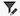

# Créer un rapport de KPI dans un tableau de bord de zones de travail

>[!IMPORTANT]
>
>La fonctionnalité Tableaux de bord de la zone de travail est actuellement disponible uniquement pour les utilisateurs participant à l’étape bêta. Il se peut que certaines parties de la fonction ne soient pas terminées ou ne fonctionnent pas comme prévu à cette étape. Veuillez soumettre tout commentaire concernant votre expérience en suivant les instructions de la section [Fournir un commentaire](/help/quicksilver/product-announcements/betas/canvas-dashboards-beta/canvas-dashboards-beta-information.md#provide-feedback) de l’article de présentation de la version Beta des tableaux de bord de la zone de travail. 
>Si vous avez des commentaires concernant un bug ou un problème technique éventuel, envoyez un ticket à l’assistance Workfront. Pour plus d’informations, voir [Contacter le service clientèle](/help/quicksilver/workfront-basics/tips-tricks-and-troubleshooting/contact-customer-support.md). 
>Notez que cette version bêta n’est pas disponible sur les fournisseurs de cloud suivants :
>
>* Apporter votre propre clé pour Amazon Web Services
>* Azure
>* Google Cloud Platform

Vous pouvez créer et ajouter un rapport sur les indicateurs de performance clés à un tableau de bord de la zone de travail, qui représente visuellement les données de vos indicateurs clés de performance sous la forme d’un nombre, que vous pouvez ensuite utiliser pour voir comment se portent vos projets et vos équipes.

## Conditions d’accès

+++ Développez pour afficher les exigences d’accès aux fonctionnalités de cet article.

<table style="table-layout:auto"> 
<col> 
</col> 
<col> 
</col> 
<tbody> 
<tr> 
   <td role="rowheader">
Package Adobe Workfront
</td> 
   <td> 

Tous 
 
   </td> 
<tr> 
 <tr> 
   <td role="rowheader">
Licence Adobe Workfront
</td> 
   <td> 

Standard
 

Plan
 
   </td> 
   </tr> 
  </tr> 
  <tr> 
   <td role="rowheader">
Configurations des niveaux d’accès
</td> 
   <td>
Accès en modification aux rapports, aux tableaux de bord et aux calendriers

  </td> 
  </tr>  
</tbody> 
</table>

Pour plus d’informations sur le contenu de ce tableau, voir [Conditions d’accès requises dans la documentation Workfront](/help/quicksilver/administration-and-setup/add-users/access-levels-and-object-permissions/access-level-requirements-in-documentation.md).
+++

## Conditions préalables

Vous devez créer un tableau de bord avant de pouvoir créer un rapport sur les indicateurs de performance clés.

## Créer un rapport de KPI dans un tableau de bord de zones de travail

De nombreuses options de configuration sont disponibles pour créer un rapport sur les indicateurs de performance clés. Dans cette section, nous vous guiderons à travers le processus général de création d’un rapport.

{{step1-to-dashboards}}

1. Dans le panneau de gauche, cliquez sur **Tableaux de bord des zones de travail**.

1. Cliquez sur **Nouveau tableau de bord** dans le coin supérieur droit.

1. Dans la zone **Créer un tableau de bord**, saisissez les **Nom** et **Description** du tableau de bord.

1. Cliquez sur **Créer**.

1. Dans la zone **Ajouter un rapport**, sélectionnez **Créer un rapport**.

1. Sur le côté gauche, sélectionnez **KPI**.

1. Dans le coin supérieur droit, cliquez sur **Créer un rapport**.

1. Pour configurer la section **Détails**, procédez comme suit :

   1. Saisissez un rapport **Nom**.
   1. Saisissez un état **Description**.

      >[!NOTE]
      >
      >La description sera utilisée comme légende sous la valeur de l’indicateur de performance clé. Si vous ne saisissez pas de description, une légende est générée pour vous en fonction de l’agrégateur et du type d’agrégation que vous sélectionnez dans les étapes suivantes.

1. Suivez les étapes ci-dessous pour configurer la section **Créer un KPI** :

   1. Dans le panneau de gauche, cliquez sur l’icône **Créer un indicateur de performance clé** .

   1. Cliquez sur **Sélectionner un champ** puis spécifiez le champ que vous souhaitez ajouter au rapport.

   1. Dans le menu déroulant **Type d’agrégation**, sélectionnez la manière dont les données sont cumulées pour produire la sortie d’indicateurs de performance clés. Les options de ce champ varient en fonction du type de champ sélectionné à l’étape précédente.

1. Pour configurer la section **Filtre**, procédez comme suit :

   1. Dans le panneau de gauche, cliquez sur l’icône **Filtrer** .

   1. Sélectionnez **Modifier le filtre**.

   1. Cliquez sur **Ajouter une condition** puis spécifiez le champ à utiliser comme filtre et le modificateur qui définit le type de condition auquel le champ doit répondre.

   1. (Facultatif) Cliquez sur **Ajouter un groupe de filtres** pour ajouter un autre ensemble de critères de filtrage. L’opérateur par défaut entre les visionneuses est AND. Cliquez sur l’opérateur pour le remplacer par OU.

      Pour plus d’informations sur les filtres, voir [Modifier les filtres de rapport dans un tableau de bord Zone de travail](/help/quicksilver/reports-and-dashboards/canvas-dashboards/manage-reports/edit-report-filters.md).

1. Suivez les étapes ci-dessous pour configurer la section **Paramètres des colonnes d’analyse** :

   1. Dans le panneau de gauche, cliquez sur l’icône **Colonnes d’analyse** . Les champs de votre graphique s’affichent automatiquement sous forme de colonnes dans la section de prévisualisation à droite.

   1. (Facultatif) Pour mettre à jour l’une des configurations de colonne existantes, sélectionnez la colonne à mettre à jour dans la section **Colonnes actives** puis mettez à jour les informations souhaitées (par exemple, le libellé, le statut lié et les règles de mise en forme).

   1. Cliquez sur **Ajouter une colonne** puis sélectionnez le champ à afficher en tant que colonne dans le tableau. Répétez ce processus pour chaque colonne à ajouter.

1. Suivez les étapes ci-dessous pour configurer la section **Paramètres du groupe d’analyse** :

   1. Dans le panneau de gauche, cliquez sur l’icône **Paramètres de groupe** .

   1. Cliquez sur le bouton **Ajouter un regroupement** puis sélectionnez le champ à créer en tant que regroupement.

1. Cliquez sur **Enregistrer** pour créer le rapport et l’ajouter au tableau de bord.

## Création d’un exemple de rapport sur les indicateurs de performance clés

Dans cette section, nous allons passer en revue les étapes pour créer un rapport sur les indicateurs de performance clés qui affiche les approbations de documents en attente.

Pour plus d’informations sur les exemples de rapports d’indicateurs clés de performance, voir [Créer un tableau de bord de rapport pour révision et approbation](/help/quicksilver/review-and-approve-work/document-reviews-and-approvals/create-review-and-approval-dashboard.md).

{{step1-to-dashboards}}

1. Dans le panneau de gauche, cliquez sur **Tableaux de bord des zones de travail**.

1. Cliquez sur **Nouveau tableau de bord** dans le coin supérieur droit.

1. Dans la zone **Créer un tableau de bord**, saisissez les **Nom** et **Description** du tableau de bord.

1. Cliquez sur **Créer**.

1. Dans la zone **Ajouter un rapport**, sélectionnez **Créer un rapport**.

1. Sur le côté gauche, sélectionnez **KPI**.

1. Dans le coin supérieur droit, cliquez sur **Créer un rapport**.

1. Pour configurer la section **Détails**, procédez comme suit :

   1. Saisissez *En attente* dans le champ **Nom**.
   1. Saisissez *Approbations en attente* dans le champ **Description**. S’affiche sous la valeur de l’indicateur de performance clé sous forme de légende.

1. Suivez les étapes ci-dessous pour configurer la section **Créer un KPI** :

   1. Dans le panneau de gauche, cliquez sur l’icône **Créer un KPI** .

   1. Cliquez sur **Sélectionner un champ**.

   1. Recherchez et sélectionnez le dossier **Approbation du document**.

   1. Sélectionnez **Statut**.

   1. Dans le menu déroulant **Type d’agrégation**, sélectionnez **Comptage**.

1. Pour configurer la section **Filtre**, procédez comme suit :

   1. Dans le panneau de gauche, cliquez sur l’icône **Filtrer** .

   1. Sélectionnez **Modifier le filtre**.

   1. Cliquez sur **Ajouter une condition**.

   1. Cliquez dans le filtre de condition vide, cliquez sur **Choisir un champ**, puis choisissez **Statut**.
   1. Laissez l’opérateur sur **Égal**, puis saisissez _en attente de révision_ dans la zone de texte.
      
1. Cliquez sur **Enregistrer** dans le coin supérieur droit de l’écran.

## Remarques concernant la création d’un rapport sur les indicateurs de performance clés

### Rapports avec des données financières

Les utilisateurs disposant d’un accès en affichage ou en modification aux données financières dans leur niveau d’accès verront toujours les données financières dans les visualisations du tableau de bord de la zone de travail, même si l’autorisation Afficher les données financières est supprimée au niveau de la tâche ou du projet.

* Les utilisateurs ne disposant pas de droits d’accès aux données financières ne verront pas les données financières dans les rapports.
* Les utilisateurs qui ne voient pas les données financières sont limités aux enregistrements qu&#39;ils sont déjà autorisés à afficher (projets, tâches, événements, etc.). Ils ne verront pas les valeurs financières des documents auxquels ils ne peuvent pas accéder.
* Les créateurs de rapports doivent faire preuve de prudence lors de l’inclusion de données financières dans les tableaux de bord et garder à l’esprit les personnes avec lesquelles ils partagent les tableaux de bord afin d’éviter tout accès involontaire.

Il s’agit d’une limite connue et nous prévoyons d’y remédier dès que possible.

### Utilisation du sélecteur de champ

La liste déroulante **Sections** de la section **Créer un indicateur de performance clé** est conçue pour limiter les choix d&#39;un sélecteur de champ afin de faciliter la recherche d&#39;un objet lors de la création d&#39;un rapport de tableau. Pour commencer, sélectionnez un objet d’entité de base.

* **Toutes les sections** : tous les types d’objet dans Workfront Workflow et Workfront Planning.
* **Objets Workfront** : objets de workflow Workfront natifs.
* **Types d’enregistrements Planning** : types d’enregistrements personnalisés définis dans Workfront Planning.

Une fois l’objet d’entité de base sélectionné, la liste déroulante **Sections** est mise à jour avec les options de type de champ applicables parmi lesquelles choisir.

* **Toutes les sections** : champs natifs, champs personnalisés et objets associés.
* **Tous les champs** : champs natifs et personnalisés (sans les relations).
* **Champs personnalisés** : champs définis par le client sur un formulaire personnalisé ou un enregistrement Planning.
* **Champs Workfront** : champs natifs uniquement.
* **Relations** : enregistrements connectés.

### Référencer des objets enfants

Les relations disponibles pour les colonnes supplémentaires, les options de filtre et les attributs de regroupement sont généralement limitées aux objets situés plus haut dans la hiérarchie d&#39;objets Workfront ou comportent une seule sélection sur l&#39;objet d&#39;entité de base du rapport. Il existe certaines exceptions à cette règle, notamment :

* Projet > Tâches
* Approbation de document > Étapes d&#39;approbation de document
* Étapes d&#39;approbation du document > Participants à l&#39;étape d&#39;approbation du document

Lors de l’utilisation de l’une des relations parent-enfant répertoriées ci-dessus, une ligne s’affiche dans le tableau pour chaque enregistrement enfant connecté à l’objet parent.

