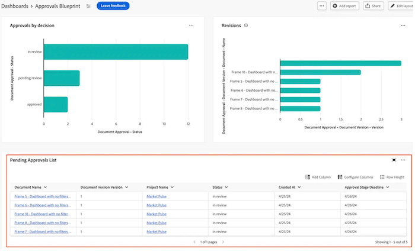
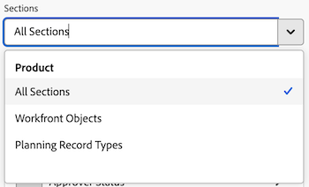

# Créer un rapport de tableau dans un tableau de bord de zones de travail

>[!IMPORTANT]
>
>La fonctionnalité Tableaux de bord de la zone de travail est actuellement uniquement disponible pour les utilisateurs participant à la phase Beta. Certaines parties de la fonction peuvent ne pas être complètes ou ne pas fonctionner comme prévu pendant cette étape. Veuillez soumettre vos commentaires concernant votre expérience en suivant les instructions de la section [Fournir des commentaires](/help/quicksilver/product-announcements/betas/canvas-dashboards-beta/canvas-dashboards-beta-information.md#provide-feedback) dans l&#39;article de présentation de la version Beta des tableaux de bord Canvas. 
>Si vous avez des commentaires concernant un problème technique ou un bug possible, veuillez envoyer un ticket au support Workfront. Pour plus d&#39;informations, voir [Contacter le service clientèle](/help/quicksilver/workfront-basics/tips-tricks-and-troubleshooting/contact-customer-support.md). 
>Veuillez noter que cette version Beta n’est pas disponible sur les fournisseurs de cloud suivants :
>
>* Ajouter votre propre clé pour Amazon Web Services
>* Azure
>* Google Cloud Platform

Vous pouvez ajouter un rapport tabulaire à un tableau de bord de zone de travail afin de visualiser vos données dans un format de tableau.

## Conditions d’accès

+++ Développez pour afficher les exigences d’accès aux fonctionnalités de cet article.

<table style="table-layout:auto"> 
<col> 
</col> 
<col> 
</col> 
<tbody> 
<tr> 
   <td role="rowheader">
Package Adobe Workfront
</td> 
   <td> 

Tous 
 
   </td> 
<tr> 
 <tr> 
   <td role="rowheader">
Licence Adobe Workfront
</td> 
   <td> 

Standard 
 

Plan
 
   </td> 
   </tr> 
  </tr> 
  <tr> 
   <td role="rowheader">
Configurations des niveaux d’accès
</td> 
   <td>
Accès en modification aux rapports, aux tableaux de bord et aux calendriers

  </td> 
  </tr>  
</tbody> 
</table>

Pour plus d’informations sur le contenu de ce tableau, voir [Conditions d’accès requises dans la documentation Workfront](/help/quicksilver/administration-and-setup/add-users/access-levels-and-object-permissions/access-level-requirements-in-documentation.md).
+++

## Conditions préalables

Vous devez créer un tableau de bord avant de pouvoir créer un rapport tabulaire.

## Créer un rapport de tableau dans un tableau de bord de zones de travail

De nombreuses options de configuration sont disponibles pour créer un rapport tabulaire. Dans cette section, nous vous guiderons à travers le processus général de création d’un rapport.

{{step1-to-dashboards}}

1. Dans le panneau de gauche, cliquez sur **Tableaux de bord des zones de travail**.

1. Cliquez sur **Nouveau tableau de bord** dans le coin supérieur droit.

1. Dans la zone **Créer un tableau de bord**, saisissez les **Nom** et **Description** du tableau de bord.

1. Cliquez sur **Créer**.

1. Dans la zone **Ajouter un rapport**, sélectionnez **Créer un rapport**.

1. Sur le côté gauche, sélectionnez **Tableau**.

1. Dans le coin supérieur droit, cliquez sur **Créer un rapport**.

1. (Facultatif) Suivez les étapes ci-dessous pour configurer la section **Détails** :

   1. Entrez un rapport **Nom**.

   1. Entrez un rapport **Description**.

1. Suivez les étapes ci-dessous pour configurer la section **Créer une table** :

   1. Dans le panneau de gauche, cliquez sur l’icône **Colonnes du tableau** .

   1. Cliquez sur **Ajouter une colonne**, puis sélectionnez le champ que vous souhaitez afficher en tant que colonne dans la table. La colonne apparaît dans la section d’aperçu à droite.

   1. Répétez l’étape ci-dessus pour chaque colonne à ajouter.

1. Suivez les étapes ci-dessous pour configurer la section **Filtre** :

   1. Dans le panneau de gauche, cliquez sur l&#39;icône **Filtre** .

   1. Sélectionnez **Modifier le filtre**.

   1. Cliquez sur **Ajouter une condition**, puis spécifiez le champ par lequel vous souhaitez filtrer et le modificateur qui définit le type de condition que le champ doit remplir. La colonne apparaît dans la section d’aperçu à droite.

1. (Facultatif) Cliquez sur **Ajouter un groupe de filtres** pour ajouter un autre ensemble de critères de filtrage. L’opérateur par défaut entre les ensembles est AND. Cliquez sur l’opérateur pour le remplacer par OR.

1. Suivez les étapes ci-dessous pour configurer la section **Paramètres du groupe d&#39;exploration** :

   1. Dans le panneau de gauche, cliquez sur l&#39;icône **Paramètres de groupe** .

   1. Cliquez sur le bouton **Ajouter un regroupement**, puis sélectionnez le champ que vous souhaitez créer en tant que regroupement. La colonne de regroupement s’affiche dans la section Aperçu à droite.

1. Cliquez sur **Enregistrer** pour créer le rapport et l&#39;ajouter au tableau de bord.

## Exemple de rapport de création de tableau

Dans cette section, nous allons passer en revue les étapes pour créer un rapport tabulaire qui affiche les approbations de documents en attente.

Pour plus d&#39;informations sur les exemples de rapport de table, voir [Créer un tableau de bord de rapport pour révision et approbations](/help/quicksilver/review-and-approve-work/document-reviews-and-approvals/create-review-and-approval-dashboard.md).

{{step1-to-dashboards}}

1. Dans le panneau de gauche, cliquez sur **Tableaux de bord des zones de travail**.

1. Cliquez sur **Nouveau tableau de bord** dans le coin supérieur droit.

1. Dans la zone **Créer un tableau de bord**, entrez le **nom** et la **description** du tableau de bord.

1. Cliquez sur **Créer**.

1. Dans la zone **Ajouter un rapport**, sélectionnez **Créer un rapport**.

1. Sur le côté gauche, sélectionnez **Tableau**.

1. Dans le coin supérieur droit, cliquez sur **Créer un rapport**.

1. Suivez les étapes ci-dessous pour configurer la section **Détails** :

   1. Saisissez _Approbations en attente_ dans le champ **Nom**.
   1. Saisissez une description dans le champ **Description**. Ce texte s&#39;affiche sous forme d&#39;info-bulle à côté du nom du graphique.

1. Suivez les étapes ci-dessous pour configurer la section **Créer une table** :

   1. Dans le panneau de gauche, cliquez sur l&#39;icône **Colonnes de tableau** .
   1. Cliquez sur **Ajouter une colonne**.
   1. Faites défiler vers le bas et sélectionnez **Approbations de document** > **État**.
   1. Ajoutez les colonnes suivantes :

   <table>
    <tr>
    <td><strong>Nom du projet</strong></td>
    <td>Version du document &gt; Document &gt; Projet &gt; Nom</td>
    </tr>
    <tr>
    <td><strong>Nom du document</strong></td>
    <td>Version du document &gt; Document &gt; saisissez <em>Nom</em> dans la zone de recherche.</td>
    </tr>
    <tr>
    <td><strong>Version du document</strong></td>
    <td>Version du document &gt; Document &gt; Version</td>
    </tr>
    <tr>
    <td><strong>Échéance</strong></td>
    <td>Approbation de document &gt; Étape d'approbation &gt; Échéance</td>
    </tr>
    <tr>
    <td><strong>Demandé par</strong></td>
    <td>Approbation de document &gt; Étape d'approbation &gt; Participants à l'étape d'approbation* &gt; Demandeur &gt; saisissez <em>Nom</em> dans la zone de recherche.</td>
    </tr>
    <tr>
    <td><strong>Date demandée</strong></td>
    <td>Approbation du document &gt; Étape d’approbation &gt; Participants à l’étape d’approbation* &gt; Créé le</td>
    </tr>
    <tr>
    <td><strong>Approbateur</strong></td>
    <td>Approbation du document &gt; Étape d’approbation &gt; Participants à l’étape d’approbation* &gt; Utilisateur participant &gt; saisissez <em>Nom</em> dans la zone de recherche.</td>
    </tr>
    </table>

   *Les participants à l&#39;étape d&#39;approbation sont tronqués à _Pa étape d&#39;approbation_.

1. Pour configurer la section **Filtre**, procédez comme suit :
   1. Dans le panneau de gauche, cliquez sur l’icône **Filtrer** .
   1. Cliquez sur **Modifier le filtre**, puis **Ajouter une condition**.
   1. Cliquez dans le filtre de condition vide, puis cliquez sur **Choisir un champ**.
   1. Sélectionnez **Statut**.
   1. Remplacez l’opérateur par **Égal**, puis saisissez _en attente d’approbation_ dans la zone de texte.
      
   1. (Facultatif) Ajoutez des filtres supplémentaires comme décrit dans la section **Filtres facultatifs** ci-dessous.
1. Cliquez sur **Enregistrer** dans le coin supérieur droit de l&#39;écran.

## Considérations à prendre en compte lors de la création d’un rapport tabulaire

### Rapports avec données financières

Les utilisateurs disposant d’un accès Afficher ou Modifier aux données financières dans leur niveau d’accès verront toujours les données financières dans les visualisations du tableau de bord de la zone de travail, même si l’autorisation Afficher les données financières est supprimée au niveau de la tâche ou du projet.

* Les personnes ne disposant pas de droits d’accès aux données financières ne verront pas les données financières dans les rapports.
* Les personnes qui ne voient pas les données financières sont limitées aux documents qu’elles sont déjà autorisées à consulter (projets, tâches, problèmes, etc.). Elles ne verront pas les valeurs financières des documents auxquels elles ne peuvent pas accéder.
* Les personnes à l’origine des rapports doivent faire preuve de prudence lors de l’inclusion de données financières dans les tableaux de bord et bien vérifier avec qui elles partagent les tableaux de bord afin d’éviter tout accès involontaire.

Il s’agit d’une limite connue et nous prévoyons d’y remédier dès que possible.

### Utilisation du sélecteur de champ

La liste déroulante **Sections** de la section **Créer un tableau** est conçue pour limiter les choix d&#39;un sélecteur de champ afin de faciliter la recherche d&#39;un objet lors de la création d&#39;un rapport de tableau. Pour commencer, sélectionnez un objet d’entité de base.

* **Toutes les sections** : tous les types d’objet dans Workfront Workflow et Workfront Planning.
* **Objets Workfront** : objets de workflow Workfront natifs.
* **Types d’enregistrements Planning** : types d’enregistrements personnalisés définis dans Workfront Planning.

Une fois l&#39;objet d&#39;entité de base sélectionné, la liste déroulante **Sections** est mise à jour avec les options de type de champ applicables.

* **Toutes les sections** : champs natifs, champs personnalisés et objets associés.
* **Tous les champs** : champs natifs et personnalisés (excluent les relations).
* **Champs personnalisés** : champs définis par le client sur un formulaire personnalisé ou un enregistrement Planning.
* **Champs Workfront** : champs natifs uniquement.
* **Relations** : enregistrements connectés.

### Référencement d’objets enfants

Les relations disponibles pour les colonnes supplémentaires, les options de filtre et les attributs de regroupement sont généralement limitées aux objets situés plus haut dans la hiérarchie d&#39;objets Workfront ou comportent une seule sélection sur l&#39;objet d&#39;entité de base du rapport. Il existe quelques exceptions à cette règle, notamment :

* Projet > Tâches
* Approbation des documents > Phases d&#39;approbation des documents
* Étapes d’approbation des documents > Participants à l’étape d’approbation des documents

Lorsque vous utilisez l’une des relations parent-enfant répertoriées ci-dessus, une ligne apparaît dans le tableau pour chaque enregistrement enfant connecté à l’objet parent.
