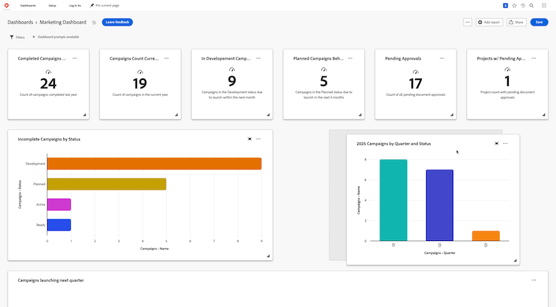

# Organiser les rapports dans un tableau de bord

>[!IMPORTANT]
>
>La fonctionnalité Tableaux de bord de la zone de travail est actuellement disponible uniquement pour les utilisateurs participant à l’étape bêta. Pour plus d’informations, voir [Informations bêta sur les tableaux de bord de la zone de travail](/help/quicksilver/product-announcements/betas/canvas-dashboards-beta/canvas-dashboards-beta-information.md).

Une fois qu’un rapport est ajouté à un tableau de bord, il s’affiche sous la forme d’un widget de rapport dans le tableau de bord afin que vous puissiez rapidement visualiser ses données en un coup d’œil. Une fois que plusieurs rapports ont été ajoutés, il est recommandé de réorganiser la taille et l’ordre de chaque widget pour afficher plus efficacement les données du tableau de bord.

+++ Développez pour afficher les exigences d’accès.

<table style="table-layout:auto"> 
<col> 
</col> 
<col> 
</col> 
<tbody> 
<tr> 
   <td role="rowheader">
Formule Adobe Workfront
</td> 
   <td> 

Tous 
 
   </td> 
<tr> 
 <tr> 
   <td role="rowheader">
Licence Adobe Workfront
</td> 
   <td> 

Actuelle : formule 
 

Nouveau : Standard
 
   </td> 
   </tr> 
  </tr> 
  <tr> 
   <td role="rowheader">
Configurations des niveaux d’accès
</td> 
   <td>
Accès en modification aux rapports, aux tableaux de bord et aux calendriers

  </td> 
  </tr>  
        <tr> 
   <td role="rowheader">
Autorisations d’objet
</td> 
   <td>
Gestion des autorisations relatives au tableau de bord

  </td> 
  </tr>
</tbody> 
</table>

Pour plus d’informations sur le contenu de ce tableau, voir [Conditions d’accès requises dans la documentation Workfront](/help/quicksilver/administration-and-setup/add-users/access-levels-and-object-permissions/access-level-requirements-in-documentation.md).
+++

## Conditions préalables

Vous devez ajouter les rapports à un tableau de bord avant de pouvoir les réorganiser.

## Organiser les rapports dans un tableau de bord

{{step1-to-dashboards}}

1. Dans le panneau de gauche, cliquez sur **Tableaux de bord des zones de travail**.

1. Sur la page **Tableaux de bord de la zone de travail**, sélectionnez **Modifier la disposition** dans le coin supérieur droit. Les widgets du rapport deviennent modifiables.

1. Cliquez sur un widget de rapport et faites-le glisser vers un nouvel emplacement sur la page.

   

1. (Facultatif) Pour ajuster la longueur et la largeur d’un widget de rapport, cliquez sur l’icône **Redimensionner**  et maintenez-la enfoncée dans le coin inférieur droit du widget, puis ajustez la taille selon vos besoins.

1. Répétez les étapes 4 à 5 pour chaque widget que vous souhaitez réorganiser.

1. Cliquez sur **Enregistrer** dans le coin supérieur droit.