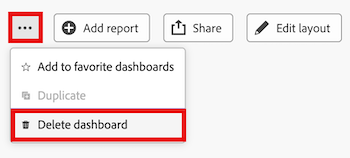

# Supprimer un tableau de bord de la zone de travail

>[!IMPORTANT]
>
>La fonctionnalité Tableaux de bord de la zone de travail est actuellement disponible uniquement pour les utilisateurs participant à l’étape bêta. Il se peut que certaines parties de la fonction ne soient pas terminées ou ne fonctionnent pas comme prévu à cette étape. Veuillez soumettre tout commentaire concernant votre expérience en suivant les instructions de la section [Fournir un commentaire](/help/quicksilver/product-announcements/betas/canvas-dashboards-beta/canvas-dashboards-beta-information.md#provide-feedback) de l’article de présentation de la version Beta des tableaux de bord de la zone de travail. 
>Si vous avez des commentaires concernant un bug ou un problème technique éventuel, envoyez un ticket à l’assistance Workfront. Pour plus d’informations, consultez la section [Contacter l’assistance clientèle](/help/quicksilver/workfront-basics/tips-tricks-and-troubleshooting/contact-customer-support.md). 
>Notez que cette version bêta n’est pas disponible sur les fournisseurs de cloud suivants :
>
>* Apporter votre propre clé pour Amazon Web Services
>* Azure
>* Google Cloud Platform

Une fois que vous n’avez plus besoin d’un tableau de bord de zone de travail, vous pouvez le supprimer d’Adobe Workfront.

## Conditions d’accès

+++ Développez pour afficher les exigences d’accès aux fonctionnalités de cet article.

<table style="table-layout:auto"> 
<col> 
</col> 
<col> 
</col> 
<tbody> 
<tr> 
   <td role="rowheader">
Package Adobe Workfront
</td> 
   <td> 

Tous 
 
   </td> 
<tr> 
 <tr> 
   <td role="rowheader">
Licence Adobe Workfront
</td> 
   <td> 

Standard 
 

Plan
 
   </td> 
   </tr> 
  </tr> 
  <tr> 
   <td role="rowheader">
Configurations des niveaux d’accès
</td> 
   <td>
Accès en modification aux rapports, aux tableaux de bord et aux calendriers

  </td> 
  </tr>  
    </tr>  
        <tr> 
   <td role="rowheader">
Autorisations d’objet
</td> 
   <td>
Gestion des autorisations relatives au tableau de bord

  </td> 
  </tr>
</tbody> 
</table>

Pour plus de détails sur les informations contenues dans ce tableau, consultez [Conditions d’accès préalables dans la documentation Workfront](/help/quicksilver/administration-and-setup/add-users/access-levels-and-object-permissions/access-level-requirements-in-documentation.md).
+++

## Conditions préalables

Vous devez créer un tableau de bord avant de pouvoir le supprimer.

Pour plus d’informations, voir [Créer un tableau de bord Zone de travail](/help/quicksilver/reports-and-dashboards/canvas-dashboards/create-dashboards/create-dashboards.md).

## Supprimer un tableau de bord

>[!WARNING]
>
> Une fois qu’un tableau de bord est supprimé, il est impossible de récupérer celui-ci ainsi que tous ses rapports et/ou visualisations personnalisés. 
> Si vous supprimez un tableau de bord qui contient un rapport classique, ce dernier ne sera pas supprimé.

{{step1-to-dashboards}}

1. Dans le panneau de gauche, cliquez sur **Tableaux de bord des zones de travail**.

1. Sur la page **Tableaux de bord de la zone de travail**, sélectionnez le tableau de bord à supprimer.

1. Dans le coin supérieur droit, sélectionnez l’icône **Plus** , puis sélectionnez **Supprimer le tableau de bord**.
   

1. Dans la boîte de dialogue **Supprimer le tableau de bord**, cochez la case **Je confirme que je souhaite supprimer ce tableau de bord**.

1. Cliquez sur **Supprimer**.
