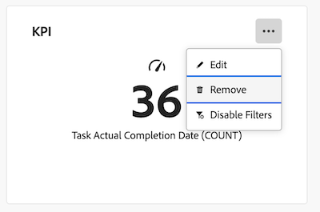

# Supprimer des rapports d’un tableau de bord

>[!IMPORTANT]
>
>La fonctionnalité Tableaux de bord de la zone de travail est actuellement disponible uniquement pour les utilisateurs participant à l’étape bêta. Pour plus d’informations, voir [Informations bêta sur les tableaux de bord de la zone de travail](/help/quicksilver/product-announcements/betas/canvas-dashboards-beta/canvas-dashboards-beta-information.md).

Une fois qu’un tableau de bord est créé et que vous y avez ajouté des rapports, vous pouvez supprimer les rapports plus anciens qui ne sont plus applicables à ce tableau de bord spécifique.

La suppression d’un rapport d’un tableau de bord est permanente. Si vous devez ajouter à nouveau un rapport après sa suppression, vous devrez recréer le rapport.

+++ Développez pour afficher les exigences d’accès. 

<table style="table-layout:auto"> 
<col> 
</col> 
<col> 
</col> 
<tbody> 
<tr> 
   <td role="rowheader">
Formule Adobe Workfront
</td> 
   <td> 

Tous 
 
   </td> 
<tr> 
 <tr> 
   <td role="rowheader">
Licence Adobe Workfront
</td> 
   <td> 

Actuelle : formule 
 

Nouveau : Standard
 
   </td> 
   </tr> 
  </tr> 
  <tr> 
   <td role="rowheader">
Configurations des niveaux d’accès
</td> 
   <td>
Accès en modification aux rapports, aux tableaux de bord et aux calendriers

  </td> 
  </tr>  
    </tr>  
        <tr> 
   <td role="rowheader">
Autorisations d’objet
</td> 
   <td>
Gestion des autorisations relatives au tableau de bord

  </td> 
  </tr>
</tbody> 
</table>

Pour plus de détails sur les informations contenues dans ce tableau, consultez [Conditions d’accès préalables dans la documentation Workfront](/help/quicksilver/administration-and-setup/add-users/access-levels-and-object-permissions/access-level-requirements-in-documentation.md).
+++

## Conditions préalables

Vous devez ajouter des rapports à un tableau de bord avant de pouvoir les supprimer.

## Supprimer un rapport d’un tableau de bord

>[!WARNING]
>
>Une fois qu’un rapport est supprimé, il ne peut pas être récupéré.

{{step1-to-dashboards}}

1. Dans le panneau de gauche, cliquez sur **Tableaux de bord des zones de travail**.

1. Sur la page **Tableaux de bord de la zone de travail**, sélectionnez l’icône **Plus**  dans le coin supérieur droit du tableau de bord que vous souhaitez mettre à jour, puis sélectionnez **Supprimer**.

   

1. Dans la boîte de dialogue **Supprimer le rapport** qui s’affiche, cliquez sur **Supprimer**. Le rapport est supprimé et supprimé du tableau de bord.