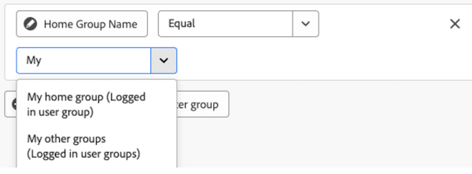

# Référence des filtres de rapport pour les tableaux de bord de la zone de travail

>[!IMPORTANT]
>
>La fonctionnalité Tableaux de bord de la zone de travail est actuellement disponible uniquement pour les utilisateurs participant à l’étape bêta. Il se peut que certaines parties de la fonction ne soient pas terminées ou ne fonctionnent pas comme prévu à cette étape. Veuillez soumettre tout commentaire concernant votre expérience en suivant les instructions de la section [Fournir un commentaire](/help/quicksilver/product-announcements/betas/canvas-dashboards-beta/canvas-dashboards-beta-information.md#provide-feedback) de l’article de présentation de la version Beta des tableaux de bord de la zone de travail. 
>Si vous avez des commentaires concernant un bug ou un problème technique éventuel, envoyez un ticket à l’assistance Workfront. Pour plus d’informations, consultez la section [Contacter l’assistance clientèle](/help/quicksilver/workfront-basics/tips-tricks-and-troubleshooting/contact-customer-support.md). 
>Notez que cette version bêta n’est pas disponible sur les fournisseurs de cloud suivants :
>
>* Apporter votre propre clé pour Amazon Web Services
>* Azure
>* Google Cloud Platform

Cet article décrit les champs, les opérateurs, les caractères génériques et les règles spéciales disponibles lorsque vous filtrez un rapport. Pour connaître les étapes de création ou de modification d’un filtre, voir [Filtrer un rapport dans un tableau de bord de zone de travail](/help/quicksilver/reports-and-dashboards/canvas-dashboards/manage-reports/filter-a-report.md).

## Opérateurs de champ par type de champ

+++ Développez pour afficher la liste des opérateurs de champ par type de champ. 

<table>
    <tr>
        <td><b>Type de champ</b></td>
        <td><b>Exemple</b></td>
       <td><b>Opérateurs</b></td>
        <td><b>Caractères génériques</b></td>
    </tr>
    <tr>
        <td>Nom de l’objet/référence</td>
        <td>Tout attribut de nom natif ou recherche personnalisée</td>
              <td><ul>
        <li>Égal à (non sensible à la casse)</li>
        <li>Non égal à (non sensible à la casse)</li>
        <li>Contient</li>
          <li>Ne contient pas</li>
            <li>Est nul</li>
              <li>N’est pas nul</li>
        </ul></td>
        <td>Utilisateur : nom
        <ul>
        <li>Moi (personne connectée)</li>
        </ul>
        Groupe : Nom
        <ul>
          <li>Mon groupe principal (groupe des utilisateurs et utilisatrices connectés)</li>
            <li>Mes autres groupes (groupes des utilisateurs et utilisatrices connectés)</li>
          </ul>
          Équipe : Nom
                  <ul>
          <li>Mon équipe par défaut (équipe des utilisateurs et utilisatrices connectés)</li>
            <li>Mes autres équipes (équipes d’utilisateurs et d’utilisatrices connectés)</li>
          </ul>
        </td>
    </tr>
    <tr>
        <td>Chaîne / Entrée De Texte </td>
                <td>Projet : Description</td>
                      <td><ul>
             <li>Égal à (non sensible à la casse)</li>
        <li>Non égal à (non sensible à la casse)</li>
        <li>Contient</li>
          <li>Ne contient pas</li>
            <li>Est nul</li>
              <li>N’est pas nul</li>
        </ul></td>
        <td></td>
    </tr>
    <tr>
        <td>Nombre entier/double</td>
             <td>Projet : heures prévues
         Tâche : Pourcentage d'achèvement</td>
              <td><ul>
        <li>Égal à (non sensible à la casse)</li>
        <li>Non égal à (non sensible à la casse)</li>
        <li>Supérieur à</li>
          <li>Supérieur ou égal à</li>
          <li>Inférieur à</li>
          <li>Inférieur ou égal à</li>
            <li>Est nul</li>
              <li>N’est pas nul</li>
        </ul></td>
        <td></td>
    </tr>
       <tr>
        <td> Date/Date/Heure </td>
                    <td>Projet : Date de début prévue
         Heure : Date d'entrée</td>
              <td><ul>
        <li>Égal à (non sensible à la casse)</li>
        <li>Non égal à (non sensible à la casse)</li>
        </ul></td>
        <td>En activant l’option <b>Définir la date relative</b>, vous pouvez appliquer des caractères génériques de date relative pour rendre le rapport plus dynamique et l’ajuster automatiquement en fonction de périodes courantes. 
         <ul><li>$$TODAY</li>
         <li>$$NOW</li>
         </ul>
        </td>
    </tr>
       <tr>
        <td>Booléen </td>
                  <td>Projet : contient des documents
         Tâche : est critique
        Utilisateur   : Est Actif</td>
        <td><ul>
        <li>Égal à (non sensible à la casse)</li>
        <li>Non égal à (non sensible à la casse)</li>
        </ul></td>
        <td> </td>
    </tr>
   </table>

+++

## Variables de filtrage des caractères génériques basés sur la date

Les options de caractères génériques basés sur la date peuvent être utilisées en combinaison avec n’importe quel attribut de filtre de date. Pour plus d’informations sur l’ajout d’un caractère générique basé sur la date à un rapport, voir [Utiliser des caractères génériques basés sur la date pour généraliser les rapports](/help/quicksilver/reports-and-dashboards/reports/reporting-elements/use-date-based-wildcards-generalize-reports.md).

>[!NOTE]
>
>Si vous créez un calcul de date et heure qui n’inclut pas de partie horaire ou qui utilise les caractères génériques $$TODAY ou $$NOW, le système utilise la date selon le fuseau horaire universel coordonné (UTC), et non selon votre fuseau horaire local. Cela peut entraîner un résultat de date inattendu.

Vous pouvez choisir parmi les caractères génériques suivants basés sur la date :

<table style="table-layout:auto"> 
 <col> 
 <col> 
 <tbody> 
  <tr valign="top"> 
   <td width="100" role="rowheader"> 
<strong>$$TODAY</strong> 
 </td> 
   <td> 
Nous vous recommandons de créer des filtres sensibles à la date à l’aide de ce caractère générique afin d’éviter de les recréer demain, la semaine prochaine ou le mois prochain.
 
Par exemple, si vous souhaitez afficher toutes les tâches qui doivent être effectuées avant aujourd’hui, vous pouvez utiliser la règle suivante dans un filtre de tâche : <em>Date de début prévue inférieure à $$TODAY</em>.
 
$$TODAY est toujours égal à minuit pour le jour en cours.
 </td> 
  </tr> 
  <tr valign="top"> 
   <td width="100" role="rowheader"> 
<strong>$$NOW</strong> 
 </td> 
   <td> 
Cette opération est similaire au caractère générique $$TODAY, mais inclut la date et l’heure actuelles. $$NOW est égal à la date et à l’heure actuelles.
 
Par exemple, si vous souhaitez afficher toutes les entrées d’heure fournies jusqu’à l’heure actuelle, vous pouvez le faire en utilisant la règle suivante dans un filtre d’heure : <em>Date de début prévue inférieure à $$NOW</em>.
 
Note : ce caractère générique n’est pas pris en charge dans le planificateur de ressources.
 </td> 
  </tr> 
 </tbody> 
</table>

Pour indiquer différentes périodes et différents points dans le temps (futur ou passé), vous pouvez combiner les caractères génériques ci-dessus avec les éléments suivants :

| Attributs |   |
|---|---|
| **q** | Trimestre du calendrier |
| **h** | heure |
| **d** | jour |
| **w** | semaine |
| **m** | mois |
| **y** | an |

{style="table-layout:auto"}

| **Qualificateurs** |   |
|---|---|
| **b** | début de la période (sans attribut spécifié, début de la semaine par défaut : dimanche) |
| **e** | fin de la période (sans attribut spécifié, fin de la semaine par défaut : samedi) |

{style="table-layout:auto"}

| **Opérateurs** |   |
|---|---|
| **+** | Ajouter la valeur à la valeur d’un caractère générique |
| **-** | Soustraire la valeur de la valeur d’un caractère générique |

{style="table-layout:auto"}

Par exemple, le caractère générique `$$TODAYb+2w` fait référence à « 2 semaines à partir du début de cette semaine ». Le caractère générique `$$NOW+2h` fait référence à « dans 2 heures ».

## Variables de filtre de caractères génériques de l’utilisateur connecté

* Lors du filtrage sur l’attribut de `name` utilisateur, vous verrez l’option **Moi (utilisateur connecté)**.

  

* Lors du filtrage sur un attribut de `name` de groupe, vous verrez les options **Mon groupe principal (groupe d’utilisateurs connectés)** et **Mes autres groupes (groupes d’utilisateurs connectés)** à utiliser dans une condition de filtre.

  

* Lors du filtrage sur un attribut de `name` d’équipe, vous verrez les options **Mon équipe par défaut (équipe utilisateur connectée)** et **Mes autres équipes (équipes utilisateurs connectées)** parmi lesquelles effectuer votre choix dans la condition de filtrage.

  

## Référencer des objets enfants

Les relations disponibles pour les colonnes supplémentaires, les options de filtre et les attributs de regroupement sont généralement limitées aux objets situés plus haut dans la hiérarchie d&#39;objets Workfront ou comportent une seule sélection sur l&#39;objet d&#39;entité de base du rapport. Il existe certaines exceptions à cette règle, notamment :

* Projet > Tâches
* Approbation de document > Étapes d&#39;approbation de document
* Étapes d&#39;approbation du document > Participants à l&#39;étape d&#39;approbation du document

Lors de l’utilisation de l’une des relations parent-enfant répertoriées ci-dessus, une ligne s’affiche dans le tableau pour chaque enregistrement enfant connecté à l’objet parent.

<!--

## Filter on collection relationships in Preview

A collection is a field that links to a group of related records rather than to a single record. For example, the participants on a project's approval stages are a collection. When you build a filter, you can filter on collections directly, without switching to text mode.

To filter on a collection, open the Select a field panel, then select Collections. This section lists only collection relationships. Single-record relationships stay under Relationships.

After you select a collection, you can do two things:

* Filter on the collection's own fields. For example, from a portfolio's projects, you can filter on a project's status.
* Follow one single-record relationship out of the collection. For example, from a portfolio's projects, you can reach the project owner.

Collections don't support deeper navigation. You can't open a collection nested inside another collection, follow more than one relationship, or select the relationship that leads back to where you started.

The Collections section appears only when you build a filter. It doesn't appear in other field choosers, such as those for table columns, groupings, or chart fields.

-->

## Exclure les projets personnels, les tâches et les utilisateurs de robots

>[!NOTE]
>
>Si un rapport Tableaux de bord de la zone de travail renvoie plus de résultats que prévu par rapport à un rapport classique similaire, les projets personnels, les tâches personnelles ou les utilisateurs de robots peuvent être inclus par défaut. Ajoutez une condition de filtre pour les exclure.

Dans les rapports Projet et Tâche des tableaux de bord de la zone de travail, le filtre `isPersonal` n’est pas automatiquement appliqué. Par conséquent, les projets personnels et les tâches personnelles sont inclus par défaut dans les résultats. Pour les exclure, ajoutez une condition de filtre telle que `isPersonal=false`.

De même, les rapports d’utilisateur des tableaux de bord de la zone de travail incluent tous les utilisateurs par défaut, y compris les collaborateurs AI (utilisateurs de robots). Pour exclure les utilisateurs de robots, ajoutez une condition de filtre telle que `isBot=false`.

Les rapports classiques sur les projets et les tâches excluent automatiquement les projets personnels et les tâches personnelles et les rapports classiques sur les utilisateurs excluent automatiquement les utilisateurs de robots. Pour les inclure à la place dans un rapport classique, ajoutez une condition de filtre telle que `isPersonal=true` (éléments personnels uniquement) ou `isPersonal_Mod=notnull` (éléments personnels et non personnels).
