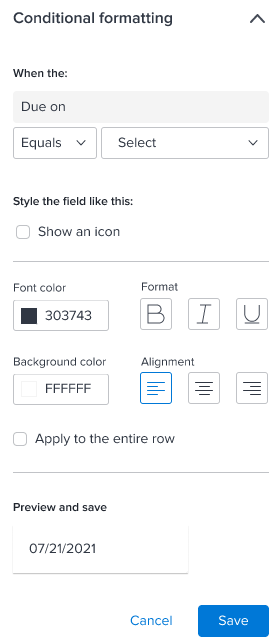

# Configurer une colonne de tableau dans la zone de travail de reporting

Vous pouvez configurer l’affichage des colonnes d’un tableau. Les éléments suivants d’une colonne peuvent être modifiés :

* Nom
* Tri
* Autorisation de modification
* Texte de pointage
* Agrégation
* Mise en forme conditionnelle

## Conditions préalables

Avant de commencer, vous devez vous inscrire à la version bêta de la zone de travail de reporting. Pour plus d’informations, voir [Version bêta de la zone de travail de reporting : vue d’ensemble](/help/quicksilver/product-announcements/betas/canvas-dashboards-beta/reporting-canvas-beta-overview.md).

## Modifier les colonnes d’un tableau

1. Sur un rapport existant, cliquez sur l’icône **Plus de menu**  dans l’en-tête du rapport, puis sélectionnez **Modifier**.
1. Dans l’en-tête du tableau du rapport, cliquez sur l’icône **Modifier** .

   

   >[!NOTE]
   >
   >Si vous venez de créer le tableau et que vous n’avez pas encore ajouté de champs, cliquez plutôt sur le bouton Modifier au centre du tableau.

1. (Facultatif) Ajoutez, repositionnez ou supprimez des colonnes du tableau. Pour plus d’informations sur la modification des champs d’un tableau, voir [Ajouter ou modifier un bloc de tableau dans la zone de travail de reporting](../../../reports-and-dashboards/reporting-canvas/table-blocks/add-or-edit-report-table.md).

   | Ajouter une nouvelle colonne | Pour ajouter une colonne à un tableau, cliquez sur un champ du panneau **Champs** à droite de la page et faites-le glisser dans le tableau souhaité ou double-cliquez sur un champ pour l’ajouter en tant que colonne la plus à droite. |
   |---|---|
   | Déplacer une colonne | Pour réorganiser l’ordre des colonnes dans un tableau, cliquez sur le nom d’une colonne et faites-la glisser vers un nouvel emplacement. |
   | Supprimer une colonne | Pour supprimer une colonne d’un tableau, cliquez sur la colonne à supprimer, puis sur le bouton X en regard du nom de la colonne. |

   {style="table-layout:auto"}

1. Pour configurer une colonne, cliquez sur le nom de la colonne à modifier dans la ligne d’en-tête du tableau, puis sur l’un des onglets suivants du panneau de droite :

   <table style="table-layout:auto"> 
    <col> class="TableStyle-TableStyle-List-options-in-steps-Column-Column1" /&gt;
    <tbody>
     <tr data-mc-conditions="">
      <th role="rowheader" colspan="2">Onglet Données</th>
     </tr>
     <tr data-mc-conditions="">
      <td role="rowheader">Agrégé sur la base de</td>
      <td>
 Pour agréger (résumer dans l’en-tête) les informations d’une colonne, sélectionnez le type d’agrégation à utiliser dans le menu déroulant <strong>Agrégé sur la base de</strong>. Les options disponibles dépendent du type de données contenues dans la colonne.

Si vous utilisez des groupes dans le tableau, la valeur agrégée s’affiche dans la ligne de groupe au-dessus du nom de la colonne plutôt qu’en regard du nom de la colonne.
</td>
     </tr>
     <tr data-mc-conditions="">
      <td role="rowheader">Format du champ</td>
      <td>
(Disponible uniquement lorsque la colonne contient des données de date, de pourcentage, de devise ou d’heure, et non du texte.) Sélectionnez le format souhaité pour les données dans le menu déroulant <b>Format du champ</b>. Par exemple, vous pouvez afficher des signes de pourcentage après les chiffres d’une colonne ou modifier l’affichage des dates.
</td>
     </tr>
     <tr data-mc-conditions="">
      <td role="rowheader">Le champ peut être modifié.</td>
      <td>Activez l’option <strong>Le champ peut être modifié.</strong> si vous souhaitez permettre aux utilisateurs et utilisatrices qui consultent le tableau de modifier le nom de la colonne.</td>
     </tr>
     <tr>
      <td role="rowheader"><strong>Trier</strong></td>
      <td>
Par défaut, le tableau est classé selon les données de sa colonne la plus à gauche, dans l’ordre croissant. Pour trier selon la colonne sélectionnée, cliquez sur la flèche vers le bas située en regard de <strong>Tri</strong>, puis cochez la case <b>Trier sur la base de cette colonne</b>. Vous pouvez alors sélectionner une direction de <strong>Tri</strong> (ordre croissant ou décroissant) et un <strong>Ordre de classement</strong> (priorité de tri pour cette colonne par rapport aux autres colonnes de tri du tableau).

Vous pouvez répéter ce processus pour trier le tableau en fonction de 5 colonnes différentes au maximum. Assurez-vous que chaque colonne comporte l’<strong>Ordre de classement</strong> correct par rapport aux nouvelles colonnes que vous sélectionnez pour le tri.

Note : si vous supprimez une colonne sélectionnée pour trier un tableau et qu’une autre colonne est également sélectionnée pour le tri, cette colonne est utilisée pour trier le tableau dans l’ordre décroissant. Si aucune autre colonne n’est sélectionnée pour le tri, le tableau retourne à la valeur par défaut : le tri par la première colonne.

Lorsque vous définissez une colonne pour trier le tableau, une petite zone s’affiche en regard du nom de la colonne avec un nombre indiquant la priorité relative de la colonne lors du tri du tableau (le tableau est trié en premier par 1, puis par 2, etc.) et une flèche pour indiquer si le sens du tri est croissant ou décroissant. 

</td>
     </tr>
    </tbody>
   </table>

   <table style="table-layout:auto"> 
    <col> 
    <col> 
    <tbody> 
     <tr> 
      <th role="rowheader" colspan="2">Onglet Style</th> 
     </tr> 
     <tr> 
      <td role="rowheader"><strong>Personnaliser le libellé de la colonne</strong> </td> 
      <td>Saisissez un nouveau nom d’affichage pour la colonne (limite de 100 caractères).</td> 
     </tr> 
     <tr> 
      <td role="rowheader">Afficher le texte de pointage</td> 
      <td> 
Déterminez si vous souhaitez que le texte descriptif s’affiche lorsqu’une personne survole le nom d’une colonne.
 
Cette option est désactivée par défaut.
 </td> 
     </tr> 
     <tr> 
      <td role="rowheader">Texte de pointage</td> 
      <td>(Disponible uniquement lorsque l’option <strong>Afficher le texte de pointage</strong> est activée.) Personnalisez le texte explicatif qui s’affiche lorsqu’une personne survole le nom d’une colonne.</td> 
     </tr> 
     <tr> 
      <td role="rowheader"><strong>Mise en forme conditionnelle</strong> </td> 
      <td> 
       <ol data-mc-continue="false"> 
        <li value="1"> 
Ajoutez , modifiez ou supprimez  une règle qui formate les cellules dans la colonne lorsque leurs valeurs répondent aux critères spécifiés.
 
Par exemple, vous pouvez créer une règle qui change la police du champ « Statut du projet » en violet gras lorsque la valeur de ce champ est égale à « Création ».
 
Vous pouvez également utiliser <b>Afficher une icône</b> pour ajouter une icône d’indicateur verte à chaque élément de la colonne ayant le statut « Actuel ».
 
  
 
Remarque : si vous utilisez <strong>Afficher une icône</strong>, les autres options de formatage ne sont pas disponibles.
 
Vous pouvez sélectionner l’option <strong>Appliquer à toute la ligne</strong> si vous souhaitez que la mise en forme affecte la ligne entière d’une cellule qui respecte la condition de votre règle. Vous pouvez, par exemple, mettre en surbrillance les projets arrivant à échéance après une certaine date en appliquant une couleur d’arrière-plan jaune non seulement aux cellules de date de la colonne « Date d’échéance le », mais également à toute la ligne où ces dates se produisent.
 
Conseil : lorsque vous ajoutez des options de formatage à une règle, le format de cellule obtenu s’affiche sous <strong>Prévisualisation</strong> au bas du panneau.
 </li> 
        <li value="2">Lorsque vous avez terminé d’ajouter une règle, cliquez sur <strong>Enregistrer</strong>.</li> 
        <li value="3"> 
(Facultatif) Cliquez sur <b>+ Ajouter une règle</b> pour ajouter des règles supplémentaires à la même colonne.
 
Plusieurs règles de mise en forme conditionnelle dans un tableau sont appliquées dans l’ordre suivant :
 
         <ul> 
          <li> 
Les règles qui s’appliquent à des lignes entières sont évaluées en premier, de gauche à droite pour chaque colonne, puis de haut en bas dans une colonne.
 
Note : la mise en forme des lignes remplace la mise en forme conditionnelle des cellules de cette ligne, même si, dans le cas contraire, elles respectent la condition de la règle d’une autre colonne.
 </li> 
          <li> 
Les autres règles sont évaluées ensuite, de haut en bas, car elles sont répertoriées dans le panneau de droite pour une colonne. Vous pouvez faire glisser des règles enregistrées  dans ce panneau pour en modifier l’ordre.
 
Note : les cellules sont formatées selon la première condition qu’elles remplissent et ne le seront pas davantage, même si elles répondent à d’autres conditions.
 </li> 
         </ul> </li> 
       </ol> </td> 
     </tr> 
    </tbody> 
   </table>

1. Cliquez sur la flèche **Revenir en arrière** dans le coin supérieur gauche de l’écran pour revenir à votre rapport.
