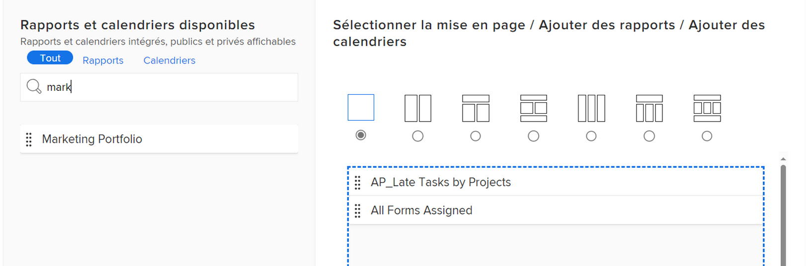

# Création d’un tableau de bord

Vous pouvez créer des tableaux de bord pour accéder rapidement aux informations des rapports, des calendriers et des pages externes.

Pour en savoir plus sur les tableaux de bord, voir [Prise en main des tableaux de bord](../../../reports-and-dashboards/dashboards/understanding-dashboards/get-started-dashboards.md).

## Exigences d’accès

Vous devez disposer des éléments suivants :

<table style="table-layout:auto">
 <col> 
 </col> 
 <col> 
 </col> 
 <tbody> 
  <tr> 
   <td> 
<strong>Formule Adobe Workfront*</strong>
 </td> 
   <td>Tous</td> 
  </tr> 
  <tr> 
   <td> 
<strong>Licence Adobe Workfront*</strong>
 </td> 
   <td> 
Plan 
 </td> 
  </tr> 
  <tr> 
   <td><strong>Paramétrages du niveau d'accès*</strong> </td> 
   <td> 
Modification de l’accès aux rapports, aux tableaux de bord et aux calendriers
 
Remarque : Si vous n’avez toujours pas accès à , demandez à votre administrateur Workfront s’il définit des restrictions supplémentaires à votre niveau d’accès. Pour plus d’informations sur la façon dont un administrateur Workfront peut modifier votre niveau d’accès, voir <a href="../../../administration-and-setup/add-users/configure-and-grant-access/create-modify-access-levels.md" class="MCXref xref">Création ou modification de niveaux d’accès personnalisés</a>.
 </td> 
  </tr> 
  <tr> 
   <td> 
<strong>Autorisations d’objet</strong> 
 </td> 
   <td> 
Vous obtiendrez les autorisations Gérer pour le nouveau tableau de bord
 
Pour plus d’informations sur la demande d’accès supplémentaire, voir <a href="../../../workfront-basics/grant-and-request-access-to-objects/request-access.md" class="MCXref xref">Demande d’accès aux objets </a>. Pour plus d’informations sur les autorisations pour les tableaux de bord, voir <a href="../../../workfront-basics/grant-and-request-access-to-objects/permissions-reports-dashboards-calendars.md" class="MCXref xref">Partage de rapports, de tableaux de bord et de calendriers </a>.
 </td> 
  </tr> 
 </tbody> 
</table>

&#42;Pour connaître le plan, le type de licence ou l’accès dont vous disposez, contactez votre administrateur Workfront.

## Conditions préalables

Vous devez créer l’un des objets suivants avant de pouvoir les ajouter à un tableau de bord :

* **Rapports**: Pour plus d’informations sur la création de rapports, voir [Création d’un rapport personnalisé](../../../reports-and-dashboards/reports/creating-and-managing-reports/create-custom-report.md).

* **Calendriers**: Pour plus d’informations sur la création de calendriers, voir [Présentation des rapports sur les calendriers](../../../reports-and-dashboards/reports/calendars/calendar-reports-overview.md).

* **Pages externes**: Pour plus d’informations sur la création de pages externes, voir [Incorporation d’une page web externe dans un tableau de bord](../../../reports-and-dashboards/dashboards/creating-and-managing-dashboards/embed-external-web-page-dashboard.md).

## Création d’un tableau de bord

1. Cliquez sur l’icône du menu principal , puis cliquez sur **Tableaux de bord.**
1. Cliquez sur **Nouveau tableau de bord**.\
   La boîte de dialogue Nouveau tableau de bord s’affiche.

1. Indiquez les informations suivantes :

   <table style="table-layout:auto">
    <col>
    <col>
    <tbody>
     <tr>
      <td role="rowheader"><strong>Nom</strong></td>
      <td>
Il s’agit du nom de votre tableau de bord.

Si vous ne spécifiez aucun nom, le nom du premier rapport du tableau de bord devient, par défaut, celui du tableau de bord.
</td>
     </tr>
     <tr>
      <td role="rowheader"><strong>Description (facultatif)</strong></td>
      <td>Il s’agit d’une description de votre tableau de bord.</td>
     </tr>
    </tbody>
   </table>

1. Sélectionnez une mise en page en cliquant sur le bouton radio qui lui correspond.

   La mise en page à une seule colonne est la mise en page par défaut.

   Pour plus d’informations sur la disposition des rapports dans les tableaux de bord, voir [Comprendre comment les rapports s’affichent sur un tableau de bord](../../../reports-and-dashboards/dashboards/understanding-dashboards/understand-how-reports-display-dashboard.md).

   <!--
   <MadCap:conditionalText data-mc-conditions="QuicksilverOrClassic.Draft mode">
   (NOTE: Consider adding the information from this article here, at some point, instead of linking to it.)
   </MadCap:conditionalText>
   -->

1. Ajoutez des rapports, des calendriers ou des pages externes existants en les recherchant dans le **Effectuez une recherche par nom ou par type ...** puis les faire glisser vers le volet de mise en page lorsqu’ils apparaissent dans la liste.

   >[!NOTE]
   >
   >Lors de la recherche d’un élément, la recherche renvoie l’un des 2 000 rapports créés le plus récemment. Les noms de rapports contenant des caractères Unicode ne sont pas renvoyés dans les résultats de recherche. Il est recommandé d’éviter d’inclure des caractères Unicode lors de l’attribution d’un nom aux objets dans Workfront en saisissant des noms plutôt que de copier et coller des noms à partir d’une autre source.

   

1. (Facultatif) Cliquez sur **Ajouter une page externe** pour ajouter une page externe au tableau de bord.\
   Pour plus d’informations sur la création de pages externes et leur incorporation dans les tableaux de bord, voir [Incorporation d’une page web externe dans un tableau de bord](../../../reports-and-dashboards/dashboards/creating-and-managing-dashboards/embed-external-web-page-dashboard.md).

1. Cliquez sur **Enregistrer + Fermer**.\
   Un horodatage s’affiche dans le coin supérieur droit du tableau de bord. L’horodatage inclut la date, l’heure et le fuseau horaire de la dernière actualisation du tableau de bord.
