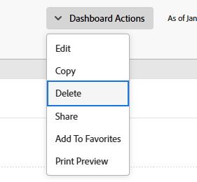

# Supprimer un tableau de bord

<!-- Audited: 1/2025 -->

Si vous n’avez plus besoin d’un tableau de bord, vous pouvez le supprimer d’Adobe Workfront.

## Conditions d’accès

+++ Développez pour afficher les exigences d’accès aux fonctionnalités de cet article.

Vous devez disposer des éléments suivants :

<table style="table-layout:auto"> 
 <col> 
 <col> 
 <tbody> 
  <tr> 
   <td role="rowheader"><strong>Formule Adobe Workfront</strong></td> 
   <td> 
Tous
 </td> 
  </tr> 
  <tr> 
   <td role="rowheader"><strong>Licence Adobe Workfront</strong></td> 
   <td> 
      
Nouveau :

         <ul>
         <li>
Standard
</li>
         </ul>
      
Actuel :

         <ul>
         <li>
Plan
</li>
         </ul>
   </td>
  </tr> 
  <tr> 
   <td role="rowheader"><strong>Configurations des niveaux d’accès</strong></td> 
   <td> 
Accès en modification aux rapports, aux tableaux de bord et aux calendriers
</td> 
  </tr> 
  <tr> 
   <td role="rowheader"><strong>Autorisations d’objet</strong></td> 
   <td> 
Autorisations en gestion pour le tableau de bord
</td> 
  </tr> 
 </tbody> 
</table>

Pour plus d’informations, voir [Conditions d’accès requises dans la documentation Workfront](/help/quicksilver/administration-and-setup/add-users/access-levels-and-object-permissions/access-level-requirements-in-documentation.md).

+++

## Supprimer un tableau de bord à partir du menu Actions

Si vous souhaitez supprimer un tableau de bord, vous pouvez le faire à l’aide du menu Actions.

Pour plus d’informations sur la suppression d’un tableau de bord incorporant une page externe, voir [Supprimer un tableau de bord de la zone Tableaux de bord](#delete-a-dashboard-from-the-dashboards-area).

Pour supprimer un tableau de bord :

1. Accédez au tableau de bord que vous souhaitez modifier.
1. Cliquez sur **Actions de tableau de bord**, puis sur **Supprimer**.

   

1. Pour confirmer la suppression du tableau de bord, cliquez sur **Oui, supprimer.**
Le tableau de bord est supprimé de Workfront.

## Supprimer un tableau de bord de la zone Tableaux de bord {#delete-a-dashboard-from-the-dashboards-area}

Si vous supprimez plusieurs tableaux de bord, vous pouvez les supprimer à partir de la zone Tableaux de bord. C’est également la seule façon de supprimer un tableau de bord incluant une page externe.

Pour supprimer plusieurs tableaux de bord :

1. Cliquez sur l’icône **[!UICONTROL Menu principal]**  dans le coin supérieur droit d’Adobe Workfront, ou (le cas échéant), cliquez sur l’icône **[!UICONTROL Menu principal]**  dans le coin supérieur gauche, puis cliquez sur **[!UICONTROL Tableaux de bord]**.
1. Sélectionnez dans la liste les tableaux de bord à supprimer, puis cliquez sur **Supprimer** .

   

1. Pour confirmer la suppression du tableau de bord, cliquez sur **Oui, supprimer.**
Le tableau de bord est supprimé de Workfront.
