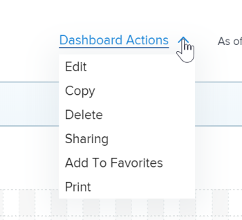

# Modification d’un tableau de bord

Le tableau de bord permet d’accéder rapidement aux informations. Vous pouvez remplir un tableau de bord avec les éléments suivants dans Adobe Workfront :

* Rapports

   Pour plus d’informations sur la création de rapports, voir [Création d’un rapport personnalisé](../../../reports-and-dashboards/reports/creating-and-managing-reports/create-custom-report.md).

* Calendriers

   Pour plus d’informations sur la création de calendriers, voir [Calendriers](../../../reports-and-dashboards/reports/calendars/calendars.md).

* Pages externes

   Pour plus d’informations sur la création de pages externes, voir [Incorporation d’une page web externe dans un tableau de bord](../../../reports-and-dashboards/dashboards/creating-and-managing-dashboards/embed-external-web-page-dashboard.md).

Après avoir créé ces éléments et les avoir ajoutés au tableau de bord, vous pouvez modifier le tableau de bord pour y ajouter d’autres éléments, en supprimer d’autres ou modifier les informations du tableau de bord.

Toute modification apportée à un tableau de bord aura un impact sur tous les utilisateurs qui ont accès à ce tableau de bord.

Lorsque vous partagez un tableau de bord avec des utilisateurs, tous les rapports, calendriers et pages externes sont également partagés avec les mêmes utilisateurs.

## Exigences d’accès

Vous devez disposer des éléments suivants :

<table style="table-layout:auto"> 
 <col> 
 <col> 
 <tbody> 
  <tr> 
   <td role="rowheader"><strong>Formule Adobe Workfront*</strong></td> 
   <td> 
Tous
 </td> 
  </tr> 
  <tr> 
   <td role="rowheader"><strong>Licence Adobe Workfront*</strong></td> 
   <td> 
Plan 
 </td> 
  </tr> 
  <tr> 
   <td role="rowheader"><strong>Paramétrages du niveau d'accès*</strong></td> 
   <td> 
Modification de l’accès aux rapports, aux tableaux de bord et aux calendriers
 
Remarque : Si vous n’avez toujours pas accès à , demandez à votre administrateur Workfront s’il définit des restrictions supplémentaires à votre niveau d’accès. Pour plus d’informations sur la façon dont un administrateur Workfront peut modifier votre niveau d’accès, voir <a href="../../../administration-and-setup/add-users/configure-and-grant-access/create-modify-access-levels.md" class="MCXref xref">Création ou modification de niveaux d’accès personnalisés</a>.
 </td> 
  </tr> 
  <tr> 
   <td role="rowheader"><strong>Autorisations d’objet</strong></td> 
   <td> 
Gestion des autorisations pour le tableau de bord
 
Pour plus d’informations sur la demande d’accès supplémentaire, voir <a href="../../../workfront-basics/grant-and-request-access-to-objects/request-access.md" class="MCXref xref">Demande d’accès aux objets </a>.
 </td> 
  </tr> 
 </tbody> 
</table>

&#42;Pour connaître le plan, le type de licence ou l’accès dont vous disposez, contactez votre administrateur Workfront.

## Conditions préalables

Vous devez créer un tableau de bord avant de pouvoir le modifier.

Pour plus d’informations sur la création de tableaux de bord, voir [Création d’un tableau de bord](../../../reports-and-dashboards/dashboards/creating-and-managing-dashboards/create-dashboard.md).

## Modification d’un tableau de bord

1. Accédez au tableau de bord que vous souhaitez modifier.
1. Cliquez sur **Actions du tableau de bord**, puis cliquez sur **Modifier**.

   

   >[!TIP]
   >
   >Pour savoir comment supprimer un tableau de bord, voir [Suppression d’un tableau de bord](../../../reports-and-dashboards/dashboards/creating-and-managing-dashboards/delete-dashboard.md).

1. Envisagez de modifier les champs suivants :

   * **Nom**: Modifiez le nom du tableau de bord.
   * **Description**: Spécifiez une description pour le tableau de bord.

1. Dans le **Rapports et calendriers disponibles** , commencez à saisir le nom d’un rapport, d’un calendrier ou d’une page externe dans la variable **Effectuez une recherche par nom ou par type ...** puis faites glisser le rapport ou le calendrier dans le volet de mise en page à droite.

   >[!NOTE]
   >
   >Lors de la recherche d’un élément, la recherche renvoie l’un des 2 000 rapports créés le plus récemment. Les noms de rapports contenant des caractères Unicode ne sont pas renvoyés dans les résultats de recherche. Il est recommandé d’éviter d’inclure des caractères Unicode lors de l’attribution d’un nom aux objets dans Workfront en saisissant des noms plutôt que de copier et coller des noms à partir d’une autre source.

1. (Facultatif) Sélectionnez une nouvelle mise en page pour le tableau de bord en cliquant sur un bouton radio correspondant à la mise en page de votre choix.
1. (Facultatif) Placez le pointeur de la souris sur le nom d’un rapport existant, puis cliquez sur l’icône de corbeille pour le supprimer du tableau de bord.
1. (Facultatif) Modifiez l’ordre des rapports dans le tableau de bord en cliquant sur le nom d’un rapport, en le faisant glisser et en le déposant à l’emplacement de votre choix dans le volet Disposition.
1. (Facultatif) Cliquez sur **Ajouter une page externe** pour ajouter une page externe au tableau de bord.\
   Ou\
   Localisez une page externe existante dans le tableau de bord, puis placez-la à l’aide de la souris et cliquez sur l’icône **Modifier** pour modifier la page externe.\
   Pour plus d’informations sur l’ajout ou la modification de pages externes dans un tableau de bord, voir [Incorporation d’une page web externe dans un tableau de bord](../../../reports-and-dashboards/dashboards/creating-and-managing-dashboards/embed-external-web-page-dashboard.md).

1. Cliquez sur **Enregistrer + Fermer**.
