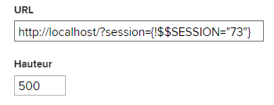

# Incorporer une page web externe dans un tableau de bord

<!--Audited: 01/2025-->

Vous pouvez incorporer une page web externe dans un tableau de bord pour permettre l’accès aux informations connexes provenant d’autres systèmes ou d’Adobe Workfront.

Par exemple, si votre entreprise dispose d’un référentiel de documents web, d’un wiki ou d’un autre système de gestion de contenu qui contient des informations sur le projet régulièrement consultées via une URL, vous pouvez afficher ces informations dans Workfront en créant une page externe sur un tableau de bord.

>[!IMPORTANT]
>
>* Pour des raisons de sécurité, certains sites web ne vous permettent pas d’incorporer des pages web en tant qu’iframe. Si la page web que vous souhaitez incorporer dans un tableau de bord ne vous le permet pas, elle ne s’affiche pas dans le tableau de bord. Vous pouvez toutefois accéder à la page externe en cliquant sur le nom du tableau de bord.\
>\
>Pour permettre l’incorporation d’un site web dont vous êtes propriétaire, demandez à votre équipe d’administration web d’ajuster le paramètre **X-Frame-Options**. Pour plus d’informations, voir [X-Frame-Options](https://developer.mozilla.org/en-US/docs/Web/HTTP/Headers/X-Frame-Options).
>
>
>* Les pages de tableau de bord ne sont plus prises en charge en tant que pages externes incorporées dans les tableaux de bord. Bien que les tableaux de bord existants ne soient pas automatiquement modifiés pour supprimer ces pages externes, toute modification apportée à un tableau de bord contenant une telle référence ne pourra pas être enregistrée tant que la référence n’aura pas été supprimée ou modifiée.
> Plus précisément, les sous-domaines Workfront.com suivants ne sont plus pris en charge :
>
>     * /dashboards
>     * /dashboard/:ID
>     * /portfolio/:ID/content-dashboard__:dashboardID
>     * /program/:ID/content-dashboard__:dashboardID
>     * /project/:ID/content-dashboard__:dashboardID
>     * /task/:ID/content-dashboard__:dashboardID
>     * /template/:ID/content-dashboard__:dashboardID
>     * /templatetask/:ID/content-dashboard__:dashboardID
>     * /resourcemanagement/:ID/
>     * content-dashboard__:dashboardID
>     * /team/:ID/content-dashboard__:dashboardID
>     * /iteration/:ID/content-dashboard__:dashboardID
>     * /requests/:ID/content-dashboard__:dashboardID
>     * /group/:ID/content-dashboard__:dashboardID
>     * /billingrecord/:ID/content-dashboard__:dashboardID
>
>Vous pouvez également envisager d’inclure un rapport de liste dans votre tableau de bord, comme décrit dans [Ajouter un rapport à un tableau de bord](/help/quicksilver/reports-and-dashboards/dashboards/creating-and-managing-dashboards/add-report-dashboard.md)

## Conditions d’accès

+++ Développez pour afficher les exigences d’accès aux fonctionnalités de cet article.

Vous devez disposer des éléments suivants :

<table style="table-layout:auto"> 
 <col> 
 <col> 
 <tbody> 
  <tr> 
   <td role="rowheader"><strong>Formule Adobe Workfront</strong></td> 
   <td> 
Tous
 </td> 
  </tr> 
  <tr> 
   <td role="rowheader"><strong>Licence Adobe Workfront</strong></td> 
   <td> 
      
Nouveau :

         <ul>
         <li>
Standard
</li>
         </ul>
      
Actuel :

         <ul>
         <li>
Plan
</li>
         </ul>
   </td>
  </tr> 
  <tr> 
   <td role="rowheader"><strong>Configurations des niveaux d’accès</strong></td> 
   <td> 
Accès en modification aux rapports, aux tableaux de bord et aux calendriers
 </td> 
  </tr> 
  <tr> 
   <td role="rowheader"><strong>Autorisations d’objet</strong></td> 
   <td> 
Modifier l’accès au tableau de bord
 </td> 
  </tr> 
 </tbody> 
</table>

Pour plus d’informations, voir [Conditions d’accès requises dans la documentation Workfront](/help/quicksilver/administration-and-setup/add-users/access-levels-and-object-permissions/access-level-requirements-in-documentation.md).

+++

## Conditions préalables

Vous devez créer un tableau de bord avant d’y incorporer une page externe.

Pour plus d’informations sur la création de tableaux de bord, voir [Créer un tableau de bord](../../../reports-and-dashboards/dashboards/creating-and-managing-dashboards/create-dashboard.md).

## Incorporer une page externe dans un tableau de bord

>[!IMPORTANT]
>
>Vous pouvez supprimer une page externe d’un tableau de bord si vous n’en avez plus besoin. Cependant, vous ne pouvez pas supprimer une page externe une fois qu’elle a été créée dans Workfront. Vous ne pouvez supprimer une page externe qu’à l’aide de l’API. Pour plus d’informations, voir [Supprimer une page externe d’un tableau de bord](../../../reports-and-dashboards/dashboards/creating-and-managing-dashboards/remove-external-page-from-dashboard.md).

1. Localisez l’URL de la page à afficher dans Workfront et copiez l’URL située dans la barre d’adresse.

   >[!NOTE]
   >
   >Si vous partagez des URL avec des objets Workfront, n’oubliez pas que certaines URL expirent. Par exemple, les URL de document expirent après avoir été ouvertes. Il s’agit d’une mesure de sécurité. Elles sont, par conception, considérées comme des URL non statiques et ne doivent pas être partagées.

{{step1-to-dashboards}}

1. Pour modifier un tableau de bord existant, sélectionnez le tableau de bord dans lequel vous souhaitez incorporer la page du site web, puis cliquez sur **Actions du tableau de bord**, puis sur **Modifier**,
ou,\
   pour créer un tableau de bord, cliquez sur **Nouveau tableau de bord**.\
   Pour plus d’informations sur la création d’un tableau de bord, voir [Créer un tableau de bord](../../../reports-and-dashboards/dashboards/creating-and-managing-dashboards/create-dashboard.md).

1. Cliquez sur **Ajouter une page externe** sous la zone **Sélectionner une disposition/Ajouter des rapports/Ajouter des calendriers**.

   

   La zone **Ajouter une page externe** s’affiche.

1. Indiquez les informations suivantes sur la page externe :

   * **Nom** : ajoutez un nom pour le tableau de bord.
   * **Description** : ajoutez des informations supplémentaires sur le tableau de bord pour identifier les informations qu’il contient. La description s’affiche sur le tableau de bord pour toutes les personnes y ayant accès en affichage, une fois que vous l’avez enregistré.
   * **URL** : collez l’URL que vous avez copiée précédemment dans ce champ.

     Vous pouvez spécifier les types d’URL suivants :

      * URL HTTPS (chiffrée) vers une page web.\
        Seules les pages HTTPS (chiffrées) sont chargées avec l’URL.\
        

      * URL de modèle contenant des informations de session pour un site web spécifique.\
        Par exemple : *https://localhost/?session={!$$SESSION}*
Il faut se connecter au site web spécifié pour afficher la page externe.\
        Pour plus d’informations sur l’obtention d’un SessionID à partir de Workfront, voir [Concepts de base des API](../../../wf-api/general/api-basics.md).\
        Pour des raisons de sécurité, votre équipe d’administration Workfront peut configurer vos préférences système de manière à ne pas autoriser l’utilisation des informations de session dans vos pages externes. Dans ce cas, la page externe ne se charge pas sur le tableau de bord.\
        Pour plus d’informations sur les préférences de sécurité système, voir [Configurer les préférences de sécurité système](../../../administration-and-setup/manage-workfront/security/configure-security-preferences.md).\
        

     >[!WARNING]
     >
     >L’utilisation de SessionID n’est pas sécurisée et n’est pas recommandée.
     >

   * **Hauteur** : saisissez un nombre supérieur à 0 pour définir l’espace occupé par la page externe sur le tableau de bord. La hauteur par défaut est de 500.

1. Cliquer sur **Enregistrer**.

   La page est automatiquement ajoutée au tableau de bord.

   Si vous créez des tableaux de bord supplémentaires, vous pouvez trouver cette page externe et l’ajouter à d’autres tableaux de bord. Vous trouverez toutes les pages externes existantes dans la liste Rapports et calendriers disponibles lors de la création ou de la modification d’un tableau de bord.

   <!--
    *** This is linked to: Creating Dashboards, and Editing Dashboards.
   -->

## Mettre à jour une page externe sur un tableau de bord

Pour mettre à jour les informations d’une page externe utilisée sur un tableau de bord, procédez comme suit :

{{step1-to-dashboards}}

1. Cliquez sur le nom du tableau de bord à mettre à jour pour l’ouvrir, puis sur **Actions du tableau de bord**, et enfin sur **Modifier**.

   La zone **Détails du tableau de bord** s’ouvre.

1. Dans la zone **Sélectionner la mise en page / Ajouter des rapports** de la zone **Détails du tableau de bord**, recherchez la page externe à mettre à jour, survolez-la avec la souris et cliquez sur l’icône **Modifier**.\
   

1. Dans la zone **Modifier la page externe**, mettez à jour les champs à modifier, puis cliquez sur **Enregistrer**.
1. (Facultatif) Cliquez sur l’icône **Supprimer**  pour supprimer la page externe du tableau de bord. Pour plus d’informations, voir [Supprimer une page externe d’un tableau de bord](../../../reports-and-dashboards/dashboards/creating-and-managing-dashboards/remove-external-page-from-dashboard.md).
1. Cliquez sur **Enregistrer + Fermer**.

## Afficher des pages externes dans un rapport

Vous pouvez afficher toutes les pages externes de Workfront dans un rapport de page externe.

{{step1-to-reports}}

1. Cliquez sur **Nouveau rapport** > sélectionnez **Section externe**.

   

1. (Facultatif) Mettez à jour les onglets Vues, Filtres ou Reroupements du rapport.

   Pour plus d’informations, voir [Créer un rapport personnalisé](../../../reports-and-dashboards/reports/creating-and-managing-reports/create-custom-report.md).

1. Cliquez sur **Enregistrer + Fermer**.

   Vous pouvez afficher le nom et l’URL associés à toute page externe de votre système dans le nouveau rapport.

