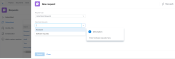

# Intégrer une file d’attente des demandes dans un tableau de bord

<!-- Audited: 1/2025 -->

Vous pouvez intégrer une nouvelle file d’attente des demandes dans un tableau de bord pour fournir un accès direct à la file d’attente des demandes à vos utilisateurs et utilisatrices, sans avoir à accéder à la zone Demandes.

Par exemple, si vous disposez d’une file d’attente des demandes ouverte à l’ensemble de l’organisation, telle qu’une file d’attente du centre d’assistance ou une file d’attente des demandes de congés à laquelle tout le monde doit accéder régulièrement, il peut s’avérer pratique d’insérer la file d’attente des demandes directement dans l’un de leurs tableaux de bord pour un accès rapide et facile. Le processus de configuration est similaire à celui de la création d’une page externe sur un tableau de bord.

Tout d’abord, vous devez obtenir une URL vers la file d’attente des demandes. Ensuite, vous pouvez intégrer l’URL dans un tableau de bord en ajoutant une page externe.

## Conditions d’accès

+++ Développez pour afficher les exigences d’accès aux fonctionnalités de cet article.

Vous devez disposer des accès suivants pour effectuer les étapes décrites dans cet article :

<table style="table-layout:auto"> 
 <col> 
 <col> 
 <tbody> 
  <tr> 
   <td role="rowheader"><strong>Formule Adobe Workfront</strong></td> 
   <td> 
Tous
 </td> 
  </tr> 
  <tr> 
   <td role="rowheader"><strong>Licence Adobe Workfront</strong></td> 
   <td> 
      
Nouveau :

         <ul>
         <li>
Standard
</li>
         </ul>
      
Actuel :

         <ul>
         <li>
Plan
</li>
         </ul>
   </td> 
  </tr> 
  <tr> 
   <td role="rowheader"><strong>Configurations des niveaux d’accès</strong></td> 
   <td> 
Accès en modification aux rapports, tableaux de bord et calendriers
 </td> 
  </tr> 
  <tr> 
   <td role="rowheader"><strong>Autorisations d’objet</strong></td> 
   <td> 
Autorisations en gestion pour le tableau de bord
 </td> 
  </tr> 
 </tbody> 
</table>

Pour plus d’informations, voir [Conditions d’accès requises dans la documentation Workfront](/help/quicksilver/administration-and-setup/add-users/access-levels-and-object-permissions/access-level-requirements-in-documentation.md).

+++

## Conditions préalables

Vous devez créer les deux éléments suivants avant d’intégrer une file d’attente des demandes dans un tableau de bord :

* **Tableau de bord** : pour plus d’informations sur la création de tableaux de bord, voir [Créer un tableau de bord](../../../reports-and-dashboards/dashboards/creating-and-managing-dashboards/create-dashboard.md).

* **File d’attente des demandes** : pour plus d’informations sur la création de files d’attente des demandes, voir [Créer une file d’attente des demandes](../../../manage-work/requests/create-and-manage-request-queues/create-request-queue.md).

## Obtenir l’URL de la file d’attente des demandes {#obtain-the-url-of-the-request-queue}

Vous pouvez obtenir l’URL d’une file d’attente des demandes de plusieurs manières, en fonction de la partie de la file d’attente des demandes que vous souhaitez afficher aux utilisateurs et utilisatrices lorsqu’ils y accèdent à partir d’un tableau de bord.

* [Obtenir un lien vers une rubrique de file d’attente spécifique avec possibilité de modifier le type de demande](#obtain-a-link-to-a-specific-queue-topic-with-ability-to-change-the-request-type)

* [Obtenir un lien vers une file d’attente des demandes et possibilité de modifier le type de demande](#obtain-a-link-to-a-request-queue-and-ability-to-change-the-request-type)

* [Obtenir un lien vers une file d’attente des demandes sans possibilité de modifier le type de demande](#obtain-a-link-to-a-request-queue-with-no-ability-to-change-the-request-type)

### Obtenir un lien vers une rubrique de file d’attente spécifique avec possibilité de modifier le type de demande {#obtain-a-link-to-a-specific-queue-topic-with-ability-to-change-the-request-type}

Lorsque vous partagez avec d’autres utilisateurs et utilisatrices un lien vers une rubrique de file d’attente spécifique, le formulaire de demande s’ouvre sur la rubrique de file d’attente exacte nécessaire pour envoyer leur demande. Cela s’avère utile lorsque les utilisateurs et utilisatrices peuvent ne pas savoir quelle rubrique de file d’attente choisir lors de la journalisation des demandes pour une file d’attente des demandes spécifique.

Les utilisateurs et utilisatrices peuvent modifier le type de demande ou choisir une autre rubrique si besoin. La navigation de la zone Demandes s’affiche également.

1. Cliquez sur le **Menu principal** > **Demandes** > **Nouvelle demande**.
1. Continuez à sélectionner les groupes de rubriques et les rubriques de la file d’attente jusqu’à ce que vous atteigniez la file d’attente que vous souhaitez partager sur le tableau de bord, si vous souhaitez partager une file d’attente spécifique. Pour plus d’informations sur l’envoi de demandes, voir [Créer et envoyer des demandes Adobe Workfront](../../../manage-work/requests/create-requests/create-submit-requests.md).

   >[!TIP]
   >
   >La sélection de groupes de rubriques et de rubriques de file d’attente est facultative.

1. Cliquez sur **Partager le chemin** dans le coin supérieur droit de la zone Nouvelle demande.

   Cette opération copie le lien vers la file d’attente des demandes ou la rubrique de la file d’attente lorsque vous l’affichez à l’écran. Les utilisateurs et utilisatrices peuvent mettre à jour le type de demande ou l’un des groupes de rubriques et des rubriques de file d’attente disponibles.

   

### Obtenir un lien vers une file d’attente des demandes et possibilité de modifier le type de demande {#obtain-a-link-to-a-request-queue-and-ability-to-change-the-request-type}

Lorsque vous partagez un lien vers un type de demande, le type de demande est sélectionné pour l’utilisateur ou l’utilisatrice. Cela s’avère utile lorsque les utilisateurs et utilisatrices doivent choisir parmi plusieurs groupes de rubriques ou rubriques de file d’attente pour le même type de demande. Les utilisateurs et utilisatrices peuvent modifier le type de demande et en choisir un autre. La navigation de la zone Demandes s’affiche également.

1. Accédez à un projet désigné comme une file d’attente des demandes.

   Pour plus d’informations sur la création d’une file d’attente de demandes à partir d’un projet, accédez à [Créer une file d’attente des demandes](../../../manage-work/requests/create-and-manage-request-queues/create-request-queue.md).

1. Accédez à **Détails de la file d’attente**.
1. Copiez le code que vous trouvez dans le champ **URL d’accès direct**.

   Le code doit ressembler à ceci :

   `https://<yourdomain>.my.workfront.com/requests/new?activeTab=tab-new-helpRequest&projectID=50062d6f000849c95ab3513c0e84a51e&path=`

   Il s’agit du lien vers la file d’attente des demandes associée au projet sélectionné. Le type de demande est présélectionné.

   Les utilisateurs et utilisatrices peuvent sélectionner n’importe quel groupe de rubriques ou rubrique de file d’attente, ou choisir un autre type de demande.

   

### Obtenir un lien vers une file d’attente des demandes sans possibilité de modifier le type de demande {#obtain-a-link-to-a-request-queue-with-no-ability-to-change-the-request-type}

Lorsque vous partagez un lien vers un type de demande présélectionné, le type de demande est sélectionné pour l’utilisateur ou l’utilisatrice et ne peut pas être modifié (il est grisé). Les utilisateurs et utilisatrices peuvent choisir les groupes de rubrique ou les rubriques de file d’attente dont ils ont besoin. Cela s’avère utile lorsque vous ne souhaitez pas que les utilisateurs et utilisatrices visualisent et sélectionnent d’autres types de demandes. La navigation dans la zone Demandes ne s’affiche pas.

1. Accédez à un projet désigné comme une file d’attente des demandes.

   Pour plus d’informations sur la création d’une file d’attente de demandes à partir d’un projet, accédez à [Créer une file d’attente des demandes](../../../manage-work/requests/create-and-manage-request-queues/create-request-queue.md).

1. Accédez à **Détails de la file d’attente**.
1. Copiez le code du champ **Code incorporé**.

   Le code doit ressembler à ceci :

   `<iframe src="https://<yourdomain>my.workfront.com/requests/newRequestEmbedded?projectID=612518c7000404462d3bc9a0bc09fa71" frameborder="0" width="500" height="600"></iframe>`

1. Modifiez le code afin de ne conserver que les informations ci-dessous :

   `https://<yourdomain>.my.workfront.com/requests/newRequestEmbedded?projectID=612518c7000404462d3bc9a0bc09fa71`

   >[!TIP]
   >
   >Vous pouvez ajouter une balise `<samp>iframe </samp>` lors de l’incorporation du code dans une application autre que Workfront.

   Il s’agit du lien vers la file d’attente des demandes associée au projet sélectionné. Le type de demande est présélectionné et ne peut pas être modifié.

   Les utilisateurs et utilisatrices peuvent sélectionner n’importe quel groupe de rubriques ou rubrique de file d’attente pour le type de demande sélectionné. Les utilisateurs et utilisatrices ne peuvent pas sélectionner un autre type de demande.

   

## Intégrer une file d’attente des demandes dans un tableau de bord

Vous pouvez incorporer un lien vers la file d’attente des demandes ou vers une rubrique de la file d’attente imbriquée sous une file d’attente des demandes dans un tableau de bord pour donner aux utilisateurs et utilisatrices un accès direct à la saisie des demandes.

1. Obtenez une URL de file d’attente des demandes à l’aide de l’une des méthodes décrites dans la section [Obtenir l’URL de la file d’attente des demandes](#obtain-the-url-of-the-request-queue) de cet article.

1. Cliquez sur **Menu principal** > **Tableaux de bord** > **Nouveau tableau de bord**.

1. Saisissez un **Nom** pour le tableau de bord. Champ obligatoire.

1. Cliquez sur **Ajouter une page externe**.

   

1. Dans la zone **Ajouter une page externe**, modifiez les champs suivants :

   * **Nom** : saisissez le nom de la file d’attente des demandes tel qu’il doit s’afficher dans le tableau de bord. Champ obligatoire.

   * **Description** : ajoutez une description de la page externe. Ce champ n’est pas obligatoire et est réservé à des fins de création de rapports. Il ne s’affiche pas dans le tableau de bord.

   * **URL** : collez l’URL que vous avez obtenue à l’aide de l’une des méthodes décrites à l’étape 1.

   * **Hauteur** : saisissez la hauteur de la page externe. Cela définit l’espace occupé par la page externe contenant la file d’attente des demandes sur le tableau de bord. Il s’agit d’un champ obligatoire dont la valeur par défaut est 500.

1. Cliquer sur **Enregistrer**.

1. Cliquez sur **Enregistrer + Fermer**.

   La file d’attente des demandes s’affiche dans le tableau de bord sous la forme d’un composant de tableau de bord distinct.

1. (Facultatif) Cliquez sur **Actions du tableau de bord**, puis sur **Modifier** pour ajouter des rapports, des calendriers ou d’autres pages externes au même tableau de bord.

   Pour plus d’informations sur l’ajout de composants à un tableau de bord, voir [Créer un tableau de bord](../../../reports-and-dashboards/dashboards/creating-and-managing-dashboards/create-dashboard.md).

<!--
<ol data-mc-conditions="QuicksilverOrClassic.Draft mode">
<li value="1"> 
Click the <strong>Main Menu</strong> > Requests >&nbsp;<strong>New Request</strong>. 
 </li>
<li class="preview" value="2" data-mc-conditions="QuicksilverOrClassic.Quicksilver"> 
Continue entering the request.&nbsp;For information about submitting requests, see <a href="../../../manage-work/requests/create-requests/create-submit-requests.md" class="MCXref xref">Create and submit Adobe Workfront requests</a>. 
 </li>
<li value="3"> 
Select the <strong>Request Type</strong> for the queue you would like added to the dashboard.
 </li>
<li value="4"> 
(Optional) Select a Queue Topic and a Topic Group. Depending on how the project manager set up the request queue, the names of these fields are different in each Workfront instance.
 </li>
<li class="preview" value="5" data-mc-conditions="QuicksilverOrClassic.Quicksilver"> 
Click <strong>Share path</strong> to obtain a shared link from the request queue you want to embed on a dashboard.
 
For information about sharing a request queue, see <a href="../../../manage-work/requests/create-requests/share-link-to-request-queue.md" class="MCXref xref">Share a link to a request queue</a>
 </li>
<li value="6"> 
For example, enter a URL similar to one of the following: 
 </li>
</ol>
-->
