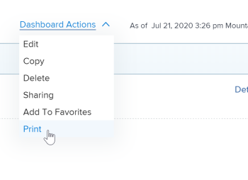

# Exporter un tableau de bord

Vous pouvez exporter un tableau de bord vers un fichier .pdf en utilisant les options d’impression disponibles dans votre navigateur web.

>[!NOTE]
>
>Lorsque vous imprimez le contenu d’une page web, le formatage du contenu peut être affecté.\
>Par exemple, l’en-tête d’un rapport dans un tableau de bord peut être coupé des lignes d’une liste de rapports.

## Conditions d’accès

Vous devez disposer des éléments suivants :

<table style="table-layout:auto"> 
 <col> 
 <col> 
 <tbody> 
  <tr> 
   <td role="rowheader"><strong>Formule Adobe Workfront*</strong></td> 
   <td> 
Tous
 </td> 
  </tr> 
  <tr> 
   <td role="rowheader"><strong>Licence Adobe Workfront*</strong></td> 
   <td> 
Travail ou supérieur
 </td> 
  </tr> 
  <tr> 
   <td role="rowheader"><strong>Configurations du niveau d’accès*</strong></td> 
   <td> 
Afficher l’accès aux rapports, aux tableaux de bord et aux calendriers
 
Remarque : si vous n’avez toujours pas d’accès, demandez à votre équipe d’administration Workfront s’il existe des restrictions supplémentaires à votre niveau d’accès. Pour plus d’informations sur la façon dont un administrateur ou une administratrice Workfront peut modifier votre niveau d’accès, voir <a href="../../../administration-and-setup/add-users/configure-and-grant-access/create-modify-access-levels.md" class="MCXref xref">Créer ou modifier des niveaux d’accès personnalisés</a>.
 </td> 
  </tr> 
  <tr> 
   <td role="rowheader"><strong>Autorisations d’objet</strong></td> 
   <td> 
Afficher des autorisations pour le tableau de bord
 
Pour plus d’informations sur la demande d’accès supplémentaire, voir <a href="../../../workfront-basics/grant-and-request-access-to-objects/request-access.md" class="MCXref xref">Demander l’accès aux objets </a>.
 </td> 
  </tr> 
 </tbody> 
</table>

&#42;Pour connaître le forfait, le type de licence ou l’accès dont vous disposez, contactez votre administrateur ou administratrice Workfront.

## Conditions préalables

Le tableau de bord doit être créé avant de pouvoir être exporté.

Pour plus d’informations sur la création de tableaux de bord, voir [Créer un tableau de bord](../../../reports-and-dashboards/dashboards/creating-and-managing-dashboards/create-dashboard.md).

## Exporter un tableau de bord vers un fichier .pdf :

1. Accédez au tableau de bord que vous souhaitez exporter.
1. Cliquez sur **Actions du tableau de bord**, puis sélectionnez **Imprimer**.

   

   La boîte de dialogue Imprimer s’ouvre.

1. En fonction de votre navigateur, sélectionnez les options d’impression appropriées pour compléter l’export du fichier .pdf :

   <table style="table-layout:auto"> 
    <col> 
    <col> 
    <thead> 
     <tr> 
      <th>Navigateur web</th> 
      <th>Sélections de la boîte de dialogue d’impression</th> 
     </tr> 
    </thead> 
    <tbody> 
     <tr> 
      <td>Google Chrome</td> 
      <td> 
       <ol> 
        <li value="1">Dans le champ <strong>Destination</strong>, sélectionnez <strong>Enregistrer en tant que PDF</strong>, puis modifiez toutes les autres options d’impression que vous souhaitez changer.</li> 
        <li value="2">Cliquer sur <strong>Enregistrer</strong>.</li> 
        <li value="3">(Facultatif) Modifiez le <strong>nom du fichier</strong>, puis sélectionnez un nouveau dossier de destination pour le fichier.</li> 
        <li value="4">Cliquez sur <strong>Enregistrer</strong> pour enregistrer le fichier .pdf sur votre disque dur.  </li> 
       </ol> </td> 
     </tr> 
     <tr> 
      <td>Internet Explorer, Microsoft Edge et Mozilla Firefox</td> 
      <td> 
Remarque : si vous utilisez la version 11 d’Internet Explorer, il se peut que vous ne puissiez pas utiliser la fonctionnalité d’impression au format PDF sans installer un plug-in tiers.
 
       <ol> 
        <li value="1">Dans le champ <strong>Imprimante</strong> ou <strong>Sélectionner une imprimante</strong>, sélectionnez <strong>Microsoft Print to PDF</strong>, puis modifiez toutes les autres options d’impression que vous souhaitez changer.</li> 
        <li value="2">Cliquez sur <strong>Imprimer</strong>.</li> 
        <li value="3">Saisissez un <strong>nom de fichier</strong>.</li> 
        <li value="4">(Facultatif) Sélectionnez une nouvelle destination de dossier pour le fichier.</li> 
        <li value="5">Cliquer sur <strong>Enregistrer</strong>.</li> 
       </ol> </td> 
     </tr> 
     <tr> 
      <td>Safari</td> 
      <td> 
       <ol> 
        <li value="1">Dans le coin inférieur gauche, cliquez sur la flèche déroulante, puis sélectionnez <strong>Enregistrer en tant que PDF</strong>.</li> 
        <li value="2">Saisissez un <strong>nom de fichier</strong>.</li> 
        <li value="3">(Facultatif) Modifiez les autres options d’impression souhaitées, y compris la sélection d’une nouvelle destination de dossier pour le fichier.</li> 
        <li value="4">Cliquer sur <strong>Enregistrer</strong>.</li> 
       </ol> </td> 
     </tr> 
    </tbody> 
   </table>
