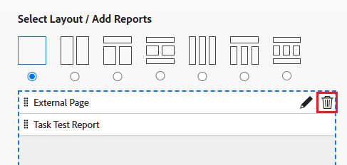

# Supprimer une page externe d’un tableau de bord

Vous pouvez supprimer une page externe d’un tableau de bord si vous n’en avez plus besoin.

Cependant, vous ne pouvez pas supprimer une page externe une fois qu’elle a été créée dans Adobe Workfront. Vous ne pouvez supprimer une page externe qu’à l’aide de l’API. Pour plus d’informations sur l’API Workfront, voir [Principes de base de l’API](../../../wf-api/general/api-basics.md). Pour plus d’informations sur la création de pages externes, voir [Intégrer une page web externe dans un tableau de bord](../../../reports-and-dashboards/dashboards/creating-and-managing-dashboards/embed-external-web-page-dashboard.md).

## Conditions d’accès

Vous devez disposer des accès suivants pour effectuer les étapes décrites dans cet article :

<table style="table-layout:auto"> 
 <col> 
 <col> 
 <tbody> 
  <tr> 
   <td role="rowheader"><strong>Formule Adobe Workfront*</strong></td> 
   <td> 
Tous
 </td> 
  </tr> 
  <tr> 
   <td role="rowheader"><strong>Licence Adobe Workfront*</strong></td> 
   <td> 
Plan 
 </td> 
  </tr> 
  <tr> 
   <td role="rowheader"><strong>Configurations du niveau d’accès*</strong></td> 
   <td> 
Accès en modification aux rapports, tableaux de bord et calendriers
 
Remarque : si vous n’avez toujours pas d’accès, demandez à votre équipe d’administration Workfront s’il existe des restrictions supplémentaires à votre niveau d’accès. Pour plus d’informations sur la façon dont un administrateur ou une administratrice Workfront peut modifier votre niveau d’accès, voir <a href="../../../administration-and-setup/add-users/configure-and-grant-access/create-modify-access-levels.md" class="MCXref xref">Créer ou modifier des niveaux d’accès personnalisés</a>.
 </td> 
  </tr> 
  <tr> 
   <td role="rowheader"><strong>Autorisations d’objet</strong></td> 
   <td> 
Autorisations en gestion pour le tableau de bord
 
Pour plus d’informations sur les demandes d’accès supplémentaire, voir <a href="../../../workfront-basics/grant-and-request-access-to-objects/request-access.md" class="MCXref xref">Demander l’accès à des objets</a>.
 </td> 
  </tr> 
 </tbody> 
</table>

&#42;Pour connaître le plan, le type de licence ou l’accès dont vous disposez, contactez votre équipe d’administration Workfront.

## Supprimer une page externe d’un tableau de bord

1. Cliquez sur l’icône **Menu principal** , puis sur **Tableaux de bords**.
1. Sélectionnez le tableau de bord dont vous souhaitez supprimer la page externe, puis cliquez sur **Modifier** .

   

1. Sur le côté droit de l’écran, localisez la page externe que vous souhaitez supprimer et cliquez sur l’icône **Supprimer** .

   

1. Cliquez sur **Enregistrer et fermer** dans le coin inférieur gauche.

   Cette opération supprime la page externe du tableau de bord sélectionné. La page externe reste dans Workfront et est accessible à partir d’un rapport. Pour plus d’informations, voir la section « Afficher des pages externes dans un rapport » de l’article [Intégrer une page web externe dans un tableau de bord](../../../reports-and-dashboards/dashboards/creating-and-managing-dashboards/embed-external-web-page-dashboard.md).
