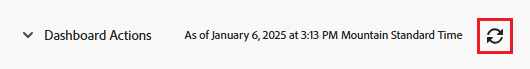

# Commencer avec les tableaux de bord

<!-- Audited: 1/2024 -->

Le tableau de bord permet d’accéder rapidement aux informations issues de plusieurs rapports. Rassemblez d’abord les informations dans des rapports, puis disposez plusieurs rapports sur les tableaux de bord pour faciliter l’accès aux informations.

## Conditions d’accès

+++ Développez pour afficher les exigences d’accès aux fonctionnalités de cet article.

Vous devez disposer des éléments suivants :

<table style="table-layout:auto">
 <col> 
 </col> 
 <col> 
 </col> 
 <tbody> 
  <tr> 
   <td> 
<strong>Formule Adobe Workfront</strong>
 </td> 
   <td>Tous</td> 
  </tr> 
  <tr> 
   <td> 
<strong>Licence Adobe Workfront</strong>
 </td> 
   <td> 
Nouvelle : contributeur ou supérieure

Ou

Actuel : Révision ou supérieur
 </td> 
  </tr> 
  <tr> 
   <td><strong>Niveau d’accès</strong> </td> 
   <td> 
Accès en affichage ou supérieur aux rapports, tableaux de bord et calendriers
 </td> 
  </tr> 
  <tr> 
   <td> 
<strong>Autorisations d’objet</strong> 
 </td> 
   <td> 
Afficher des autorisations pour le tableau de bord
  </td> 
  </tr> 
 </tbody> 
</table>

Pour plus de détails sur les informations contenues dans ce tableau, consultez [Conditions d’accès préalables dans la documentation Workfront](/help/quicksilver/administration-and-setup/add-users/access-levels-and-object-permissions/access-level-requirements-in-documentation.md).

+++

## Objets que vous pouvez ajouter à un tableau de bord

Vous pouvez remplir un tableau de bord avec jusqu’à 25 des éléments suivants dans Adobe Workfront :

* Rapports\
  Pour plus d’informations sur la création de rapports, voir [Créer un rapport personnalisé](../../../reports-and-dashboards/reports/creating-and-managing-reports/create-custom-report.md).

* Calendriers\
  Pour plus d’informations sur la création de calendriers, consultez la section [Vue d’ensemble des rapports sur les calendriers](../../../reports-and-dashboards/reports/calendars/calendar-reports-overview.md).

* Pages externes\
  Pour plus d’informations sur la création de pages externes, consultez la section [Incorporer une page web externe dans un tableau de bord](../../../reports-and-dashboards/dashboards/creating-and-managing-dashboards/embed-external-web-page-dashboard.md).

Pour plus d’informations sur la création d’un tableau de bord, voir [Créer un tableau de bord](../../../reports-and-dashboards/dashboards/creating-and-managing-dashboards/create-dashboard.md).

## Partager des tableaux de bord

Vous pouvez partager un tableau de bord avec des utilisateurs et utilisatrices de la manière suivante :

* Partage individuel.\
  Pour plus d’informations sur le partage des tableaux de bord, consultez les sections [Partager des rapports, tableaux de bord et calendriers](../../../workfront-basics/grant-and-request-access-to-objects/permissions-reports-dashboards-calendars.md) et [Partager un tableau de bord](../../../reports-and-dashboards/dashboards/creating-and-managing-dashboards/share-dashboard.md).

* Ajouter un tableau de bord à n’importe quelle zone ou objet de Workfront avec une section personnalisée\
  Pour plus d’informations sur la création de sections personnalisées, consultez la section [Navigation de gauche dans Adobe Workfront](../../../workfront-basics/the-new-workfront-experience/simplified-left-navigation.md).

* Placez les tableaux de bord dans des modèles de mise en page que vous pouvez partager avec les utilisateurs et les utilisatrices.\
  Pour plus d’informations sur le partage de tableaux de bord par le biais de modèles de mise en page, consultez la section [Personnaliser le panneau de gauche à l’aide d’un modèle de mise en page](../../../administration-and-setup/customize-workfront/use-layout-templates/customize-left-panel.md).

* Imprimez les sur papier pour les partager avec les utilisateurs et les utilisatrices.\
  Pour plus d’informations sur l’impression des tableaux de bord, consultez la section [Imprimer un tableau de bord](../../../reports-and-dashboards/dashboards/creating-and-managing-dashboards/print-dashboard.md).

* Exportez-les en tant que fichier PDF pour pouvoir les envoyer par e-mail aux utilisateurs et aux utilisatrices.\
  Pour plus d’informations sur l’export d’un tableau de bord vers un fichier PDF, consultez la section [Exporter un tableau de bord](../../../reports-and-dashboards/dashboards/creating-and-managing-dashboards/export-dashboard.md).

Quand vous partagez un tableau de bord avec des utilisateurs et des utilisatrices, les rapports, calendriers, et pages externes qu’il contient sont automatiquement partagés avec ces mêmes utilisateurs et utilisatrices.

>[!IMPORTANT]
>
>Supprimer un utilisateur ou une utilisatrice rend ses tableaux de bord inaccessibles. Pour en savoir plus, consultez la section [Supprimer des utilisateurs et utilisatrices](../../../administration-and-setup/add-users/create-and-manage-users/delete-a-user.md).

## Afficher les tableaux de bord

Vous pouvez afficher un tableau de bord comme suit :

* Accédez à la section personnalisée où se trouve le tableau de bord.\
  Pour plus d’informations sur le placement de tableaux de bord dans des sections personnalisées, consultez la section [Navigation de gauche dans Adobe Workfront](../../../workfront-basics/the-new-workfront-experience/simplified-left-navigation.md).

* Rechercher et accéder manuellement au tableau de bord

## Accéder à un tableau de bord

1. Cliquez sur l’icône **[!UICONTROL Menu principal]**  dans le coin supérieur droit d’Adobe Workfront, ou (le cas échéant), cliquez sur l’icône **[!UICONTROL Menu principal]**  dans le coin supérieur gauche, puis cliquez sur **Tableaux de bord**.
1. Pointez sur la barre latérale gauche, puis sélectionnez l’une des options suivantes :

   * **Mes tableaux de bord** : les tableaux de bord que vous avez créés sont répertoriés ici.

     >[!TIP]
     >
     >Si votre niveau d’accès ne vous permet pas de modifier les rapports, les tableaux de bord et les calendriers, vous ne pouvez pas créer de tableaux de bord. Dans ce cas, la liste « Mes tableaux de bord » est vide.

   * **Tableaux de bord partagés** : les tableaux de bord créés par d’autres utilisateurs et utilisatrices et partagés avec vous sont répertoriés ici.
   * **Tous les tableaux de bord** : vos tableaux de bord et ceux partagés avec vous par d’autres utilisateurs et utilisatrices sont répertoriés ici.

   

1. Cliquez sur le nom du tableau de bord pour l’ouvrir.\
   Le tableau de bord affiche les informations contenues dans les rapports, les calendriers ou les pages externes qui le renseignent.
1. (Facultatif et le cas échéant) Pour actualiser les informations du tableau de bord, cliquez sur l’icône **Charger à nouveau** en haut à droite du tableau de bord.\
   Les informations du tableau de bord sont synchronisées en temps réel lors de votre premier accès. Après un certain temps passé à afficher le tableau de bord dans votre navigateur, les informations des rapports du tableau de bord peuvent devenir obsolètes. La date et l’heure de la dernière actualisation du tableau de bord sont répertoriées à gauche de cette icône.\
   

## Supprimer des tableaux de bord

Vous pouvez supprimer un tableau de bord de Workfront si vous le souhaitez.

Pour en savoir plus, consultez la section [Supprimer un tableau de bord](../../../reports-and-dashboards/dashboards/creating-and-managing-dashboards/delete-dashboard.md).
