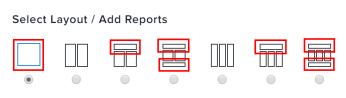

# Comprendre l’affichage des rapports sur un tableau de bord

<!-- Audited: 1/2025 -->

Vous pouvez gérer l’affichage des rapports ajoutés aux tableaux de bord. Lors de la création ou de la modification d’un tableau de bord, vous pouvez sélectionner l’une des sept options de disposition qui spécifient les zones dans lesquelles les rapports peuvent être placés sur le tableau de bord. Veillez à bien choisir la disposition de votre tableau de bord, car trop de colonnes ou certains panneaux comme l’assistant d’IA peuvent avoir un impact sur l’espace d’affichage disponible et rendre votre tableau de bord difficile à afficher.

Pour plus d’informations sur la modification de la mise en page des rapports sur un tableau de bord, voir [Créer un tableau de bord](../../../reports-and-dashboards/dashboards/creating-and-managing-dashboards/create-dashboard.md).

## Colonnes de rapport par défaut dans les zones de mise en page du tableau de bord

Certaines options de disposition comportent des zones d’emplacement de rapport qui limitent le nombre de colonnes de rapport affichées par défaut. Vous pouvez sélectionner manuellement les colonnes de rapport à afficher dans ces zones d’un tableau de bord lorsque vous créez ou modifiez un rapport en cliquant sur [!UICONTROL **Options avancées**] dans [!UICONTROL **Paramètres des colonnes**]. Si vous souhaitez afficher toutes les colonnes du rapport dans un tableau de bord, veillez à spécifier cette option pour chaque colonne du rapport ou placez le rapport dans une zone qui affiche toutes les colonnes du rapport par défaut.

Pour plus d’informations sur la sélection des colonnes d’un rapport à afficher sur un tableau de bord, voir [Créer un rapport personnalisé](../../../reports-and-dashboards/reports/creating-and-managing-reports/create-custom-report.md).

### Zones qui affichent toutes les colonnes d’un rapport par défaut

Lorsque le rapport est sélectionné pour une zone du tableau de bord qui occupe toute la largeur du tableau de bord, toutes les colonnes du rapport s’affichent par défaut sur le tableau de bord.\

### Zones qui affichent uniquement la première colonne d’un rapport par défaut

Lorsque le rapport est sélectionné pour une zone du tableau de bord dont la largeur est inférieure à la largeur totale du tableau de bord, seule la première colonne du rapport s’affiche par défaut sur le tableau de bord.\

