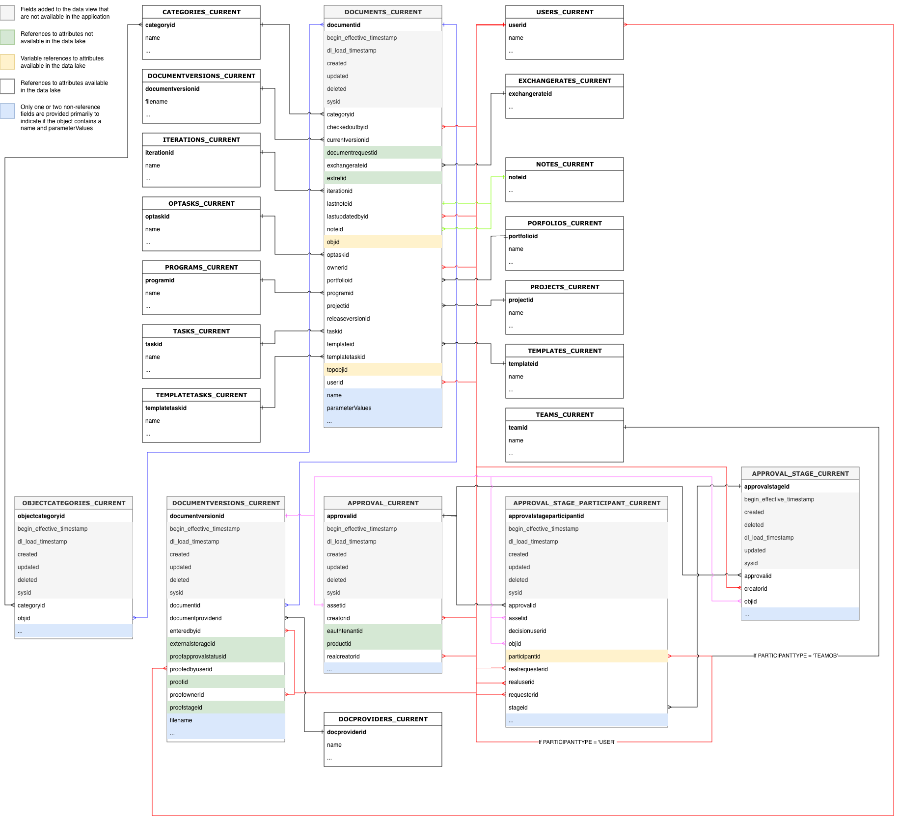

# Dictionnaire de données Workfront Data Connect

Cette page contient des informations sur la structure et le contenu des données dans Workfront Data Connect.

>[!NOTE]
>
>Les données de Data Connect sont actualisées toutes les 4 heures, de sorte que les modifications récentes peuvent ne pas être immédiatement répercutées.

## Types de vue

Il existe plusieurs types de vues que vous pouvez utiliser dans Data Connect pour afficher vos données Workfront de manière à fournir le plus d’insight.

* **Vue actuelle**

  La vue actuelle reflète les données de la même manière qu’elles existent dans Workfront, dans chaque objet et dans leur état actuel. Cependant, la latence de navigation est bien inférieure dans Workfront.

* **Vue Événement**

  L’affichage Événement suit chaque enregistrement de modification dans Workfront : en d’autres termes, chaque fois qu’un objet change d’état, un enregistrement est créé pour indiquer la date de la modification, l’auteur de la modification et ce qui a été modifié. Par conséquent, cette vue est utile pour les comparaisons ponctuelles. Cette vue inclut uniquement les enregistrements des trois dernières années.

* **Vue Historique quotidien**

  La vue Historique quotidien offre une version abrégée de la vue Événement, dans la mesure où elle affiche l&#39;état de chaque objet sur une base quotidienne plutôt que lorsque chaque événement individuel s&#39;est produit. Cette vue est donc utile pour l’analyse des tendances.

<!-- Custom view -->

## Diagrammes de relation d’entité

Les objets dans Workfront (et, par conséquent, dans votre lac de données Data Connect) sont définis non seulement par leurs valeurs individuelles, mais également par leurs relations avec d’autres objets.

Les diagrammes de relation d’entité (ERD) ci-dessous fournissent un mappage de haut niveau des relations d’objet dans Data Connect pour les objets Workfront principaux.

>[!IMPORTANT]
>
>Les diagrammes sont centrés autour d’objets uniques et ne représentent pas un diagramme de relation d’entité complet pour l’ensemble de l’application Workfront. Ces diagrammes sont destinés à fournir des exemples de la manière dont les relations peuvent être utilisées pour joindre des données à des objets adjacents.

### Exemples de diagrammes de relation d’entité

+++ Développez pour afficher les exemples de diagrammes.

>[!TIP]
>
>Pour afficher un diagramme plus détaillé, cliquez avec le bouton droit de la souris sur l’image et sélectionnez **Ouvrir l’image dans un nouvel onglet**.

### Affectations

### Documents et approbations de documents

### Heures et feuilles de temps

### Problèmes

### Projets

### Tâches

### Utilisateurs et utilisatrices

+++

## Types de date

Plusieurs objets de date fournissent des informations sur le moment où des événements spécifiques se produisent.

* `DL_LOAD_TIMESTAMP` : cette date est mise à jour une fois l’actualisation des données terminée avec succès et inclut l’horodatage du début de la tâche d’actualisation qui a fourni la dernière version d’un enregistrement.
* `CALENDAR_DATE` : cette date est uniquement présente dans la vue Historique quotidien. La vue Historique quotidien fournit un enregistrement de l’aspect des données à 11 :59 UTC pour chaque date spécifiée dans `CALENDAR_DATE`.
* `BEGIN_EFFECTIVE_TIMESTAMP` : cette date est présente dans les vues Événement et Historique quotidien et représente l&#39;heure à laquelle un enregistrement devient la valeur actuelle dans l&#39;application.
* `END_EFFECTIVE_TIMESTAMP` : Cette date est présente dans les vues Événement et Historique quotidien et enregistre exactement le moment où un enregistrement est passé _de_ la valeur de la ligne active à une valeur d&#39;une autre ligne. Pour permettre la comparaison entre les requêtes sur `BEGIN_EFFECTIVE_TIMESTAMP` et `END_EFFECTIVE_TIMESTAMP`, cette valeur n’est jamais nulle, même s’il n’existe aucune nouvelle valeur. Dans le cas où un enregistrement est toujours valide (c’est-à-dire, que la valeur n’a pas changé), `END_EFFECTIVE_TIMESTAMP` aura une valeur de 2300-01-01.

## Tableau terminologique et descriptions de Workfront

Le tableau suivant met en corrélation les noms d’objet dans Workfront (ainsi que leurs noms dans l’interface et l’API) avec leurs noms équivalents dans Data Connect et inclut des champs de référence pour chaque objet avec d’autres objets Workfront.

>[!NOTE]
>
>De nouveaux champs peuvent être ajoutés aux vues d’objet sans préavis pour prendre en charge l’évolution des besoins en données de l’application Workfront. Nous mettons en garde contre l’utilisation de requêtes « SELECT » lorsque le destinataire de données en aval n’est pas prêt à gérer des colonnes supplémentaires au fur et à mesure de leur ajout.Si le changement de nom ou la suppression d’une colonne est nécessaire, nous vous avertirons à l’avance de ces modifications.

### Niveau d’accès

<table>
    <thead>
        <tr>
            <th>Nom de l’entité Workfront</th>
            <th>Références d’interface</th>
            <th>Référence d’API</th>
            <th>Libellé de l’API</th>
            <th>Vues du lac de données</th>
        </tr>
      </thead>
      <tbody>
        <tr>
            <td>Niveau d’accès</td>
            <td>Niveau d’accès</td>
            <td>ACSLVL</td>
            <td>Niveau d’accès</td>
            <td>ACCESSLEVELS_CURRENT ACCESSLEVELS_DAILY_HISTORY ACCESSLEVELS_EVENT</td>
        </tr>
      </tbody>
</table>
<table>
    <thead>
        <tr>
            <th>Principal/Clé étrangère</th>
            <th>Type</th>
            <th>Table connexe</th>
            <th>Champ associé</th>
        </tr>
    </thead>
    <tbody>
        <tr>
             <td>ACCESSLEVELID</td>
             <td>PK</td>
             <td>-</td>
             <td>-</td>
        </tr>
        <tr>
             <td>APPGLOBALID</td>
             <td>-</td>
             <td colspan="2">Pas une relation ; utilisé à des fins d’application interne.</td>
        </tr>
        <tr>
             <td>LASTUPDATEDBYID</td>
             <td>FK</td>
             <td>USERS_CURRENT</td>
             <td>USERID</td>
        </tr>
        <tr>
             <td>ID D’ACCESSLEVEL HÉRITÉ</td>
             <td>-</td>
             <td colspan="2">Pas une relation ; utilisé à des fins d’application interne.</td>
        </tr>
        <tr>
             <td>OBJID</td>
             <td>FK</td>
             <td>Variable, basée sur OBJCODE</td>
             <td>Clé primaire/ID de l’objet identifié dans le champ OBJCODE</td>
        </tr>
        <tr>
             <td>SYSID</td>
             <td>-</td>
             <td colspan="2">Pas une relation ; utilisé à des fins d’application interne.</td>
        </tr>
    </tbody>
</table>

### Règle d&#39;accès

<table>
    <thead>
        <tr>
            <th>Nom de l’entité Workfront</th>
            <th>Références d’interface</th>
            <th>Référence d’API</th>
            <th>Libellé de l’API</th>
            <th>Vues du lac de données</th>
        </tr>
      </thead>
      <tbody>
        <tr>
            <td>Règle d'accès</td>
            <td>Partager</td>
            <td>ACSRUL</td>
            <td>Partager</td>
            <td>ACCESSRULES_CURRENT ACCESSRULES_DAILY_HISTORY ACCESSRULES_EVENT</td>
        </tr>
      </tbody>
</table>
<table>
    <thead>
        <tr>
            <th>Principal/Clé étrangère</th>
            <th>Type</th>
            <th>Table connexe</th>
            <th>Champ associé</th>
        </tr>
    </thead>
    <tbody>
        <tr>
             <td>ACCESSORID</td>
             <td>FK</td>
             <td>Variable, basée sur ACCESSOROBJCODE</td>
             <td>Clé primaire/ID de l’objet identifié dans le champ ACCESSOROBJCODE</td>
        </tr>
        <tr>
             <td>ACCESSRULEID</td>
             <td>PK</td>
             <td>-</td>
             <td>-</td>
        </tr>
        <tr>
             <td>ANCESTORID</td>
             <td>PK</td>
             <td>Variable, basée sur ANCESTOROBJCODE</td>
             <td>Clé primaire/ID de l’objet identifié dans le champ ANCESTOROBJCODE</td>
        </tr>
        <tr>
             <td>LASTUPDATEDBYID</td>
             <td>FK</td>
             <td>USERS_CURRENT</td>
             <td>USERID</td>
        </tr>
        <tr>
             <td>SECURITYOBJID</td>
             <td>FK</td>
             <td>Variable, basée sur SECURITYOBJCODE</td>
             <td>Clé primaire/ID de l’objet identifié dans le champ SECURITYOBJCODE</td>
        </tr>
        <tr>
             <td>SYSID</td>
             <td>-</td>
             <td colspan="2">Pas une relation ; utilisé à des fins d’application interne.</td>
        </tr>
    </tbody>
</table>

### Chemin d&#39;approbation

<table>
    <thead>
        <tr>
            <th>Nom de l’entité Workfront</th>
            <th>Références d’interface</th>
            <th>Référence d’API</th>
            <th>Libellé de l’API</th>
            <th>Vues du lac de données</th>
        </tr>
      </thead>
      <tbody>
        <tr>
            <td>Chemin d'approbation</td>
            <td>Chemin d'approbation</td>
            <td>ARVPTH</td>
            <td>Approbation</td>
            <td>APPROVALPATHS_CURRENT APPROVALPATHS_DAILY_HISTORY APPROVALPATHS_EVENT</td>
        </tr>
      </tbody>
</table>
<table>
    <thead>
        <tr>
            <th>Principal/Clé étrangère</th>
            <th>Type</th>
            <th>Table connexe</th>
            <th>Champ associé</th>
        </tr>
    </thead>
    <tbody>
        <tr>
             <td>APPROVALPATHID</td>
             <td>PK</td>
             <td>-</td>
             <td>-</td>
        </tr>
        <tr>
             <td>APPROVALPROCESSID</td>
             <td>FK</td>
             <td>APPROVALPROCESSES_CURRENT</td>
             <td>APPROVALPROCESSID</td>
        </tr>
        <tr>
             <td>ENTEREDBYID</td>
             <td>FK</td>
             <td>USERS_CURRENT</td>
             <td>USERID</td>
        </tr>
        <tr>
             <td>GLOBALPATHID</td>
             <td>-</td>
             <td colspan="2">Pas une relation ; utilisé à des fins d’application interne.</td>
        </tr>
        <tr>
             <td>LASTUPDATEDBYID</td>
             <td>FK</td>
             <td>USERS_CURRENT</td>
             <td>USERID</td>
        </tr>
        <tr>
             <td>SYSID</td>
             <td>-</td>
             <td colspan="2">Pas une relation ; utilisé à des fins d’application interne.</td>
        </tr>
    </tbody>
</table>

### Processus d’approbation

<table>
    <thead>
        <tr>
            <th>Nom de l’entité Workfront</th>
            <th>Références d’interface</th>
            <th>Référence d’API</th>
            <th>Libellé de l’API</th>
            <th>Vues du lac de données</th>
        </tr>
      </thead>
      <tbody>
        <tr>
            <td>Processus d’approbation</td>
            <td>Processus d’approbation</td>
            <td>ARVPRC</td>
            <td>Processus d’approbation</td>
            <td>APPROVALPROCESSES_CURRENT APPROVALPROCESSES_DAILY_HISTORY APPROVALPROCESSES_EVENT</td>
        </tr>
      </tbody>
</table>
<table>
    <thead>
        <tr>
            <th>Principal/Clé étrangère</th>
            <th>Type</th>
            <th>Table connexe</th>
            <th>Champ associé</th>
        </tr>
    </thead>
    <tbody>
        <tr>
             <td>APPROVALPROCESSID</td>
             <td>PK</td>
             <td>-</td>
             <td>-</td>
        </tr>
        <tr>
             <td>ENTEREDBYID</td>
             <td>FK</td>
             <td>USERS_CURRENT</td>
             <td>USERID</td>
        </tr>
        <tr>
             <td>LASTUPDATEDBYID</td>
             <td>FK</td>
             <td>USERS_CURRENT</td>
             <td>USERID</td>
        </tr>
        <tr>
             <td>SYSID</td>
             <td>-</td>
             <td colspan="2">Pas une relation ; utilisé à des fins d’application interne.</td>
        </tr>
    </tbody>
</table>

### Étape d’approbation

<table>
    <thead>
        <tr>
            <th>Nom de l’entité Workfront</th>
            <th>Références d’interface</th>
            <th>Référence d’API</th>
            <th>Libellé de l’API</th>
            <th>Vues du lac de données</th>
        </tr>
      </thead>
      <tbody>
        <tr>
            <td>Étape d’approbation</td>
            <td>Étape d’approbation</td>
            <td>ARVSTP</td>
            <td>Étape d’approbation</td>
            <td>APPROVALSTEPS_CURRENT APPROVALSTEPS_DAILY_HISTORY APPROVALSTEPS_EVENT</td>
        </tr>
      </tbody>
</table>
<table>
    <thead>
        <tr>
            <th>Principal/Clé étrangère</th>
            <th>Type</th>
            <th>Table connexe</th>
            <th>Champ associé</th>
        </tr>
    </thead>
    <tbody>
        <tr>
             <td>APPROVALPATHID</td>
             <td>FK</td>
             <td>APPROVALPATHS_CURRENT</td>
             <td>APPROVALPATHID</td>
        </tr>
        <tr>
             <td>APPROVALSTEPID</td>
             <td>PK</td>
             <td>-</td>
             <td>-</td>
        </tr>
        <tr>
             <td>SYSID</td>
             <td>-</td>
             <td colspan="2">Pas une relation ; utilisé à des fins d’application interne.</td>
        </tr>
    </tbody>
</table>

### Statut de l&#39;approbateur

<table>
    <thead>
        <tr>
            <th>Nom de l’entité Workfront</th>
            <th>Références d’interface</th>
            <th>Référence d’API</th>
            <th>Libellé de l’API</th>
            <th>Vues du lac de données</th>
        </tr>
      </thead>
      <tbody>
        <tr>
            <td>Statut de l'approbateur</td>
            <td>Statut de l'approbateur</td>
            <td>ARVSTS</td>
            <td>ApproverStatus</td>
            <td>APPROVERSTATUSES_CURRENT APPROVERSTATUSES_DAILY_HISTORY APPROVERSTATUSES_EVENT</td>
        </tr>
      </tbody>
</table>
<table>
    <thead>
        <tr>
            <th>Principal/Clé étrangère</th>
            <th>Type</th>
            <th>Table connexe</th>
            <th>Champ associé</th>
        </tr>
    </thead>
    <tbody>
        <tr>
             <td>APPROVERSTATUSID</td>
             <td>PK</td>
             <td>-</td>
             <td>-</td>
        </tr>
        <tr>
             <td>APPROVABLEOBJID</td>
             <td>FK</td>
             <td>Variable, basée sur APPROVABLEOBJCODE</td>
             <td>Clé primaire/ID de l'objet identifié dans le champ APPROVABLEOBJCODE</td>
        </tr>
        <tr>
             <td>APPROVALSTEPID</td>
             <td>FK</td>
             <td>APPROVALSTEPS_CURRENT</td>
             <td>APPROVALSTEPID</td>
        </tr>
        <tr>
             <td>APPROVEDBYID</td>
             <td>FK</td>
             <td>USERS_CURRENT</td>
             <td>USERID</td>
        </tr>
        <tr>
             <td>DELEGATEUSERID</td>
             <td>FK</td>
             <td>USERS_CURRENT</td>
             <td>USERID</td>
        </tr>
        <tr>
             <td>LASTUPDATEDBYID</td>
             <td>FK</td>
             <td>USERS_CURRENT</td>
             <td>USERID</td>
        </tr>
        <tr>
             <td>OPTASKID</td>
             <td>FK</td>
             <td>OPTASKS_CURRENT</td>
             <td>OPTASKID</td>
        </tr>
        <tr>
             <td>OVERRIDDENUSERID</td>
             <td>FK</td>
             <td>USERS_CURRENT</td>
             <td>USERID</td>
        </tr>
        <tr>
             <td>PROJECTID</td>
             <td>FK</td>
             <td>PROJECTS_CURRENT</td>
             <td>PROJECTID</td>
        </tr>
        <tr>
             <td>STEPAPPROVERID</td>
             <td>FK</td>
             <td>USERS_CURRENT</td>
             <td>USERID</td>
        </tr>
        <tr>
             <td>SYSYSYID</td>
             <td>-</td>
             <td colspan="2">Pas une relation ; utilisé à des fins d’application interne.</td>
        </tr>
        <tr>
             <td>TASKID</td>
             <td>FK</td>
             <td>TASKS_CURRENT</td>
             <td>TASKID</td>
        </tr>
        <tr>
             <td>WILDCARDUSERID</td>
             <td>FK</td>
             <td>USERS_CURRENT</td>
             <td>USERID</td>
        </tr>
    </tbody>
</table>

### Affectation

<table>
    <thead>
        <tr>
            <th>Nom de l’entité Workfront</th>
            <th>Références d’interface</th>
            <th>Référence d’API</th>
            <th>Libellé de l’API</th>
            <th>Vues du lac de données</th>
        </tr>
      </thead>
      <tbody>
        <tr>
            <td>Affectation</td>
            <td>Affectation</td>
            <td>ASSGN</td>
            <td>Affectation</td>
            <td>ASSIGNMENTS_CURRENT ASSIGNMENTS_DAILY_HISTORY ASSIGNMENTS_EVENT</td>
        </tr>
      </tbody>
</table>
<table>
    <thead>
        <tr>
            <th>Principal/Clé étrangère</th>
            <th>Type</th>
            <th>Table connexe</th>
            <th>Champ associé</th>
        </tr>
    </thead>
    <tbody>
        <tr>
             <td>ASSIGNEDBYID</td>
             <td>FK</td>
             <td>USERS_CURRENT</td>
             <td>USERID</td>
        </tr>
        <tr>
             <td>ASSIGNEDTOID</td>
             <td>FK</td>
             <td>USERS_CURRENT</td>
             <td>USERID</td>
        </tr>
        <tr>
             <td>ASSIGNMENTID</td>
             <td>PK</td>
             <td>-</td>
             <td>-</td>
        </tr>
        <tr>
             <td>CATEGORYID</td>
             <td>FK</td>
             <td>CATEGORIES_CURRENT</td>
             <td>CATEGORYID</td>
        </tr>
        <tr>
             <td>CLASSIFIERID</td>
             <td>FK</td>
             <td>CLASSIFIER_CURRENT</td>
             <td>CLASSIFIERID</td>
        </tr>
      <tr>
             <td>LASTUPDATEDBYID</td>
             <td>FK</td>
             <td>USERS_CURRENT</td>
             <td>USERID</td>
        </tr>
        <tr>
             <td>OPTASKID</td>
             <td>FK</td>
             <td>OPTASKS_CURRENT</td>
             <td>OPTASKID</td>
        </tr>
        <tr>
             <td>PRIVATERATECARDID</td>
             <td>FK</td>
             <td>RATECARD_CURRENT</td>
             <td>RATECARDID</td>
        </tr>
        <tr>
             <td>PROJECTID</td>
             <td>FK</td>
             <td>PROJECTS_CURRENT</td>
             <td>PROJECTID</td>
        </tr>
        <tr>
             <td>ROLEID</td>
             <td>FK</td>
             <td>ROLES_CURRENT</td>
             <td>ROLEID</td>
        </tr>
        <tr>
             <td>TASKID</td>
             <td>FK</td>
             <td>TASKS_CURRENT</td>
             <td>TASKID</td>
        </tr>
        <tr>
             <td>TEAMID</td>
             <td>FK</td>
             <td>TEAMS_CURRENT</td>
             <td>TEAMID</td>
        </tr>
    </tbody>
</table>

### Approbations en attente

<table>
    <thead>
        <tr>
            <th>Nom de l’entité Workfront</th>
            <th>Références d’interface</th>
            <th>Référence d’API</th>
            <th>Libellé de l’API</th>
            <th>Vues du lac de données</th>
        </tr>
      </thead>
      <tbody>
        <tr>
            <td>Approbations en attente</td>
            <td>Approbations en attente</td>
            <td>AWAPVL</td>
            <td>Approbations en attente</td>
            <td>AWAITINGAPPROVALS_CURRENT AWAITINGAPPROVALS_DAILY_HISTORY AWAITINGAPPROVALS_EVENT</td>
        </tr>
      </tbody>
</table>
<table>
    <thead>
        <tr>
            <th>Principal/Clé étrangère</th>
            <th>Type</th>
            <th>Table connexe</th>
            <th>Champ associé</th>
        </tr>
    </thead>
    <tbody>
        <tr>
             <td>ACCESSREQUESTID</td>
             <td>-</td>
             <td colspan="2">Le tableau des demandes d'accès n'est pas pris en charge actuellement</td>
        </tr>
        <tr>
             <td>ID APPROUVABLE</td>
             <td>FK</td>
             <td>-</td>
             <td colspan="2">Pas une relation ; utilisé à des fins d’application interne.</td>
        </tr>
        <tr>
             <td>APPROVERID</td>
             <td>FK</td>
             <td>USERS_CURRENT</td>
             <td>USERID</td>
        </tr>
        <tr>
             <td>EN ATTENTE DE VALIDITÉ</td>
             <td>PK</td>
             <td>-</td>
             <td>-</td>
        </tr>
        <tr>
             <td>DOCUMENTID</td>
             <td>FK</td>
             <td>DOCUMENTS_CURRENT</td>
             <td>DOCUMENTID</td>
        </tr>
        <tr>
             <td>DOCUMENTVERSIONID</td>
             <td>FK</td>
             <td>DOCUMENTVERSIONS_CURRENT</td>
             <td>DOCUMENTVERSIONID</td>
        </tr>
        <tr>
             <td>OPTASKID</td>
             <td>FK</td>
             <td>OPTASKS_CURRENT</td>
             <td>OPTASKID</td>
        </tr>
        <tr>
             <td>PROJECTID</td>
             <td>FK</td>
             <td>PROJECTS_CURRENT</td>
             <td>PROJECTID</td>
        </tr>
        <tr>
             <td>ROLEID</td>
             <td>FK</td>
             <td>ROLES_CURRENT</td>
             <td>ROLEID</td>
        </tr>
        <tr>
             <td>SUBMITTEDBYID</td>
             <td>FK</td>
             <td>USERS_CURRENT</td>
             <td>USERID</td>
        </tr>
        <tr>
             <td>SYSID</td>
             <td>-</td>
             <td colspan="2">Pas une relation ; utilisé à des fins d’application interne.</td>
        </tr>
        <tr>
             <td>TASKID</td>
             <td>FK</td>
             <td>TASKS_CURRENT</td>
             <td>TASKID</td>
        </tr>
        <tr>
             <td>TEAMID</td>
             <td>FK</td>
             <td>TEAMS_CURRENT</td>
             <td>TEAMID</td>
        </tr>
        <tr>
             <td>TIMESHEETID</td>
             <td>FK</td>
             <td>TIMESHEETS_CURRENT</td>
             <td>TIMESHEETID</td>
        </tr>
        <tr>
             <td>USERID</td>
             <td>FK</td>
             <td>USERS_CURRENT</td>
             <td>USERID</td>
        </tr>
    </tbody>
</table>

### Niveau de référence

<table>
    <thead>
        <tr>
            <th>Nom de l’entité Workfront</th>
            <th>Références d’interface</th>
            <th>Référence d’API</th>
            <th>Libellé de l’API</th>
            <th>Vues du lac de données</th>
        </tr>
      </thead>
      <tbody>
        <tr>
            <td>Niveau de référence</td>
            <td>Niveau de référence</td>
            <td>AVEUGLE</td>
            <td>Niveau de référence</td>
            <td>BASELINES_CURRENT BASELINES_DAILY_HISTORY BASELINES_EVENT</td>
        </tr>
      </tbody>
</table>
<table>
    <thead>
        <tr>
            <th>Principal/Clé étrangère</th>
            <th>Type</th>
            <th>Table connexe</th>
            <th>Champ associé</th>
        </tr>
    </thead>
    <tbody>
        <tr>
             <td>BASELINEID</td>
             <td>PK</td>
             <td>-</td>
             <td>-</td>
        </tr>
        <tr>
             <td>EXCHANGERATEID</td>
             <td>FK</td>
             <td>EXCHANGERATES_CURRENT</td>
             <td>EXCHANGERATEID</td>
        </tr>
        <tr>
             <td>PROJECTID</td>
             <td>FK</td>
             <td>PROJECTS_CURRENT</td>
             <td>PROJECTID</td>
        </tr>
        <tr>
             <td>SYSID</td>
             <td>-</td>
             <td colspan="2">Pas une relation ; utilisé à des fins d’application interne.</td>
        </tr>
    </tbody>
</table>

### Tâche de ligne de base

<table>
    <thead>
        <tr>
            <th>Nom de l’entité Workfront</th>
            <th>Références d’interface</th>
            <th>Référence d’API</th>
            <th>Libellé de l’API</th>
            <th>Vues du lac de données</th>
        </tr>
      </thead>
      <tbody>
        <tr>
            <td>Tâche de ligne de base</td>
            <td>Tâche de ligne de base</td>
            <td>BSTSK</td>
            <td>Tâche de ligne de base</td>
            <td>BASELINETASKS_CURRENT BASELINETASKS_DAILY_HISTORY BASELINETASKS_EVENT</td>
        </tr>
      </tbody>
</table>
<table>
    <thead>
        <tr>
            <th>Principal/Clé étrangère</th>
            <th>Type</th>
            <th>Table connexe</th>
            <th>Champ associé</th>
        </tr>
    </thead>
    <tbody>
        <tr>
             <td>BASELINEID</td>
             <td>FK</td>
             <td>BASELINES_CURRENT</td>
             <td>BASELINEID</td>
        </tr>
        <tr>
             <td>BASELINETASKID</td>
             <td>PK</td>
             <td>-</td>
             <td>-</td>
        </tr>
        <tr>
             <td>EXCHANGERATEID</td>
             <td>FK</td>
             <td>EXCHANGERATES_CURRENT</td>
             <td>EXCHANGERATEID</td>
        </tr>
        <tr>
             <td>PROJECTID</td>
             <td>FK</td>
             <td>PROJECTS_CURRENT</td>
             <td>PROJECTID</td>
        </tr>
        <tr>
             <td>SYSID</td>
             <td>-</td>
             <td colspan="2">Pas une relation ; utilisé à des fins d’application interne.</td>
        </tr>
        <tr>
             <td>TASKID</td>
             <td>FK</td>
             <td>TASKS_CURRENT</td>
             <td>TASKID</td>
        </tr>
    </tbody>
</table>

### Taux de facturation

<table>
    <thead>
        <tr>
            <th>Nom de l’entité Workfront</th>
            <th>Références d’interface</th>
            <th>Référence d’API</th>
            <th>Libellé de l’API</th>
            <th>Vues du lac de données</th>
        </tr>
      </thead>
      <tbody>
        <tr>
            <td>Taux de facturation</td>
            <td>Taux ou taux de remplacement</td>
            <td>TAUX</td>
            <td>Taux de facturation</td>
            <td>RATES_CURRENT RATES_DAILY_HISTORY RATES_EVENT</td>
        </tr>
      </tbody>
</table>
<table>
    <thead>
        <tr>
            <th>Principal/Clé étrangère</th>
            <th>Type</th>
            <th>Table connexe</th>
            <th>Champ associé</th>
        </tr>
    </thead>
    <tbody>
        <tr>
             <td>ASSIGNMENTID</td>
             <td>FK</td>
             <td>ASSIGNMENTS_CURRENT</td>
             <td>ASSIGNMENTID</td>
        </tr>
        <tr>
             <td>CLASSIFIERID</td>
             <td>FK</td>
             <td>CLASSIFIER_CURRENT</td>
             <td>CLASSIFIERID</td>
        </tr>
        <tr>
             <td>EXCHANGERATEID</td>
             <td>FK</td>
             <td>EXCHANGERATES_CURRENT</td>
             <td>EXCHANGERATEID</td>
        </tr>
        <tr>
             <td>NLBRCATEGORYID</td>
             <td>FK</td>
             <td>NLBRCATEGORIES_CURRENT</td>
             <td>NLBRCATEGORYID</td>
        </tr>
        <tr>
             <td>NONLABORRESOURCEID</td>
             <td>FK</td>
             <td>NONLABORRESOURCES_CURRENT</td>
             <td>NONLABORRESOURCEID</td>
        </tr>
        <tr>
             <td>OBJID</td>
             <td>FK</td>
             <td>Variable, basée sur OBJCODE</td>
             <td>Clé primaire/ID de l’objet identifié dans le champ OBJCODE</td>
        </tr>
        <tr>
             <td>PROJECTID</td>
             <td>FK</td>
             <td>PROJECTS_CURRENT</td>
             <td>PROJECTID</td>
        </tr>
        <tr>
             <td>RATECARDID</td>
             <td>FK</td>
             <td>RATECARD_CURRENT</td>
             <td>RATECARDID</td>
        </tr>
        <tr>
             <td>RATEID</td>
             <td>PK</td>
             <td>-</td>
             <td>-</td>
        </tr>
        <tr>
             <td>ROLEID</td>
             <td>FK</td>
             <td>ROLES_CURRENT</td>
             <td>ROLEID</td>
        </tr>
        <tr>
             <td>SOURCERATECARDID</td>
             <td>FK</td>
             <td>RATECARD_CURRENT</td>
             <td>RATECARDID</td>
        </tr>
        <tr>
             <td>SYSID</td>
             <td>-</td>
             <td colspan="2">Pas une relation ; utilisé à des fins d’application interne.</td>
        </tr>
        <tr>
             <td>TEMPLATEID</td>
             <td>FK</td>
             <td>TEMPLATES_CURRENT</td>
             <td>TEMPLATEID</td>
        </tr>
        <tr>
             <td>USERID</td>
             <td>FK</td>
             <td>USERS_CURRENT</td>
             <td>USERID</td>
        </tr>
    </tbody>
</table>

### Enregistrement de facturation

<table>
    <thead>
        <tr>
            <th>Nom de l’entité Workfront</th>
            <th>Références d’interface</th>
            <th>Référence d’API</th>
            <th>Libellé de l’API</th>
            <th>Vues du lac de données</th>
        </tr>
      </thead>
      <tbody>
        <tr>
            <td>Enregistrement de facturation</td>
            <td>Enregistrement de facturation</td>
            <td>FACTURE</td>
            <td>Enregistrement de facturation</td>
            <td>BILLINGRECORDS_CURRENT BILLINGRECORDS_DAILY_HISTORY BILLINGRECORDS_EVENT</td>
        </tr>
      </tbody>
</table>
<table>
    <thead>
        <tr>
            <th>Principal/Clé étrangère</th>
            <th>Type</th>
            <th>Table connexe</th>
            <th>Champ associé</th>
        </tr>
    </thead>
    <tbody>
        <tr>
             <td>BILLINGRECORDID</td>
             <td>PK</td>
             <td>-</td>
             <td>-</td>
        </tr>
        <tr>
             <td>CATEGORYID</td>
             <td>FK</td>
             <td>CATEGORIES_CURRENT</td>
             <td>CATEGORYID</td>
        </tr>
        <tr>
             <td>EXCHANGERATEID</td>
             <td>FK</td>
             <td>EXCHANGERATES_CURRENT</td>
             <td>EXCHANGERATEID</td>
        </tr>
        <tr>
             <td>INVOICEID</td>
             <td>-</td>
             <td colspan="2">Table des factures non prise en charge actuellement</td>
        </tr>
        <tr>
             <td>LASTUPDATEDBYID</td>
             <td>FK</td>
             <td>USERS_CURRENT</td>
             <td>USERID</td>
        </tr>
        <tr>
             <td>PROJECTID</td>
             <td>FK</td>
             <td>PROJECTS_CURRENT</td>
             <td>PROJECTID</td>
        </tr>
        <tr>
             <td>SYSID</td>
             <td>-</td>
             <td colspan="2">Pas une relation ; utilisé à des fins d’application interne.</td>
        </tr>
    </tbody>
</table>

### Réservation

<table>
    <thead>
        <tr>
            <th>Nom de l’entité Workfront</th>
            <th>Références d’interface</th>
            <th>Référence d’API</th>
            <th>Libellé de l’API</th>
            <th>Vues du lac de données</th>
        </tr>
      </thead>
      <tbody>
        <tr>
            <td>Réservation</td>
            <td>Réservation</td>
            <td>RÉSERVATION</td>
            <td>Réservation</td>
            <td>BOOKINGS_CURRENT BOOKINGS_DAILY_HISTORY BOOKINGS_EVENT</td>
        </tr>
      </tbody>
</table>
<table>
    <thead>
        <tr>
            <th>Principal/Clé étrangère</th>
            <th>Type</th>
            <th>Table connexe</th>
            <th>Champ associé</th>
        </tr>
    </thead>
    <tbody>
        <tr>
             <td>BOOKINGID</td>
             <td>PK</td>
             <td>-</td>
             <td>-</td>
        </tr>
        <tr>
             <td>ENTEREDBYID</td>
             <td>FK</td>
             <td>USERS_CURRENT</td>
             <td>USERID</td>
        </tr>
        <tr>
             <td>LASTUPDATEDBYID</td>
             <td>FK</td>
             <td>USERS_CURRENT</td>
             <td>USERID</td>
        </tr>
        <tr>
             <td>NLBRCATEGORYID</td>
             <td>FK</td>
             <td>NLBRCATEGORIES_CURRENT</td>
             <td>NLBRCATEGORYID</td>
        </tr>
        <tr>
             <td>NONLABORRESOURCEID</td>
             <td>FK</td>
             <td>NONLABORRESOURCES_CURRENT</td>
             <td>NONLABORRESOURCEID</td>
        </tr>
        <tr>
             <td>OBJID</td>
             <td>FK</td>
             <td>Variable, basée sur OBJCODE</td>
             <td>Clé primaire/ID de l’objet identifié dans le champ OBJCODE</td>
        </tr>
        <tr>
             <td>PROJECTID</td>
             <td>FK</td>
             <td>PROJECTS_CURRENT</td>
             <td>PROJECTID</td>
        </tr>
        <tr>
             <td>SYSID</td>
             <td>-</td>
             <td colspan="2">Pas une relation ; utilisé à des fins d’application interne.</td>
        </tr>
        <tr>
             <td>TASKID</td>
             <td>FK</td>
             <td>TASKS_CURRENT</td>
             <td>TASKID</td>
        </tr>
        <tr>
             <td>TEMPLATEID</td>
             <td>FK</td>
             <td>TEMPLATES_CURRENT</td>
             <td>TEMPLATEID</td>
        </tr>
        <tr>
             <td>TEMPLATETASKID</td>
             <td>FK</td>
             <td>TEMPLATETASKS_CURRENT</td>
             <td>TEMPLATETASKID</td>
        </tr>
        <tr>
             <td>TOPOBJID</td>
             <td>FK</td>
             <td>Variable, basée sur TOPOBJCODE</td>
             <td>Clé primaire/ID de l'objet identifié dans le champ TOPOBJCODE</td>
        </tr>
    </tbody>
</table>

### Profil professionnel

<table>
    <thead>
        <tr>
            <th>Nom de l’entité Workfront</th>
            <th>Références d’interface</th>
            <th>Référence d’API</th>
            <th>Libellé de l’API</th>
            <th>Vues du lac de données</th>
        </tr>
      </thead>
      <tbody>
        <tr>
            <td>Profil professionnel</td>
            <td>Profil professionnel</td>
            <td>BSNPRF</td>
            <td>BusinessProfile</td>
            <td>BUSINESSPROFILE_CURRENT BUSINESSPROFILE_DAILY_HISTORY BUSINESSPROFILE_EVENT</td>
        </tr>
      </tbody>
</table>
<table>
    <thead>
        <tr>
            <th>Principal/Clé étrangère</th>
            <th>Type</th>
            <th>Table connexe</th>
            <th>Champ associé</th>
        </tr>
    </thead>
    <tbody>
        <tr>
             <td>ACCESSLEVELID</td>
             <td>FK</td>
             <td>ACCESSLEVELS_CURRENT</td>
             <td>ACCESSLEVELID</td>
        </tr>
        <tr>
             <td>BUSINESSPROFILEID</td>
             <td>PK</td>
             <td>-</td>
             <td>-</td>
        </tr>
        <tr>
             <td>ENTEREDBYID</td>
             <td>FK</td>
             <td>USERS_CURRENT</td>
             <td>USERID</td>
        </tr>
        <tr>
             <td>GROUPID</td>
             <td>FK</td>
             <td>GROUPS_CURRENT</td>
             <td>GROUPID</td>
        </tr>
        <tr>
             <td>LASTUPDATEDBYID</td>
             <td>FK</td>
             <td>USERS_CURRENT</td>
             <td>USERID</td>
        </tr>
        <tr>
             <td>SYSID</td>
             <td>-</td>
             <td colspan="2">Pas une relation ; utilisé à des fins d’application interne.</td>
        </tr>
    </tbody>
</table>

### Règles métier

<table>
    <thead>
        <tr>
            <th>Nom de l’entité Workfront</th>
            <th>Références d’interface</th>
            <th>Référence d’API</th>
            <th>Libellé de l’API</th>
            <th>Vues du lac de données</th>
        </tr>
      </thead>
      <tbody>
        <tr>
            <td>Règles métier</td>
            <td>Règles métier</td>
            <td>BNRUL</td>
            <td>Règles métier</td>
            <td>BUSINESSRULE_CURRENT BUSINESSRULE_DAILY_HISTORY BUSINESSRULE_EVENT</td>
        </tr>
      </tbody>
</table>
<table>
    <thead>
        <tr>
            <th>Principal/Clé étrangère</th>
            <th>Type</th>
            <th>Table connexe</th>
            <th>Champ associé</th>
        </tr>
    </thead>
    <tbody>
        <tr>
             <td>BUSINESSRULEID</td>
             <td>PK</td>
             <td>-</td>
             <td>-</td>
        </tr>
        <tr>
             <td>ENTEREDBYID</td>
             <td>FK</td>
             <td>USERS_CURRENT</td>
             <td>USERID</td>
        </tr>
        <tr>
             <td>LASTUPDATEDBYID</td>
             <td>FK</td>
             <td>USERS_CURRENT</td>
             <td>USERID</td>
        </tr>
        <tr>
             <td>SYSID</td>
             <td>-</td>
             <td colspan="2">Pas une relation ; utilisé à des fins d’application interne.</td>
        </tr>
    </tbody>
</table>

### Catégorie

<table>
    <thead>
        <tr>
            <th>Nom de l’entité Workfront</th>
            <th>Références d’interface</th>
            <th>Référence d’API</th>
            <th>Libellé de l’API</th>
            <th>Vues du lac de données</th>
        </tr>
      </thead>
      <tbody>
        <tr>
            <td>Catégorie</td>
            <td>Formulaire personnalisé</td>
            <td>VINGT</td>
            <td>Catégorie</td>
            <td>CATEGORIES_CURRENT CATEGORIES_DAILY_HISTORY CATEGORIES_EVENT</td>
        </tr>
      </tbody>
</table>
<table>
    <thead>
        <tr>
            <th>Principal/Clé étrangère</th>
            <th>Type</th>
            <th>Table connexe</th>
            <th>Champ associé</th>
        </tr>
    </thead>
    <tbody>
        <tr>
             <td>CATEGORYID</td>
             <td>PK</td>
             <td>-</td>
             <td>-</td>
        </tr>
        <tr>
             <td>ENTEREDBYID</td>
             <td>FK</td>
             <td>USERS_CURRENT</td>
             <td>USERID</td>
        </tr>
        <tr>
             <td>GROUPID</td>
             <td>FK</td>
             <td>GROUPS_CURRENT</td>
             <td>GROUPID</td>
        </tr>
        <tr>
             <td>LASTUPDATEDBYID</td>
             <td>FK</td>
             <td>USERS_CURRENT</td>
             <td>USERID</td>
        </tr>
        <tr>
             <td>SYSID</td>
             <td>-</td>
             <td colspan="2">Pas une relation ; utilisé à des fins d’application interne.</td>
        </tr>
    </tbody>
</table>

### Paramètre de catégorie

<table>
    <thead>
        <tr>
            <th>Nom de l’entité Workfront</th>
            <th>Références d’interface</th>
            <th>Référence d’API</th>
            <th>Libellé de l’API</th>
            <th>Vues du lac de données</th>
        </tr>
      </thead>
      <tbody>
        <tr>
            <td>Paramètre de catégorie</td>
            <td>Champs de formulaire personnalisés</td>
            <td>CTGYPA</td>
            <td>Paramètre de catégorie</td>
            <td>CATEGORIESPARAMETERS_CURRENT CATEGORIESPARAMETERS_DAILY_HISTORY CATEGORIESPARAMETERS_EVENT</td>
        </tr>
      </tbody>
</table>
<table>
    <thead>
        <tr>
            <th>Principal/Clé étrangère</th>
            <th>Type</th>
            <th>Table connexe</th>
            <th>Champ associé</th>
        </tr>
    </thead>
    <tbody>
        <tr>
             <td>CATEGORIESPARAMETERID</td>
             <td>PK</td>
             <td>-</td>
             <td>-</td>
        </tr>
        <tr>
             <td>CATEGORYID</td>
             <td>FK</td>
             <td>CATEGORIES_CURRENT</td>
             <td>CATEGORYID</td>
        </tr>
        <tr>
             <td>PARAMETERGROUPID</td>
             <td>FK</td>
             <td>PARAMETERGROUPS_CURRENT</td>
             <td>PARAMETERGROUPID</td>
        </tr>
        <tr>
             <td>PARAMETERID</td>
             <td>FK</td>
             <td>PARAMETERS_CURRENT</td>
             <td>PARAMETERID</td>
        </tr>
        <tr>
             <td>SYSID</td>
             <td>-</td>
             <td colspan="2">Pas une relation ; utilisé à des fins d’application interne.</td>
        </tr>
    </tbody>
</table>

### Classificateur

<table>
    <thead>
        <tr>
            <th>Nom de l’entité Workfront</th>
            <th>Références d’interface</th>
            <th>Référence d’API</th>
            <th>Libellé de l’API</th>
            <th>Vues du lac de données</th>
        </tr>
      </thead>
      <tbody>
        <tr>
            <td>Classificateur</td>
            <td>Emplacement</td>
            <td>CLSF</td>
            <td>Emplacement</td>
            <td>CLASSIFIER_CURRENT CLASSIFIER_DAILY_HISTORY CLASSIFIER_EVENT</td>
        </tr>
      </tbody>
</table>
<table>
    <thead>
        <tr>
            <th>Principal/Clé étrangère</th>
            <th>Type</th>
            <th>Table connexe</th>
            <th>Champ associé</th>
        </tr>
    </thead>
    <tbody>
        <tr>
             <td>CLASSIFIERID</td>
             <td>PK</td>
             <td>-</td>
             <td>-</td>
        </tr>
        <tr>
             <td>ENTEREDBYID</td>
             <td>FK</td>
             <td>USERS_CURRENT</td>
             <td>USERID</td>
        </tr>
        <tr>
             <td>LASTUPDATEDBYID</td>
             <td>FK</td>
             <td>USERS_CURRENT</td>
             <td>USERID</td>
        </tr>
        <tr>
             <td>PARENTID</td>
             <td>FK</td>
             <td>CLASSIFIER_CURRENT</td>
             <td>CLASSIFIERID</td>
        </tr>
        <tr>
             <td>SYSID</td>
             <td>-</td>
             <td colspan="2">Pas une relation ; utilisé à des fins d’application interne.</td>
        </tr>
    </tbody>
</table>

### Entreprise

<table>
    <thead>
        <tr>
            <th>Nom de l’entité Workfront</th>
            <th>Références d’interface</th>
            <th>Référence d’API</th>
            <th>Libellé de l’API</th>
            <th>Vues du lac de données</th>
        </tr>
      </thead>
      <tbody>
        <tr>
            <td>Entreprise</td>
            <td>Entreprise</td>
            <td>CMPY</td>
            <td>Entreprise</td>
            <td>COMPANIES_CURRENT COMPANIES_DAILY_HISTORY COMPANIES_EVENT</td>
        </tr>
      </tbody>
</table>
<table>
    <thead>
        <tr>
            <th>Principal/Clé étrangère</th>
            <th>Type</th>
            <th>Table connexe</th>
            <th>Champ associé</th>
        </tr>
    </thead>
    <tbody>
        <tr>
             <td>CATEGORYID</td>
             <td>FK</td>
             <td>CATEGORIES_CURRENT</td>
             <td>CATEGORYID</td>
        </tr>
        <tr>
             <td>COMPANYID</td>
             <td>PK</td>
             <td>-</td>
             <td>-</td>
        </tr>
        <tr>
             <td>ENTEREDBYID</td>
             <td>FK</td>
             <td>USERS_CURRENT</td>
             <td>USERID</td>
        </tr>
        <tr>
             <td>GROUPID</td>
             <td>FK</td>
             <td>GROUPS_CURRENT</td>
             <td>GROUPID</td>
        </tr>
        <tr>
             <td>LASTUPDATEDBYID</td>
             <td>FK</td>
             <td>USERS_CURRENT</td>
             <td>USERID</td>
        </tr>
        <tr>
             <td>PRIVATERATECARDID</td>
             <td>FK</td>
             <td>RATECARD_CURRENT</td>
             <td>RATECARDID</td>
        </tr>
        <tr>
             <td>SYSID</td>
             <td>-</td>
             <td colspan="2">Pas une relation ; utilisé à des fins d’application interne.</td>
        </tr>
    </tbody>
</table>

### Trimestre personnalisé

<table>
    <thead>
        <tr>
            <th>Nom de l’entité Workfront</th>
            <th>Références d’interface</th>
            <th>Référence d’API</th>
            <th>Libellé de l’API</th>
            <th>Vues du lac de données</th>
        </tr>
      </thead>
      <tbody>
        <tr>
            <td>Trimestre personnalisé</td>
            <td>Trimestre personnalisé</td>
            <td>DÉMARRER</td>
            <td>Trimestre personnalisé</td>
            <td>CUSTOMQUARTERS_CURRENT CUSTOMQUARTERS_DAILY_HISTORY CUSTOMQUARTERS_EVENT</td>
        </tr>
      </tbody>
</table>
<table>
    <thead>
        <tr>
            <th>Principal/Clé étrangère</th>
            <th>Type</th>
            <th>Table connexe</th>
            <th>Champ associé</th>
        </tr>
    </thead>
    <tbody>
        <tr>
             <td>CUSTOMQUARTERID</td>
             <td>PK</td>
             <td>-</td>
             <td>-</td>
        </tr>
        <tr>
             <td>SYSID</td>
             <td>-</td>
             <td colspan="2">Pas une relation ; utilisé à des fins d’application interne.</td>
        </tr>
    </tbody>
</table>

### Énumération personnalisée

<table>
    <thead>
        <tr>
            <th>Nom de l’entité Workfront</th>
            <th>Références d’interface</th>
            <th>Référence d’API</th>
            <th>Libellé de l’API</th>
            <th>Vues du lac de données</th>
        </tr>
      </thead>
      <tbody>
        <tr>
            <td>CustomEnum</td>
            <td>Statut, Priorité, Gravité, Statut</td>
            <td>SYSTÈME</td>
            <td>Énumération personnalisée</td>
            <td>CUSTOMENUMS_CURRENT CUSTOMENUMS_DAILY_HISTORY CUSTOMENUMS_EVENT</td>
        </tr>
      </tbody>
</table>
<table>
    <thead>
        <tr>
            <th>Principal/Clé étrangère</th>
            <th>Type</th>
            <th>Table connexe</th>
            <th>Champ associé</th>
        </tr>
    </thead>
    <tbody>
        <tr>
             <td>CUSTOMENUMID</td>
             <td>PK</td>
             <td>-</td>
             <td>-</td>
        </tr>
        <tr>
             <td>ENTEREDBYID</td>
             <td>FK</td>
             <td>USERS_CURRENT</td>
             <td>USERID</td>
        </tr>
        <tr>
             <td>GROUPID</td>
             <td>FK</td>
             <td>GROUPS_CURRENT</td>
             <td>GROUPID</td>
        </tr>
        <tr>
             <td>LASTUPDATEDBYID</td>
             <td>FK</td>
             <td>USERS_CURRENT</td>
             <td>USERID</td>
        </tr>
        <tr>
             <td>SYSID</td>
             <td>-</td>
             <td colspan="2">Pas une relation ; utilisé à des fins d’application interne.</td>
        </tr>
    </tbody>
</table>

>[!NOTE]
>
>Le type d’enregistrement est identifié via la propriété `enumClass` . Voici les types attendus : 
><ul><li>CONDITION_OPTASK</li>
&gt;<li>CONDITION_PROJ</li>
&gt;<li>CONDITION_TASK</li>
&gt;<li>PRIORITY_OPTASK</li>
&gt;<li>PRIORITY_PROJ</li>
&gt;<li>PRIORITY_TASK</li>
&gt;<li>SEVERITY_OPTASK</li>
&gt;<li>STATUS_OPTASK</li>
&gt;<li>STATUS_PROJ</li>
&gt;<li>STATUS_TASK</li></ul>

### Document

<table>
    <thead>
        <tr>
            <th>Nom de l’entité Workfront</th>
            <th>Références d’interface</th>
            <th>Référence d’API</th>
            <th>Libellé de l’API</th>
            <th>Vues du lac de données</th>
        </tr>
      </thead>
      <tbody>
        <tr>
            <td>Document</td>
            <td>Document</td>
            <td>DOCU</td>
            <td>Document</td>
            <td>DOCUMENTS_CURRENT DOCUMENTS_DAILY_HISTORY DOCUMENTS_EVENT</td>
        </tr>
      </tbody>
</table>
<table>
    <thead>
        <tr>
            <th>Principal/Clé étrangère</th>
            <th>Type</th>
            <th>Table connexe</th>
            <th>Champ associé</th>
        </tr>
    </thead>
    <tbody>
        <tr>
             <td>CATEGORYID</td>
             <td>FK</td>
             <td>CATEGORIES_CURRENT</td>
             <td>CATEGORYID</td>
        </tr>
        <tr>
             <td>CHECKEDOUTBYID</td>
             <td>FK</td>
             <td>USERS_CURRENT</td>
             <td>USERID</td>
        </tr>
        <tr>
             <td>DOCUMENTID</td>
             <td>PK</td>
             <td>-</td>
             <td>-</td>
        </tr>
        <tr>
             <td>DOCUMENTREQUESTID</td>
             <td>-</td>
             <td colspan="2">Le tableau de demande de document n’est actuellement pas pris en charge</td>
        </tr>
        <tr>
             <td>EXCHANGERATEID</td>
             <td>FK</td>
             <td>EXCHANGERATES_CURRENT</td>
             <td>EXCHANGERATEID</td>
        </tr>
        <tr>
             <td>ITÉRATIONID</td>
             <td>FK</td>
             <td>ITÉRATIONS_CURRENT</td>
             <td>ITÉRATIONID</td>
        </tr>
        <tr>
             <td>LASTNOTEID</td>
             <td>FK</td>
             <td>NOTES_CURRENT</td>
             <td>NOTEID</td>
        </tr>
        <tr>
             <td>LASTUPDATEDBYID</td>
             <td>FK</td>
             <td>USERS_CURRENT</td>
             <td>USERID</td>
        </tr>
        <tr>
             <td>NOTEID</td>
             <td>FK</td>
             <td>NOTES_CURRENT</td>
             <td>NOTEID</td>
        </tr>
        <tr>
             <td>OBJID</td>
             <td>FK</td>
             <td>Variable, basée sur OBJCODE</td>
             <td>Clé primaire/ID de l’objet identifié dans le champ OBJCODE</td>
        </tr>
        <tr>
             <td>OPTASKID</td>
             <td>FK</td>
             <td>OPTASKS_CURRENT</td>
             <td>OPTASKID</td>
        </tr>
        <tr>
             <td>OWNERID</td>
             <td>FK</td>
             <td>USERS_CURRENT</td>
             <td>USERID</td>
        </tr>
        <tr>
             <td>PORTFOLIOID</td>
             <td>FK</td>
             <td>PORTFOLIOS_CURRENT</td>
             <td>PORTFOLIOID</td>
        </tr>
        <tr>
             <td>PROGRAMID</td>
             <td>FK</td>
             <td>PROGRAMMES_ACTUELS</td>
             <td>PROGRAMID</td>
        </tr>
        <tr>
             <td>PROJECTID</td>
             <td>FK</td>
             <td>PROJECTS_CURRENT</td>
             <td>PROJECTID</td>
        </tr>
        <tr>
             <td>RELEASEVERSIONID</td>
             <td>-</td>
             <td colspan="2">Le tableau des versions de version n’est actuellement pas pris en charge</td>
        </tr>
        <tr>
             <td>SYSID</td>
             <td>-</td>
             <td colspan="2">Pas une relation ; utilisé à des fins d’application interne.</td>
        </tr>
        <tr>
             <td>TASKID</td>
             <td>FK</td>
             <td>TASKS_CURRENT</td>
             <td>TASKID</td>
        </tr>
        <tr>
             <td>TEMPLATEID</td>
             <td>FK</td>
             <td>TEMPLATES_CURRENT</td>
             <td>TEMPLATEID</td>
        </tr>
        <tr>
             <td>TEMPLATETASKID</td>
             <td>FK</td>
             <td>TEMPLATETASKS_CURRENT</td>
             <td>TEMPLATETASKID</td>
        </tr>
        <tr>
             <td>TOPOBJID</td>
             <td>FK</td>
             <td>Variable, basée sur TOPOBJCODE</td>
             <td>Clé primaire/ID de l'objet identifié dans le champ TOPOBJCODE</td>
        </tr>
        <tr>
             <td>USERID</td>
             <td>FK</td>
             <td>USERS_CURRENT</td>
             <td>USERID</td>
        </tr>
    </tbody>
</table>

### Approbation du document

<table>
    <thead>
        <tr>
            <th>Nom de l’entité Workfront</th>
            <th>Références d’interface</th>
            <th>Référence d’API</th>
            <th>Libellé de l’API</th>
            <th>Vues du lac de données</th>
        </tr>
      </thead>
      <tbody>
        <tr>
            <td>Approbation du document</td>
            <td>Approbation du document</td>
            <td>DOCAPL</td>
            <td>Approbation du document</td>
            <td>DOCAPPROVALS_CURRENT DOCAPPROVALS_DAILY_HISTORY DOCAPPROVALS_EVENT</td>
        </tr>
      </tbody>
</table>
<table>
    <thead>
        <tr>
            <th>Principal/Clé étrangère</th>
            <th>Type</th>
            <th>Table connexe</th>
            <th>Champ associé</th>
        </tr>
    </thead>
    <tbody>
        <tr>
             <td>APPROVERID</td>
             <td>FK</td>
             <td>USERS_CURRENT</td>
             <td>USERID</td>
        </tr>
        <tr>
             <td>DOCAPPROVALID</td>
             <td>PK</td>
             <td>-</td>
             <td>-</td>
        </tr>
        <tr>
             <td>DOCUMENTID</td>
             <td>FK</td>
             <td>DOCUMENTS_CURRENT</td>
             <td>DOCUMENTID</td>
        </tr>
        <tr>
             <td>NOTEID</td>
             <td>FK</td>
             <td>NOTES_CURRENT</td>
             <td>NOTEID</td>
        </tr>
        <tr>
             <td>ID DU DEMANDEUR</td>
             <td>FK</td>
             <td>USERS_CURRENT</td>
             <td>USERID</td>
        </tr>
        <tr>
             <td>SYSID</td>
             <td>-</td>
             <td colspan="2">Pas une relation ; utilisé à des fins d’application interne.</td>
        </tr>
    </tbody>
</table>

### Approbation du document (NOUVEAU)

Disponibilité limitée des clients

<table>
    <thead>
        <tr>
            <th>Nom de l’entité Workfront</th>
            <th>Références d’interface</th>
            <th>Référence d’API</th>
            <th>Libellé de l’API</th>
            <th>Vues du lac de données</th>
        </tr>
      </thead>
      <tbody>
        <tr>
            <td>Approbation du document</td>
            <td>Approbation</td>
            <td>S/O</td>
            <td>S/O</td>
            <td>APPROVAL_CURRENT APPROVAL_DAILY_HISTORY APPROVAL_EVENT</td>
        </tr>
      </tbody>
</table>
<table>
    <thead>
        <tr>
            <th>Principal/Clé étrangère</th>
            <th>Type</th>
            <th>Table connexe</th>
            <th>Champ associé</th>
        </tr>
    </thead>
    <tbody>
        <tr>
             <td class="key">APPROVALID</td>
             <td>PK</td>
             <td>-</td>
             <td>REMARQUE : il s'agit également de l'ID de l'objet DOCUMENTVERSION auquel l'approbation est associée.</td>
        </tr>
        <tr>
             <td class="key">ASSETID</td>
             <td>FK</td>
             <td>Variable, basée sur ASSETTYPE</td>
             <td>Clé primaire/ID de l’objet identifié dans le champ ASSETTYPE</td>
        </tr>
        <tr>
             <td class="key">CREATORID</td>
             <td>FK</td>
             <td>USERS_CURRENT</td>
             <td>USERID</td>
        </tr>
        <tr>
             <td class="key">EAUTHTENANTID</td>
             <td>-</td>
             <td colspan="2">Pas une relation ; utilisé à des fins d’application interne.</td>
        </tr>
        <tr>
             <td class="key">PRODUCTID</td>
             <td>-</td>
             <td colspan="2">Pas une relation ; utilisé à des fins d’application interne.</td>
        </tr>
        <tr>
             <td class="key">REALCREATORID</td>
             <td>FK</td>
             <td>USERS_CURRENT</td>
             <td>USERID</td>
        </tr>
    </tbody>
</table>

### Étape d&#39;approbation du document (NOUVEAU)

Disponibilité limitée des clients

<table>
    <thead>
        <tr>
            <th>Nom de l’entité Workfront</th>
            <th>Références d’interface</th>
            <th>Référence d’API</th>
            <th>Libellé de l’API</th>
            <th>Vues du lac de données</th>
        </tr>
      </thead>
      <tbody>
        <tr>
            <td>Étape d’approbation du document</td>
            <td>Étape d’approbation</td>
            <td>S/O</td>
            <td>S/O</td>
            <td>APPROVAL_STAGE_CURRENT APPROVAL_STAGE_DAILY_HISTORY APPROVAL_STAGE_EVENT</td>
        </tr>
      </tbody>
</table>
<table>
    <thead>
        <tr>
            <th>Principal/Clé étrangère</th>
            <th>Type</th>
            <th>Table connexe</th>
            <th>Champ associé</th>
        </tr>
    </thead>
    <tbody>
        <tr>
             <td class="key">APPROVALID</td>
             <td>FK</td>
             <td>APPROVAL_CURRENT</td>
             <td>APPROVALID</td>
        </tr>
        <tr>
             <td class="key">APPROVALSTAGEID</td>
             <td>PK</td>
             <td>-</td>
             <td>-</td>
        </tr>
        <tr>
             <td class="key">CREATORID</td>
             <td>FK</td>
             <td>USERS_CURRENT</td>
             <td>USERID</td>
        </tr>
        <tr>
             <td class="key">OBJID</td>
             <td class="type">FK</td>
             <td class="relatedtable">Variable, basée sur OBJCODE</td>
             <td>Clé primaire/ID de l’objet identifié dans le champ OBJCODE</td>
        </tr>
    </tbody>
</table>

### Participants à l&#39;étape d&#39;approbation du document (NOUVEAU)

Disponibilité limitée des clients

<table>
    <thead>
        <tr>
            <th>Nom de l’entité Workfront</th>
            <th>Références d’interface</th>
            <th>Référence d’API</th>
            <th>Libellé de l’API</th>
            <th>Vues du lac de données</th>
        </tr>
      </thead>
      <tbody>
        <tr>
            <td>Personne participant à l’étape d’approbation du document</td>
            <td>Décisions d'approbation</td>
            <td>S/O</td>
            <td>S/O</td>
            <td>APPROVAL_STAGE_PARTICIPANT_CURRENT APPROVAL_STAGE_PARTICIPANT_DAILY_HISTORY APPROVAL_STAGE_PARTICIPANT_EVENT</td>
        </tr>
      </tbody>
</table>
<table>
    <thead>
        <tr>
            <th>Principal/Clé étrangère</th>
            <th>Type</th>
            <th>Table connexe</th>
            <th>Champ associé</th>
        </tr>
    </thead>
    <tbody>
        <tr>
             <td class="key">APPROVALID</td>
             <td>FK</td>
             <td>APPROVAL_CURRENT</td>
             <td>APPROVALID</td>
        </tr>
        <tr>
             <td class="key">APPROVALSTAGEPARTICIPANTID/td&gt;
             <td>PK</td>
             <td>-</td>
             <td>-</td>
        </tr>
        <tr>
             <td class="key">ASSETID</td>
             <td>FK</td>
             <td>Variable, basée sur ASSETTYPE</td>
             <td>Clé primaire/ID de l’objet identifié dans le champ ASSETTYPE</td>
        </tr>
        <tr>
             <td class="key">DECISIONUSERID</td>
             <td>FK</td>
             <td>USERS_CURRENT</td>
             <td>USERID</td>
        </tr>
        <tr>
             <td class="key">OBJID</td>
             <td class="type">FK</td>
             <td class="relatedtable">Variable, basée sur OBJCODE</td>
             <td>Clé primaire/ID de l’objet identifié dans le champ OBJCODE</td>
        </tr>
        <tr>
             <td class="key">PARTICIPANTID</td>
             <td>FK</td>
             <td class="relatedtable">Variable, basée sur PARTICIPANTTYPE</td>
             <td>Clé primaire/ID de l’objet identifié dans le champ PARTICIPANTTYPE</td>
        </tr>
        <tr>
             <td class="key">REALREQUESTORID</td>
             <td>FK</td>
             <td>USERS_CURRENT</td>
             <td>USERID</td>
        </tr>
        <tr>
             <td class="key">REALUSERID</td>
             <td>FK</td>
             <td>USERS_CURRENT</td>
             <td>USERID</td>
        </tr>
        <tr>
             <td class="key">ID DU DEMANDEUR</td>
             <td>FK</td>
             <td>USERS_CURRENT</td>
             <td>USERID</td>
        </tr>
        <tr>
             <td class="key">STAGEID</td>
             <td>FK</td>
             <td>APPROVAL_STAGE_CURRENT</td>
             <td>STAGEID</td>
        </tr>
    </tbody>
</table>

### Dossier de documents

<table>
    <thead>
        <tr>
            <th>Nom de l’entité Workfront</th>
            <th>Références d’interface</th>
            <th>Référence d’API</th>
            <th>Libellé de l’API</th>
            <th>Vues du lac de données</th>
        </tr>
      </thead>
      <tbody>
        <tr>
            <td>Dossier de documents</td>
            <td>Dossier de documents</td>
            <td>DOCFLD</td>
            <td>DocsFolders</td>
            <td>DOCFOLDERS_CURRENT DOCFOLDERS_DAILY_HISTORY DOCFOLDERS_EVENT</td>
        </tr>
      </tbody>
</table>
<table>
    <thead>
        <tr>
            <th>Principal/Clé étrangère</th>
            <th>Type</th>
            <th>Table connexe</th>
            <th>Champ associé</th>
        </tr>
    </thead>
    <tbody>
        <tr>
             <td>DOCFOLDERID</td>
             <td>PK</td>
             <td>-</td>
             <td>-</td>
        </tr>
        <tr>
             <td>ENTEREDBYID</td>
             <td>FK</td>
             <td>USERS_CURRENT</td>
             <td>USERID</td>
        </tr>
        <tr>
             <td>ID DE PROBLÈME</td>
             <td>FK</td>
             <td>OPTASKS_CURRENT</td>
             <td>OPTASKID</td>
        </tr>
        <tr>
             <td>ITÉRATIONID</td>
             <td>FK</td>
             <td>ITÉRATIONS_CURRENT</td>
             <td>ITÉRATIONID</td>
        </tr>
        <tr>
             <td>LINKEDFOLDERID</td>
             <td>FK</td>
             <td>LINKEDFOLDERS_CURRENT</td>
             <td>LINKEDFOLDERID</td>
        </tr>
        <tr>
             <td>PARENTID</td>
             <td>FK</td>
             <td>DOCFOLDERS_CURRENT</td>
             <td>DOCFOLDERID</td>
        </tr>
        <tr>
             <td>PORTFOLIOID</td>
             <td>FK</td>
             <td>PORTFOLIOS_CURRENT</td>
             <td>PORTFOLIOID</td>
        </tr>
        <tr>
             <td>PROGRAMID</td>
             <td>FK</td>
             <td>PROGRAMMES_ACTUELS</td>
             <td>PROGRAMID</td>
        </tr>
        <tr>
             <td>PROJECTID</td>
             <td>FK</td>
             <td>PROJECTS_CURRENT</td>
             <td>PROJECTID</td>
        </tr>
        <tr>
             <td>SYSID</td>
             <td>-</td>
             <td colspan="2">Pas une relation ; utilisé à des fins d’application interne.</td>
        </tr>
        <tr>
             <td>TASKID</td>
             <td>FK</td>
             <td>TASKS_CURRENT</td>
             <td>TASKID</td>
        </tr>
        <tr>
             <td>TEMPLATEID</td>
             <td>FK</td>
             <td>TEMPLATES_CURRENT</td>
             <td>TEMPLATEID</td>
        </tr>
        <tr>
             <td>TEMPLATETASKID</td>
             <td>FK</td>
             <td>TEMPLATETASKS_CURRENT</td>
             <td>TEMPLATETASKID</td>
        </tr>
        <tr>
             <td>USERID</td>
             <td>FK</td>
             <td>USERS_CURRENT</td>
             <td>USERID</td>
        </tr>
    </tbody>
</table>

### Métadonnées du fournisseur de documents

<table>
    <thead>
        <tr>
            <th>Nom de l’entité Workfront</th>
            <th>Références d’interface</th>
            <th>Référence d’API</th>
            <th>Libellé de l’API</th>
            <th>Vues du lac de données</th>
        </tr>
      </thead>
      <tbody>
        <tr>
            <td>Métadonnées du fournisseur de documents</td>
            <td>Métadonnées du fournisseur de documents</td>
            <td>DOCUMENT</td>
            <td>DocumentProviderMetadata</td>
            <td>DOCPROVIDERMETA_CURRENT DOCPROVIDERMETA_DAILY_HISTORY DOCPROVIDERMETA_EVENT</td>
        </tr>
      </tbody>
</table>
<table>
    <thead>
        <tr>
            <th>Principal/Clé étrangère</th>
            <th>Type</th>
            <th>Table connexe</th>
            <th>Champ associé</th>
        </tr>
    </thead>
    <tbody>
        <tr>
             <td>DOCPROVIDERMETAID</td>
             <td>PK</td>
             <td>-</td>
             <td>-</td>
        </tr>
        <tr>
             <td>SYSID</td>
             <td>-</td>
             <td colspan="2">Pas une relation ; utilisé à des fins d’application interne.</td>
        </tr>
    </tbody>
</table>

### Fournisseur de documents

<table>
    <thead>
        <tr>
            <th>Nom de l’entité Workfront</th>
            <th>Références d’interface</th>
            <th>Référence d’API</th>
            <th>Libellé de l’API</th>
            <th>Vues du lac de données</th>
        </tr>
      </thead>
      <tbody>
        <tr>
            <td>Fournisseur de documents</td>
            <td>Fournisseur de documents</td>
            <td>DOCPRO</td>
            <td>Fournisseur de documents</td>
            <td>DOCPROVIDERS_CURRENT DOCPROVIDERS_DAILY_HISTORY DOCPROVIDERS_EVENT</td>
        </tr>
      </tbody>
</table>
<table>
    <thead>
        <tr>
            <th>Principal/Clé étrangère</th>
            <th>Type</th>
            <th>Table connexe</th>
            <th>Champ associé</th>
        </tr>
    </thead>
    <tbody>
        <tr>
             <td>DOCPROVIDERCONFIGID</td>
             <td>FK</td>
             <td>DOCPROVIDERCONFIG_CURRENT</td>
             <td>DOCPROVIDERCONFIGID</td>
        </tr>
        <tr>
             <td>DOCPROVIDERID</td>
             <td>PK</td>
             <td>-</td>
             <td>-</td>
        </tr>
        <tr>
             <td>OWNERID</td>
             <td>FK</td>
             <td>USERS_CURRENT</td>
             <td>USERID</td>
        </tr>
        <tr>
             <td>SYSID</td>
             <td>-</td>
             <td colspan="2">Pas une relation ; utilisé à des fins d’application interne.</td>
        </tr>
    </tbody>
</table>

### Configuration du fournisseur de documents

<table>
    <thead>
        <tr>
            <th>Nom de l’entité Workfront</th>
            <th>Références d’interface</th>
            <th>Référence d’API</th>
            <th>Libellé de l’API</th>
            <th>Vues du lac de données</th>
        </tr>
      </thead>
      <tbody>
        <tr>
            <td>Configuration du fournisseur de documents</td>
            <td>Configuration du fournisseur de documents</td>
            <td>DOCCFG</td>
            <td>DocumentProviderConfig</td>
            <td>DOCPROVIDERCONFIG_CURRENT DOCPROVIDERCONFIG_DAILY_HISTORY DOCPROVIDERCONFIG_EVENT</td>
        </tr>
      </tbody>
</table>
<table>
    <thead>
        <tr>
            <th>Principal/Clé étrangère</th>
            <th>Type</th>
            <th>Table connexe</th>
            <th>Champ associé</th>
        </tr>
    </thead>
    <tbody>
        <tr>
             <td>DOCPROVIDERCONFIGID</td>
             <td>PK</td>
             <td>-</td>
             <td>-</td>
        </tr>
        <tr>
             <td>SYSID</td>
             <td>-</td>
             <td colspan="2">Pas une relation ; utilisé à des fins d’application interne.</td>
        </tr>
    </tbody>
</table>

### Version du document

<table>
    <thead>
        <tr>
            <th>Nom de l’entité Workfront</th>
            <th>Références d’interface</th>
            <th>Référence d’API</th>
            <th>Libellé de l’API</th>
            <th>Vues du lac de données</th>
        </tr>
      </thead>
      <tbody>
        <tr>
            <td>Version du document</td>
            <td>Version du document</td>
            <td>DOCV</td>
            <td>Version du document</td>
            <td>DOCUMENTVERSIONS_CURRENT DOCUMENTVERSIONS_DAILY_HISTORY DOCUMENTVERSIONS_EVENT</td>
        </tr>
      </tbody>
</table>
<table>
    <thead>
        <tr>
            <th>Principal/Clé étrangère</th>
            <th>Type</th>
            <th>Table connexe</th>
            <th>Champ associé</th>
        </tr>
    </thead>
    <tbody>
        <tr>
             <td>DOCUMENTID</td>
             <td>FK</td>
             <td>DOCUMENTS_CURRENT</td>
             <td>DOCUMENTID</td>
        </tr>
        <tr>
             <td>DOCUMENTPROVIDERID</td>
             <td>FK</td>
             <td>DOCPROVIDERS_CURRENT</td>
             <td>DOCUMENTPROVIDERID</td>
        </tr>
        <tr>
             <td>DOCUMENTVERSIONID</td>
             <td>PK</td>
             <td>-</td>
             <td>-</td>
        </tr>
        <tr>
             <td>ENTEREDBYID</td>
             <td>FK</td>
             <td>USERS_CURRENT</td>
             <td>USERID</td>
        </tr>
        <tr>
             <td>EXTERNALSTORAGEID</td>
             <td>-</td>
             <td colspan="2">ID externe dans le système de stockage externe</td>
        </tr>
        <tr>
             <td>PROOFAPPROVALSTATUSID</td>
             <td>-</td>
             <td colspan="2">Le tableau Statut d'approbation de l'épreuve n'est pas pris en charge actuellement</td>
        </tr>
        <tr>
             <td>PROOFEDBYUSERID</td>
             <td>FK</td>
             <td>USERS_CURRENT</td>
             <td>USERID</td>
        </tr>
        <tr>
             <td>PROOFID</td>
             <td>-</td>
             <td colspan="2">La table d'épreuve n'est pas prise en charge actuellement</td>
        </tr>
        <tr>
             <td>PROOFOWNERID</td>
             <td>FK</td>
             <td>USERS_CURRENT</td>
             <td>USERID</td>
        </tr>
        <tr>
             <td>PROOFSTAGEID</td>
             <td>FK</td>
             <td>-</td>
             <td colspan="2">Le tableau Étape de l'épreuve n'est pas pris en charge actuellement</td>
        </tr>
        <tr>
             <td>SYSID</td>
             <td>-</td>
             <td colspan="2">Pas une relation ; utilisé à des fins d’application interne.</td>
        </tr>
    </tbody>
</table>

### Taux de change

<table>
    <thead>
        <tr>
            <th>Nom de l’entité Workfront</th>
            <th>Références d’interface</th>
            <th>Référence d’API</th>
            <th>Libellé de l’API</th>
            <th>Vues du lac de données</th>
        </tr>
      </thead>
      <tbody>
        <tr>
            <td>Taux de change</td>
            <td>Taux de change</td>
            <td>EXRATE</td>
            <td>Taux de change</td>
            <td>EXCHANGERATES_CURRENT EXCHANGERATES_DAILY_HISTORY EXCHANGERATES_EVENT</td>
        </tr>
      </tbody>
</table>
<table>
    <thead>
        <tr>
            <th>Principal/Clé étrangère</th>
            <th>Type</th>
            <th>Table connexe</th>
            <th>Champ associé</th>
        </tr>
    </thead>
    <tbody>
        <tr>
             <td>EXCHANGERATEID</td>
             <td>PK</td>
             <td>-</td>
             <td>-</td>
        </tr>
        <tr>
             <td>PROJECTID</td>
             <td>FK</td>
             <td>PROJECTS_CURRENT</td>
             <td>PROJECTID</td>
        </tr>
        <tr>
             <td>SYSID</td>
             <td>-</td>
             <td colspan="2">Pas une relation ; utilisé à des fins d’application interne.</td>
        </tr>
        <tr>
             <td>TEMPLATEID</td>
             <td>FK</td>
             <td>TEMPLATES_CURRENT</td>
             <td>TEMPLATEID</td>
        </tr>
    </tbody>
</table>

### Frais

<table>
    <thead>
        <tr>
            <th>Nom de l’entité Workfront</th>
            <th>Références d’interface</th>
            <th>Référence d’API</th>
            <th>Libellé de l’API</th>
            <th>Vues du lac de données</th>
        </tr>
      </thead>
      <tbody>
        <tr>
            <td>Frais</td>
            <td>Frais</td>
            <td>EXPNS</td>
            <td>Frais</td>
            <td>EXPENSES_CURRENT EXPENSES_DAILY_HISTORY EXPENSES_EVENT</td>
        </tr>
      </tbody>
</table>
<table>
    <thead>
        <tr>
            <th>Principal/Clé étrangère</th>
            <th>Type</th>
            <th>Table connexe</th>
            <th>Champ associé</th>
        </tr>
    </thead>
    <tbody>
        <tr>
             <td>BILLINGRECORDID</td>
             <td>FK</td>
             <td>BILLINGRECORDS_CURRENT</td>
             <td>BILLINGRECORDID</td>
        </tr>
        <tr>
             <td>CATEGORYID</td>
             <td>FK</td>
             <td>CATEGORIES_CURRENT</td>
             <td>CATEGORYID</td>
        </tr>
        <tr>
             <td>ENTEREDBYID</td>
             <td>FK</td>
             <td>USERS_CURRENT</td>
             <td>USERID</td>
        </tr>
        <tr>
             <td>EXCHANGERATEID</td>
             <td>FK</td>
             <td>EXCHANGERATES_CURRENT</td>
             <td>EXCHANGERATEID</td>
        </tr>
        <tr>
             <td>EXPENSEID</td>
             <td>PK</td>
             <td>-</td>
             <td>-</td>
        </tr>
        <tr>
             <td>EXPENSETYPEID</td>
             <td>FK</td>
             <td>EXPENSETYPES_CURRENT</td>
             <td>EXPENSETYPEID</td>
        </tr>
        <tr>
             <td>LASTUPDATEDBYID</td>
             <td>FK</td>
             <td>USERS_CURRENT</td>
             <td>USERID</td>
        </tr>
        <tr>
             <td>OBJID</td>
             <td>FK</td>
             <td>Variable, basée sur OBJCODE</td>
             <td>Clé primaire/ID de l’objet identifié dans le champ OBJCODE</td>
        </tr>
        <tr>
             <td>PROJECTID</td>
             <td>FK</td>
             <td>PROJECTS_CURRENT</td>
             <td>PROJECTID</td>
        </tr>
        <tr>
             <td>SYSID</td>
             <td>-</td>
             <td colspan="2">Pas une relation ; utilisé à des fins d’application interne.</td>
        </tr>
        <tr>
             <td>TASKID</td>
             <td>FK</td>
             <td>TASKS_CURRENT</td>
             <td>TASKID</td>
        </tr>
        <tr>
             <td>TEMPLATEID</td>
             <td>FK</td>
             <td>TEMPLATES_CURRENT</td>
             <td>TEMPLATEID</td>
        </tr>
        <tr>
             <td>TEMPLATETASKID</td>
             <td>FK</td>
             <td>TEMPLATETASKS_CURRENT</td>
             <td>TEMPLATETASKID</td>
        </tr>
        <tr>
             <td>TOPOBJID</td>
             <td>FK</td>
             <td>Variable, basée sur TOPBJCODE</td>
             <td>Clé primaire/ID de l'objet identifié dans le champ TOPBJCODE</td>
        </tr>
    </tbody>
</table>

### Type de frais

<table>
    <thead>
        <tr>
            <th>Nom de l’entité Workfront</th>
            <th>Références d’interface</th>
            <th>Référence d’API</th>
            <th>Libellé de l’API</th>
            <th>Vues du lac de données</th>
        </tr>
      </thead>
      <tbody>
        <tr>
            <td>Type de frais</td>
            <td>Type de frais</td>
            <td>EXPTYP</td>
            <td>Type de frais</td>
            <td>EXPENSETYPES_CURRENT EXPENSETYPES_DAILY_HISTORY EXPENSETYPES_EVENT</td>
        </tr>
      </tbody>
</table>
<table>
    <thead>
        <tr>
            <th>Principal/Clé étrangère</th>
            <th>Type</th>
            <th>Table connexe</th>
            <th>Champ associé</th>
        </tr>
    </thead>
    <tbody>
        <tr>
             <td>APPGLOBALID</td>
             <td>-</td>
             <td colspan="2">Pas une relation ; utilisé à des fins d’application interne.</td>
        </tr>
        <tr>
             <td>EXPENSETYPEID</td>
             <td>PK</td>
             <td>-</td>
             <td>-</td>
        </tr>
        <tr>
             <td>OBJID</td>
             <td>FK</td>
             <td>Variable, basée sur OBJCODE</td>
             <td>Clé primaire/ID de l’objet identifié dans le champ OBJCODE</td>
        </tr>
        <tr>
             <td>SYSID</td>
             <td>-</td>
             <td colspan="2">Pas une relation ; utilisé à des fins d’application interne.</td>
        </tr>
    </tbody>
</table>

### Groupe

<table>
    <thead>
        <tr>
            <th>Nom de l’entité Workfront</th>
            <th>Références d’interface</th>
            <th>Référence d’API</th>
            <th>Libellé de l’API</th>
            <th>Vues du lac de données</th>
        </tr>
      </thead>
      <tbody>
        <tr>
            <td>Groupe</td>
            <td>Groupe</td>
            <td>GROUP</td>
            <td>Groupe</td>
            <td>GROUPS_CURRENT GROUPS_DAILY_HISTORY GROUPS_EVENT</td>
        </tr>
      </tbody>
</table>
<table>
    <thead>
        <tr>
            <th>Principal/Clé étrangère</th>
            <th>Type</th>
            <th>Table connexe</th>
            <th>Champ associé</th>
        </tr>
    </thead>
    <tbody>
        <tr>
             <td>BUSINESSLEADERID</td>
             <td>FK</td>
             <td>USERS_CURRENT</td>
             <td>USERID</td>
        </tr>
        <tr>
             <td>CATEGORYID</td>
             <td>FK</td>
             <td>CATEGORIES_CURRENT</td>
             <td>CATEGORYID</td>
        </tr>
        <tr>
             <td>ENTEREDBYID</td>
             <td>FK</td>
             <td>USERS_CURRENT</td>
             <td>USERID</td>
        </tr>
        <tr>
             <td>GROUPID</td>
             <td>PK</td>
             <td>-</td>
             <td>-</td>
        </tr>
        <tr>
             <td>LAYOUTTEMPLATEID</td>
             <td>-</td>
             <td colspan="2">Pas une relation ; utilisé à des fins d’application interne.</td>
        </tr>
        <tr>
             <td>PARENTID</td>
             <td>FK</td>
             <td>GROUPS_CURRENT</td>
             <td>GROUPID</td>
        </tr>
        <tr>
             <td>ROOTID</td>
             <td>FK</td>
             <td>GROUPS_CURRENT</td>
             <td>GROUPID</td>
        </tr>
        <tr>
             <td>SYSID</td>
             <td>-</td>
             <td colspan="2">Pas une relation ; utilisé à des fins d’application interne.</td>
        </tr>
        <tr>
             <td>UITEMPLATEID</td>
             <td>FK</td>
             <td>UITEMPLATES_CURRENT</td>
             <td>UITEMPLATEID</td>
        </tr>
    </tbody>
</table>

### Heure

<table>
    <thead>
        <tr>
            <th>Nom de l’entité Workfront</th>
            <th>Références d’interface</th>
            <th>Référence d’API</th>
            <th>Libellé de l’API</th>
            <th>Vues du lac de données</th>
        </tr>
      </thead>
      <tbody>
        <tr>
            <td>Heure</td>
            <td>Heure</td>
            <td>HOUR</td>
            <td>Heure</td>
            <td>HOURS_CURRENT HOURS_DAILY_HISTORY HOURS_EVENT</td>
        </tr>
      </tbody>
</table>
<table>
    <thead>
        <tr>
            <th>Principal/Clé étrangère</th>
            <th>Type</th>
            <th>Table connexe</th>
            <th>Champ associé</th>
        </tr>
    </thead>
    <tbody>
        <tr>
             <td>APPROVEDBYID</td>
             <td>FK</td>
             <td>USERS_CURRENT</td>
             <td>USERID</td>
        </tr>
        <tr>
             <td>BILLINGRECORDID</td>
             <td>FK</td>
             <td>BILLINGRECORDS_CURRENT</td>
             <td>BILLINGRECORDID</td>
        </tr>
        <tr>
             <td>CATEGORYID</td>
             <td>FK</td>
             <td>CATEGORIES_CURRENT</td>
             <td>CATEGORYID</td>
        </tr>
        <tr>
             <td>CLASSIFIERID</td>
             <td>FK</td>
             <td>CLASSIFIER_CURRENT</td>
             <td>CLASSIFIERID</td>
        </tr>
        <tr>
             <td>DUPID</td>
             <td>-</td>
             <td colspan="2">Pas une relation ; utilisé à des fins d’application interne.</td>
        </tr>
        <tr>
             <td>EXCHANGERATEID</td>
             <td>FK</td>
             <td>EXCHANGERATES_CURRENT</td>
             <td>EXCHANGERATEID</td>
        </tr>
        <tr>
             <td>EXTERNALTIMESHEETID</td>
             <td>-</td>
             <td colspan="2">N’est pas une relation Workfront ; utilisé pour l’intégration à des systèmes externes.
Self</td>
        </tr>
        <tr>
             <td>HOURID</td>
             <td>PK</td>
             <td>-</td>
             <td>-</td>
        </tr>
        <tr>
             <td>HOURTYPEID</td>
             <td>FK</td>
             <td>HOURTYPES_CURRENT</td>
             <td>HOURTYPEID</td>
        </tr>
        <tr>
             <td>LASTUPDATEDBYID</td>
             <td>FK</td>
             <td>USERS_CURRENT</td>
             <td>USERID</td>
        </tr>
        <tr>
             <td>OPTASKID</td>
             <td>FK</td>
             <td>OPTASKS_CURRENT</td>
             <td>OPTASKID</td>
        </tr>
        <tr>
             <td>OWNERID</td>
             <td>FK</td>
             <td>USERS_CURRENT</td>
             <td>USERID</td>
        </tr>
        <tr>
             <td>PROJECTID</td>
             <td>FK</td>
             <td>PROJECTS_CURRENT</td>
             <td>PROJECTID</td>
        </tr>
        <tr>
             <td>PROJECTOVERHEADID</td>
             <td>-</td>
             <td colspan="2">Pas une relation ; utilisé à des fins d’application interne.</td>
        </tr>
        <tr>
             <td>ROLEID</td>
             <td>FK</td>
             <td>ROLES_CURRENT</td>
             <td>ROLEID</td>
        </tr>
        <tr>
             <td>SYSID</td>
             <td>-</td>
             <td colspan="2">Pas une relation ; utilisé à des fins d’application interne.</td>
        </tr>
        <tr>
             <td>TASKID</td>
             <td>FK</td>
             <td>TASKS_CURRENT</td>
             <td>TASKID</td>
        </tr>
        <tr>
             <td>TIMESHEETID</td>
             <td>FK</td>
             <td>TIMESHEETS_CURRENT</td>
             <td>TIMESHEETID</td>
        </tr>
    </tbody>
</table>

### Type d’heure

<table>
    <thead>
        <tr>
            <th>Nom de l’entité Workfront</th>
            <th>Références d’interface</th>
            <th>Référence d’API</th>
            <th>Libellé de l’API</th>
            <th>Vues du lac de données</th>
        </tr>
      </thead>
      <tbody>
        <tr>
            <td>Type d’heure</td>
            <td>Type d’heure</td>
            <td>HEURE</td>
            <td>Type d’heure</td>
            <td>HOURTYPES_CURRENT HOURTYPES_DAILY_HISTORY HOURTYPES_EVENT</td>
        </tr>
      </tbody>
</table>
<table>
    <thead>
        <tr>
            <th>Principal/Clé étrangère</th>
            <th>Type</th>
            <th>Table connexe</th>
            <th>Champ associé</th>
        </tr>
    </thead>
    <tbody>
        <tr>
             <td>APPGLOBALID</td>
             <td>-</td>
             <td colspan="2">Pas une relation ; utilisé à des fins d’application interne.</td>
        </tr>
        <tr>
             <td>HOURTYPEID</td>
             <td>PK</td>
             <td>-</td>
             <td>-</td>
        </tr>
        <tr>
             <td>OBJID</td>
             <td>FK</td>
             <td>Variable, basée sur OBJCODE</td>
             <td>Clé primaire/ID de l’objet identifié dans le champ OBJCODE</td>
        </tr>
        <tr>
             <td>SYSID</td>
             <td>-</td>
             <td colspan="2">Pas une relation ; utilisé à des fins d’application interne.</td>
        </tr>
    </tbody>
</table>

### Itération

<table>
    <thead>
        <tr>
            <th>Nom de l’entité Workfront</th>
            <th>Références d’interface</th>
            <th>Référence d’API</th>
            <th>Libellé de l’API</th>
            <th>Vues du lac de données</th>
        </tr>
      </thead>
      <tbody>
        <tr>
            <td>Itération</td>
            <td>Itération</td>
            <td>RETOUR</td>
            <td>Itération</td>
            <td>ITERATIONS_CURRENT ITERATIONS_DAILY_HISTORY ITERATIONS_EVENT</td>
        </tr>
      </tbody>
</table>
<table>
    <thead>
        <tr>
            <th>Principal/Clé étrangère</th>
            <th>Type</th>
            <th>Table connexe</th>
            <th>Champ associé</th>
        </tr>
    </thead>
    <tbody>
        <tr>
             <td>CATEGORYID</td>
             <td>FK</td>
             <td>CATEGORIES_CURRENT</td>
             <td>CATEGORYID</td>
        </tr>
        <tr>
             <td>ENTEREDBYID</td>
             <td>FK</td>
             <td>USERS_CURRENT</td>
             <td>USERID</td>
        </tr>
        <tr>
             <td>ITÉRATIONID</td>
             <td>PK</td>
             <td>-</td>
             <td>-</td>
        </tr>
        <tr>
             <td>LASTUPDATEDBYID</td>
             <td>FK</td>
             <td>USERS_CURRENT</td>
             <td>USERID</td>
        </tr>
        <tr>
             <td>OWNERID</td>
             <td>FK</td>
             <td>USERS_CURRENT</td>
             <td>USERID</td>
        </tr>
        <tr>
             <td>SYSID</td>
             <td>-</td>
             <td colspan="2">Pas une relation ; utilisé à des fins d’application interne.</td>
        </tr>
        <tr>
             <td>TEAMID</td>
             <td>FK</td>
             <td>TEAMS_CURRENT</td>
             <td>TEAMID</td>
        </tr>
    </tbody>
</table>

### Entrée au journal

<table>
    <thead>
        <tr>
            <th>Nom de l’entité Workfront</th>
            <th>Références d’interface</th>
            <th>Référence d’API</th>
            <th>Libellé de l’API</th>
            <th>Vues du lac de données</th>
        </tr>
      </thead>
      <tbody>
        <tr>
            <td>Entrée au journal</td>
            <td>Entrée au journal</td>
            <td>JRNLE</td>
            <td>Entrée au journal</td>
            <td>JOURNALENTRIES_CURRENT JOURNALENTRIES_DAILY_HISTORY JOURNALENTRIES_EVENT</td>
        </tr>
      </tbody>
</table>
<table>
    <thead>
        <tr>
            <th>Principal/Clé étrangère</th>
            <th>Type</th>
            <th>Table connexe</th>
            <th>Champ associé</th>
        </tr>
    </thead>
    <tbody>
        <tr>
             <td>APPROVERSTATUSID</td>
             <td>FK</td>
             <td>APPROVERSTATUSES_CURRENT</td>
             <td>APPROVERSTATUSID</td>
        </tr>
        <tr>
             <td>ASSIGNMENTID</td>
             <td>FK</td>
             <td>ASSIGNMENTS_CURRENT</td>
             <td>ASSIGNMENTID</td>
        </tr>
        <tr>
             <td>AUDITRECORDID</td>
             <td>-</td>
             <td colspan="2">Table des enregistrements d’audit non prise en charge actuellement</td>
        </tr>
        <tr>
             <td>BASELINEID</td>
             <td>FK</td>
             <td>BASELINES_CURRENT</td>
             <td>BASELINEID</td>
        </tr>
        <tr>
             <td>BILLINGRECORDID</td>
             <td>FK</td>
             <td>BILLINGRECORDS_CURRENT</td>
             <td>BILLINGRECORDID</td>
        </tr>
        <tr>
             <td>COMPANYID</td>
             <td>FK</td>
             <td>COMPANIES_CURRENT</td>
             <td>COMPANYID</td>
        </tr>
        <tr>
             <td>DOCUMENTID</td>
             <td>FK</td>
             <td>DOCUMENTS_CURRENT</td>
             <td>DOCUMENTID</td>
        </tr>
        <tr>
             <td>DOCUMENTSHAREID</td>
             <td>-</td>
             <td colspan="2">Le tableau de partage de document n'est pas pris en charge actuellement</td>
        </tr>
        <tr>
             <td>EDITEDBYID</td>
             <td>FK</td>
             <td>USERS_CURRENT</td>
             <td>USERID</td>
        </tr>
        <tr>
             <td>EXPENSEID</td>
             <td>FK</td>
             <td>DEPENSES_CURRENT</td>
             <td>EXPENSEID</td>
        </tr>
        <tr>
             <td>HOURID</td>
             <td>FK</td>
             <td>HOURS_CURRENT</td>
             <td>HOURID</td>
        </tr>
        <tr>
             <td>INITIATIVEID</td>
             <td>-</td>
             <td colspan="2">Table d’initiative non prise en charge actuellement</td>
        </tr>
        <tr>
             <td>JOURNALENTRIESID</td>
             <td>PK</td>
             <td>-</td>
             <td>-</td>
        </tr>
        <tr>
             <td>OBJID</td>
             <td>FK</td>
             <td>Variable, basée sur OBJCODE</td>
             <td>Clé primaire/ID de l’objet identifié dans le champ OBJCODE</td>
        </tr>
        <tr>
             <td>OPTASKID</td>
             <td>FK</td>
             <td>OPTASKS_CURRENT</td>
             <td>OPTASKID</td>
        </tr>
        <tr>
             <td>PORTFOLIOID</td>
             <td>FK</td>
             <td>PORTFOLIOS_CURRENT</td>
             <td>PORTFOLIOID</td>
        </tr>
        <tr>
             <td>PROGRAMID</td>
             <td>FK</td>
             <td>PROGRAMMES_ACTUELS</td>
             <td>PROGRAMID</td>
        </tr>
        <tr>
             <td>PROJECTID</td>
             <td>FK</td>
             <td>PROJECTS_CURRENT</td>
             <td>PROJECTID</td>
        </tr>
        <tr>
             <td>SUBOBJID</td>
             <td>FK</td>
             <td>Variable, basée sur SUBOBJCODE</td>
             <td>Clé primaire/ID de l’objet identifié dans le champ SUBOBJCODE</td>
        </tr>
        <tr>
             <td>SUBSCRIBEID</td>
             <td>-</td>
             <td colspan="2">Pas une relation ; utilisé à des fins d’application interne.</td>
        </tr>
        <tr>
             <td>SYSID</td>
             <td>-</td>
             <td colspan="2">Pas une relation ; utilisé à des fins d’application interne.</td>
        </tr>
        <tr>
             <td>TASKID</td>
             <td>FK</td>
             <td>TASKS_CURRENT</td>
             <td>TASKID</td>
        </tr>
        <tr>
             <td>TEMPLATEID</td>
             <td>FK</td>
             <td>TEMPLATES_CURRENT</td>
             <td>TEMPLATEID</td>
        </tr>
        <tr>
             <td>TIMESHEETID</td>
             <td>FK</td>
             <td>TIMESHEETS_CURRENT</td>
             <td>TIMESHEETID</td>
        </tr>
        <tr>
             <td>TOPOBJID</td>
             <td>FK</td>
             <td>Variable, basée sur TOPOBJCODE</td>
             <td>Clé primaire/ID de l'objet identifié dans le champ TOPOBJCODE</td>
        </tr>
        <tr>
             <td>USERID</td>
             <td>FK</td>
             <td>USERS_CURRENT</td>
             <td>USERID</td>
        </tr>
    </tbody>
</table>

### Dossier Lié

<table>
    <thead>
        <tr>
            <th>Nom de l’entité Workfront</th>
            <th>Références d’interface</th>
            <th>Référence d’API</th>
            <th>Libellé de l’API</th>
            <th>Vues du lac de données</th>
        </tr>
      </thead>
      <tbody>
        <tr>
            <td>Dossier Lié</td>
            <td>Dossier Lié</td>
            <td>LNKFDR</td>
            <td>LinkedFolder</td>
            <td>LINKEDFOLDERS_CURRENT LINKEDFOLDERS_DAILY_HISTORY LINKEDFOLDERS_EVENT</td>
        </tr>
      </tbody>
</table>
<table>
    <thead>
        <tr>
            <th>Principal/Clé étrangère</th>
            <th>Type</th>
            <th>Table connexe</th>
            <th>Champ associé</th>
        </tr>
    </thead>
    <tbody>
        <tr>
             <td>DOCUMENTPROVIDERID</td>
             <td>FK</td>
             <td>DOCPROVIDERS_CURRENT</td>
             <td>DOCUMENTPROVIDERID</td>
        </tr>
        <tr>
             <td>EXTERNALSTORAGEID</td>
             <td>-</td>
             <td colspan="2">ID externe dans le système de stockage externe</td>
        </tr>
        <tr>
             <td>FOLDERID</td>
             <td>FK</td>
             <td>DOCFOLDERS_CURRENT</td>
             <td>FOLDERID</td>
        </tr>
        <tr>
             <td>LINKEDBYID</td>
             <td>FK</td>
             <td>USERS_CURRENT</td>
             <td>USERID</td>
        </tr>
        <tr>
             <td>LINKEDFOLDERID</td>
             <td>PK</td>
             <td>-</td>
             <td>-</td>
        </tr>
        <tr>
             <td>SYSID</td>
             <td>-</td>
             <td colspan="2">Pas une relation ; utilisé à des fins d’application interne.</td>
        </tr>
    </tbody>
</table>

### Jalon

<table>
    <thead>
        <tr>
            <th>Nom de l’entité Workfront</th>
            <th>Références d’interface</th>
            <th>Référence d’API</th>
            <th>Libellé de l’API</th>
            <th>Vues du lac de données</th>
        </tr>
      </thead>
      <tbody>
        <tr>
            <td>Jalon</td>
            <td>Jalon</td>
            <td>MILE</td>
            <td>Jalon</td>
            <td>MILESTONES_CURRENT MILESTONES_DAILY_HISTORY MILESTONES_EVENT</td>
        </tr>
      </tbody>
</table>
<table>
    <thead>
        <tr>
            <th>Principal/Clé étrangère</th>
            <th>Type</th>
            <th>Table connexe</th>
            <th>Champ associé</th>
        </tr>
    </thead>
    <tbody>
        <tr>
             <td>LASTUPDATEDBYID</td>
             <td>FK</td>
             <td>USERS_CURRENT</td>
             <td>USERID</td>
        </tr>
        <tr>
             <td>MILESTONEID</td>
             <td>PK</td>
             <td>-</td>
             <td>-</td>
        </tr>
        <tr>
             <td>MILESTONEPATID</td>
             <td>FK</td>
             <td>MILESTONEPATHS_CURRENT</td>
             <td>MILESTONEPATID</td>
        </tr>
        <tr>
             <td>SYSID</td>
             <td>-</td>
             <td colspan="2">Pas une relation ; utilisé à des fins d’application interne.</td>
        </tr>
    </tbody>
</table>

### Chemin jalonné

<table>
    <thead>
        <tr>
            <th>Nom de l’entité Workfront</th>
            <th>Références d’interface</th>
            <th>Référence d’API</th>
            <th>Libellé de l’API</th>
            <th>Vues du lac de données</th>
        </tr>
      </thead>
      <tbody>
        <tr>
            <td>Chemin jalonné</td>
            <td>Chemin jalonné</td>
            <td>CHEMIN</td>
            <td>Chemin jalonné</td>
            <td>MILESTONEPATHS_CURRENT MILESTONEPATHS_DAILY_HISTORY MILESTONEPATHS_EVENT</td>
        </tr>
      </tbody>
</table>
<table>
    <thead>
        <tr>
            <th>Principal/Clé étrangère</th>
            <th>Type</th>
            <th>Table connexe</th>
            <th>Champ associé</th>
        </tr>
    </thead>
    <tbody>
        <tr>
             <td>ENTEREDBYID</td>
             <td>FK</td>
             <td>USERS_CURRENT</td>
             <td>USERID</td>
        </tr>
        <tr>
             <td>LASTUPDATEDBYID</td>
             <td>FK</td>
             <td>USERS_CURRENT</td>
             <td>USERID</td>
        </tr>
        <tr>
             <td>MILESTONEPATID</td>
             <td>PK</td>
             <td>-</td>
             <td>-</td>
        </tr>
        <tr>
             <td>SYSID</td>
             <td>-</td>
             <td colspan="2">Pas une relation ; utilisé à des fins d’application interne.</td>
        </tr>
    </tbody>
</table>

### Ressource non liée à la main-d’œuvre

<table>
    <thead>
        <tr>
            <th>Nom de l’entité Workfront</th>
            <th>Références d’interface</th>
            <th>Référence d’API</th>
            <th>Libellé de l’API</th>
            <th>Vues du lac de données</th>
        </tr>
      </thead>
      <tbody>
        <tr>
            <td>Ressource non liée à la main-d’œuvre</td>
            <td>Ressource non liée à la main-d’œuvre</td>
            <td>NLBR</td>
            <td>Ressource non liée à la main-d’œuvre</td>
            <td>NONLABORRESOURCES_CURRENT NONLABORRESOURCES_DAILY_HISTORY NONLABORRESOURCES_EVENT</td>
        </tr>
      </tbody>
</table>
<table>
    <thead>
        <tr>
            <th>Principal/Clé étrangère</th>
            <th>Type</th>
            <th>Table connexe</th>
            <th>Champ associé</th>
        </tr>
    </thead>
    <tbody>
        <tr>
             <td>CATEGORYID</td>
             <td>FK</td>
             <td>CATEGORIES_CURRENT</td>
             <td>CATEGORYID</td>
        </tr>
        <tr>
             <td>NONLABORRESOURCEID</td>
             <td>PK</td>
             <td>-</td>
             <td>-</td>
        </tr>
        <tr>
             <td>ENTEREDBYID</td>
             <td>FK</td>
             <td>USERS_CURRENT</td>
             <td>USERID</td>
        </tr>
        <tr>
             <td>HOMEGROUPID</td>
             <td>FK</td>
             <td>GROUPS_CURRENT</td>
             <td>GROUPID</td>
        </tr>
        <tr>
             <td>LASTUPDATEDBYID</td>
             <td>FK</td>
             <td>USERS_CURRENT</td>
             <td>USERID</td>
        </tr>
        <tr>
             <td>NONLABORRESOURCECATEGORYID</td>
             <td>FK</td>
             <td>NLBRCATEGORIES_CURRENT</td>
             <td>NLBRCATEGORYID</td>
        </tr>
        <tr>
             <td>SYSID</td>
             <td>-</td>
             <td colspan="2">Pas une relation ; utilisé à des fins d’application interne.</td>
        </tr>
    </tbody>
</table>

### Catégorie de ressources non liée à la main-d’œuvre

<table>
    <thead>
        <tr>
            <th>Nom de l’entité Workfront</th>
            <th>Références d’interface</th>
            <th>Référence d’API</th>
            <th>Libellé de l’API</th>
            <th>Vues du lac de données</th>
        </tr>
      </thead>
      <tbody>
        <tr>
            <td>Catégorie de ressources non liée à la main-d’œuvre</td>
            <td>Catégorie de ressources non liée à la main-d’œuvre</td>
            <td>NLBRCY</td>
            <td>Catégorie de ressource non liée à la main d’œuvre</td>
            <td>NLBRCATEGORIES_CURRENT NLBRCATEGORIES_DAILY_HISTORY NLBRCATEGORIES_EVENT</td>
        </tr>
      </tbody>
</table>
<table>
    <thead>
        <tr>
            <th>Principal/Clé étrangère</th>
            <th>Type</th>
            <th>Table connexe</th>
            <th>Champ associé</th>
        </tr>
    </thead>
    <tbody>
        <tr>
             <td>CATEGORYID</td>
             <td>FK</td>
             <td>CATEGORIES_CURRENT</td>
             <td>CATEGORYID</td>
        </tr>
        <tr>
             <td>ENTEREDBYID</td>
             <td>FK</td>
             <td>USERS_CURRENT</td>
             <td>USERID</td>
        </tr>
        <tr>
             <td>LASTUPDATEDBYID</td>
             <td>FK</td>
             <td>USERS_CURRENT</td>
             <td>USERID</td>
        </tr>
        <tr>
             <td>NLBRCATEGORYID</td>
             <td>PK</td>
             <td>-</td>
             <td>-</td>
        </tr>
        <tr>
             <td>PRIVATERATECARDID</td>
             <td>FK</td>
             <td>RATECARD_CURRENT</td>
             <td>RATECARDID</td>
        </tr>
        <tr>
             <td>SCHEDULEID</td>
             <td>FK</td>
             <td>SCHEDULES_CURRENT</td>
             <td>SCHEDULEID</td>
        </tr>
        <tr>
             <td>SYSID</td>
             <td>-</td>
             <td colspan="2">Pas une relation ; utilisé à des fins d’application interne.</td>
        </tr>
    </tbody>
</table>

### Jour Non Ouvré

<table>
    <thead>
        <tr>
            <th>Nom de l’entité Workfront</th>
            <th>Références d’interface</th>
            <th>Référence d’API</th>
            <th>Libellé de l’API</th>
            <th>Vues du lac de données</th>
        </tr>
      </thead>
      <tbody>
        <tr>
            <td>Jour Non Ouvré</td>
            <td>Exception de planification</td>
            <td>NONWKD</td>
            <td>Jour non ouvrables</td>
            <td>NONWORKDAYS_CURRENT NONWORKDAYS_DAILY_HISTORY NONWORKDAYS_EVENT</td>
        </tr>
      </tbody>
</table>
<table>
    <thead>
        <tr>
            <th>Principal/Clé étrangère</th>
            <th>Type</th>
            <th>Table connexe</th>
            <th>Champ associé</th>
        </tr>
    </thead>
    <tbody>
        <tr>
             <td>NONWORKDAY ID</td>
             <td>PK</td>
             <td>-</td>
             <td>-</td>
        </tr>
        <tr>
             <td>OBJID</td>
             <td>FK</td>
             <td>Variable, basée sur OBJCODE</td>
             <td>Clé primaire/ID de l’objet identifié dans le champ OBJCODE</td>
        </tr>
        <tr>
             <td>SCHEDULEID</td>
             <td>FK</td>
             <td>SCHEDULES_CURRENT</td>
             <td>SCHEDULEID</td>
        </tr>
        <tr>
             <td>SYSID</td>
             <td>-</td>
             <td colspan="2">Pas une relation ; utilisé à des fins d’application interne.</td>
        </tr>
        <tr>
             <td>USERID</td>
             <td>FK</td>
             <td>USERS_CURRENT</td>
             <td>USERID</td>
        </tr>
    </tbody>
</table>

### Note

<table>
    <thead>
        <tr>
            <th>Nom de l’entité Workfront</th>
            <th>Références d’interface</th>
            <th>Référence d’API</th>
            <th>Libellé de l’API</th>
            <th>Vues du lac de données</th>
        </tr>
      </thead>
      <tbody>
        <tr>
            <td>Note</td>
            <td>Note</td>
            <td>NOTE</td>
            <td>Note</td>
            <td>NOTES_CURRENT NOTES_DAILY_HISTORY NOTES_EVENT</td>
        </tr>
      </tbody>
</table>
<table>
    <thead>
        <tr>
            <th>Principal/Clé étrangère</th>
            <th>Type</th>
            <th>Table connexe</th>
            <th>Champ associé</th>
        </tr>
    </thead>
    <tbody>
        <tr>
             <td>ATTACHDOCUMENTID</td>
             <td>FK</td>
             <td>DOCUMENTS_CURRENT</td>
             <td>DOCUMENTID</td>
        </tr>
        <tr>
             <td>ATTACHOBJID</td>
             <td>FK</td>
             <td>Variable, basée sur ATTACHOBJCODE</td>
             <td>Clé primaire/ID de l'objet identifié dans l'OBJCODE ATTACHOBJCODE</td>
        </tr>
        <tr>
             <td>ATTACHOPTASKID</td>
             <td>FK</td>
             <td>OPTASKS_CURRENT</td>
             <td>OPTASKID</td>
        </tr>
        <tr>
             <td>ATTACHWORKID</td>
             <td>FK</td>
             <td>WORKITEMS_CURRENT</td>
             <td>WORKITEMID</td>
        </tr>
        <tr>
             <td>ATTACHWORKUSERID</td>
             <td>FK</td>
             <td>USERS_CURRENT</td>
             <td>USERID</td>
        </tr>
        <tr>
             <td>AUDITRECORDID</td>
             <td>-</td>
             <td colspan="2">Le tableau des enregistrements d’audit n’est pas pris en charge actuellement</td>
        </tr>
        <tr>
             <td>COMPANYID</td>
             <td>FK</td>
             <td>COMPANIES_CURRENT</td>
             <td>COMPANYID</td>
        </tr>
        <tr>
             <td>DOCUMENTID</td>
             <td>FK</td>
             <td>DOCUMENTS_CURRENT</td>
             <td>DOCUMENTID</td>
        </tr>
        <tr>
             <td>EXTERNALSERVICEID</td>
             <td>-</td>
             <td colspan="2">N’est pas une relation Workfront ; utilisé pour l’intégration à des systèmes externes.</td>
        </tr>
        <tr>
             <td>ITÉRATIONID</td>
             <td>FK</td>
             <td>ITÉRATIONS_CURRENT</td>
             <td>ITÉRATIONID</td>
        </tr>
        <tr>
             <td>NOTEID</td>
             <td>PK</td>
             <td>-</td>
             <td>-</td>
        </tr>
        <tr>
             <td>OBJID</td>
             <td>FK</td>
             <td>Variable, basée sur NOTEOBJCODE</td>
             <td>Clé primaire/ID de l’objet identifié dans le champ NOTEOBJCODE</td>
        </tr>
        <tr>
             <td>OPTASKID</td>
             <td>FK</td>
             <td>OPTASKS_CURRENT</td>
             <td>OPTASKID</td>
        </tr>
        <tr>
             <td>OWNERID</td>
             <td>FK</td>
             <td>USERS_CURRENT</td>
             <td>USERID</td>
        </tr>
        <tr>
             <td>PARENTENDORSEMENTID</td>
             <td>-</td>
             <td colspan="2">Table d’endossement non prise en charge actuellement</td>
        </tr>
        <tr>
             <td>PARENTJOURNALENTRYID</td>
             <td>FK</td>
             <td>JOURNALENTRIES_CURRENT</td>
             <td>JOURNALENTRYID</td>
        </tr>
        <tr>
             <td>PARENTNOTEID</td>
             <td>FK</td>
             <td>NOTES_CURRENT</td>
             <td>NOTEID</td>
        </tr>
        <tr>
             <td>PORTFOLIOID</td>
             <td>FK</td>
             <td>PORTFOLIOS_CURRENT</td>
             <td>PORTFOLIOID</td>
        </tr>
        <tr>
             <td>PROGRAMID</td>
             <td>FK</td>
             <td>PROGRAMMES_ACTUELS</td>
             <td>PROGRAMID</td>
        </tr>
        <tr>
             <td>PROJECTID</td>
             <td>FK</td>
             <td>PROJECTS_CURRENT</td>
             <td>PROJECTID</td>
        </tr>
        <tr>
             <td>PROOFACTIONID</td>
             <td>-</td>
             <td colspan="2">Le tableau Action de l'épreuve n'est pas pris en charge actuellement</td>
        </tr>
        <tr>
             <td>PROOFID</td>
             <td>-</td>
             <td colspan="2">La table d'épreuve n'est pas prise en charge actuellement</td>
        </tr>
        <tr>
             <td>RICHTEXTNOTEID</td>
             <td>FK</td>
             <td>RESERVEDTEXTNOTES_CURRENT</td>
             <td>RICHTEXTNOTEID</td>
        </tr>
        <tr>
             <td>SYSID</td>
             <td>-</td>
             <td colspan="2">Pas une relation ; utilisé à des fins d’application interne.</td>
        </tr>
        <tr>
             <td>TASKID</td>
             <td>FK</td>
             <td>TASKS_CURRENT</td>
             <td>TASKID</td>
        </tr>
        <tr>
             <td>TEMPLATEID</td>
             <td>FK</td>
             <td>TEMPLATES_CURRENT</td>
             <td>TEMPLATEID</td>
        </tr>
        <tr>
             <td>TEMPLATETASKID</td>
             <td>FK</td>
             <td>TEMPLATETASKS_CURRENT</td>
             <td>TEMPLATETASKID</td>
        </tr>
        <tr>
             <td>THREADID</td>
             <td>FK</td>
             <td>NOTES_CURRENT</td>
             <td>NOTEID</td>
        </tr>
        <tr>
             <td>TIMESHEETID</td>
             <td>FK</td>
             <td>TIMESHEETS_CURRENT</td>
             <td>TIMESHEETID</td>
        </tr>
        <tr>
             <td>TOPOBJID</td>
             <td>FK</td>
             <td>Variable, basée sur TOPOBJCODE</td>
             <td>Clé primaire/ID de l'objet identifié dans le champ TOPOBJCODE</td>
        </tr>
        <tr>
             <td>USERID</td>
             <td>FK</td>
             <td>USERS_CURRENT</td>
             <td>USERID</td>
        </tr>

</table>

### Intégration d’objet

<table>
    <thead>
        <tr>
            <th>Nom de l’entité Workfront</th>
            <th>Références d’interface</th>
            <th>Référence d’API</th>
            <th>Libellé de l’API</th>
            <th>Vues du lac de données</th>
        </tr>
      </thead>
      <tbody>
        <tr>
            <td>Intégration d’objet</td>
            <td>Intégration d’objet</td>
            <td>OBJINT</td>
            <td>ObjectIntegration</td>
            <td>OBJECTINTEGRATION_CURRENT OBJECTINTEGRATION_DAILY_HISTORY OBJECTINTEGRATION_EVENT</td>
        </tr>
      </tbody>
</table>
<table>
    <thead>
        <tr>
            <th>Principal/Clé étrangère</th>
            <th>Type</th>
            <th>Table connexe</th>
            <th>Champ associé</th>
        </tr>
    </thead>
    <tbody>
        <tr>
             <td>LINKEDOBJECTID</td>
             <td>FK</td>
             <td>Variable, basée sur LINKEDOBJECTCODE</td>
             <td>Clé primaire/ID de l'objet identifié dans le champ LINKEDOBJECTCODE</td>
        </tr>
        <tr>
             <td>OBJECTINTEGRATIONID</td>
             <td>PK</td>
             <td>-</td>
             <td>-</td>
        </tr>
        <tr>
             <td>OBJID</td>
             <td>FK</td>
             <td>Variable, basée sur OBJCODE</td>
             <td>Clé primaire/ID de l’objet identifié dans le champ OBJCODE</td>
        </tr>
        <tr>
             <td>SYSID</td>
             <td>-</td>
             <td colspan="2">Pas une relation ; utilisé à des fins d’application interne.</td>
        </tr>

</table>

### Catégorie d&#39;objets

<table>
    <thead>
        <tr>
            <th>Nom de l’entité Workfront</th>
            <th>Références d’interface</th>
            <th>Référence d’API</th>
            <th>Libellé de l’API</th>
            <th>Vues du lac de données</th>
        </tr>
      </thead>
      <tbody>
        <tr>
            <td>Catégorie d'objets</td>
            <td>Catégories d’objets</td>
            <td>OBJET</td>
            <td>Catégorie d'objet</td>
            <td>OBJECTSCATEGORIES_CURRENT OBJECTSCATEGORIES_DAILY_HISTORY OBJECTSCATEGORIES_EVENT</td>
        </tr>
      </tbody>
</table>
<table>
    <thead>
        <tr>
            <th>Principal/Clé étrangère</th>
            <th>Type</th>
            <th>Table connexe</th>
            <th>Champ associé</th>
        </tr>
    </thead>
    <tbody>
        <tr>
             <td>CATEGORYID</td>
             <td>FK</td>
             <td>CATEGORIES_CURRENT</td>
             <td>CATEGORYID</td>
        </tr>
        <tr>
             <td>OBJECTSCATEGORYID</td>
             <td>PK</td>
             <td>-</td>
             <td>-</td>
        </tr>
        <tr>
             <td>OBJID</td>
             <td>FK</td>
             <td>Variable, basée sur OBJCODE</td>
             <td>Clé primaire/ID de l’objet identifié dans le champ OBJCODE</td>
        </tr>
        <tr>
             <td>SYSID</td>
             <td>-</td>
             <td colspan="2">Pas une relation ; utilisé à des fins d’application interne.</td>
        </tr>
    </tbody>
</table>

### Tâche/Événement d&#39;opération

<table>
    <thead>
        <tr>
            <th>Nom de l’entité Workfront</th>
            <th>Références d’interface</th>
            <th>Référence d’API</th>
            <th>Libellé de l’API</th>
            <th>Vues du lac de données</th>
        </tr>
      </thead>
      <tbody>
        <tr>
            <td>TâcheOp</td>
            <td>Événement, demande</td>
            <td>OPTASK</td>
            <td>Problème</td>
            <td>OPTASKS_CURRENT OPTASKS_DAILY_HISTORY OPTASKS_EVENT</td>
        </tr>
      </tbody>
</table>
<table>
    <thead>
        <tr>
            <th>Principal/Clé étrangère</th>
            <th>Type</th>
            <th>Table connexe</th>
            <th>Champ associé</th>
        </tr>
    </thead>
    <tbody>
        <tr>
             <td>APPROVALPROCESSID</td>
             <td>FK</td>
             <td>APPROVALPROCESSES_CURRENT</td>
             <td>APPROVALPROCESSID</td>
        </tr>
        <tr>
             <td>ASSIGNEDTOID</td>
             <td>FK</td>
             <td>USERS_CURRENT</td>
             <td>USERID</td>
        </tr>
        <tr>
             <td>CATEGORYID</td>
             <td>FK</td>
             <td>CATEGORIES_CURRENT</td>
             <td>CATEGORYID</td>
        </tr>
        <tr>
             <td>CURRENTAPPROVALSTEPID</td>
             <td>FK</td>
             <td>APPROVALSTEPS_CURRENT</td>
             <td>APPROVALSTEPID</td>
        </tr>
        <tr>
             <td>ENTEREDBYID</td>
             <td>FK</td>
             <td>USERS_CURRENT</td>
             <td>USERID</td>
        </tr>
        <tr>
             <td>EXCHANGERATEID</td>
             <td>FK</td>
             <td>EXCHANGERATES_CURRENT</td>
             <td>EXCHANGERATEID</td>
        </tr>
        <tr>
             <td>ITÉRATIONID</td>
             <td>FK</td>
             <td>ITÉRATIONS_CURRENT</td>
             <td>ITÉRATIONID</td>
        </tr>
        <tr>
             <td>KANBANBOARDID</td>
             <td>-</td>
             <td colspan="2">La table de tableau kanban n’est actuellement pas prise en charge</td>
        </tr>
        <tr>
             <td>LASTCONDITIONNOTEID</td>
             <td>FK</td>
             <td>NOTES_CURRENT</td>
             <td>NOTEID</td>
        </tr>
        <tr>
             <td>LASTNOTEID</td>
             <td>FK</td>
             <td>NOTES_CURRENT</td>
             <td>NOTEID</td>
        </tr>
        <tr>
             <td>LASTUPDATEDBYID</td>
             <td>FK</td>
             <td>USERS_CURRENT</td>
             <td>USERID</td>
        </tr>
        <tr>
             <td>OPTASKID</td>
             <td>PK</td>
             <td>-</td>
             <td>-</td>
        </tr>
        <tr>
             <td>OWNERID</td>
             <td>FK</td>
             <td>USERS_CURRENT</td>
             <td>USERID</td>
        </tr>
        <tr>
             <td>PROJECTID</td>
             <td>FK</td>
             <td>PROJECTS_CURRENT</td>
             <td>PROJECTID</td>
        </tr>
        <tr>
             <td>QUEUEDEFID</td>
             <td>-</td>
             <td colspan="2">Le tableau de définition de file d'attente n'est pas pris en charge actuellement</td>
        </tr>
        <tr>
             <td>QUEUETOPICID</td>
             <td>-</td>
             <td colspan="2">Le tableau Rubrique de file d'attente n'est pas pris en charge actuellement</td>
        </tr>
        <tr>
             <td>RESOLVEOPTASKID</td>
             <td>FK</td>
             <td>OPTASKS_CURRENT</td>
             <td>OPTASKID</td>
        </tr>
        <tr>
             <td>RESOLVEPROJECTID</td>
             <td>FK</td>
             <td>PROJECTS_CURRENT</td>
             <td>PROJECTID</td>
        </tr>
        <tr>
             <td>RESOLVETASKID</td>
             <td>FK</td>
             <td>TASKS_CURRENT</td>
             <td>TASKID</td>
        </tr>
        <tr>
             <td>RESOLVINGOBJID</td>
             <td>FK</td>
             <td>Variable, basée sur RESOLVINGOBJCODE</td>
             <td>Clé primaire/ID de l’objet identifié dans le champ RESOLVINGOBJCODE</td>
        </tr>
        <tr>
             <td>ROLEID</td>
             <td>FK</td>
             <td>ROLES_CURRENT</td>
             <td>ROLEID</td>
        </tr>
        <tr>
             <td>SOURCEOBJID</td>
             <td>FK</td>
             <td>Variable, basée sur SOURCEOBJCODE</td>
             <td>Clé primaire/ID de l’objet identifié dans le champ SOURCEOBJCODE</td>
        </tr>
        <tr>
             <td>SOURCETASKID</td>
             <td>FK</td>
             <td>TASKS_CURRENT</td>
             <td>TASKID</td>
        </tr>
        <tr>
             <td>SUBMITTEDBYID</td>
             <td>FK</td>
             <td>USERS_CURRENT</td>
             <td>USERID</td>
        </tr>
        <tr>
             <td>SYSID</td>
             <td>-</td>
             <td colspan="2">Pas une relation ; utilisé à des fins d’application interne.</td>
        </tr>
        <tr>
             <td>TEAMID</td>
             <td>FK</td>
             <td>TEAMS_CURRENT</td>
             <td>TEAMID</td>
        </tr>
    </tbody>
</table>

### Paramètre

<table>
    <thead>
        <tr>
            <th>Nom de l’entité Workfront</th>
            <th>Références d’interface</th>
            <th>Référence d’API</th>
            <th>Libellé de l’API</th>
            <th>Vues du lac de données</th>
        </tr>
      </thead>
      <tbody>
        <tr>
            <td>Paramètre</td>
            <td>Champ personnalisé</td>
            <td>PARAMÈTRE</td>
            <td>Paramètre</td>
            <td>PARAMETERS_CURRENT PARAMETERS_DAILY_HISTORY PARAMETERS_EVENT</td>
        </tr>
      </tbody>
</table>
<table>
    <thead>
        <tr>
            <th>Principal/Clé étrangère</th>
            <th>Type</th>
            <th>Table connexe</th>
            <th>Champ associé</th>
        </tr>
    </thead>
    <tbody>
        <tr>
             <td>LASTUPDATEDBYID</td>
             <td>FK</td>
             <td>USERS_CURRENT</td>
             <td>USERID</td>
        </tr>
        <tr>
             <td>PARAMETERFILTERID</td>
             <td>-</td>
             <td colspan="2">Tableau de filtres de paramètres actuellement non pris en charge</td>
        </tr>
        <tr>
             <td>PARAMETERID</td>
             <td>PK</td>
             <td>-</td>
             <td>-</td>
        </tr>
        <tr>
             <td>SYSID</td>
             <td>-</td>
             <td colspan="2">Pas une relation ; utilisé à des fins d’application interne.</td>
        </tr>
    </tbody>
</table>

### Groupe de paramètres

<table>
    <thead>
        <tr>
            <th>Nom de l’entité Workfront</th>
            <th>Références d’interface</th>
            <th>Référence d’API</th>
            <th>Libellé de l’API</th>
            <th>Vues du lac de données</th>
        </tr>
      </thead>
      <tbody>
        <tr>
            <td>Groupe de paramètres</td>
            <td>Section du formulaire</td>
            <td>PARAMÈTRE</td>
            <td>Groupe de paramètres</td>
            <td>PARAMETERGROUPS_CURRENT PARAMETERGROUPS_DAILY_HISTORY PARAMETERGROUPS_EVENT</td>
        </tr>
      </tbody>
</table>
<table>
    <thead>
        <tr>
            <th>Principal/Clé étrangère</th>
            <th>Type</th>
            <th>Table connexe</th>
            <th>Champ associé</th>
        </tr>
    </thead>
    <tbody>
        <tr>
             <td>LASTUPDATEDBYID</td>
             <td>FK</td>
             <td>USERS_CURRENT</td>
             <td>USERID</td>
        </tr>
        <tr>
             <td>PARAMETERGROUPID</td>
             <td>PK</td>
             <td>-</td>
             <td>-</td>
        </tr>
        <tr>
             <td>SYSID</td>
             <td>-</td>
             <td colspan="2">Pas une relation ; utilisé à des fins d’application interne.</td>
        </tr>
    </tbody>
</table>

### Option de paramètre

<table>
    <thead>
        <tr>
            <th>Nom de l’entité Workfront</th>
            <th>Références d’interface</th>
            <th>Référence d’API</th>
            <th>Libellé de l’API</th>
            <th>Vues du lac de données</th>
        </tr>
      </thead>
      <tbody>
        <tr>
            <td>Option de paramètre</td>
            <td>Option de paramètre</td>
            <td>POPT</td>
            <td>Option de paramètre</td>
            <td>PARAMETEROPTIONS_CURRENT PARAMETEROPTIONS_DAILY_HISTORY PARAMETEROPTIONS_EVENT</td>
        </tr>
      </tbody>
</table>
<table>
    <thead>
        <tr>
            <th>Principal/Clé étrangère</th>
            <th>Type</th>
            <th>Table connexe</th>
            <th>Champ associé</th>
        </tr>
    </thead>
    <tbody>
        <tr>
             <td>PARAMETERID</td>
             <td>FK</td>
             <td>PARAMETERS_CURRENT</td>
             <td>PARAMETERID</td>
        </tr>
        <tr>
             <td>PARAMETEROPTIONID</td>
             <td>PK</td>
             <td>-</td>
             <td>-</td>
        </tr>
        <tr>
             <td>SYSID</td>
             <td>-</td>
             <td colspan="2">Pas une relation ; utilisé à des fins d’application interne.</td>
        </tr>
    </tbody>
</table>

### Section/Rapport du portail

<table>
    <thead>
        <tr>
            <th>Nom de l’entité Workfront</th>
            <th>Références d’interface</th>
            <th>Référence d’API</th>
            <th>Libellé de l’API</th>
            <th>Vues du lac de données</th>
        </tr>
      </thead>
      <tbody>
        <tr>
            <td>Section du portail</td>
            <td>Rapport</td>
            <td>PTLSEC</td>
            <td>Rapport</td>
            <td>PORTALSECTIONS_CURRENT PORTALSECTIONS_DAILY_HISTORY PORTALSECTIONS_EVENT</td>
        </tr>
      </tbody>
</table>
<table>
    <thead>
        <tr>
            <th>Principal/Clé étrangère</th>
            <th>Type</th>
            <th>Table connexe</th>
            <th>Champ associé</th>
        </tr>
    </thead>
    <tbody>
        <tr>
             <td>APPGLOBALID</td>
             <td>-</td>
             <td colspan="2">Pas une relation ; utilisé à des fins d’application interne.</td>
        </tr>
        <tr>
             <td>ENTEREDBYID</td>
             <td>FK</td>
             <td>USERS_CURRENT</td>
             <td>USERID</td>
        </tr>
        <tr>
             <td>FILTERID</td>
             <td>FK</td>
             <td>UIFILTERS_CURRENT</td>
             <td>FILTERID</td>
        </tr>
        <tr>
             <td>GROUPBYID</td>
             <td>FK</td>
             <td>UIGROUPBYS_CURRENT</td>
             <td>GROUPBYID</td>
        </tr>
        <tr>
             <td>LASTUPDATEDBYID</td>
             <td>FK</td>
             <td>USERS_CURRENT</td>
             <td>USERID</td>
        </tr>
        <tr>
             <td>LASTVIEWEDBYID</td>
             <td>FK</td>
             <td>USERS_CURRENT</td>
             <td>USERID</td>
        </tr>
        <tr>
             <td>OBJID</td>
             <td>FK</td>
             <td>Variable, basée sur OBJCODE</td>
             <td>Clé primaire/ID de l’objet identifié dans le champ OBJCODE</td>
        </tr>
        <tr>
             <td>PORTALSECTIONID</td>
             <td>PK</td>
             <td>-</td>
             <td>-</td>
        </tr>
        <tr>
             <td>PREFERENCEID</td>
             <td>FK</td>
             <td>PREFERENCES_CURRENT</td>
             <td>PREFERENCEID</td>
        </tr>
        <tr>
             <td>PUBLICRUNASUSERID</td>
             <td>FK</td>
             <td>USERS_CURRENT</td>
             <td>USERID</td>
        </tr>
        <tr>
             <td>REPORTFOLDERID</td>
             <td>FK</td>
             <td>REPORTFOLDERS_CURRENT</td>
             <td>REPORTFOLDERID</td>
        </tr>
        <tr>
             <td>RUNASUSERID</td>
             <td>FK</td>
             <td>USERS_CURRENT</td>
             <td>USERID</td>
        </tr>
        <tr>
             <td>SCHEDULEDREPORTID</td>
             <td>-</td>
             <td colspan="2">Le tableau Rapport planifié n’est actuellement pas pris en charge</td>
        </tr>
        <tr>
             <td>SYSID</td>
             <td>-</td>
             <td colspan="2">Pas une relation ; utilisé à des fins d’application interne.</td>
        </tr>
        <tr>
             <td>VIEWID</td>
             <td>FK</td>
             <td>UIVIEWS_CURRENT</td>
             <td>VIEWID</td>
        </tr>
    </tbody>
</table>

### Onglet de portail/tableau de bord

<table>
    <thead>
        <tr>
            <th>Nom de l’entité Workfront</th>
            <th>Références d’interface</th>
            <th>Référence d’API</th>
            <th>Libellé de l’API</th>
            <th>Vues du lac de données</th>
        </tr>
      </thead>
      <tbody>
        <tr>
            <td>Onglet Portail</td>
            <td>Tableau de bord</td>
            <td>PTLTAB</td>
            <td>Tableau de bord</td>
            <td>PORTALTABS_CURRENT PORTALTABS_DAILY_HISTORY PORTALTABS_EVENT</td>
        </tr>
      </tbody>
</table>
<table>
    <thead>
        <tr>
            <th>Principal/Clé étrangère</th>
            <th>Type</th>
            <th>Table connexe</th>
            <th>Champ associé</th>
        </tr>
    </thead>
    <tbody>
        <tr>
             <td>DOCID</td>
             <td>-</td>
             <td colspan="2">Pas une relation ; utilisé à des fins d’application interne.</td>
        </tr>
        <tr>
             <td>LASTUPDATEDBYID</td>
             <td>FK</td>
             <td>USERS_CURRENT</td>
             <td>USERID</td>
        </tr>
        <tr>
             <td>PORTALPROFILEID</td>
             <td>-</td>
             <td colspan="2">Pas une relation ; utilisé à des fins d’application interne.</td>
        </tr>
        <tr>
             <td>PORTALTABID</td>
             <td>PK</td>
             <td>-</td>
             <td>-</td>
        </tr>
        <tr>
             <td>SYSID</td>
             <td>-</td>
             <td colspan="2">Pas une relation ; utilisé à des fins d’application interne.</td>
        </tr>
        <tr>
             <td>USERID</td>
             <td>FK</td>
             <td>USERS_CURRENT</td>
             <td>USERID</td>
        </tr>
    </tbody>
</table>

### Section d&#39;onglet de portail

<table>
    <thead>
        <tr>
            <th>Nom de l’entité Workfront</th>
            <th>Références d’interface</th>
            <th>Référence d’API</th>
            <th>Libellé de l’API</th>
            <th>Vues du lac de données</th>
        </tr>
      </thead>
      <tbody>
        <tr>
            <td>Section d'onglet de portail</td>
            <td>Section Tableau de bord</td>
            <td>PRTBSC</td>
            <td>Section d'onglet de portail</td>
            <td>PORTALTABSPORTALSECTIONS_CURRENT PORTALTABSPORTALSECTIONS_DAILY_HISTORY PORTALTABSPORTALSECTIONS_EVENT</td>
        </tr>
      </tbody>
</table>
<table>
    <thead>
        <tr>
            <th>Principal/Clé étrangère</th>
            <th>Type</th>
            <th>Table connexe</th>
            <th>Champ associé</th>
        </tr>
    </thead>
    <tbody>
        <tr>
             <td>CALENDARPORTALSECTIONID</td>
             <td>-</td>
             <td colspan="2">Section de portail de calendrier non prise en charge actuellement</td>
        </tr>
        <tr>
             <td>EXTERNALSECTIONID</td>
             <td>-</td>
             <td colspan="2">Le tableau des sections externes n'est pas pris en charge actuellement</td>
        </tr>
        <tr>
             <td>INTERNALSECTIONID</td>
             <td>FK</td>
             <td>PORTALSECTIONS_CURRENT</td>
             <td>PORTALSECTIONID</td>
        </tr>
        <tr>
             <td>PORTALSECTIONOBJID</td>
             <td>FK</td>
             <td>Variable, basée sur PORTALSECTIONOBJCODE</td>
             <td>Clé primaire/ID de l'objet identifié dans le champ PORTALSECTIONOBJCODE</td>
        </tr>
        <tr>
             <td>PORTALTABID</td>
             <td>FK</td>
             <td>PORTALTABS_CURRENT</td>
             <td>PORTALTABID</td>
        </tr>
        <tr>
             <td>PORTALTABSECTIONID</td>
             <td>PK</td>
             <td>-</td>
             <td>-</td>
        </tr>
        <tr>
             <td>SYSID</td>
             <td>-</td>
             <td colspan="2">Pas une relation ; utilisé à des fins d’application interne.</td>
        </tr>
    </tbody>
</table>

### Dernière visionneuse de section de portail

<table>
    <thead>
        <tr>
            <th>Nom de l’entité Workfront</th>
            <th>Références d’interface</th>
            <th>Référence d’API</th>
            <th>Libellé de l’API</th>
            <th>Vues du lac de données</th>
        </tr>
      </thead>
      <tbody>
        <tr>
            <td>PortalSectionLastViewer</td>
            <td>Signaler les dernières visionneuses</td>
            <td>PLSLSV</td>
            <td>PortalSectionLastViewer</td>
            <td>REPORTLASTVIEWERS_CURRENT REPORTLASTVIEWERS_DAILY_HISTORY REPORTLASTVIEWERS_EVENT</td>
        </tr>
      </tbody>
</table>
<table>
    <thead>
        <tr>
            <th>Principal/Clé étrangère</th>
            <th>Type</th>
            <th>Table connexe</th>
            <th>Champ associé</th>
        </tr>
    </thead>
    <tbody>
        <tr>
             <td>REPORTID</td>
             <td>FK</td>
             <td>PORTALSECTIONS_CURRENT</td>
             <td>REPORTID</td>
        </tr>
        <tr>
             <td>REPORTLASTVIEWERID</td>
             <td>PK</td>
             <td>-</td>
             <td>-</td>
        </tr>
        <tr>
             <td>SYSID</td>
             <td>-</td>
             <td colspan="2">Pas une relation ; utilisé à des fins d’application interne.</td>
        </tr>
        <tr>
             <td>VIEWERID</td>
             <td>FK</td>
             <td>USERS_CURRENT</td>
             <td>USERID</td>
        </tr>
    </tbody>
</table>

### Portfolio

<table>
    <thead>
        <tr>
            <th>Nom de l’entité Workfront</th>
            <th>Références d’interface</th>
            <th>Référence d’API</th>
            <th>Libellé de l’API</th>
            <th>Vues du lac de données</th>
        </tr>
      </thead>
      <tbody>
        <tr>
            <td>Portfolio</td>
            <td>Portfolio</td>
            <td>PORT</td>
            <td>Portfolio</td>
            <td>PORTFOLIOS_CURRENT PORTFOLIOS_DAILY_HISTORY PORTFOLIOS_EVENT</td>
        </tr>
      </tbody>
</table>
<table>
    <thead>
        <tr>
            <th>Principal/Clé étrangère</th>
            <th>Type</th>
            <th>Table connexe</th>
            <th>Champ associé</th>
        </tr>
    </thead>
    <tbody>
        <tr>
             <td>ALIGNMENTSCORECARDID</td>
             <td>-</td>
             <td colspan="2">Le tableau des cartes de performance n’est actuellement pas pris en charge</td>
        </tr>
        <tr>
             <td>CATEGORYID</td>
             <td>FK</td>
             <td>CATEGORIES_CURRENT</td>
             <td>CATEGORYID</td>
        </tr>
        <tr>
             <td>ENTEREDBYID</td>
             <td>FK</td>
             <td>USERS_CURRENT</td>
             <td>USERID</td>
        </tr>
        <tr>
             <td>GROUPID</td>
             <td>FK</td>
             <td>GROUPS_CURRENT</td>
             <td>GROUPID</td>
        </tr>
        <tr>
             <td>LASTUPDATEDBYID</td>
             <td>FK</td>
             <td>USERS_CURRENT</td>
             <td>USERID</td>
        </tr>
        <tr>
             <td>OWNERID</td>
             <td>FK</td>
             <td>USERS_CURRENT</td>
             <td>USERID</td>
        </tr>
        <tr>
             <td>PORTFOLIOID</td>
             <td>PK</td>
             <td>-</td>
             <td>-</td>
        </tr>
        <tr>
             <td>SYSID</td>
             <td>-</td>
             <td colspan="2">Pas une relation ; utilisé à des fins d’application interne.</td>
        </tr>
    </tbody>
</table>

### Préférence

<table>
    <thead>
        <tr>
            <th>Nom de l’entité Workfront</th>
            <th>Références d’interface</th>
            <th>Référence d’API</th>
            <th>Libellé de l’API</th>
            <th>Vues du lac de données</th>
        </tr>
      </thead>
      <tbody>
        <tr>
            <td>Préférence</td>
            <td>Affichage, Filtrage, Regroupement, Définition De Rapport</td>
            <td>PROSET</td>
            <td>Préférence</td>
            <td>PREFERENCES_CURRENT PREFERENCES_DAILY_HISTORY PREFERENCES_EVENT</td>
        </tr>
      </tbody>
</table>
<table>
    <thead>
        <tr>
            <th>Principal/Clé étrangère</th>
            <th>Type</th>
            <th>Table connexe</th>
            <th>Champ associé</th>
        </tr>
    </thead>
    <tbody>
        <tr>
             <td>APPGLOBALID</td>
             <td>-</td>
             <td colspan="2">Pas une relation ; utilisé à des fins d’application interne.</td>
        </tr>
        <tr>
             <td>PREFERENCEID</td>
             <td>PK</td>
             <td>-</td>
             <td>-</td>
        </tr>
        <tr>
             <td>SYSID</td>
             <td>-</td>
             <td colspan="2">Pas une relation ; utilisé à des fins d’application interne.</td>
        </tr>
    </tbody>
</table>

### Programme

<table>
    <thead>
        <tr>
            <th>Nom de l’entité Workfront</th>
            <th>Références d’interface</th>
            <th>Référence d’API</th>
            <th>Libellé de l’API</th>
            <th>Vues du lac de données</th>
        </tr>
      </thead>
      <tbody>
        <tr>
            <td>Programme</td>
            <td>Programme</td>
            <td>PRGM</td>
            <td>Programme</td>
            <td>PROGRAMS_CURRENT PROGRAMS_DAILY_HISTORY PROGRAMS_EVENT</td>
        </tr>
      </tbody>
</table>
<table>
    <thead>
        <tr>
            <th>Principal/Clé étrangère</th>
            <th>Type</th>
            <th>Table connexe</th>
            <th>Champ associé</th>
        </tr>
    </thead>
    <tbody>
        <tr>
             <td>CATEGORYID</td>
             <td>FK</td>
             <td>CATEGORIES_CURRENT</td>
             <td>CATEGORYID</td>
        </tr>
        <tr>
             <td>ENTEREDBYID</td>
             <td>FK</td>
             <td>USERS_CURRENT</td>
             <td>USERID</td>
        </tr>
        <tr>
             <td>GROUPID</td>
             <td>FK</td>
             <td>GROUPS_CURRENT</td>
             <td>GROUPID</td>
        </tr>
        <tr>
             <td>LASTUPDATEDBYID</td>
             <td>FK</td>
             <td>USERS_CURRENT</td>
             <td>USERID</td>
        </tr>
        <tr>
             <td>OWNERID</td>
             <td>FK</td>
             <td>USERS_CURRENT</td>
             <td>USERID</td>
        </tr>
        <tr>
             <td>PORTFOLIOID</td>
             <td>FK</td>
             <td>PORTFOLIOS_CURRENT</td>
             <td>PORTFOLIOID</td>
        </tr>
        <tr>
             <td>PROGRAMID</td>
             <td>PK</td>
             <td>-</td>
             <td>-</td>
        </tr>
        <tr>
             <td>SYSID</td>
             <td>-</td>
             <td colspan="2">Pas une relation ; utilisé à des fins d’application interne.</td>
        </tr>
    </tbody>
</table>

### Projet

<table>
    <thead>
        <tr>
            <th>Nom de l’entité Workfront</th>
            <th>Références d’interface</th>
            <th>Référence d’API</th>
            <th>Libellé de l’API</th>
            <th>Vues du lac de données</th>
        </tr>
      </thead>
      <tbody>
        <tr>
            <td>Projet</td>
            <td>Projet</td>
            <td>PROJ</td>
            <td>Projet</td>
            <td>PROJECTS_CURRENT PROJECTS_DAILY_HISTORY PROJECTS_EVENT</td>
        </tr>
      </tbody>
</table>
<table>
    <thead>
        <tr>
            <th>Principal/Clé étrangère</th>
            <th>Type</th>
            <th>Table connexe</th>
            <th>Champ associé</th>
        </tr>
    </thead>
    <tbody>
        <tr>
             <td>AEMNATIVEFOLDERTREESREFID</td>
             <td>-</td>
             <td colspan="2">Pas une relation ; utilisé à des fins d’application interne.</td>
        </tr>
        <tr>
             <td>ALIGNMENTSCORECARDID</td>
             <td>-</td>
             <td colspan="2">Le tableau des cartes de performance n’est actuellement pas pris en charge</td>
        </tr>
        <tr>
             <td>APPROVALPROCESSID</td>
             <td>FK</td>
             <td>APPROVALPROCESSES_CURRENT</td>
             <td>APPROVALPROCESSID</td>
        </tr>
        <tr>
             <td>ATTACHEDRATECARDID</td>
             <td>FK</td>
             <td>RATECARD_CURRENT</td>
             <td>RATECARDID</td>
        </tr>
        <tr>
             <td>CATEGORYID</td>
             <td>FK</td>
             <td>CATEGORIES_CURRENT</td>
             <td>CATEGORYID</td>
        </tr>
        <tr>
             <td>COMPANYID</td>
             <td>FK</td>
             <td>COMPANIES_CURRENT</td>
             <td>COMPANYID</td>
        </tr>
        <tr>
             <td>CONVERTEDOPTASKID</td>
             <td>FK</td>
             <td>OPTASKS_CURRENT</td>
             <td>OPTASKID</td>
        </tr>
        <tr>
             <td>CONVERTEDOPTASKORIGINATORID</td>
             <td>FK</td>
             <td>USERS_CURRENT</td>
             <td>USERID</td>
        </tr>
        <tr>
             <td>CURRENTAPPROVALSTEPID</td>
             <td>FK</td>
             <td>APPROVALSTEPS_CURRENT</td>
             <td>APPROVALSTEPID</td>
        </tr>
        <tr>
             <td>DELIVERABLESCORECARDID</td>
             <td>-</td>
             <td colspan="2">Le tableau des cartes de performance n’est actuellement pas pris en charge</td>
        </tr>
        </tr>
        <tr>
             <td>ENTEREDBYID</td>
             <td>FK</td>
             <td>USERS_CURRENT</td>
             <td>USERID</td>
        </tr>
        <tr>
             <td>GROUPID</td>
             <td>FK</td>
             <td>GROUPS_CURRENT</td>
             <td>GROUPID</td>
        </tr>
        <tr>
             <td>LASTCONDITIONNOTEID</td>
             <td>FK</td>
             <td>NOTES_CURRENT</td>
             <td>NOTEID</td>
        </tr>
        <tr>
             <td>LASTNOTEID</td>
             <td>FK</td>
             <td>NOTES_CURRENT</td>
             <td>NOTEID</td>
        </tr>
        <tr>
             <td>LASTUPDATEDBYID</td>
             <td>FK</td>
             <td>USERS_CURRENT</td>
             <td>USERID</td>
        </tr>
        <tr>
             <td>MILESTONEPATID</td>
             <td>FK</td>
             <td>MILESTONEPATHS_CURRENT</td>
             <td>MILESTONEPATID</td>
        </tr>
        <tr>
             <td>OWNERID</td>
             <td>FK</td>
             <td>USERS_CURRENT</td>
             <td>USERID</td>
        </tr>
        <tr>
             <td>POPACCOUNTID</td>
             <td>-</td>
             <td colspan="2">La table des comptes POP n’est actuellement pas prise en charge</td>
        </tr>
        <tr>
             <td>PORTFOLIOID</td>
             <td>FK</td>
             <td>PORTFOLIOS_CURRENT</td>
             <td>PORTFOLIOID</td>
        </tr>
        <tr>
             <td>PRIVATERATECARDID</td>
             <td>FK</td>
             <td>RATECARD_CURRENT</td>
             <td>RATECARDID</td>
        </tr>
        <tr>
             <td>PROGRAMID</td>
             <td>FK</td>
             <td>PROGRAMMES_ACTUELS</td>
             <td>PROGRAMID</td>
        </tr>
        <tr>
             <td>PROJECTID</td>
             <td>PK</td>
             <td>-</td>
             <td>-</td>
        </tr>
        <tr>
             <td>QUEUEDEFID</td>
             <td>-</td>
             <td colspan="2">Le tableau de définition de file d'attente n'est pas pris en charge actuellement</td>
        </tr>
        <tr>
             <td>REJECTIONISSUEID</td>
             <td>FK</td>
             <td>OPTASKS_CURRENT</td>
             <td>OPTASKID</td>
        </tr>
        <tr>
             <td>RESOURCEPOOLID</td>
             <td>FK</td>
             <td>RESOURCEPOOLS_CURRENT</td>
             <td>RESOURCEPOOLID</td>
        </tr>
        <tr>
             <td>SCHEDULEID</td>
             <td>FK</td>
             <td>SCHEDULES_CURRENT</td>
             <td>SCHEDULEID</td>
        </tr>
        <tr>
             <td>SPONSORID</td>
             <td>FK</td>
             <td>USERS_CURRENT</td>
             <td>USERID</td>
        </tr>
        <tr>
             <td>SUBMITTEDBYID</td>
             <td>FK</td>
             <td>USERS_CURRENT</td>
             <td>USERID</td>
        </tr>
        <tr>
             <td>SYSID</td>
             <td>-</td>
             <td colspan="2">Pas une relation ; utilisé à des fins d’application interne.</td>
        </tr>
        <tr>
             <td>TEAMID</td>
             <td>FK</td>
             <td>TEAMS_CURRENT</td>
             <td>TEAMID</td>
        </tr>
        <tr>
             <td>TEMPLATEID</td>
             <td>FK</td>
             <td>TEMPLATES_CURRENT</td>
             <td>TEMPLATEID</td>
        </tr>
    </tbody>
</table>

### Utilisateur de l&#39;équipe du projet

<table>
    <thead>
        <tr>
            <th>Nom de l’entité Workfront</th>
            <th>Références d’interface</th>
            <th>Référence d’API</th>
            <th>Libellé de l’API</th>
            <th>Vues du lac de données</th>
        </tr>
      </thead>
      <tbody>
        <tr>
            <td>Utilisateur de l'équipe du projet</td>
            <td>Utilisateur de l'équipe du projet</td>
            <td>PRTU</td>
            <td>Utilisateur du projet</td>
            <td>PROJECTSUSERS_CURRENT PROJECTSUSERS_DAILY_HISTORY PROJECTSUSERS_EVENT</td>
        </tr>
      </tbody>
</table>
<table>
    <thead>
        <tr>
            <th>Principal/Clé étrangère</th>
            <th>Type</th>
            <th>Table connexe</th>
            <th>Champ associé</th>
        </tr>
    </thead>
    <tbody>
        <tr>
             <td>PROJECTID</td>
             <td>FK</td>
             <td>PROJECTS_CURRENT</td>
             <td>PROJECTID</td>
        </tr>
        <tr>
             <td>PROJECTSUSERID</td>
             <td>PK</td>
             <td>-</td>
             <td>-</td>
        </tr>
        <tr>
             <td>SYSID</td>
             <td>-</td>
             <td colspan="2">Pas une relation ; utilisé à des fins d’application interne.</td>
        </tr>
        <tr>
             <td>TMPUSERID</td>
             <td>-</td>
             <td colspan="2">Pas une relation ; utilisé à des fins d’application interne.</td>
        </tr>
        <tr>
             <td>USERID</td>
             <td>FK</td>
             <td>USERS_CURRENT</td>
             <td>USERID</td>
        </tr>
    </tbody>
</table>

### Rôle d&#39;utilisateur d&#39;équipe de projet

<table>
    <thead>
        <tr>
            <th>Nom de l’entité Workfront</th>
            <th>Références d’interface</th>
            <th>Référence d’API</th>
            <th>Libellé de l’API</th>
            <th>Vues du lac de données</th>
        </tr>
      </thead>
      <tbody>
        <tr>
            <td>Rôle d'utilisateur d'équipe de projet</td>
            <td>Rôle d'utilisateur d'équipe de projet</td>
            <td>PTEAM</td>
            <td>ProjectUserRole</td>
            <td>PROJECTSUSERSROLES_CURRENT PROJECTSUSERSROLES_DAILY_HISTORY PROJECTSUSERSROLES_EVENT</td>
        </tr>
      </tbody>
</table>
<table>
    <thead>
        <tr>
            <th>Principal/Clé étrangère</th>
            <th>Type</th>
            <th>Table connexe</th>
            <th>Champ associé</th>
        </tr>
    </thead>
    <tbody>
        <tr>
             <td>PROJECTID</td>
             <td>FK</td>
             <td>PROJECTS_CURRENT</td>
             <td>PROJECTID</td>
        </tr>
        <tr>
             <td>PROJECTSUSERSROLEID</td>
             <td>PK</td>
             <td>-</td>
             <td>-</td>
        </tr>
        <tr>
             <td>ROLEID</td>
             <td>FK</td>
             <td>ROLES_CURRENT</td>
             <td>ROLEID</td>
        </tr>
        <tr>
             <td>SYSID</td>
             <td>-</td>
             <td colspan="2">Pas une relation ; utilisé à des fins d’application interne.</td>
        </tr>
        <tr>
             <td>USERID</td>
             <td>FK</td>
             <td>USERS_CURRENT</td>
             <td>USERID</td>
        </tr>
    </tbody>
</table>

### Carte tarifaire

<table>
    <thead>
        <tr>
            <th>Nom de l’entité Workfront</th>
            <th>Références d’interface</th>
            <th>Référence d’API</th>
            <th>Libellé de l’API</th>
            <th>Vues du lac de données</th>
        </tr>
      </thead>
      <tbody>
        <tr>
            <td>Carte tarifaire</td>
            <td>Carte tarifaire</td>
            <td>CRTD</td>
            <td>Carte tarifaire</td>
            <td>RATECARD_CURRENT RATECARD_DAILY_HISTORY RATECARD_EVENT</td>
        </tr>
      </tbody>
</table>
<table>
    <thead>
        <tr>
            <th>Principal/Clé étrangère</th>
            <th>Type</th>
            <th>Table connexe</th>
            <th>Champ associé</th>
        </tr>
    </thead>
    <tbody>
        <tr>
             <td>CATEGORYID</td>
             <td>FK</td>
             <td>CATEGORIES_CURRENT</td>
             <td>CATEGORYID</td>
        </tr>
        <tr>
             <td>ENTEREDBYID</td>
             <td>FK</td>
             <td>USERS_CURRENT</td>
             <td>USERID</td>
        </tr>
        <tr>
             <td>LASTUPDATEDBYID</td>
             <td>FK</td>
             <td>USERS_CURRENT</td>
             <td>USERID</td>
        </tr>
        <tr>
             <td>RATECARDID</td>
             <td>PK</td>
             <td>-</td>
             <td>-</td>
        </tr>
        <tr>
             <td>SECURITYROOTID</td>
             <td>FK</td>
             <td>Variable, basée sur SECURITYOBJCODE</td>
             <td>Clé primaire/ID de l’objet identifié dans le champ SECURITYOBJCODE</td>
        </tr>
        <tr>
             <td>SOURCEID</td>
             <td>FK</td>
             <td>Variable, basée sur SOURCEOBJCODE</td>
             <td>Clé primaire/ID de l’objet identifié dans le champ SOURCEOBJCODE</td>
        </tr>
        <tr>
             <td>SYSID</td>
             <td>-</td>
             <td colspan="2">Pas une relation ; utilisé à des fins d’application interne.</td>
        </tr>

</table>

### Dossier des rapports

<table>
    <thead>
        <tr>
            <th>Nom de l’entité Workfront</th>
            <th>Références d’interface</th>
            <th>Référence d’API</th>
            <th>Libellé de l’API</th>
            <th>Vues du lac de données</th>
        </tr>
      </thead>
      <tbody>
        <tr>
            <td>Dossier des rapports</td>
            <td>Dossier des rapports</td>
            <td>RPTFDR</td>
            <td>Dossier des rapports</td>
            <td>REPORTFOLDERS_CURRENT REPORTFOLDERS_DAILY_HISTORY REPORTFOLDERS_EVENT</td>
        </tr>
      </tbody>
</table>
<table>
    <thead>
        <tr>
            <th>Principal/Clé étrangère</th>
            <th>Type</th>
            <th>Table connexe</th>
            <th>Champ associé</th>
        </tr>
    </thead>
    <tbody>
        <tr>
             <td>REPORTFOLDERID</td>
             <td>PK</td>
             <td>-</td>
             <td>-</td>
        </tr>
        <tr>
             <td>SYSID</td>
             <td>-</td>
             <td colspan="2">Pas une relation ; utilisé à des fins d’application interne.</td>
        </tr>
    </tbody>
</table>

### Nombre de statistiques de vues de rapports

<table>
    <thead>
        <tr>
            <th>Nom de l’entité Workfront</th>
            <th>Références d’interface</th>
            <th>Référence d’API</th>
            <th>Libellé de l’API</th>
            <th>Vues du lac de données</th>
        </tr>
      </thead>
      <tbody>
        <tr>
            <td>Nombre de statistiques de vues de rapports</td>
            <td>Nombre de statistiques de vues de rapports</td>
            <td>PLSVST</td>
            <td>PortalSectionStatisticInfo</td>
            <td>REPORTVIEWSTATISTICCOUNTS_CURRENT REPORTVIEWSTATISTICCOUNTS_DAILY_HISTORY REPORTVIEWSTATISTICCOUNTS_EVENT</td>
        </tr>
      </tbody>
</table>
<table>
    <thead>
        <tr>
            <th>Principal/Clé étrangère</th>
            <th>Type</th>
            <th>Table connexe</th>
            <th>Champ associé</th>
        </tr>
    </thead>
    <tbody>
        <tr>
             <td>REPORTID</td>
             <td>FK</td>
             <td>PORTALSECTIONS_CURRENT</td>
             <td>PORTALSECTIONID</td>
        </tr>
        <tr>
             <td>REPORTVIEWSTATISTICCOUNTID</td>
             <td>PK</td>
             <td>-</td>
             <td>-</td>
        </tr>
        <tr>
             <td>SYSID</td>
             <td>-</td>
             <td colspan="2">Pas une relation ; utilisé à des fins d’application interne.</td>
        </tr>
    </tbody>
</table>

### Heures budgétées à déclarer

<table>
    <thead>
        <tr>
            <th>Nom de l’entité Workfront</th>
            <th>Références d’interface</th>
            <th>Référence d’API</th>
            <th>Libellé de l’API</th>
            <th>Vues du lac de données</th>
        </tr>
      </thead>
      <tbody>
        <tr>
            <td>Heures budgétées à déclarer</td>
            <td>Heures budgétées à déclarer</td>
            <td>RPBGHR</td>
            <td>Heure budgétée</td>
            <td>REPORTABLEBUDGETEDHOURS_CURRENT REPORTABLEBUDGETEDHOURS_DAILY_HISTORY REPORTABLEBUDGETEDHOURS_EVENT</td>
        </tr>
      </tbody>
</table>
<table>
    <thead>
        <tr>
            <th>Principal/Clé étrangère</th>
            <th>Type</th>
            <th>Table connexe</th>
            <th>Champ associé</th>
        </tr>
    </thead>
    <tbody>
        <tr>
             <td>PROJECTID</td>
             <td>FK</td>
             <td>PROJECTS_CURRENT</td>
             <td>PROJECTID</td>
        </tr>
        <tr>
             <td>REPORTABLEBUDGETEDHOURID</td>
             <td>PK</td>
             <td>-</td>
             <td>-</td>
        </tr>
        <tr>
             <td>ROLEID</td>
             <td>FK</td>
             <td>ROLES_CURRENT</td>
             <td>ROLEID</td>
        </tr>
        <tr>
             <td>SYSID</td>
             <td>-</td>
             <td colspan="2">Pas une relation ; utilisé à des fins d’application interne.</td>
        </tr>
        <tr>
             <td>USERID</td>
             <td>FK</td>
             <td>USERS_CURRENT</td>
             <td>USERID</td>
        </tr>
    </tbody>
</table>

### Temps réservé / PTO

<table>
    <thead>
        <tr>
            <th>Nom de l’entité Workfront</th>
            <th>Références d’interface</th>
            <th>Référence d’API</th>
            <th>Libellé de l’API</th>
            <th>Vues du lac de données</th>
        </tr>
      </thead>
      <tbody>
        <tr>
            <td>Temps réservé</td>
            <td>Congés (personnels)</td>
            <td>RESVT</td>
            <td>Congés</td>
            <td>RESERVEDTIMES_CURRENT RESERVEDTIMES_DAILY_HISTORY RESERVEDTIMES_EVENT</td>
        </tr>
      </tbody>
</table>
<table>
    <thead>
        <tr>
            <th>Principal/Clé étrangère</th>
            <th>Type</th>
            <th>Table connexe</th>
            <th>Champ associé</th>
        </tr>
    </thead>
    <tbody>
        <tr>
             <td>RESERVEDTIMEID</td>
             <td>PK</td>
             <td>-</td>
             <td>-</td>
        </tr>
        <tr>
             <td>SYSID</td>
             <td>-</td>
             <td colspan="2">Pas une relation ; utilisé à des fins d’application interne.</td>
        </tr>
        <tr>
             <td>TASKID</td>
             <td>FK</td>
             <td>TASKS_CURRENT</td>
             <td>TASKID</td>
        </tr>
        <tr>
             <td>USERID</td>
             <td>FK</td>
             <td>USERS_CURRENT</td>
             <td>USERID</td>
        </tr>
    </tbody>
</table>

### Gestionnaire des ressources

<table>
    <thead>
        <tr>
            <th>Nom de l’entité Workfront</th>
            <th>Références d’interface</th>
            <th>Référence d’API</th>
            <th>Libellé de l’API</th>
            <th>Vues du lac de données</th>
        </tr>
      </thead>
      <tbody>
        <tr>
            <td>Gestionnaire des ressources</td>
            <td>Gestionnaire des ressources</td>
            <td>RESMGR</td>
            <td>Gestionnaire des ressources</td>
            <td>RESOURCEMANAGERS_CURRENT RESOURCEMANAGERS_DAILY_HISTORY RESOURCEMANAGERS_EVENT</td>
        </tr>
      </tbody>
</table>
<table>
    <thead>
        <tr>
            <th>Principal/Clé étrangère</th>
            <th>Type</th>
            <th>Table connexe</th>
            <th>Champ associé</th>
        </tr>
    </thead>
    <tbody>
        <tr>
             <td>ID</td>
             <td>PK</td>
             <td>-</td>
             <td>-</td>
        </tr>
        <tr>
             <td>PROJECTID</td>
             <td>FK</td>
             <td>PROJECTS_CURRENT</td>
             <td>PROJECTID</td>
        </tr>
        <tr>
             <td>RESOURCEMANAGERID</td>
             <td>FK</td>
             <td>USERS_CURRENT</td>
             <td>USERID</td>
        </tr>
        <tr>
             <td>SYSID</td>
             <td>-</td>
             <td colspan="2">Pas une relation ; utilisé à des fins d’application interne.</td>
        </tr>
        <tr>
             <td>TEMPLATEID</td>
             <td>FK</td>
             <td>TEMPLATES_CURRENT</td>
             <td>TEMPLATEID</td>
        </tr>
    </tbody>
</table>

### Pool de ressources

<table>
    <thead>
        <tr>
            <th>Nom de l’entité Workfront</th>
            <th>Références d’interface</th>
            <th>Référence d’API</th>
            <th>Libellé de l’API</th>
            <th>Vues du lac de données</th>
        </tr>
      </thead>
      <tbody>
        <tr>
            <td>Pool de ressources</td>
            <td>Pool de ressources</td>
            <td>RSPL</td>
            <td>Pool de ressources</td>
            <td>RSRCPOOLS_CURRENT RSRCPOOLS_DAILY_HISTORY RSRCPOOLS_EVENT</td>
        </tr>
      </tbody>
</table>
<table>
    <thead>
        <tr>
            <th>Principal/Clé étrangère</th>
            <th>Type</th>
            <th>Table connexe</th>
            <th>Champ associé</th>
        </tr>
    </thead>
    <tbody>
        <tr>
             <td>ENTEREDBYID</td>
             <td>FK</td>
             <td>USERS_CURRENT</td>
             <td>USERID</td>
        </tr>
        <tr>
             <td>LASTUPDATEDBYID</td>
             <td>FK</td>
             <td>USERS_CURRENT</td>
             <td>USERID</td>
        </tr>
        <tr>
             <td>RESOURCEPOOLID</td>
             <td>PK</td>
             <td>-</td>
             <td>-</td>
        </tr>
        <tr>
             <td>SYSID</td>
             <td>-</td>
             <td colspan="2">Pas une relation ; utilisé à des fins d’application interne.</td>
        </tr>
    </tbody>
</table>

### Remarque Rich Text

<table>
    <thead>
        <tr>
            <th>Nom de l’entité Workfront</th>
            <th>Références d’interface</th>
            <th>Référence d’API</th>
            <th>Libellé de l’API</th>
            <th>Vues du lac de données</th>
        </tr>
      </thead>
      <tbody>
        <tr>
            <td>Remarque Rich Text</td>
            <td>Remarque Rich Text</td>
            <td>RHNOTE</td>
            <td>Remarque Rich Text</td>
            <td>RESERVEDTEXTNOTES_CURRENT RESERVEDTEXTNOTES_DAILY_HISTORY RESERVEDTEXTNOTES_EVENT</td>
        </tr>
      </tbody>
</table>
<table>
    <thead>
        <tr>
            <th>Principal/Clé étrangère</th>
            <th>Type</th>
            <th>Table connexe</th>
            <th>Champ associé</th>
        </tr>
    </thead>
    <tbody>
        <tr>
             <td>RICHTEXTNOTEID</td>
             <td>PK</td>
             <td>-</td>
             <td>-</td>
        </tr>
        <tr>
             <td>SYSID</td>
             <td>-</td>
             <td colspan="2">Pas une relation ; utilisé à des fins d’application interne.</td>
        </tr>
    </tbody>
</table>

### Valeur de paramètre Rich Text

<table>
    <thead>
        <tr>
            <th>Nom de l’entité Workfront</th>
            <th>Références d’interface</th>
            <th>Référence d’API</th>
            <th>Libellé de l’API</th>
            <th>Vues du lac de données</th>
        </tr>
      </thead>
      <tbody>
        <tr>
            <td>Valeur de paramètre Rich Text</td>
            <td>Valeur de paramètre Rich Text</td>
            <td>ARCHVAL</td>
            <td>RichTextParameterValue</td>
            <td>RICHTEXTPARAMETERVALUES_CURRENT RICHTEXTPARAMETERVALUES_DAILY_HISTORY RICHTEXTPARAMETERVALUES_EVENT</td>
        </tr>
      </tbody>
</table>
<table>
    <thead>
        <tr>
            <th>Principal/Clé étrangère</th>
            <th>Type</th>
            <th>Table connexe</th>
            <th>Champ associé</th>
        </tr>
    </thead>
    <tbody>
        <tr>
             <td>PARAMETERVALUEID</td>
             <td>-</td>
             <td colspan="2">Tableau de valeurs de paramètres non pris en charge actuellement</td>
        </tr>
        <tr>
             <td>RICHTEXTPARAMETERVALUEID</td>
             <td>PK</td>
             <td>-</td>
             <td>-</td>
        </tr>
        <tr>
             <td>SYSID</td>
             <td>-</td>
             <td colspan="2">Pas une relation ; utilisé à des fins d’application interne.</td>
        </tr>
    </tbody>
</table>

### Risque

<table>
    <thead>
        <tr>
            <th>Nom de l’entité Workfront</th>
            <th>Références d’interface</th>
            <th>Référence d’API</th>
            <th>Libellé de l’API</th>
            <th>Vues du lac de données</th>
        </tr>
      </thead>
      <tbody>
        <tr>
            <td>Risque</td>
            <td>Risque</td>
            <td>RISQUE</td>
            <td>Risque</td>
            <td>RISKS_CURRENT RISKS_DAILY_HISTORY RISKS_EVENT</td>
        </tr>
      </tbody>
</table>
<table>
    <thead>
        <tr>
            <th>Principal/Clé étrangère</th>
            <th>Type</th>
            <th>Table connexe</th>
            <th>Champ associé</th>
        </tr>
    </thead>
    <tbody>
        <tr>
             <td>ENTEREDBYID</td>
             <td>FK</td>
             <td>USERS_CURRENT</td>
             <td>USERID</td>
        </tr>
        <tr>
             <td>EXCHANGERATEID</td>
             <td>FK</td>
             <td>EXCHANGERATES_CURRENT</td>
             <td>EXCHANGERATEID</td>
        </tr>
        <tr>
             <td>LASTUPDATEDBYID</td>
             <td>FK</td>
             <td>USERS_CURRENT</td>
             <td>USERID</td>
        </tr>
        <tr>
             <td>PROJECTID</td>
             <td>FK</td>
             <td>PROJECTS_CURRENT</td>
             <td>PROJECTID</td>
        </tr>
        <tr>
             <td>RISKID</td>
             <td>PK</td>
             <td>-</td>
             <td>-</td>
        </tr>
        <tr>
             <td>RISKTYPEID</td>
             <td>FK</td>
             <td>RISKTYPES_CURRENT</td>
             <td>RISKTYPEID</td>
        </tr>
        <tr>
             <td>SYSID</td>
             <td>-</td>
             <td colspan="2">Pas une relation ; utilisé à des fins d’application interne.</td>
        </tr>
        <tr>
             <td>TEMPLATEID</td>
             <td>FK</td>
             <td>TEMPLATES_CURRENT</td>
             <td>TEMPLATEID</td>
        </tr>
    </tbody>
</table>

### Type de risque

<table>
    <thead>
        <tr>
            <th>Nom de l’entité Workfront</th>
            <th>Références d’interface</th>
            <th>Référence d’API</th>
            <th>Libellé de l’API</th>
            <th>Vues du lac de données</th>
        </tr>
      </thead>
      <tbody>
        <tr>
            <td>Type de risque</td>
            <td>Type de risque</td>
            <td>RSKTYPE</td>
            <td>Type de risque</td>
            <td>RISKTYPES_CURRENT RISKTYPES_DAILY_HISTORY RISKTYPES_EVENT</td>
        </tr>
      </tbody>
</table>
<table>
    <thead>
        <tr>
            <th>Principal/Clé étrangère</th>
            <th>Type</th>
            <th>Table connexe</th>
            <th>Champ associé</th>
        </tr>
    </thead>
    <tbody>
        <tr>
             <td>RISKTYPEID</td>
             <td>PK</td>
             <td>-</td>
             <td>-</td>
        </tr>
        <tr>
             <td>SYSID</td>
             <td>-</td>
             <td colspan="2">Pas une relation ; utilisé à des fins d’application interne.</td>
        </tr>
    </tbody>
</table>

### Rôle

<table>
    <thead>
        <tr>
            <th>Nom de l’entité Workfront</th>
            <th>Références d’interface</th>
            <th>Référence d’API</th>
            <th>Libellé de l’API</th>
            <th>Vues du lac de données</th>
        </tr>
      </thead>
      <tbody>
        <tr>
            <td>Rôle</td>
            <td>Fonction</td>
            <td>RÔLE</td>
            <td>Fonction</td>
            <td>ROLES_CURRENT ROLES_DAILY_HISTORY ROLES_EVENT</td>
        </tr>
      </tbody>
</table>
<table>
    <thead>
        <tr>
            <th>Principal/Clé étrangère</th>
            <th>Type</th>
            <th>Table connexe</th>
            <th>Champ associé</th>
        </tr>
    </thead>
    <tbody>
        <tr>
             <td>ENTEREDBYID</td>
             <td>FK</td>
             <td>USERS_CURRENT</td>
             <td>USERID</td>
        </tr>
        <tr>
             <td>LAYOUTTEMPLATEID</td>
             <td>-</td>
             <td colspan="2">Le tableau Modèle de mise en page ne sera pas pris en charge</td>
        </tr>
        <tr>
             <td>PRIVATERATECARDID</td>
             <td>FK</td>
             <td>RATECARD_CURRENT</td>
             <td>RATECARDID</td>
        </tr>
        <tr>
             <td>ROLEID</td>
             <td>PK</td>
             <td>-</td>
             <td>-</td>
        </tr>
        <tr>
             <td>SYSID</td>
             <td>-</td>
             <td colspan="2">Pas une relation ; utilisé à des fins d’application interne.</td>
        </tr>
        <tr>
             <td>UITEMPLATEID</td>
             <td>FK</td>
             <td>UITEMPLATES_CURRENT</td>
             <td>UITEMPLATEID</td>
        </tr>
    </tbody>
</table>

### Planning

<table>
    <thead>
        <tr>
            <th>Nom de l’entité Workfront</th>
            <th>Références d’interface</th>
            <th>Référence d’API</th>
            <th>Libellé de l’API</th>
            <th>Vues du lac de données</th>
        </tr>
      </thead>
      <tbody>
        <tr>
            <td>Planning</td>
            <td>Planning</td>
            <td>PLANIFIÉ</td>
            <td>Planning</td>
            <td>SCHEDULES_CURRENT SCHEDULES_DAILY_HISTORY SCHEDULES_EVENT</td>
        </tr>
      </tbody>
</table>
<table>
    <thead>
        <tr>
            <th>Principal/Clé étrangère</th>
            <th>Type</th>
            <th>Table connexe</th>
            <th>Champ associé</th>
        </tr>
    </thead>
    <tbody>
        <tr>
             <td>ENTEREDBYID</td>
             <td>FK</td>
             <td>USERS_CURRENT</td>
             <td>USERID</td>
        </tr>
        <tr>
             <td>GROUPID</td>
             <td>FK</td>
             <td>GROUPS_CURRENT</td>
             <td>GROUPID</td>
        </tr>
        <tr>
             <td>HOMEGROUPID</td>
             <td>FK</td>
             <td>GROUPS_CURRENT</td>
             <td>GROUPID</td>
        </tr>
        <tr>
             <td>SCHEDULEID</td>
             <td>PK</td>
             <td>-</td>
             <td>-</td>
        </tr>
        <tr>
             <td>SYSID</td>
             <td>-</td>
             <td colspan="2">Pas une relation ; utilisé à des fins d’application interne.</td>
        </tr>
    </tbody>
</table>

### Plan de recrutement

Disponibilité limitée des clients

<table>
    <thead>
        <tr>
            <th>Nom de l’entité Workfront</th>
            <th>Références d’interface</th>
            <th>Référence d’API</th>
            <th>Libellé de l’API</th>
            <th>Vues du lac de données</th>
        </tr>
      </thead>
      <tbody>
        <tr>
            <td>Plan de recrutement</td>
            <td>Plan des effectifs</td>
            <td>STAFFP</td>
            <td>Plan de recrutement</td>
            <td>STAFFING_PLAN_CURRENT STAFFING_PLAN_DAILY_HISTORY STAFFING_PLAN_EVENT</td>
        </tr>
      </tbody>
</table>
<table>
    <thead>
        <tr>
            <th>Principal/Clé étrangère</th>
            <th>Type</th>
            <th>Table connexe</th>
            <th>Champ associé</th>
        </tr>
    </thead>
    <tbody>
        <tr>
             <td>ATTACHEDRATECARDID</td>
             <td>FK</td>
             <td>RATECARD_CURRENT</td>
             <td>RATECARDID</td>
        </tr>
        <tr>
             <td>CATEGORYID</td>
             <td>FK</td>
             <td>CATEGORIES_CURRENT </td>
             <td>CATEGORYID</td>
        </tr>
        <tr>
             <td>COMPANYID</td>
             <td>FK</td>
             <td>COMPANIES_CURRENT</td>
             <td>COMPANYID</td>
        </tr>        
        <tr>
             <td>GROUPID</td>
             <td>FK</td>
             <td>GROUPS_CURRENT</td>
             <td>GROUPID</td>
        </tr>        
        <tr>
             <td>LASTUPDATEDBYID</td>
             <td>FK</td>
             <td>USERS_CURRENT</td>
             <td>USERID</td>
        </tr>        
        <tr>
             <td>OWNERID</td>
             <td>FK</td>
             <td>USERS_CURRENT</td>
             <td>USERID</td>
        </tr>       
         <tr>
             <td>PRIVATERATECARDID</td>
             <td>FK</td>
             <td>RATECARD_CURRENT</td>
             <td>RATECARDID
</td>
        </tr>        
        <tr>
             <td>SCHEDULEID</td>
             <td>FK</td>
             <td>SCHEDULES_CURRENT</td>
             <td>SCHEDULEID
</td>
        </tr>        
        <tr>
             <td>STAFFINGPLANID</td>
             <td>PK</td>
             <td>-</td>
             <td>-</td>
        </tr>
    </tbody>
</table>

### Ressource du plan de recrutement

Disponibilité limitée des clients

<table>
    <thead>
        <tr>
            <th>Nom de l’entité Workfront</th>
            <th>Références d’interface</th>
            <th>Référence d’API</th>
            <th>Libellé de l’API</th>
            <th>Vues du lac de données</th>
        </tr>
      </thead>
      <tbody>
        <tr>
            <td>Ressource du plan de recrutement</td>
            <td>Ressource du plan des effectifs</td>
            <td>STAFFR</td>
            <td>Ressource du plan de recrutement</td>
            <td>STAFFING_PLAN_RESOURCE_CURRENT STAFFING_PLAN_RESOURCE_DAILY_HISTORY STAFFING_PLAN_RESOURCE_EVENT</td>
        </tr>
      </tbody>
</table>
<table>
    <thead>
        <tr>
            <th>Principal/Clé étrangère</th>
            <th>Type</th>
            <th>Table connexe</th>
            <th>Champ associé</th>
        </tr>
    </thead>
    <tbody>
        <tr>
             <td>ASSIGNEDBYID</td>
             <td>FK</td>
             <td>USERS_CURRENT</td>
             <td>USERID</td>
        </tr>
        <tr>
             <td>ASSIGNEDTOID</td>
             <td>FK</td>
             <td>USERS_CURRENT</td>
             <td>USERID</td>
        </tr>
        <tr>
             <td>CATEGORYID</td>
             <td>FK</td>
             <td>CATEGORIES_CURRENT</td>
             <td>CATEGORYID</td>
        </tr>        
        <tr>
             <td>LASTUPDATEDBYID</td>
             <td>FK</td>
             <td>USERS_CURRENT</td>
             <td>USERID</td>
        </tr>        
        <tr>
             <td>ROLEID</td>
             <td>FK</td>
             <td>ROLES_CURRENT</td>
             <td>ROLEID</td>
        </tr>        
        <tr>
             <td>STAFFINGPLANID</td>
             <td>FK</td>
             <td>STAFFING_PLAN_CURRENT</td>
             <td>STAFFINGPLANID</td>
        </tr>       
         <tr>
             <td>STAFFINGPLANRESOURCEID</td>
             <td>PK</td>
             <td>-</td>
             <td>-</td>
        </tr>        
    </tbody>
</table>

### Personne approbatrice d’étape

<table>
    <thead>
        <tr>
            <th>Nom de l’entité Workfront</th>
            <th>Références d’interface</th>
            <th>Référence d’API</th>
            <th>Libellé de l’API</th>
            <th>Vues du lac de données</th>
        </tr>
      </thead>
      <tbody>
        <tr>
            <td>Personne approbatrice d’étape</td>
            <td>Personne approbatrice d’étape</td>
            <td>SPAPVR</td>
            <td>Approbateur d'étape</td>
            <td>STEPAPPROVERS_CURRENT STEPAPPROVERS_DAILY_HISTORY STEPAPPROVERS_EVENT</td>
        </tr>
      </tbody>
</table>
<table>
    <thead>
        <tr>
            <th>Principal/Clé étrangère</th>
            <th>Type</th>
            <th>Table connexe</th>
            <th>Champ associé</th>
        </tr>
    </thead>
    <tbody>
        <tr>
             <td>APPROVALSTEPID</td>
             <td>FK</td>
             <td>APPROVALSTEPS_CURRENT</td>
             <td>APPROVALSTEPID</td>
        </tr>
        <tr>
             <td>ROLEID</td>
             <td>FK</td>
             <td>ROLES_CURRENT</td>
             <td>ROLEID</td>
        </tr>
        <tr>
             <td>STEPAPPROVERID</td>
             <td>PK</td>
             <td>-</td>
             <td>-</td>
        </tr>
        <tr>
             <td>SYSID</td>
             <td>-</td>
             <td colspan="2">Pas une relation ; utilisé à des fins d’application interne.</td>
        </tr>
        <tr>
             <td>TEAMID</td>
             <td>FK</td>
             <td>TEAMS_CURRENT</td>
             <td>TEAMID</td>
        </tr>
        <tr>
             <td>USERID</td>
             <td>FK</td>
             <td>USERS_CURRENT</td>
             <td>USERID</td>
        </tr>
    </tbody>
</table>

### Tâche

<table>
    <thead>
        <tr>
            <th>Nom de l’entité Workfront</th>
            <th>Références d’interface</th>
            <th>Référence d’API</th>
            <th>Libellé de l’API</th>
            <th>Vues du lac de données</th>
        </tr>
      </thead>
      <tbody>
        <tr>
            <td>Tâche</td>
            <td>Tâche</td>
            <td>TASK</td>
            <td>Tâche</td>
            <td>TASKS_CURRENT TASKS_DAILY_HISTORY TASKS_EVENT</td>
        </tr>
      </tbody>
</table>
<table>
    <thead>
        <tr>
            <th>Principal/Clé étrangère</th>
            <th>Type</th>
            <th>Table connexe</th>
            <th>Champ associé</th>
        </tr>
    </thead>
    <tbody>
        <tr>
             <td>APPROVALPROCESSID</td>
             <td>FK</td>
             <td>APPROVALPROCESSES_CURRENT</td>
             <td>APPROVALPROCESSID</td>
        </tr>
        <tr>
             <td>ASSIGNEDTOID</td>
             <td>FK</td>
             <td>USERS_CURRENT</td>
             <td>USERID</td>
        </tr>
        <tr>
             <td>BILLINGRECORDID</td>
             <td>FK</td>
             <td>BILLINGRECORDS_CURRENT</td>
             <td>BILLINGRECORDID</td>
        </tr>
        <tr>
             <td>CATEGORYID</td>
             <td>FK</td>
             <td>CATEGORIES_CURRENT</td>
             <td>CATEGORYID</td>
        </tr>
        <tr>
             <td>CONVERTEDOPTASKID</td>
             <td>FK</td>
             <td>OPTASKS_CURRENT</td>
             <td>OPTASKID</td>
        </tr>
        <tr>
             <td>CONVERTEDOPTASKORIGINATORID</td>
             <td>FK</td>
             <td>USERS_CURRENT</td>
             <td>USERID</td>
        </tr>
        <tr>
             <td>CURRENTAPPROVALSTEPID</td>
             <td>FK</td>
             <td>APPROVALSTEPS_CURRENT</td>
             <td>APPROVALSTEPID</td>
        </tr>
        <tr>
             <td>ENTEREDBYID</td>
             <td>FK</td>
             <td>USERS_CURRENT</td>
             <td>USERID</td>
        </tr>
        <tr>
             <td>EXCHANGERATEID</td>
             <td>FK</td>
             <td>EXCHANGERATES_CURRENT</td>
             <td>EXCHANGERATEID</td>
        </tr>
        <tr>
             <td>GROUPID</td>
             <td>FK</td>
             <td>GROUPS_CURRENT</td>
             <td>GROUPID</td>
        </tr>
        <tr>
             <td>ITÉRATIONID</td>
             <td>FK</td>
             <td>ITÉRATIONS_CURRENT</td>
             <td>ITÉRATIONID</td>
        </tr>
        <tr>
             <td>KANBANBOARDID</td>
             <td>-</td>
             <td colspan="2">La table de tableau kanban n’est actuellement pas prise en charge</td>
        </tr>
        <tr>
             <td>LASTCONDITIONNOTEID</td>
             <td>FK</td>
             <td>NOTES_CURRENT</td>
             <td>NOTEID</td>
        </tr>
        <tr>
             <td>LASTNOTEID</td>
             <td>FK</td>
             <td>NOTES_CURRENT</td>
             <td>NOTEID</td>
        </tr>
        <tr>
             <td>LASTUPDATEDBYID</td>
             <td>FK</td>
             <td>USERS_CURRENT</td>
             <td>USERID</td>
        </tr>
        <tr>
             <td>MILESTONEID</td>
             <td>FK</td>
             <td>MILESTONES_CURRENT</td>
             <td>MILESTONEID</td>
        </tr>
        <tr>
             <td>PARENTID</td>
             <td>FK</td>
             <td>TASKS_CURRENT</td>
             <td>TASKID</td>
        </tr>
        <tr>
             <td>PROJECTID</td>
             <td>FK</td>
             <td>PROJECTS_CURRENT</td>
             <td>PROJECTID</td>
        </tr>
        <tr>
             <td>RECURRENCERULEID</td>
             <td>-</td>
             <td colspan="2">Le tableau des règles de récurrence n'est pas pris en charge actuellement</td>
        </tr>
        <tr>
             <td>REJECTIONISSUEID</td>
             <td>FK</td>
             <td>OPTASKS_CURRENT</td>
             <td>OPTASKID</td>
        </tr>
        <tr>
             <td>RESERVEDTIMEID</td>
             <td>FK</td>
             <td>RESERVEDTIMES_CURRENT</td>
             <td>RESERVEDTIMEID</td>
        </tr>
        <tr>
             <td>ROLEID</td>
             <td>FK</td>
             <td>ROLES_CURRENT</td>
             <td>ROLEID</td>
        </tr>
        <tr>
             <td>SUBMITTEDBYID</td>
             <td>FK</td>
             <td>USERS_CURRENT</td>
             <td>SUBMITTEDBYID</td>
        </tr>
        <tr>
             <td>SYSID</td>
             <td>-</td>
             <td colspan="2">Pas une relation ; utilisé à des fins d’application interne.</td>
        </tr>
        <tr>
             <td>TASKID</td>
             <td>PK</td>
             <td>-</td>
             <td>-</td>
        </tr>
        <tr>
             <td>TEAMID</td>
             <td>FK</td>
             <td>TEAMS_CURRENT</td>
             <td>TEAMID</td>
        </tr>
        <tr>
             <td>TEMPLATETASKID</td>
             <td>FK</td>
             <td>TEMPLATETASKS_CURRENT</td>
             <td>TEMPLATETASKID</td>
        </tr>
    </tbody>
</table>

### Tâche antérieure

<table>
    <thead>
        <tr>
            <th>Nom de l’entité Workfront</th>
            <th>Références d’interface</th>
            <th>Référence d’API</th>
            <th>Libellé de l’API</th>
            <th>Vues du lac de données</th>
        </tr>
      </thead>
      <tbody>
        <tr>
            <td>Tâche antérieure</td>
            <td>Tâche antérieure</td>
            <td>PRED</td>
            <td>Tâche antérieure</td>
            <td>PREDECESSORS_CURRENT PREDECESSORS_DAILY_HISTORY PREDECESSORS_EVENT</td>
        </tr>
      </tbody>
</table>
<table>
    <thead>
        <tr>
            <th>Principal/Clé étrangère</th>
            <th>Type</th>
            <th>Table connexe</th>
            <th>Champ associé</th>
        </tr>
    </thead>
    <tbody>
        <tr>
             <td>ID</td>
             <td>PK</td>
             <td>-</td>
             <td>-</td>
        </tr>
        <tr>
             <td>PREDECESSORID</td>
             <td>FK</td>
             <td>TASKS_CURRENT</td>
             <td>TASKID</td>
        </tr>
        <tr>
             <td>SUCCESSORID</td>
             <td>FK</td>
             <td>TASKS_CURRENT</td>
             <td>TASKID</td>
        </tr>
        <tr>
             <td>SYSID</td>
             <td>-</td>
             <td colspan="2">Pas une relation ; utilisé à des fins d’application interne.</td>
        </tr>
    </tbody>
</table>

### Equipe

<table>
    <thead>
        <tr>
            <th>Nom de l’entité Workfront</th>
            <th>Références d’interface</th>
            <th>Référence d’API</th>
            <th>Libellé de l’API</th>
            <th>Vues du lac de données</th>
        </tr>
      </thead>
      <tbody>
        <tr>
            <td>Equipe</td>
            <td>Equipe</td>
            <td>TEAMOB</td>
            <td>Equipe</td>
            <td>TEAMS_CURRENT TEAMS_DAILY_HISTORY TEAMS_EVENT</td>
        </tr>
      </tbody>
</table>
<table>
    <thead>
        <tr>
            <th>Principal/Clé étrangère</th>
            <th>Type</th>
            <th>Table connexe</th>
            <th>Champ associé</th>
        </tr>
    </thead>
    <tbody>
        <tr>
             <td>ENTEREDBYID</td>
             <td>FK</td>
             <td>USERS_CURRENT</td>
             <td>USERID</td>
        </tr>
        <tr>
             <td>GROUPID</td>
             <td>FK</td>
             <td>GROUPS_CURRENT</td>
             <td>GROUPID</td>
        </tr>
        <tr>
             <td>LAYOUTTEMPLATEID</td>
             <td>-</td>
             <td colspan="2">Le tableau Modèle de mise en page ne sera pas pris en charge</td>
        </tr>
        <tr>
             <td>MYWORKVIEWID</td>
             <td>FK</td>
             <td>UIVIEWS_CURRENT</td>
             <td>UIVIEWID</td>
        </tr>
        <tr>
             <td>OWNERID</td>
             <td>FK</td>
             <td>USERS_CURRENT</td>
             <td>USERID</td>
        </tr>
        <tr>
             <td>REQUESTSVIEWID</td>
             <td>FK</td>
             <td>UIVIEWS_CURRENT</td>
             <td>UIVIEWID</td>
        </tr>
        <tr>
             <td>SCHEDULEID</td>
             <td>FK</td>
             <td>SCHEDULES_CURRENT</td>
             <td>SCHEDULEID</td>
        </tr>
        <tr>
             <td>TEAMID</td>
             <td>PK</td>
             <td>-</td>
             <td>-</td>
        </tr>
        <tr>
             <td>SYSID</td>
             <td>-</td>
             <td colspan="2">Pas une relation ; utilisé à des fins d’application interne.</td>
        </tr>
        <tr>
             <td>UITEMPLATEID</td>
             <td>FK</td>
             <td>UITEMPLATES_CURRENT</td>
             <td>UITEMPLATEID</td>
        </tr>
    </tbody>
</table>

>[!NOTE]
>
>Trois types d&#39;équipe sont stockés dans les tables d&#39;objets d&#39;équipe : PROJECT, TEMPLATE et ADHOC. Chacun de ces types d’équipes est représenté ensemble dans les vues du lac de données Data Connect. Pour isoler le type spécifique d&#39;équipe que vous souhaitez renvoyer, vous devez appliquer un filtre sur la colonne `teamtype`. Par exemple, si vous souhaitez uniquement les équipes traditionnelles qui font partie de vos structures organisationnelles, configurées dans la zone Équipes de l’application, vous pouvez avoir une requête qui ressemble à ceci : <code>select * from team_current where teamtype = &#39;ADHOC&#39;;</code>

### Membre d&#39;équipe

<table>
    <thead>
        <tr>
            <th>Nom de l’entité Workfront</th>
            <th>Références d’interface</th>
            <th>Référence d’API</th>
            <th>Libellé de l’API</th>
            <th>Vues du lac de données</th>
        </tr>
      </thead>
      <tbody>
        <tr>
            <td>Membre d'équipe</td>
            <td>Autres équipes, membre d'équipe</td>
            <td>TEAMMB</td>
            <td>Membre d'équipe</td>
            <td>TEAMMEMBERS_CURRENT TEAMMEMBERS_DAILY_HISTORY TEAMMEMBERS_EVENT</td>
        </tr>
      </tbody>
</table>
<table>
    <thead>
        <tr>
            <th>Principal/Clé étrangère</th>
            <th>Type</th>
            <th>Table connexe</th>
            <th>Champ associé</th>
        </tr>
    </thead>
    <tbody>
        <tr>
             <td>SYSID</td>
             <td>-</td>
             <td colspan="2">Pas une relation ; utilisé à des fins d’application interne.</td>
        </tr>
        <tr>
             <td>TEAMID</td>
             <td>FK</td>
             <td>TEAMS_CURRENT</td>
             <td>TEAMID</td>
        </tr>
        <tr>
             <td>TEAMMEMBERID</td>
             <td>PK</td>
             <td>-</td>
             <td>-</td>
        </tr>
        <tr>
             <td>USERID</td>
             <td>FK</td>
             <td>USERS_CURRENT</td>
             <td>USERID</td>
        </tr>
    </tbody>
</table>

### Rôle de membre d&#39;équipe

<table>
    <thead>
        <tr>
            <th>Nom de l’entité Workfront</th>
            <th>Références d’interface</th>
            <th>Référence d’API</th>
            <th>Libellé de l’API</th>
            <th>Vues du lac de données</th>
        </tr>
      </thead>
      <tbody>
        <tr>
            <td>Rôle de membre d'équipe</td>
            <td>Rôle de membre d'équipe</td>
            <td>TEAMMR</td>
            <td>Rôle de membre d'équipe</td>
            <td>TEAMMEMBERROLES_CURRENT TEAMMEMBERROLES_DAILY_HISTORY TEAMMEMBERROLES_EVENT</td>
        </tr>
      </tbody>
</table>
<table>
    <thead>
        <tr>
            <th>Principal/Clé étrangère</th>
            <th>Type</th>
            <th>Table connexe</th>
            <th>Champ associé</th>
        </tr>
    </thead>
    <tbody>
        <tr>
             <td>ROLEID</td>
             <td>FK</td>
             <td>ROLES_CURRENT</td>
             <td>ROLEID</td>
        </tr>
        <tr>
             <td>SYSID</td>
             <td>-</td>
             <td colspan="2">Pas une relation ; utilisé à des fins d’application interne.</td>
        </tr>
        <tr>
             <td>TEAMID</td>
             <td>FK</td>
             <td>TEAMS_CURRENT</td>
             <td>TEAMID</td>
        </tr>
        <tr>
             <td>TEAMMEMBERROLEID</td>
             <td>PK</td>
             <td>-</td>
             <td>-</td>
        </tr>
        <tr>
             <td>USERID</td>
             <td>FK</td>
             <td>USERS_CURRENT</td>
             <td>USERID</td>
        </tr>
    </tbody>
</table>

### Modèle

<table>
    <thead>
        <tr>
            <th>Nom de l’entité Workfront</th>
            <th>Références d’interface</th>
            <th>Référence d’API</th>
            <th>Libellé de l’API</th>
            <th>Vues du lac de données</th>
        </tr>
      </thead>
      <tbody>
        <tr>
            <td>Modèle</td>
            <td>Modèle, Modèle de projet</td>
            <td>TMPL</td>
            <td>Modèle</td>
            <td>TEMPLATES_CURRENT TEMPLATES_DAILY_HISTORY TEMPLATES_EVENT</td>
        </tr>
      </tbody>
</table>
<table>
    <thead>
        <tr>
            <th>Principal/Clé étrangère</th>
            <th>Type</th>
            <th>Table connexe</th>
            <th>Champ associé</th>
        </tr>
    </thead>
    <tbody>
        <tr>
             <td>APPROVALPROCESSID</td>
             <td>FK</td>
             <td>APPROVALPROCESSES_CURRENT</td>
             <td>APPROVALPROCESSID</td>
        </tr>
        <tr>
             <td>CATEGORYID</td>
             <td>FK</td>
             <td>CATEGORIES_CURRENT</td>
             <td>CATEGORYID</td>
        </tr>
        <tr>
             <td>COMPANYID</td>
             <td>FK</td>
             <td>COMPANIES_CURRENT</td>
             <td>COMPANYID</td>
        </tr>
        <tr>
             <td>DELIVERABLESCORECARDID</td>
             <td>-</td>
             <td colspan="2">Le tableau Carte de résultats livrable n'est pas pris en charge actuellement</td>
        </tr>
        <tr>
             <td>ENTEREDBYID</td>
             <td>FK</td>
             <td>USERS_CURRENT</td>
             <td>USERID</td>
        </tr>
        <tr>
             <td>GROUPID</td>
             <td>FK</td>
             <td>GROUPS_CURRENT</td>
             <td>GROUPID</td>
        </tr>
        <tr>
             <td>LASTNOTEID</td>
             <td>FK</td>
             <td>NOTES_CURRENT</td>
             <td>NOTEID</td>
        </tr>
        <tr>
             <td>LASTUPDATEDBYID</td>
             <td>FK</td>
             <td>USERS_CURRENT</td>
             <td>USERID</td>
        </tr>
        <tr>
             <td>MILESTONEPATID</td>
             <td>FK</td>
             <td>MILESTONEPATHS_CURRENT</td>
             <td>MILESTONEPATID</td>
        </tr>
        <tr>
             <td>OWNERID</td>
             <td>FK</td>
             <td>USERS_CURRENT</td>
             <td>USERID</td>
        </tr>
        <tr>
             <td>PRIVATERATECARDID</td>
             <td>FK</td>
             <td>RATECARD_CURRENT</td>
             <td>RATECARDID</td>
        </tr>
        <tr>
             <td>PROGRAMID</td>
             <td>FK</td>
             <td>PROGRAMMES_ACTUELS</td>
             <td>PROGRAMID</td>
        </tr>
        <tr>
             <td>QUEUEDEFID</td>
             <td>-</td>
             <td colspan="2">Le tableau de définition de file d'attente n'est pas pris en charge actuellement</td>
        </tr>
        <tr>
             <td>SCHEDULEID</td>
             <td>FK</td>
             <td>SCHEDULES_CURRENT</td>
             <td>SCHEDULEID</td>
        </tr>
        <tr>
             <td>SYSID</td>
             <td>-</td>
             <td colspan="2">Pas une relation ; utilisé à des fins d’application interne.</td>
        </tr>
        <tr>
             <td>TEAMID</td>
             <td>FK</td>
             <td>TEAMS_CURRENT</td>
             <td>TEAMID</td>
        </tr>
        <tr>
             <td>TEMPLATEID</td>
             <td>PK</td>
             <td>-</td>
             <td>-</td>
        </tr>
    </tbody>
</table>

### Modèle d&#39;affectation de tâche

<table>
    <thead>
        <tr>
            <th>Nom de l’entité Workfront</th>
            <th>Références d’interface</th>
            <th>Référence d’API</th>
            <th>Libellé de l’API</th>
            <th>Vues du lac de données</th>
        </tr>
      </thead>
      <tbody>
        <tr>
            <td>Modèle d'affectation de tâche</td>
            <td>Modèle d'affectation</td>
            <td>AFFECTATION</td>
            <td>Modèle d'affectation</td>
            <td>TEMPLATEASSIGNMENTS_CURRENT TEMPLATEASSIGNMENTS_DAILY_HISTORY TEMPLATEASSIGNMENTS_EVENT</td>
        </tr>
      </tbody>
</table>
<table>
    <thead>
        <tr>
            <th>Principal/Clé étrangère</th>
            <th>Type</th>
            <th>Table connexe</th>
            <th>Champ associé</th>
        </tr>
    </thead>
    <tbody>
        <tr>
             <td>ASSIGNEDTOID</td>
             <td>FK</td>
             <td>USERS_CURRENT</td>
             <td>USERID</td>
        </tr>
        <tr>
             <td>CATEGORYID</td>
             <td>FK</td>
             <td>CATEGORIES_CURRENT</td>
             <td>CATEGORYID</td>
        </tr>
        <tr>
             <td>LASTUPDATEDBYID</td>
             <td>FK</td>
             <td>USERS_CURRENT</td>
             <td>USERID</td>
        </tr>
        <tr>
             <td>OBJID</td>
             <td>FK</td>
             <td>Variable, basée sur OBJCODE</td>
             <td>Clé primaire/ID de l’objet identifié dans le champ OBJCODE</td>
        </tr>
        <tr>
             <td>ROLEID</td>
             <td>FK</td>
             <td>ROLES_CURRENT</td>
             <td>ROLEID</td>
        </tr>
        <tr>
             <td>SYSID</td>
             <td>-</td>
             <td colspan="2">Pas une relation ; utilisé à des fins d’application interne.</td>
        </tr>
        <tr>
             <td>TEAMID</td>
             <td>FK</td>
             <td>TEAMS_CURRENT</td>
             <td>TEAMID</td>
        </tr>
        <tr>
             <td>TEAMTIMELINEABLEID</td>
             <td>-</td>
             <td colspan="2">Tableau de chronologie d'équipe non pris en charge actuellement</td>
        </tr>
        <tr>
             <td>TEMPLATEASSIGNMENTID</td>
             <td>PK</td>
             <td>-</td>
             <td>-</td>
        </tr>
        <tr>
             <td>TEMPLATETASKID</td>
             <td>FK</td>
             <td>TEMPLATETASKS_CURRENT</td>
             <td>TEMPLATETASKID</td>
        </tr>
    </tbody>
</table>

### Tâche de modèle

<table>
    <thead>
        <tr>
            <th>Nom de l’entité Workfront</th>
            <th>Références d’interface</th>
            <th>Référence d’API</th>
            <th>Libellé de l’API</th>
            <th>Vues du lac de données</th>
        </tr>
      </thead>
      <tbody>
        <tr>
            <td>Tâche de modèle</td>
            <td>Tâche de modèle</td>
            <td>TTSK</td>
            <td>Tâche de modèle</td>
            <td>TEMPLATETASKS_CURRENT TEMPLATETASKS_DAILY_HISTORY TEMPLATETASKS_EVENT</td>
        </tr>
      </tbody>
</table>
<table>
    <thead>
        <tr>
            <th>Principal/Clé étrangère</th>
            <th>Type</th>
            <th>Table connexe</th>
            <th>Champ associé</th>
        </tr>
    </thead>
    <tbody>
        <tr>
             <td>APPROVALPROCESSID</td>
             <td>FK</td>
             <td>APPROVALPROCESSES_CURRENT</td>
             <td>APPROVALPROCESSID</td>
        </tr>
        <tr>
             <td>ASSIGNEDTOID</td>
             <td>FK</td>
             <td>USERS_CURRENT</td>
             <td>USERID</td>
        </tr>
        <tr>
             <td>CATEGORYID</td>
             <td>FK</td>
             <td>CATEGORIES_CURRENT</td>
             <td>CATEGORYID</td>
        </tr>
        <tr>
             <td>ENTEREDBYID</td>
             <td>FK</td>
             <td>USERS_CURRENT</td>
             <td>USERID</td>
        </tr>
        <tr>
             <td>EXCHANGERATEID</td>
             <td>FK</td>
             <td>EXCHANGERATES_CURRENT</td>
             <td>EXCHANGERATEID</td>
        </tr>
        <tr>
             <td>LASTNOTEID</td>
             <td>FK</td>
             <td>NOTES_CURRENT</td>
             <td>NOTEID</td>
        </tr>
        <tr>
             <td>LASTUPDATEDBYID</td>
             <td>FK</td>
             <td>USERS_CURRENT</td>
             <td>USERID</td>
        </tr>
        <tr>
             <td>MILESTONEID</td>
             <td>FK</td>
             <td>MILESTONES_CURRENT</td>
             <td>MILESTONEID</td>
        </tr>
        <tr>
             <td>PARENTID</td>
             <td>FK</td>
             <td>TEMPLATETASKS_CURRENT</td>
             <td>TEMPLATETASKID</td>
        </tr>
        <tr>
             <td>RECURRENCERULEID</td>
             <td>-</td>
             <td colspan="2">Le tableau des règles de récurrence n'est pas pris en charge actuellement</td>
        </tr>
        <tr>
             <td>ROLEID</td>
             <td>FK</td>
             <td>ROLES_CURRENT</td>
             <td>ROLEID</td>
        </tr>
        <tr>
             <td>SYSID</td>
             <td>-</td>
             <td colspan="2">Pas une relation ; utilisé à des fins d’application interne.</td>
        </tr>
        <tr>
             <td>TEAMID</td>
             <td>FK</td>
             <td>TEAMS_CURRENT</td>
             <td>TEAMID</td>
        </tr>
        <tr>
             <td>TEAMTIMELINEABLEID</td>
             <td>-</td>
             <td colspan="2">Tableau de chronologie d'équipe non pris en charge actuellement</td>
        </tr>
        <tr>
             <td>TEMPLATEID</td>
             <td>FK</td>
             <td>TEMPLATES_CURRENT</td>
             <td>TEMPLATEID</td>
        </tr>
        <tr>
             <td>TEMPLATETASKID</td>
             <td>PK</td>
             <td>-</td>
             <td>-</td>
        </tr>
    </tbody>
</table>

### Tâche de modèle antérieure

<table>
    <thead>
        <tr>
            <th>Nom de l’entité Workfront</th>
            <th>Références d’interface</th>
            <th>Référence d’API</th>
            <th>Libellé de l’API</th>
            <th>Vues du lac de données</th>
        </tr>
      </thead>
      <tbody>
        <tr>
            <td>Tâche de modèle antérieure</td>
            <td>Prédécesseur du modèle</td>
            <td>TPRED</td>
            <td>Tâche antérieure</td>
            <td>TEMPLATEPREDECESSORS_CURRENT TEMPLATEPREDECESSORS_DAILY_HISTORY TEMPLATEPREDECESSORS_EVENT</td>
        </tr>
      </tbody>
</table>
<table>
    <thead>
        <tr>
            <th>Principal/Clé étrangère</th>
            <th>Type</th>
            <th>Table connexe</th>
            <th>Champ associé</th>
        </tr>
    </thead>
    <tbody>
        <tr>
             <td>PREDECESSORID</td>
             <td>FK</td>
             <td>TEMPLATETASKS_CURRENT</td>
             <td>TEMPLATETASKID</td>
        </tr>
        <tr>
             <td>SUCCESSORID</td>
             <td>FK</td>
             <td>TEMPLATETASKS_CURRENT</td>
             <td>TEMPLATETASKID</td>
        </tr>
        <tr>
             <td>TEMPLATEPREDECESSORID</td>
             <td>PK</td>
             <td>-</td>
             <td>-</td>
        </tr>
        <tr>
             <td>SYSID</td>
             <td>-</td>
             <td colspan="2">Pas une relation ; utilisé à des fins d’application interne.</td>
        </tr>
    </tbody>
</table>

### KPI par étapes combinés

Disponibilité limitée des clients

<table>
    <thead>
        <tr>
            <th>Nom de l’entité Workfront</th>
            <th>Références d’interface</th>
            <th>Référence d’API</th>
            <th>Libellé de l’API</th>
            <th>Vues du lac de données</th>
        </tr>
      </thead>
      <tbody>
        <tr>
            <td>KPI par étapes combinés</td>
            <td>KPI chronologique</td>
            <td>TMPH</td>
            <td>TimePhasedKPI</td>
            <td>TIMEPHASED_COMBINED_CURRENT TIMEPHASED_COMBINED_DAILY_HISTORY TIMEPHASED_COMBINED_EVENT</td>
        </tr>
      </tbody>
</table>
<table>
    <thead>
        <tr>
            <th>Principal/Clé étrangère</th>
            <th>Type</th>
            <th>Table connexe</th>
            <th>Champ associé</th>
        </tr>
    </thead>
    <tbody>
        <tr>
             <td>ASSIGNMENTID</td>
             <td>FK</td>
             <td>ASSIGNMENTS_CURRENT</td>
             <td>ASSIGNMENTID</td>
        </tr>
                <tr>
             <td>EVENT_ID    </td>
             <td>PK</td>
             <td>Il s’agit d’une clé naturelle pour l’entrée d’indicateur de performance clé temporel</td>
             <td>-</td>
        </tr>
                        <tr>
             <td>GROUPID</td>
             <td>FK</td>
             <td>GROUPS_CURRENT</td>
             <td>GROUPID</td>
        </tr>
                        <tr>
             <td>LOCATIONID</td>
             <td>FK</td>
             <td>CLASSIFIER_CURRENT</td>
             <td>CLASSIFIERID</td>
        </tr>
                        <tr>
             <td>METADATAID</td>
             <td>FK</td>
             <td>Le tableau METADATA n’est pas fourni</td>
             <td>-</td>
        </tr>
                        <tr>
             <td>OPTASKID</td>
             <td>FK</td>
             <td>OPTASKS_CURRENT</td>
             <td>OPTASKID</td>
        </tr>
                        <tr>
             <td>PORTFOLIOID</td>
             <td>FK</td>
             <td>PORTFOLIOS_CURRENT</td>
             <td>PORTFOLIOID</td>
        </tr>
                        <tr>
             <td>PROGRAMID</td>
             <td>FK</td>
             <td>PROGRAMMES_ACTUELS</td>
             <td>PROGRAMID</td>
        </tr>
                        <tr>
             <td>PROJECTID</td>
             <td>FK</td>
             <td>PROJECTS_CURRENT</td>
             <td>PROJECTID</td>
        </tr>
                        <tr>
             <td>REFERENCEID</td>
             <td>FK</td>
             <td>Variable, basée sur OBJCODE</td>
             <td>Clé primaire/ID de l’objet identifié dans le champ OBJCODE
</td>
        </tr>
                        <tr>
             <td>ROLEID</td>
             <td>FK</td>
             <td>ROLES_CURRENT</td>
             <td>ROLEID</td>
        </tr>
                        <tr>
             <td>SCHEMAID</td>
             <td>FK</td>
             <td>Le tableau SCHEMA n’est pas fourni ; la valeur de ce tableau est fournie dans la colonne SCHEMANAME . Le SCHEMANAME identifie l'indicateur de performance clé (par exemple, les heures prévues, les heures estimées et les heures réelles) auquel l'enregistrement est connecté.</td>
             <td>-</td>
        </tr>
                                <tr>
             <td>SOURCETASKID</td>
             <td>FK</td>
             <td>TASKS_CURRENT</td>
             <td>TASKID</td>
        </tr>
                                <tr>
             <td>STAFFINGPLANID</td>
             <td>FK</td>
             <td>STAFFING_PLAN_CURRENT</td>
             <td>STAFFINGPLANID</td>
        </tr>
                                <tr>
             <td>STAFFINGPLANRESOURCEID</td>
             <td>FK</td>
             <td>STAFFING_PLAN_RESOURCE_CURRENT</td>
             <td>STAFFINGPLANRESOURCEID</td>
        </tr>
                                <tr>
             <td>TASKID</td>
             <td>FK</td>
             <td>TASKS_CURRENT</td>
             <td>TASKID</td>
        </tr>
                                <tr>
             <td>USERID</td>
             <td>FK</td>
             <td>USERS_CURRENT</td>
             <td>USERID</td>
        </tr>
    </tbody>
</table>

### Devise des indicateurs de performance clés temporels

Disponibilité limitée des clients

<table>
    <thead>
        <tr>
            <th>Nom de l’entité Workfront</th>
            <th>Références d’interface</th>
            <th>Référence d’API</th>
            <th>Libellé de l’API</th>
            <th>Vues du lac de données</th>
        </tr>
      </thead>
      <tbody>
        <tr>
            <td>Devise des indicateurs de performance clés temporels</td>
            <td>KPI chronologique</td>
            <td>TMPH</td>
            <td>TimePhasedKPI</td>
            <td>TIMEPHASED_CURRENCY_CURRENT TIMEPHASED_CURRENCY_DAILY_HISTORY TIMEPHASED_CURRENCY_EVENT</td>
        </tr>
      </tbody>
</table>
<table>
    <thead>
        <tr>
            <th>Principal/Clé étrangère</th>
            <th>Type</th>
            <th>Table connexe</th>
            <th>Champ associé</th>
        </tr>
    </thead>
    <tbody>
        <tr>
             <td>ASSIGNMENTID</td>
             <td>FK</td>
             <td>ASSIGNMENTS_CURRENT</td>
             <td>ASSIGNMENTID</td>
        </tr>
        <tr>
             <td>GROUPID</td>
             <td>FK</td>
             <td>GROUPS_CURRENT</td>
             <td>GROUPID</td>
        </tr>
        <tr>
             <td>LOCATIONID</td>
             <td>FK</td>
             <td>CLASSIFIER_CURRENT</td>
             <td>CLASSIFIERID</td>
        </tr>
                <tr>
             <td>METADATAID</td>
             <td>FK</td>
             <td>Le tableau METADATA n’est pas fourni</td>
             <td>-</td>
        </tr>
        <tr>
             <td>OPTASKID</td>
             <td>FK</td>
             <td>OPTASKS_CURRENT</td>
             <td>OPTASKID</td>
        </tr>
        <tr>
             <td>PORTFOLIOID</td>
             <td>FK</td>
             <td>PORTFOLIOS_CURRENT</td>
             <td>PORTFOLIOID</td>
        </tr>
        <tr>
             <td>PROGRAMID</td>
             <td>FK</td>
             <td>PROGRAMMES_ACTUELS</td>
             <td>PROGRAMID</td>
        </tr>
        <tr>
             <td>PROJECTID</td>
             <td>FK</td>
             <td>PROJECTS_CURRENT</td>
             <td>PROJECTID</td>
        </tr>
        <tr>
             <td>REFERENCEID</td>
             <td>FK</td>
             <td>Variable, basée sur OBJCODE</td>
             <td>Clé primaire/ID de l’objet identifié dans le champ OBJCODE</td>
        </tr>
        <tr>
             <td>ROLEID</td>
             <td>FK</td>
             <td>ROLES_CURRENT</td>
             <td>ROLEID</td>
        </tr>
        <tr>
             <td>SCHEMAID</td>
             <td>FK</td>
             <td>Le tableau SCHEMA n’est pas fourni ; la valeur de ce tableau est fournie dans la colonne SCHEMANAME . Le SCHEMANAME identifie l'indicateur de performance clé (par exemple, scheduledRevenueRate, scheduledCostRate, realRevenue, etc.) auquel l'enregistrement est connecté.</td>
             <td>SCHEMAID</td>
        </tr>
        <tr>
             <td>SOURCETASKID</td>
             <td>FK</td>
             <td>TASKS_CURRENT</td>
             <td>TASKID</td>
        </tr>
                <tr>
             <td>STAFFINGPLANID</td>
             <td>FK</td>
             <td>STAFFING_PLAN_CURRENT</td>
             <td>STAFFINGPLANID</td>
        </tr>
          <tr>
             <td>STAFFINGPLANRESOURCEID</td>
             <td>FK</td>
             <td>STAFFING_PLAN_RESOURCE_CURRENT</td>
             <td>STAFFINGPLANRESOURCEID</td>
        </tr>
        <tr>
             <td>SYSID</td>
             <td>-</td>
             <td colspan="2">Pas une relation ; utilisé à des fins d’application interne.</td>
        </tr>
        <tr>
             <td>TASKID</td>
             <td>FK</td>
             <td>TASKS_CURRENT</td>
             <td>TASKID</td>
        </tr>
        <tr>
             <td>TIMEPHASEDCURRENCYID</td>
             <td>PK</td>
             <td>-</td>
             <td>-</td>
        </tr>
        <tr>
             <td>USERID</td>
             <td>FK</td>
             <td>USERS_CURRENT</td>
             <td>USERID</td>
        </tr>
    </tbody>
</table>

### Durée des KPI par étapes

Disponibilité limitée des clients

<table>
    <thead>
        <tr>
            <th>Nom de l’entité Workfront</th>
            <th>Références d’interface</th>
            <th>Référence d’API</th>
            <th>Libellé de l’API</th>
            <th>Vues du lac de données</th>
        </tr>
      </thead>
      <tbody>
        <tr>
            <td>Durée des KPI par étapes</td>
            <td>KPI chronologique</td>
            <td>TMPH</td>
            <td>TimePhasedKPI</td>
            <td>TIMEPHASED_DURATION_CURRENT TIMEPHASED_DURATION_DAILY_HISTORY TIMEPHASED_DURATION_EVENT</td>
        </tr>
      </tbody>
</table>
<table>
    <thead>
        <tr>
            <th>Principal/Clé étrangère</th>
            <th>Type</th>
            <th>Table connexe</th>
            <th>Champ associé</th>
        </tr>
    </thead>
    <tbody>
        <tr>
             <td>ASSIGNMENTID</td>
             <td>FK</td>
             <td>ASSIGNMENTS_CURRENT</td>
             <td>ASSIGNMENTID</td>
        </tr>
        <tr>
             <td>GROUPID</td>
             <td>FK</td>
             <td>GROUPS_CURRENT</td>
             <td>GROUPID</td>
        </tr>
        <tr>
             <td>LOCATIONID</td>
             <td>FK</td>
             <td>CLASSIFIER_CURRENT</td>
             <td>CLASSIFIERID</td>
        </tr>
                <tr>
             <td>METADATAID</td>
             <td>FK</td>
             <td>Le tableau METADATA n’est pas fourni</td>
             <td>-</td>
        </tr>
        <tr>
             <td>OPTASKID</td>
             <td>FK</td>
             <td>OPTASKS_CURRENT</td>
             <td>OPTASKID</td>
        </tr>
        <tr>
             <td>PORTFOLIOID</td>
             <td>FK</td>
             <td>PORTFOLIOS_CURRENT</td>
             <td>PORTFOLIOID</td>
        </tr>
        <tr>
             <td>PROGRAMID</td>
             <td>FK</td>
             <td>PROGRAMMES_ACTUELS</td>
             <td>PROGRAMID</td>
        </tr>
        <tr>
             <td>PROJECTID</td>
             <td>FK</td>
             <td>PROJECTS_CURRENT</td>
             <td>PROJECTID</td>
        </tr>
        <tr>
             <td>REFERENCEID</td>
             <td>FK</td>
             <td>Variable, basée sur OBJCODE</td>
             <td>Clé primaire/ID de l’objet identifié dans le champ OBJCODE</td>
        </tr>
        <tr>
             <td>ROLEID</td>
             <td>FK</td>
             <td>ROLES_CURRENT</td>
             <td>ROLEID</td>
        </tr>
        <tr>
             <td>SCHEMAID</td>
             <td>FK</td>
             <td>Le tableau SCHEMA n’est pas fourni ; la valeur de ce tableau est fournie dans la colonne SCHEMANAME . Le SCHEMANAME identifie l'indicateur de performance clé (par exemple, les heures prévues, les heures estimées et les heures réelles) auquel l'enregistrement est connecté.</td>
             <td>SCHEMAID</td>
        </tr>
        <tr>
             <td>SOURCETASKID</td>
             <td>FK</td>
             <td>TASKS_CURRENT</td>
             <td>TASKID</td>
        </tr>
                <tr>
             <td>STAFFINGPLANID </td>
             <td>FK</td>
             <td>STAFFING_PLAN_CURRENT</td>
             <td>STAFFINGPLANID</td>
        </tr>
           <tr>
             <td>STAFFINGPLANRESOURCEID</td>
             <td>FK</td>
             <td>STAFFING_PLAN_RESOURCE_CURRENT</td>
             <td>STAFFINGPLANRESOURCEID</td>
        </tr>
        <tr>
             <td>SYSID</td>
             <td>-</td>
             <td colspan="2">Pas une relation ; utilisé à des fins d’application interne.</td>
        </tr>
        <tr>
             <td>TASKID</td>
             <td>FK</td>
             <td>TASKS_CURRENT</td>
             <td>TASKID</td>
        </tr>
        <tr>
             <td>TIMEPHASEDDURATIONID</td>
             <td>PK</td>
             <td>-</td>
             <td>-</td>
        </tr>
        <tr>
             <td>USERID</td>
             <td>FK</td>
             <td>USERS_CURRENT</td>
             <td>USERID</td>
        </tr>
    </tbody>
</table>

### Numéros d’indicateurs de performance clés temporels

Disponibilité limitée des clients

<table>
    <thead>
        <tr>
            <th>Nom de l’entité Workfront</th>
            <th>Références d’interface</th>
            <th>Référence d’API</th>
            <th>Libellé de l’API</th>
            <th>Vues du lac de données</th>
        </tr>
      </thead>
      <tbody>
        <tr>
            <td>Numéros d’indicateurs de performance clés temporels</td>
            <td>KPI chronologique</td>
            <td>TMPH</td>
            <td>TimePhasedKPI</td>
            <td>TIMEPHASED_NUMBERS_CURRENT TIMEPHASED_NUMBERS_DAILY_HISTORY TIMEPHASED_NUMBERS_EVENT</td>
        </tr>
      </tbody>
</table>
<table>
    <thead>
        <tr>
            <th>Principal/Clé étrangère</th>
            <th>Type</th>
            <th>Table connexe</th>
            <th>Champ associé</th>
        </tr>
    </thead>
    <tbody>
        <tr>
             <td>ASSIGNMENTID</td>
             <td>FK</td>
             <td>ASSIGNMENTS_CURRENT</td>
             <td>ASSIGNMENTID</td>
        </tr>
        <tr>
             <td>EVENT_ID</td>
             <td>PK</td>
             <td>Il s’agit d’une clé naturelle pour l’entrée d’indicateur de performance clé temporel</td>
             <td>-</td>
        </tr>
        <tr>
             <td>GROUPID</td>
             <td>FK</td>
             <td>GROUPS_CURRENT</td>
             <td>GROUPID</td>
        </tr>
        <tr>
             <td>LOCATIONID</td>
             <td>FK</td>
             <td>CLASSIFIER_CURRENT</td>
             <td>CLASSIFIERID</td>
        </tr>
        <tr>
             <td>METADATAID</td>
             <td>FK</td>
             <td>Le tableau METADATA n’est pas fourni</td>
             <td>-</td>
        </tr>
        <tr>
             <td>OPTASKID</td>
             <td>FK</td>
             <td>OPTASKS_CURRENT</td>
             <td>OPTASKID</td>
        </tr>
        <tr>
             <td>PORTFOLIOID</td>
             <td>FK</td>
             <td>PORTFOLIOS_CURRENT</td>
             <td>PORTFOLIOID</td>
        </tr>
                <tr>
             <td>PROGRAMID</td>
             <td>FK</td>
             <td>PROGRAMMES_ACTUELS</td>
             <td>PROGRAMID</td>
        </tr>
                <tr>
             <td>PROJECTID</td>
             <td>FK</td>
             <td>PROJECTS_CURRENT</td>
             <td>PROJECTID</td>
        </tr>
                <tr>
             <td>REFERENCEID</td>
             <td>FK</td>
             <td>Variable, basée sur OBJCODE</td>
             <td>Clé primaire/ID de l’objet identifié dans le champ OBJCODE</td>
        </tr>
                <tr>
             <td>ROLEID</td>
             <td>FK</td>
             <td>ROLES_CURRENT</td>
             <td>ROLEID</td>
        </tr>
                <tr>
             <td>SCHEMAID</td>
             <td>FK</td>
             <td>Le tableau SCHEMA n’est pas fourni ; la valeur de ce tableau est fournie dans la colonne SCHEMANAME . Le SCHEMANAME identifie l'indicateur de performance clé (par exemple, les heures prévues, les heures estimées et les heures réelles) auquel l'enregistrement est connecté.</td>
             <td>-</td>
        </tr>
                <tr>
             <td>SOURCETASKID</td>
             <td>FK</td>
             <td>TASKS_CURRENT</td>
             <td>TASKID</td>
        </tr>
                <tr>
             <td>STAFFINGPLANID</td>
             <td>FK</td>
             <td>STAFFING_PLAN_CURRENT</td>
             <td>STAFFINGPLANID</td>
        </tr>
                <tr>
             <td>STAFFINGPLANRESOURCEID</td>
             <td>FK</td>
             <td>STAFFING_PLAN_RESOURCE_CURRENT</td>
             <td>STAFFINGPLANRESOURCEID</td>
        </tr>
                <tr>
             <td>TASKID</td>
             <td>FK</td>
             <td>TASKS_CURRENT</td>
             <td>TASKID</td>
        </tr>
                <tr>
             <td>TIMEPHASEDNUMBERSID</td>
             <td>PK</td>
             <td>-</td>
             <td>-</td>
        </tr>
                <tr>
             <td>USERID</td>
             <td>FK</td>
             <td>USERS_CURRENT</td>
             <td>USERID</td>
        </tr>
    </tbody>
</table>

### Feuille de temps

<table>
    <thead>
        <tr>
            <th>Nom de l’entité Workfront</th>
            <th>Références d’interface</th>
            <th>Référence d’API</th>
            <th>Libellé de l’API</th>
            <th>Vues du lac de données</th>
        </tr>
      </thead>
      <tbody>
        <tr>
            <td>Feuille de temps</td>
            <td>Feuille de temps</td>
            <td>TSHET</td>
            <td>Feuille de temps</td>
            <td>TIMESHEETS_CURRENT TIMESHEETS_DAILY_HISTORY TIMESHEETS_EVENT</td>
        </tr>
      </tbody>
</table>
<table>
    <thead>
        <tr>
            <th>Principal/Clé étrangère</th>
            <th>Type</th>
            <th>Table connexe</th>
            <th>Champ associé</th>
        </tr>
    </thead>
    <tbody>
        <tr>
             <td>APPROVERID</td>
             <td>FK</td>
             <td>USERS_CURRENT</td>
             <td>USERID</td>
        </tr>
        <tr>
             <td>LASTNOTEID</td>
             <td>FK</td>
             <td>NOTES_CURRENT</td>
             <td>NOTEID</td>
        </tr>
        <tr>
             <td>LASTUPDATEDBYID</td>
             <td>FK</td>
             <td>USERS_CURRENT</td>
             <td>USERID</td>
        </tr>
        <tr>
             <td>SYSID</td>
             <td>-</td>
             <td colspan="2">Pas une relation ; utilisé à des fins d’application interne.</td>
        </tr>
        <tr>
             <td>TIMESHEETID</td>
             <td>PK</td>
             <td>-</td>
             <td>-</td>
        </tr>
        <tr>
             <td>TIMESHEETPROFILEID</td>
             <td>FK</td>
             <td>TIMESHEETPROFILES_CURRENT</td>
             <td>TIMESHEETPROFILEID</td>
        </tr>
        <tr>
             <td>USERID</td>
             <td>FK</td>
             <td>USERS_CURRENT</td>
             <td>USERID</td>
        </tr>
    </tbody>
</table>

### Profil de feuille de temps

<table>
    <thead>
        <tr>
            <th>Nom de l’entité Workfront</th>
            <th>Références d’interface</th>
            <th>Référence d’API</th>
            <th>Libellé de l’API</th>
            <th>Vues du lac de données</th>
        </tr>
      </thead>
      <tbody>
        <tr>
            <td>Profil de feuille de temps</td>
            <td>Profil de feuille de temps</td>
            <td>TSPRO</td>
            <td>Profil de feuille de temps</td>
            <td>TIMESHEETPROFILES_CURRENT TIMESHEETPROFILES_DAILY_HISTORY TIMESHEETPROFILES_EVENT</td>
        </tr>
      </tbody>
</table>
<table>
    <thead>
        <tr>
            <th>Principal/Clé étrangère</th>
            <th>Type</th>
            <th>Table connexe</th>
            <th>Champ associé</th>
        </tr>
    </thead>
    <tbody>
        <tr>
             <td>APPROVERID</td>
             <td>FK</td>
             <td>USERS_CURRENT</td>
             <td>USERID</td>
        </tr>
        <tr>
             <td>ENTEREDBYID</td>
             <td>FK</td>
             <td>USERS_CURRENT</td>
             <td>USERID</td>
        </tr>
        <tr>
             <td>GROUPID</td>
             <td>FK</td>
             <td>GROUPS_CURRENT</td>
             <td>GROUPID</td>
        </tr>
        <tr>
             <td>SYSID</td>
             <td>-</td>
             <td colspan="2">Pas une relation ; utilisé à des fins d’application interne.</td>
        </tr>
        <tr>
             <td>TIMESHEETPROFILEID</td>
             <td>PK</td>
             <td>-</td>
             <td>-</td>
        </tr>
    </tbody>
</table>

### Filtre d’interface utilisateur

<table>
    <thead>
        <tr>
            <th>Nom de l’entité Workfront</th>
            <th>Références d’interface</th>
            <th>Référence d’API</th>
            <th>Libellé de l’API</th>
            <th>Vues du lac de données</th>
        </tr>
      </thead>
      <tbody>
        <tr>
            <td>Filtre d’interface utilisateur</td>
            <td>Filtre</td>
            <td>SOULEVER</td>
            <td>Filtre</td>
            <td>UIFILTERS_CURRENT UIFILTERS_DAILY_HISTORY UIFILTERS_EVENT</td>
        </tr>
      </tbody>
</table>
<table>
    <thead>
        <tr>
            <th>Principal/Clé étrangère</th>
            <th>Type</th>
            <th>Table connexe</th>
            <th>Champ associé</th>
        </tr>
    </thead>
    <tbody>
        <tr>
             <td>APPGLOBALID</td>
             <td>-</td>
             <td colspan="2">Pas une relation ; utilisé à des fins d’application interne.</td>
        </tr>
        <tr>
             <td>ENTEREDBYID</td>
             <td>FK</td>
             <td>USERS_CURRENT</td>
             <td>USERID</td>
        </tr>
        <tr>
             <td>LASTUPDATEDBYID</td>
             <td>FK</td>
             <td>USERS_CURRENT</td>
             <td>USERID</td>
        </tr>
        <tr>
             <td>OBJID</td>
             <td>FK</td>
             <td>Variable, basée sur OBJCODE</td>
             <td>Clé primaire/ID de l’objet identifié dans le champ OBJCODE</td>
        </tr>
        <tr>
             <td>PREFERENCEID</td>
             <td>FK</td>
             <td>PREFERENCES_CURRENT</td>
             <td>PREFERENCEID</td>
        </tr>
        <tr>
             <td>SYSID</td>
             <td>-</td>
             <td colspan="2">Pas une relation ; utilisé à des fins d’application interne.</td>
        </tr>
        <tr>
             <td>UIFILTERID</td>
             <td>PK</td>
             <td>-</td>
             <td>-</td>
        </tr>
    </tbody>
</table>

### Regrouper les interfaces utilisateur par

<table>
    <thead>
        <tr>
            <th>Nom de l’entité Workfront</th>
            <th>Références d’interface</th>
            <th>Référence d’API</th>
            <th>Libellé de l’API</th>
            <th>Vues du lac de données</th>
        </tr>
      </thead>
      <tbody>
        <tr>
            <td>Regrouper les interfaces utilisateur par</td>
            <td>Regroupement</td>
            <td>UIGB</td>
            <td>Regroupement</td>
            <td>UIGROUPBYS_CURRENT UIGROUPBYS_DAILY_HISTORY UIGROUPBYS_EVENT</td>
        </tr>
      </tbody>
</table>
<table>
    <thead>
        <tr>
            <th>Principal/Clé étrangère</th>
            <th>Type</th>
            <th>Table connexe</th>
            <th>Champ associé</th>
        </tr>
    </thead>
    <tbody>
        <tr>
             <td>APPGLOBALID</td>
             <td>-</td>
             <td colspan="2">Pas une relation ; utilisé à des fins d’application interne.</td>
        </tr>
        <tr>
             <td>ENTEREDBYID</td>
             <td>FK</td>
             <td>USERS_CURRENT</td>
             <td>USERID</td>
        </tr>
        <tr>
             <td>LASTUPDATEDBYID</td>
             <td>FK</td>
             <td>USERS_CURRENT</td>
             <td>USERID</td>
        </tr>
        <tr>
             <td>OBJID</td>
             <td>FK</td>
             <td>Variable, basée sur OBJCODE</td>
             <td>Clé primaire/ID de l’objet identifié dans le champ OBJCODE</td>
        </tr>
        <tr>
             <td>PREFERENCEID</td>
             <td>FK</td>
             <td>PREFERENCES_CURRENT</td>
             <td>PREFERENCEID</td>
        </tr>
        <tr>
             <td>SYSID</td>
             <td>-</td>
             <td colspan="2">Pas une relation ; utilisé à des fins d’application interne.</td>
        </tr>
        <tr>
             <td>UIGROUPBYID</td>
             <td>PK</td>
             <td>-</td>
             <td>-</td>
        </tr>
    </tbody>
</table>

### Modèle d’interface utilisateur

<table>
    <thead>
        <tr>
            <th>Nom de l’entité Workfront</th>
            <th>Références d’interface</th>
            <th>Référence d’API</th>
            <th>Libellé de l’API</th>
            <th>Vues du lac de données</th>
        </tr>
      </thead>
      <tbody>
        <tr>
            <td>Modèle d’interface utilisateur</td>
            <td>Modèle de mise en page</td>
            <td>UITMPL</td>
            <td>Modèle de mise en page</td>
            <td>UITEMPLATES_CURRENT UITEMPLATES_DAILY_HISTORY UITEMPLATES_EVENT</td>
        </tr>
      </tbody>
</table>
<table>
    <thead>
        <tr>
            <th>Principal/Clé étrangère</th>
            <th>Type</th>
            <th>Table connexe</th>
            <th>Champ associé</th>
        </tr>
    </thead>
    <tbody>
        <tr>
             <td>ENTEREDBYID</td>
             <td>FK</td>
             <td>USERS_CURRENT</td>
             <td>USERID</td>
        </tr>
        <tr>
             <td>GROUPID</td>
             <td>FK</td>
             <td>GROUPS_CURRENT</td>
             <td>GROUPID</td>
        </tr>
        <tr>
             <td>LASTUPDATEDBYID</td>
             <td>FK</td>
             <td>USERS_CURRENT</td>
             <td>USERID</td>
        </tr>
        <tr>
             <td>SYSID</td>
             <td>-</td>
             <td colspan="2">Pas une relation ; utilisé à des fins d’application interne.</td>
        </tr>
        <tr>
             <td>UITEMPLATEID</td>
             <td>PK</td>
             <td>-</td>
             <td>-</td>
        </tr>
    </tbody>
</table>

### Vue UI

<table>
    <thead>
        <tr>
            <th>Nom de l’entité Workfront</th>
            <th>Références d’interface</th>
            <th>Référence d’API</th>
            <th>Libellé de l’API</th>
            <th>Vues du lac de données</th>
        </tr>
      </thead>
      <tbody>
        <tr>
            <td>Vue UI</td>
            <td>Afficher</td>
            <td>UIVIEW</td>
            <td>Afficher</td>
            <td>UIVIEWS_CURRENT UIVIEWS_DAILY_HISTORY UIVIEWS_EVENT</td>
        </tr>
      </tbody>
</table>
<table>
    <thead>
        <tr>
            <th>Principal/Clé étrangère</th>
            <th>Type</th>
            <th>Table connexe</th>
            <th>Champ associé</th>
        </tr>
    </thead>
    <tbody>
        <tr>
             <td>APPGLOBALID</td>
             <td>-</td>
             <td colspan="2">Pas une relation ; utilisé à des fins d’application interne.</td>
        </tr>
        <tr>
             <td>ENTEREDBYID</td>
             <td>FK</td>
             <td>USERS_CURRENT</td>
             <td>USERID</td>
        </tr>
        <tr>
             <td>LASTUPDATEDBYID</td>
             <td>FK</td>
             <td>USERS_CURRENT</td>
             <td>USERID</td>
        </tr>
        <tr>
             <td>OBJID</td>
             <td>FK</td>
             <td>Variable, basée sur OBJCODE</td>
             <td>Clé primaire/ID de l’objet identifié dans le champ OBJCODE</td>
        </tr>
        <tr>
             <td>PREFERENCEID</td>
             <td>FK</td>
             <td>PREFERENCES_CURRENT</td>
             <td>PREFERENCEID</td>
        </tr>
        <tr>
             <td>SYSID</td>
             <td>-</td>
             <td colspan="2">Pas une relation ; utilisé à des fins d’application interne.</td>
        </tr>
        <tr>
             <td>UIVIEWID</td>
             <td>PK</td>
             <td>-</td>
             <td>-</td>
        </tr>
    </tbody>
</table>

### l’utilisateur ou de l’utilisatrice

<table>
    <thead>
        <tr>
            <th>Nom de l’entité Workfront</th>
            <th>Références d’interface</th>
            <th>Référence d’API</th>
            <th>Libellé de l’API</th>
            <th>Vues du lac de données</th>
        </tr>
      </thead>
      <tbody>
        <tr>
            <td>l’utilisateur ou de l’utilisatrice</td>
            <td>l’utilisateur ou de l’utilisatrice</td>
            <td>USER</td>
            <td>l’utilisateur ou de l’utilisatrice</td>
            <td>USERS_CURRENT USERS_DAILY_HISTORY USERS_EVENT</td>
        </tr>
      </tbody>
</table>
<table>
    <thead>
        <tr>
            <th>Principal/Clé étrangère</th>
            <th>Type</th>
            <th>Table connexe</th>
            <th>Champ associé</th>
        </tr>
    </thead>
    <tbody>
        <tr>
             <td>ACCESSLEVELID</td>
             <td>FK</td>
             <td>ACCESSLEVELS_CURRENT</td>
             <td>ACCESSLEVELID</td>
        </tr>
        <tr>
             <td>CATEGORYID</td>
             <td>FK</td>
             <td>CATEGORIES_CURRENT</td>
             <td>CATEGORYID</td>
        </tr>
        <tr>
             <td>COMPANYID</td>
             <td>FK</td>
             <td>COMPANIES_CURRENT</td>
             <td>COMPANYID</td>
        </tr>
        <tr>
             <td>DEFAULTHOURTYPEID</td>
             <td>FK</td>
             <td>HOURTYPES_CURRENT</td>
             <td>HOURTYPEID</td>
        </tr>
        <tr>
             <td>DELEGATIONTOID</td>
             <td>FK</td>
             <td>USERS_CURRENT</td>
             <td>USERID</td>
        </tr>
        <tr>
             <td>EAUTHUSERID</td>
             <td>-</td>
             <td colspan="2">Pas une relation ; utilisé à des fins d’application interne.</td>
        </tr>
        <tr>
             <td>ENTEREDBYID</td>
             <td>FK</td>
             <td>USERS_CURRENT</td>
             <td>USERID</td>
        </tr>
        <tr>
             <td>HOMEGROUPID</td>
             <td>FK</td>
             <td>GROUPS_CURRENT</td>
             <td>GROUPID</td>
        </tr>
        <tr>
             <td>HOMETEAMID</td>
             <td>FK</td>
             <td>TEAMS_CURRENT</td>
             <td>TEAMID</td>
        </tr>
        <tr>
             <td>LASTENTEREDNOTEID</td>
             <td>FK</td>
             <td>NOTES_CURRENT</td>
             <td>NOTEID</td>
        </tr>
        <tr>
             <td>LASTUPDATEDBYID</td>
             <td>FK</td>
             <td>USERS_CURRENT</td>
             <td>USERID</td>
        </tr>
        <tr>
             <td>LATESTUPDATENOTEID</td>
             <td>FK</td>
             <td>NOTES_CURRENT</td>
             <td>NOTEID</td>
        </tr>
        <tr>
             <td>LAYOUTTEMPLATEID</td>
             <td>-</td>
             <td colspan="2">Le tableau Modèle de mise en page ne sera pas pris en charge</td>
        </tr>
        <tr>
             <td>MANAGERID</td>
             <td>FK</td>
             <td>USERS_CURRENT</td>
             <td>USERID</td>
        </tr>
        <tr>
             <td>PORTALPROFILEID</td>
             <td>-</td>
             <td colspan="2">La table Profil de portail ne sera pas prise en charge</td>
        </tr>
        <tr>
             <td>PRÉFLUIDE</td>
             <td>-</td>
             <td colspan="2">Pas une relation ; utilisé à des fins d’application interne.</td>
        </tr>
        <tr>
             <td>PRIVATERATECARDID</td>
             <td>FK</td>
             <td>RATECARD_CURRENT</td>
             <td>RATECARDID</td>
        </tr>
        <tr>
             <td>RESOURCEPOOLID</td>
             <td>FK</td>
             <td>RESOURCEPOOLS_CURRENT</td>
             <td>RESOURCEPOOLID</td>
        </tr>
        <tr>
             <td>ROLEID</td>
             <td>FK</td>
             <td>ROLES_CURRENT</td>
             <td>ROLEID</td>
        </tr>
        <tr>
             <td>SCHEDULEID</td>
             <td>FK</td>
             <td>SCHEDULES_CURRENT</td>
             <td>SCHEDULEID</td>
        </tr>
        <tr>
             <td>SYSID</td>
             <td>-</td>
             <td colspan="2">Pas une relation ; utilisé à des fins d’application interne.</td>
        </tr>
        <tr>
             <td>TIMESHEETPROFILEID</td>
             <td>FK</td>
             <td>TIMESHEETPROFILES_CURRENT</td>
             <td>TIMESHEETPROFILEID</td>
        </tr>
        <tr>
             <td>UITEMPLATEID</td>
             <td>FK</td>
             <td>UITEMPLATES_CURRENT</td>
             <td>UITEMPLATEID</td>
        </tr>
        <tr>
             <td>USERID</td>
             <td>PK</td>
             <td>-</td>
             <td>-</td>
        </tr>
        <tr>
             <td>UUMUSERID</td>
             <td>-</td>
             <td colspan="2">Pas une relation ; utilisé à des fins d’application interne.</td>
        </tr>
    </tbody>
</table>

### Délégation d&#39;utilisateur

<table>
    <thead>
        <tr>
            <th>Nom de l’entité Workfront</th>
            <th>Références d’interface</th>
            <th>Référence d’API</th>
            <th>Libellé de l’API</th>
            <th>Vues du lac de données</th>
        </tr>
      </thead>
      <tbody>
        <tr>
            <td>Délégation d'utilisateur</td>
            <td>Délégation d'utilisateur</td>
            <td>USERDEL</td>
            <td>Délégation d'utilisateur</td>
            <td>USERDELEGATIONS_CURRENT USERDELEGATIONS_DAILY_HISTORY USERDELEGATIONS_EVENT</td>
        </tr>
      </tbody>
</table>
<table>
    <thead>
        <tr>
            <th>Principal/Clé étrangère</th>
            <th>Type</th>
            <th>Table connexe</th>
            <th>Champ associé</th>
        </tr>
    </thead>
    <tbody>
        <tr>
             <td>FROMUSERID</td>
             <td>FK</td>
             <td>USERS_CURRENT</td>
             <td>USERID</td>
        </tr>
        <tr>
             <td>SYSID</td>
             <td>-</td>
             <td colspan="2">Pas une relation ; utilisé à des fins d’application interne.</td>
        </tr>
        <tr>
             <td>TOUSERID</td>
             <td>FK</td>
             <td>USERS_CURRENT</td>
             <td>USERID</td>
        </tr>
        <tr>
             <td>USERDELEGATIONID</td>
             <td>PK</td>
             <td>-</td>
             <td>-</td>
        </tr>
    </tbody>
</table>

### Groupe d&#39;utilisateurs

<table>
    <thead>
        <tr>
            <th>Nom de l’entité Workfront</th>
            <th>Références d’interface</th>
            <th>Référence d’API</th>
            <th>Libellé de l’API</th>
            <th>Vues du lac de données</th>
        </tr>
      </thead>
      <tbody>
        <tr>
            <td>Groupe d'utilisateurs</td>
            <td>Autres groupes</td>
            <td>USRGPS</td>
            <td>Groupe d'utilisateurs</td>
            <td>USERSGROUPS_CURRENT USERSGROUPS_DAILY_HISTORY USERSGROUPS_EVENT</td>
        </tr>
      </tbody>
</table>
<table>
    <thead>
        <tr>
            <th>Principal/Clé étrangère</th>
            <th>Type</th>
            <th>Table connexe</th>
            <th>Champ associé</th>
        </tr>
    </thead>
    <tbody>
        <tr>
             <td>GROUPID</td>
             <td>FK</td>
             <td>GROUPS_CURRENT</td>
             <td>GROUPID</td>
        </tr>
        <tr>
             <td>SYSID</td>
             <td>-</td>
             <td colspan="2">Pas une relation ; utilisé à des fins d’application interne.</td>
        </tr>
        <tr>
             <td>USERID</td>
             <td>FK</td>
             <td>USERS_CURRENT</td>
             <td>USERID</td>
        </tr>
        <tr>
             <td>USERSGROUPID</td>
             <td>PK</td>
             <td>-</td>
             <td>-</td>
        </tr>
    </tbody>
</table>

### Emplacement de l’utilisateur

<table>
    <thead>
        <tr>
            <th>Nom de l’entité Workfront</th>
            <th>Références d’interface</th>
            <th>Référence d’API</th>
            <th>Libellé de l’API</th>
            <th>Vues du lac de données</th>
        </tr>
      </thead>
      <tbody>
        <tr>
            <td>Emplacement de l’utilisateur</td>
            <td>Emplacement de l’utilisateur</td>
            <td>USRLOC</td>
            <td>UserLocation</td>
            <td>USERLOCATIONS_CURRENT USERLOCATIONS_DAILY_HISTORY USERLOCATIONS_EVENT</td>
        </tr>
      </tbody>
</table>
<table>
    <thead>
        <tr>
            <th>Principal/Clé étrangère</th>
            <th>Type</th>
            <th>Table connexe</th>
            <th>Champ associé</th>
        </tr>
    </thead>
    <tbody>
        <tr>
             <td>CLASSIFIERID</td>
             <td>FK</td>
             <td>CLASSIFIER_CURRENT</td>
             <td>CLASSIFIERID</td>
        </tr>
        <tr>
             <td>SYSID</td>
             <td>-</td>
             <td colspan="2">Pas une relation ; utilisé à des fins d’application interne.</td>
        </tr>
        <tr>
             <td>USERID</td>
             <td>FK</td>
             <td>USERS_CURRENT</td>
             <td>USERID</td>
        </tr>
        <tr>
             <td>USERLOCATIONID</td>
             <td>PK</td>
             <td>-</td>
             <td>-</td>
        </tr>
    </tbody>
</table>

### Rôle d’utilisateur

<table>
    <thead>
        <tr>
            <th>Nom de l’entité Workfront</th>
            <th>Références d’interface</th>
            <th>Référence d’API</th>
            <th>Libellé de l’API</th>
            <th>Vues du lac de données</th>
        </tr>
      </thead>
      <tbody>
        <tr>
            <td>Rôle d’utilisateur</td>
            <td>Autres rôles</td>
            <td>USROL</td>
            <td>Rôle d’utilisateur</td>
            <td>USERSROLES_CURRENT USERSROLES_DAILY_HISTORY USERSROLES_EVENT</td>
        </tr>
      </tbody>
</table>
<table>
    <thead>
        <tr>
            <th>Principal/Clé étrangère</th>
            <th>Type</th>
            <th>Table connexe</th>
            <th>Champ associé</th>
        </tr>
    </thead>
    <tbody>
        <tr>
             <td>ROLEID</td>
             <td>FK</td>
             <td>ROLES_CURRENT</td>
             <td>ROLEID</td>
        </tr>
        <tr>
             <td>SYSID</td>
             <td>-</td>
             <td colspan="2">Pas une relation ; utilisé à des fins d’application interne.</td>
        </tr>
        <tr>
             <td>USERID</td>
             <td>FK</td>
             <td>USERS_CURRENT</td>
             <td>USERID</td>
        </tr>
        <tr>
             <td>USERROLESETID</td>
             <td>FK</td>
             <td>USERROLESET_CURRENT</td>
             <td>USERROLESETID</td>
        </tr>
        <tr>
             <td>USERLOCATIONID</td>
             <td>PK</td>
             <td>-</td>
             <td>-</td>
        </tr>
    </tbody>
</table>

### Valeur de préférence utilisateur

<table>
    <thead>
        <tr>
            <th>Nom de l’entité Workfront</th>
            <th>Références d’interface</th>
            <th>Référence d’API</th>
            <th>Libellé de l’API</th>
            <th>Vues du lac de données</th>
        </tr>
      </thead>
      <tbody>
        <tr>
            <td>Valeur de préférence utilisateur</td>
            <td>Préférence utilisateur</td>
            <td>USERPF</td>
            <td>Préférence utilisateur</td>
            <td>USERPREFVALUES_CURRENT USERPREFVALUES_DAILY_HISTORY USERPREFVALUES_EVENT</td>
        </tr>
      </tbody>
</table>
<table>
    <thead>
        <tr>
            <th>Principal/Clé étrangère</th>
            <th>Type</th>
            <th>Table connexe</th>
            <th>Champ associé</th>
        </tr>
    </thead>
    <tbody>
        <tr>
             <td>SYSID</td>
             <td>-</td>
             <td colspan="2">Pas une relation ; utilisé à des fins d’application interne.</td>
        </tr>
        <tr>
             <td>USERID</td>
             <td>FK</td>
             <td>USERS_CURRENT</td>
             <td>USERID</td>
        </tr>
        <tr>
             <td>USERPREFVALUEID</td>
             <td>PK</td>
             <td>-</td>
             <td>-</td>
        </tr>
    </tbody>
</table>

### User Role Set

<table>
    <thead>
        <tr>
            <th>Nom de l’entité Workfront</th>
            <th>Références d’interface</th>
            <th>Référence d’API</th>
            <th>Libellé de l’API</th>
            <th>Vues du lac de données</th>
        </tr>
      </thead>
      <tbody>
        <tr>
            <td>UserRoleSet</td>
            <td>User Role Set</td>
            <td>URSET</td>
            <td>UserRoleSet</td>
            <td>USERROLESET_CURRENT USERROLESET_DAILY_HISTORY USERROLESET_EVENT</td>
        </tr>
      </tbody>
</table>
<table>
    <thead>
        <tr>
            <th>Principal/Clé étrangère</th>
            <th>Type</th>
            <th>Table connexe</th>
            <th>Champ associé</th>
        </tr>
    </thead>
    <tbody>
        <tr>
             <td>PRIMARYROLEID</td>
             <td>FK</td>
             <td>ROLES_CURRENT</td>
             <td>ROLEID</td>
        </tr>
        <tr>
             <td>SYSID</td>
             <td>-</td>
             <td colspan="2">Pas une relation ; utilisé à des fins d’application interne.</td>
        </tr>
        <tr>
             <td>USERID</td>
             <td>FK</td>
             <td>USERS_CURRENT</td>
             <td>USERID</td>
        </tr>
        <tr>
             <td>USERROLESETID</td>
             <td>PK</td>
             <td>-</td>
             <td>-</td>
        </tr>
    </tbody>
</table>

### Décisions des utilisateurs et utilisatrices

<table>
    <thead>
        <tr>
            <th>Nom de l’entité Workfront</th>
            <th>Références d’interface</th>
            <th>Référence d’API</th>
            <th>Libellé de l’API</th>
            <th>Vues du lac de données</th>
        </tr>
      </thead>
      <tbody>
        <tr>
            <td>UsersDecisions</td>
            <td>Décisions des utilisateurs et utilisatrices</td>
            <td>USRDEC</td>
            <td>Décisions des utilisateurs et utilisatrices</td>
            <td>USERSDECISIONS_CURRENT USERSDECISIONS_DAILY_HISTORY USERSDECISIONS_EVENT</td>
        </tr>
      </tbody>
</table>
<table>
    <thead>
        <tr>
            <th>Principal/Clé étrangère</th>
            <th>Type</th>
            <th>Table connexe</th>
            <th>Champ associé</th>
        </tr>
    </thead>
    <tbody>
        <tr>
             <td>USERDECISIONID</td>
             <td>PK</td>
             <td>-</td>
             <td>-</td>
        </tr>
        <tr>
             <td>SYSID</td>
             <td>-</td>
             <td colspan="2">Pas une relation ; utilisé à des fins d’application interne.</td>
        </tr>
        <tr>
             <td>USERID</td>
             <td>FK</td>
             <td>USERS_CURRENT</td>
             <td>USERID</td>
        </tr>
    </tbody>
</table>

### Élément de travail

<table>
    <thead>
        <tr>
            <th>Nom de l’entité Workfront</th>
            <th>Références d’interface</th>
            <th>Référence d’API</th>
            <th>Libellé de l’API</th>
            <th>Vues du lac de données</th>
        </tr>
      </thead>
      <tbody>
        <tr>
            <td>WorkItem</td>
            <td>Élément de travail</td>
            <td>WRKITM</td>
            <td>WorkItem</td>
            <td>WORKITEMS_CURRENT WORKITEMS_DAILY_HISTORY WORKITEMS_EVENT</td>
        </tr>
      </tbody>
</table>
<table>
    <thead>
        <tr>
            <th>Principal/Clé étrangère</th>
            <th>Type</th>
            <th>Table connexe</th>
            <th>Champ associé</th>
        </tr>
    </thead>
    <tbody>
        <tr>
             <td>ASSIGNMENTID</td>
             <td>FK</td>
             <td>ASSIGNMENTS_CURRENT</td>
             <td>ASSIGNMENTID</td>
        </tr>
        <tr>
             <td>OBJID</td>
             <td>FK</td>
             <td>Variable, basée sur OBJCODE</td>
             <td>Clé primaire/ID de l’objet identifié dans le champ OBJCODE</td>
        </tr>
        <tr>
             <td>OPTASKID</td>
             <td>FK</td>
             <td>OPTASKS_CURRENT</td>
             <td>OPTASKID</td>
        </tr>
        <tr>
             <td>PROJECTID</td>
             <td>FK</td>
             <td>PROJECTS_CURRENT</td>
             <td>PROJECTID</td>
        </tr>
        <tr>
             <td>SYSID</td>
             <td>-</td>
             <td colspan="2">Pas une relation ; utilisé à des fins d’application interne.</td>
        </tr>
        <tr>
             <td>TASKID</td>
             <td>FK</td>
             <td>TASKS_CURRENT</td>
             <td>TASKID</td>
        </tr>
        <tr>
             <td>USERID</td>
             <td>FK</td>
             <td>USERS_CURRENT</td>
             <td>USERID</td>
        </tr>
        <tr>
             <td>WORKITEMID</td>
             <td>PK</td>
             <td>-</td>
             <td>-</td>
        </tr>
    </tbody>
</table>

<!--
for July 2026 release to Production, this does not go to Preview: 

## Planning view descriptions and relationships

The following tables describe the data views available in the Planning schema in Data Connect. Unlike the Workflow data views, the Planning data views include a full column-by-column description for each view.

Planning data is available in the following views:

* **FIELD\_CURRENT** — The current definitions of all fields configured on Planning record types.
* **FIELD\_DAILY\_HISTORY** — A daily snapshot of field definitions, useful for tracking field configuration changes over time.
* **FIELD\_EVENT** — A change log of every event that modifies a field definition.
* **PLANNINGRECORD\_CURRENT** — The current state of all Planning records across all workspaces and record types.
* **PLANNINGRECORD\_DAILY\_HISTORY** — A daily snapshot of Planning record state, useful for trend analysis.
* **PLANNINGRECORD\_EVENT** — A change log of every event that modifies a Planning record, useful for point-in-time comparisons.
* **RECORDTYPE\_CURRENT** — The current definitions of all record types configured in Planning workspaces.
* **RECORDTYPE\_DAILY\_HISTORY** — A daily snapshot of record type definitions, useful for tracking record type configuration changes over time.
* **RECORDTYPE\_EVENT** — A change log of every event that modifies a record type definition.
* **REFERENCE\_CURRENT** — The current state of all cross-object reference connections between Planning records and Workfront (or other external) objects.
* **WORKSPACE\_CURRENT** — The current definitions of all Planning workspaces.
* **WORKSPACE\_DAILY\_HISTORY** — A daily snapshot of workspace definitions, useful for tracking workspace configuration changes over time.
* **WORKSPACE\_EVENT** — A change log of every event that modifies a workspace definition.

>[!NOTE]
>
>The following views are available in the Planning schema but are not described in detail here. They follow the same column patterns as their corresponding CURRENT views, with the addition of standard history and event audit fields.
>
>The views are:
>
>* DAILY\_HISTORY views
>
>* EVENT views (FIELD\_DAILY\_HISTORY, FIELD\_EVENT, PLANNINGRECORD\_DAILY\_HISTORY, PLANNINGRECORD\_EVENT, RECORDTYPE\_DAILY\_HISTORY, RECORDTYPE\_EVENT, WORKSPACE\_DAILY\_HISTORY, and WORKSPACE\_EVENT)

### FIELD\_CURRENT

Contains the current definitions of all fields configured on Workfront Planning record types. Each row represents one field, including its display name, type, and type-specific configuration stored in structured Variant (JSON) columns. Use this view to resolve field IDs from PLANNINGRECORD\_CURRENT into human-readable field names and metadata.

<table>
    <tr>
        <td>Column Name</td>
        <td>Type</td>
        <td>Description</td>
        <td>Related Table</td>
        <td>Related Field</td>
    </tr>
    <tr>
        <td>`ID`</td>
        <td>Varchar</td>
        <td>The unique identifier for the field definition. Primary key for this view.</td>
        <td>—</td>
        <td>—</td>
    </tr>
    <tr>
        <td>`RECORDTYPEID`</td>
        <td>Varchar</td>
        <td>The unique identifier of the record type this field belongs to. Use with RECORDTYPE\_CURRENT to look up record type details.</td>
        <td>RECORDTYPE\_CURRENT</td>
        <td>ID</td>
    </tr>
    <tr>
        <td>`DISPLAYNAME`</td>
        <td>Varchar</td>
        <td>The display name of the field as shown in the Planning interface.</td>
        <td>—</td>
        <td>—</td>
    </tr>
    <tr>
        <td>`ALIASNAME`</td>
        <td>Varchar</td>
        <td>A URL-safe, lowercase version of the field&#39;s display name, used for system-level identification and API access (e.g., &quot;End Date&quot; becomes `end_date`, &quot;Percent Complete&quot; becomes `percent_complete`).</td>
        <td>—</td>
        <td>—</td>
    </tr>
    <tr>
        <td>`DESCRIPTION`</td>
        <td>Varchar</td>
        <td>A user-provided description of the field&#39;s purpose.</td>
        <td>—</td>
        <td>—</td>
    </tr>
    <tr>
        <td>`FIELDTYPE`</td>
        <td>Varchar</td>
        <td>The data type or field category. Possible values include: `text`, `long-text`, `number`, `percentage`, `currency`, `date`, `boolean`, `single-select`, `multi-select`, `reference`, `lookup`, `formula`, `user`, `created-at`, and `created-by`.</td>
        <td>—</td>
        <td>—</td>
    </tr>
    <tr>
        <td>`HASERROR`</td>
        <td>Varchar</td>
        <td>Indicates whether the field currently has a configuration or sync error. Values are the strings `true` or `false`. A value of `true` means the field is in an error state and may not be returning data correctly.</td>
        <td>—</td>
        <td>—</td>
    </tr>
    <tr>
        <td>`LINKEDFIELD`</td>
        <td>Variant</td>
        <td>A JSON object containing the full field definition of the source field that this field is linked to. Present for `reference` and `lookup` field types; includes properties such as `alias`, `displayName`, `fieldType`, and `createdAt`. Null for non-linked fields.</td>
        <td>FIELD\_CURRENT</td>
        <td>ID</td>
    </tr>
    <tr>
        <td>`OPTIONS`</td>
        <td>Variant</td>
        <td>A JSON array of choice objects for `single-select` and `multi-select` fields. Each choice object contains `color` (a named color label), `displayName` (the label shown in the UI), and `name` (the internal API name). Null for non-select field types.</td>
        <td>—</td>
        <td>—</td>
    </tr>
    <tr>
        <td>`DATEOPTIONS`</td>
        <td>Variant</td>
        <td>A JSON object containing date-specific display configuration for `date` fields. Includes `dateFormat` (e.g., `locale`) and `timeFormat` (null if time is not shown). Null for non-date field types.</td>
        <td>—</td>
        <td>—</td>
    </tr>
    <tr>
        <td>`FORMULAOPTIONS`</td>
        <td>Variant</td>
        <td>A JSON object containing formula configuration for `formula` fields. Includes `formula` (the human-readable formula expression), `returnType` (e.g., `PERCENTAGE`, `NUMBER`), `numberOptions` (precision, visualization), and `dateOptions`. Null for non-formula fields.</td>
        <td>—</td>
        <td>—</td>
    </tr>
    <tr>
        <td>`REFERENCEOPTIONS`</td>
        <td>Variant</td>
        <td>A JSON object containing connection configuration for `reference` fields that link to other Planning record types. Includes `backField` (the definition of the reverse reference field on the connected record type) and `linkedRecordTypeId`. Null for non-reference fields.</td>
        <td>—</td>
        <td>—</td>
    </tr>
    <tr>
        <td>`LOOKUPOPTIONS`</td>
        <td>Variant</td>
        <td>A JSON object containing lookup configuration for `lookup` fields that pull values from a connected record type. Includes `referenceFieldId` (the ID of the reference field driving the lookup), `rollup` (aggregation method, or null for no rollup), and `sourceField` (an object with the `id` of the field being looked up). Null for non-lookup fields.</td>
        <td>—</td>
        <td>—</td>
    </tr>
    <tr>
        <td>`NUMBEROPTIONS`</td>
        <td>Variant</td>
        <td>A JSON object containing numeric formatting options for `number`, `percentage`, and `currency` fields. Includes `allowNegatives` (boolean), `currency` (currency code or null), `precision` (decimal places), and `visualizationType` (display style, or null for plain text). Null for non-numeric field types.</td>
        <td>—</td>
        <td>—</td>
    </tr>
    <tr>
        <td>`EXTERNALOPTIONS`</td>
        <td>Variant</td>
        <td>A JSON object containing configuration for fields connected to external systems outside of Planning. Typically null for natively created fields; populated for fields on externally connected record types.</td>
        <td>—</td>
        <td>—</td>
    </tr>
    <tr>
        <td>`CREATEDAT`</td>
        <td>Timestamp\_NTZ</td>
        <td>The timestamp (no timezone) of when this field was created.</td>
        <td>—</td>
        <td>—</td>
    </tr>
    <tr>
        <td>`CREATEDBY`</td>
        <td>Varchar</td>
        <td>The identifier of the user who created this field.</td>
        <td>WF.USERS\_CURRENT</td>
        <td>EAUTHUSERID</td>
    </tr>
    <tr>
        <td>`UPDATEDAT`</td>
        <td>Timestamp\_NTZ</td>
        <td>The timestamp (no timezone) of when this field was last updated.</td>
        <td>—</td>
        <td>—</td>
    </tr>
    <tr>
        <td>`UPDATEDBY`</td>
        <td>Varchar</td>
        <td>The identifier of the user who last updated this field.</td>
        <td>WF.USERS\_CURRENT</td>
        <td>EAUTHUSERID</td>
    </tr>
    <tr>
        <td>`USERID`</td>
        <td>Varchar</td>
        <td>The identifier of the user associated with this field, typically the field owner.</td>
        <td>WF.USERS\_CURRENT</td>
        <td>EAUTHUSERID</td>
    </tr>
    <tr>
        <td>`CREATED`</td>
        <td>Number</td>
        <td>A flag indicating the last operation type that affected this field record. A value of 1 indicates the record was created in the most recent data refresh cycle; 0 indicates it was not. See CREATEDAT for the actual creation timestamp.</td>
        <td>—</td>
        <td>—</td>
    </tr>
    <tr>
        <td>`UPDATED`</td>
        <td>Number</td>
        <td>A flag indicating the last operation type that affected this field record. A value of 1 indicates the record was updated in the most recent data refresh cycle; 0 indicates it was not. See UPDATEDAT for the actual last-updated timestamp.</td>
        <td>—</td>
        <td>—</td>
    </tr>
    <tr>
        <td>`DELETED`</td>
        <td>Number</td>
        <td>A flag indicating whether this field has been soft-deleted. A value of 1 indicates deleted; 0 indicates active.</td>
        <td>—</td>
        <td>—</td>
    </tr>
    <tr>
        <td>`RESTORED`</td>
        <td>Number</td>
        <td>A flag indicating whether this field was restored after being soft-deleted.</td>
        <td>—</td>
        <td>—</td>
    </tr>
    <tr>
        <td>`TRIGGEREDBYSERVICE`</td>
        <td>Varchar</td>
        <td>The name of the service or integration that triggered the last modification to this field record. A value of `Unknown` indicates the originating service could not be determined.</td>
        <td>—</td>
        <td>—</td>
    </tr>
    <tr>
        <td>`ISFUSION`</td>
        <td>Boolean</td>
        <td>A flag indicating whether this field was created or managed through a Workfront Fusion integration. A value of `true` indicates Fusion management; `false` or an empty value indicates it is a natively created field.</td>
        <td>—</td>
        <td>—</td>
    </tr>
    <tr>
        <td>`DL_LOAD_TIMESTAMP`</td>
        <td>Timestamp\_NTZ</td>
        <td>The timestamp of the data refresh job that last loaded this field record into the data lake. Updated after each successful data refresh cycle.</td>
        <td>—</td>
        <td>—</td>
    </tr>
</table>

### PLANNINGRECORD\_CURRENT

Contains the current state of all records created in Workfront Planning, across all workspaces and record types. Each row represents one Planning record, with field values stored in structured Variant (JSON) columns that reflect the dynamic, schema-flexible nature of Planning data.

<table>
    <tr>
        <td>Column Name</td>
        <td>Type</td>
        <td>Description</td>
        <td>Related Table</td>
        <td>Related Field</td>
    </tr>
    <tr>
        <td>`RECORDID`</td>
        <td>Varchar</td>
        <td>The unique identifier for the Planning record. Primary key for this view.</td>
        <td>WF.PLANNINGRECORDS\_CURRENT</td>
        <td>RECORDID</td>
    </tr>
    <tr>
        <td>`WORKSPACEID`</td>
        <td>Varchar</td>
        <td>The unique identifier for the Planning workspace that contains this record.</td>
        <td>WORKSPACE\_CURRENT</td>
        <td>ID</td>
    </tr>
    <tr>
        <td>`WORKSPACENAME`</td>
        <td>Varchar</td>
        <td>The display name of the Planning workspace that contains this record.</td>
        <td>—</td>
        <td>—</td>
    </tr>
    <tr>
        <td>`RECORDTYPEID`</td>
        <td>Varchar</td>
        <td>The unique identifier for the record type (e.g., Campaign, Initiative) that this record belongs to.</td>
        <td>RECORDTYPE\_CURRENT</td>
        <td>ID</td>
    </tr>
    <tr>
        <td>`RECORDTYPENAME`</td>
        <td>Varchar</td>
        <td>The display name of the record type that this record belongs to.</td>
        <td>—</td>
        <td>—</td>
    </tr>
    <tr>
        <td>`FIELD_IDS`</td>
        <td>Variant</td>
        <td>A JSON object mapping each field&#39;s display name to its field ID (e.g., `{&quot;Status&quot;: &quot;F69bc...&quot;, &quot;End Date&quot;: &quot;F69bc...&quot;}`). Use this to map human-readable field names to the IDs used in FIELDID\_VALUES and FIELDID\_VALUES\_RAW.</td>
        <td>—</td>
        <td>—</td>
    </tr>
    <tr>
        <td>`FIELD_VALUES_RAW`</td>
        <td>Variant</td>
        <td>A JSON object mapping each field&#39;s display name to its raw (unformatted) value. For reference fields, the value is an array of connected record objects; for number and formula fields, it is a plain numeric value; for long-text fields, it is a rich-text content object. Keyed by field display name, matching FIELD\_IDS.</td>
        <td>—</td>
        <td>—</td>
    </tr>
    <tr>
        <td>`FIELD_VALUES`</td>
        <td>Variant</td>
        <td>A JSON object mapping each field&#39;s display name to its display-formatted string value. Keyed by field display name, matching FIELD\_IDS.</td>
        <td>—</td>
        <td>—</td>
    </tr>
    <tr>
        <td>`FIELD_TYPES`</td>
        <td>Variant</td>
        <td>A JSON object mapping each field&#39;s display name to its field type string (e.g., `text`, `number`, `date`, `single-select`, `reference`, `formula`). Keyed by field display name, matching FIELD\_IDS.</td>
        <td>—</td>
        <td>—</td>
    </tr>
    <tr>
        <td>`FIELDID_VALUES`</td>
        <td>Variant</td>
        <td>A JSON object mapping each field ID to its display-formatted value. For simple field types the value is a string or number; for long-text fields it is an object containing both `content` (plain text) and `contentHTML` (HTML-formatted) properties. Use FIELD\_IDS to look up the display name for each field ID.</td>
        <td>—</td>
        <td>—</td>
    </tr>
    <tr>
        <td>`FIELDID_VALUES_RAW`</td>
        <td>Variant</td>
        <td>A JSON object mapping each field ID to its raw (unformatted) value. For most field types, values are plain strings, numbers, or epoch millisecond timestamps. Long-text fields return the plain text content as a string. Use FIELD\_IDS to look up the display name for each field ID.</td>
        <td>—</td>
        <td>—</td>
    </tr>
    <tr>
        <td>`FIELDID_FIELDID`</td>
        <td>Variant</td>
        <td>A JSON object that lists all field IDs present on this record as a self-mapping (each field ID maps to itself). Use this to enumerate which fields are populated on a given record, or to cross-reference with FIELD\_CURRENT.</td>
        <td>—</td>
        <td>—</td>
    </tr>
    <tr>
        <td>`REFERENCE_IDS`</td>
        <td>Variant</td>
        <td>A JSON object mapping each reference field&#39;s display name to the ID of the connection record (e.g., `{&quot;Project&quot;: &quot;Ref8b471aa...&quot;}`). Use in conjunction with REFERENCE\_CURRENT to resolve connected external objects for this record.</td>
        <td>—</td>
        <td>—</td>
    </tr>
    <tr>
        <td>`CREATED`</td>
        <td>Number</td>
        <td>A flag indicating the last operation type that affected this record. A value of 1 indicates the record was created in the most recent data refresh cycle; 0 indicates it was not. See CREATEDAT for the actual creation timestamp.</td>
        <td>—</td>
        <td>—</td>
    </tr>
    <tr>
        <td>`UPDATED`</td>
        <td>Number</td>
        <td>A flag indicating the last operation type that affected this record. A value of 1 indicates the record was updated in the most recent data refresh cycle; 0 indicates it was not. See UPDATEDAT for the actual last-updated timestamp.</td>
        <td>—</td>
        <td>—</td>
    </tr>
    <tr>
        <td>`DELETED`</td>
        <td>Number</td>
        <td>A flag indicating whether this record has been soft-deleted. A value of 1 indicates the record is deleted; 0 indicates it is active.</td>
        <td>—</td>
        <td>—</td>
    </tr>
    <tr>
        <td>`CREATEDAT`</td>
        <td>Timestamp\_NTZ</td>
        <td>The timestamp (no timezone) of when this record was created.</td>
        <td>—</td>
        <td>—</td>
    </tr>
    <tr>
        <td>`CREATEDBY`</td>
        <td>Varchar</td>
        <td>The identifier of the user who created this record.</td>
        <td>WF.USERS\_CURRENT</td>
        <td>EAUTHUSERID</td>
    </tr>
    <tr>
        <td>`UPDATEDAT`</td>
        <td>Timestamp\_NTZ</td>
        <td>The timestamp (no timezone) of when this record was last updated.</td>
        <td>—</td>
        <td>—</td>
    </tr>
    <tr>
        <td>`UPDATEDBY`</td>
        <td>Varchar</td>
        <td>The identifier of the user who last updated this record.</td>
        <td>WF.USERS\_CURRENT</td>
        <td>EAUTHUSERID</td>
    </tr>
    <tr>
        <td>`DL_LOAD_TIMESTAMP`</td>
        <td>Timestamp\_NTZ</td>
        <td>The timestamp of the data refresh job that last loaded this record into the data lake. Updated after each successful data refresh cycle.</td>
        <td>—</td>
        <td>—</td>
    </tr>
</table>

### RECORDTYPE\_CURRENT

Contains the current definitions of all record types configured in Workfront Planning workspaces. Each row represents one record type, including its display name, workspace association, primary field, and configuration metadata. Use this view to resolve record type IDs from PLANNINGRECORD\_CURRENT and FIELD\_CURRENT into human-readable names.

<table>
    <tr>
        <td>Column Name</td>
        <td>Type</td>
        <td>Description</td>
        <td>Related Table</td>
        <td>Related Field</td>
        <td></td>
        <td></td>
        <td></td>
        <td></td>
        <td></td>
        <td></td>
    </tr>
    <tr>
        <td>`ID`</td>
        <td>Varchar</td>
        <td>The unique identifier for the record type. Primary key for this view.</td>
        <td>—</td>
        <td>—</td>
        <td></td>
        <td></td>
        <td></td>
        <td></td>
        <td></td>
        <td></td>
    </tr>
    <tr>
        <td>`CREATED`</td>
        <td>Number</td>
        <td>A flag indicating the last operation type that affected this record type. A value of 1 indicates the record type was created in the most recent data refresh cycle; 0 indicates it was not. See CREATEDAT for the actual creation timestamp.</td>
        <td>—</td>
        <td>—</td>
        <td></td>
        <td></td>
        <td></td>
        <td></td>
        <td></td>
        <td></td>
    </tr>
    <tr>
        <td>`UPDATED`</td>
        <td>Number</td>
        <td>A flag indicating the last operation type that affected this record type. A value of 1 indicates the record type was updated in the most recent data refresh cycle; 0 indicates it was not. See UPDATEDAT for the actual last-updated timestamp.</td>
        <td>—</td>
        <td>—</td>
        <td></td>
        <td></td>
        <td></td>
        <td></td>
        <td></td>
        <td></td>
    </tr>
    <tr>
        <td>`DELETED`</td>
        <td>Number</td>
        <td>A flag indicating whether this record type has been soft-deleted. A value of 1 indicates deleted; 0 indicates active.</td>
        <td>—</td>
        <td>—</td>
        <td></td>
        <td></td>
        <td></td>
        <td></td>
        <td></td>
        <td></td>
    </tr>
    <tr>
        <td>`DL_LOAD_TIMESTAMP`</td>
        <td>Timestamp\_NTZ</td>
        <td>The timestamp of the data refresh job that last loaded this record type into the data lake. Updated after each successful data refresh cycle.</td>
        <td>—</td>
        <td>—</td>
        <td></td>
        <td></td>
        <td></td>
        <td></td>
        <td></td>
        <td></td>
    </tr>
    <tr>
        <td>`CREATEDBY`</td>
        <td>Varchar</td>
        <td>The identifier of the user who created this record type.</td>
        <td>WF.USERS\_CURRENT</td>
        <td>EAUTHUSERID</td>
        <td></td>
        <td></td>
        <td></td>
        <td></td>
        <td></td>
        <td></td>
    </tr>
    <tr>
        <td>`CREATEDAT`</td>
        <td>Timestamp\_NTZ</td>
        <td>The timestamp (no timezone) of when this record type was created.</td>
        <td>—</td>
        <td>—</td>
        <td></td>
        <td></td>
        <td></td>
        <td></td>
        <td></td>
        <td></td>
    </tr>
    <tr>
        <td>`UPDATEDBY`</td>
        <td>Varchar</td>
        <td>The identifier of the user who last updated this record type.</td>
        <td>WF.USERS\_CURRENT</td>
        <td>EAUTHUSERID</td>
        <td></td>
        <td></td>
        <td></td>
        <td></td>
        <td></td>
        <td></td>
    </tr>
    <tr>
        <td>`UPDATEDAT`</td>
        <td>Timestamp\_NTZ</td>
        <td>The timestamp (no timezone) of when this record type was last updated.</td>
        <td>—</td>
        <td>—</td>
        <td></td>
        <td></td>
        <td></td>
        <td></td>
        <td></td>
        <td></td>
    </tr>
    <tr>
        <td>`USERID`</td>
        <td>Varchar</td>
        <td>The identifier of the user associated with this record type, typically the owner.</td>
        <td>WF.USERS\_CURRENT</td>
        <td>EAUTHUSERID</td>
        <td></td>
        <td></td>
        <td></td>
        <td></td>
        <td></td>
        <td></td>
    </tr>
    <tr>
        <td>`WORKSPACEID`</td>
        <td>Varchar</td>
        <td>The unique identifier of the workspace this record type belongs to. Use with WORKSPACE\_CURRENT to look up workspace details.</td>
        <td>WORKSPACE\_CURRENT</td>
        <td>ID</td>
        <td></td>
        <td></td>
        <td></td>
        <td></td>
        <td></td>
        <td></td>
    </tr>
    <tr>
        <td>`DISPLAYNAME`</td>
        <td>Varchar</td>
        <td>The display name of the record type as shown in the Planning interface (e.g., &quot;Campaign&quot;, &quot;Initiative&quot;).</td>
        <td>—</td>
        <td>—</td>
        <td></td>
        <td></td>
        <td></td>
        <td></td>
        <td></td>
        <td></td>
    </tr>
    <tr>
        <td>`DESCRIPTION`</td>
        <td>Varchar</td>
        <td>A user-provided description of the record type&#39;s purpose.</td>
        <td>—</td>
        <td>—</td>
        <td></td>
        <td></td>
        <td></td>
        <td></td>
        <td></td>
        <td></td>
    </tr>
    <tr>
        <td>`COLOR`</td>
        <td>Varchar</td>
        <td>A named color label associated with this record type in the Planning interface (e.g., `blue`, `green`, `purple`, `magenta`, `chartreuse`, `dark-gray`). Not a hex code.</td>
        <td>—</td>
        <td>—</td>
        <td></td>
        <td></td>
        <td></td>
        <td></td>
        <td></td>
        <td></td>
    </tr>
    <tr>
        <td>`PERMISSION`</td>
        <td>Varchar</td>
        <td>The permission level configured for access to this record type (e.g., `VIEW`, `CONTRIBUTE`, `MANAGE`). May be empty if no custom permission is set.</td>
        <td>—</td>
        <td>—</td>
        <td></td>
        <td></td>
        <td></td>
        <td></td>
        <td></td>
        <td></td>
    </tr>
    <tr>
        <td>`PRIMARYFIELDID`</td>
        <td>Varchar</td>
        <td>The identifier of the field designated as the primary (title) field for this record type. Foreign key to FIELD\_CURRENT.ID.</td>
        <td>FIELD\_CURRENT</td>
        <td>ID</td>
        <td></td>
        <td></td>
        <td></td>
        <td></td>
        <td></td>
        <td></td>
    </tr>
    <tr>
        <td>`ISTAXONOMY`</td>
        <td>Varchar</td>
        <td>Indicates whether this record type is classified as a taxonomy type, used to organize and categorize other records. A value of `true` indicates a taxonomy type. May be empty for non-taxonomy record types.</td>
        <td>—</td>
        <td>—</td>
        <td></td>
        <td></td>
        <td></td>
        <td></td>
        <td></td>
        <td></td>
    </tr>
    <tr>
        <td>`PERMISSION`</td>
        <td>Varchar</td>
        <td>The permission level configured for access to this record type (e.g., `VIEW`, `CONTRIBUTE`, `MANAGE`). May be empty if no custom permission is set.</td>
        <td>—</td>
        <td>—</td>
        <td></td>
        <td>`PRIMARYFIELDID`</td>
        <td>Varchar</td>
        <td>The identifier of the field designated as the primary (title) field for this record type. Foreign key to FIELD\_CURRENT.ID.</td>
        <td>FIELD\_CURRENT</td>
        <td>ID</td>
    </tr>
    <tr>
        <td>`ISTAXONOMY`</td>
        <td>Varchar</td>
        <td>Indicates whether this record type is classified as a taxonomy type, used to organize and categorize other records. A value of `true` indicates a taxonomy type. May be empty for non-taxonomy record types.</td>
        <td>—</td>
        <td>—</td>
        <td></td>
        <td></td>
        <td></td>
        <td></td>
        <td></td>
        <td></td>
    </tr>
    <tr>
        <td>`ISEXTERNAL`</td>
        <td>Boolean</td>
        <td>A flag indicating whether this record type represents an externally connected object type rather than a native Planning record.</td>
        <td>—</td>
        <td>—</td>
        <td></td>
        <td></td>
        <td></td>
        <td></td>
        <td></td>
        <td></td>
    </tr>
    <tr>
        <td>`EXTERNALOPTIONS`</td>
        <td>Variant</td>
        <td>A JSON object containing configuration details for record types connected to external systems. Includes `connectionName` (e.g., `workfront`), `objectName` (the Workfront API object code, e.g., `PROJ`), and `fields` (a map of standard field aliases to Planning field IDs for the synced fields). Null for natively created record types.</td>
        <td>—</td>
        <td>—</td>
        <td></td>
        <td></td>
        <td></td>
        <td></td>
        <td></td>
        <td></td>
    </tr>
    <tr>
        <td>`RESTORED`</td>
        <td>Number</td>
        <td>A flag indicating whether this record type was restored after being soft-deleted.</td>
        <td>—</td>
        <td>—</td>
        <td></td>
        <td></td>
        <td></td>
        <td></td>
        <td></td>
        <td></td>
    </tr>
    <tr>
        <td>`ALIAS`</td>
        <td>Varchar</td>
        <td>An internal alias for the record type, used for system-level identification and API access. May be empty for record types that have not been assigned an alias.</td>
        <td>—</td>
        <td>—</td>
        <td></td>
        <td></td>
        <td></td>
        <td></td>
        <td></td>
        <td></td>
    </tr>
    <tr>
        <td>`TRIGGEREDBYSERVICE`</td>
        <td>Varchar</td>
        <td>The name of the service or integration that triggered the last modification to this record type. A value of `Unknown` indicates the originating service could not be determined.</td>
        <td>—</td>
        <td>—</td>
        <td></td>
        <td></td>
        <td></td>
        <td></td>
        <td></td>
        <td></td>
    </tr>
    <tr>
        <td>`ISFUSION`</td>
        <td>Boolean</td>
        <td>A flag indicating whether this record type was created or managed through a Workfront Fusion integration. A value of `true` indicates Fusion management; `false` or an empty value indicates it is a natively created record type.</td>
        <td>—</td>
        <td>—</td>
        <td></td>
        <td></td>
        <td></td>
        <td></td>
        <td></td>
        <td></td>
    </tr>
    <tr>
        <td>`CREATEDAT`</td>
        <td>Timestamp\_NTZ</td>
        <td>The timestamp (no timezone) of when this record type was created.</td>
        <td>—</td>
        <td>—</td>
        <td></td>
        <td></td>
        <td></td>
        <td></td>
        <td></td>
        <td></td>
    </tr>
    <tr>
        <td>`CREATEDBY`</td>
        <td>Varchar</td>
        <td>The identifier of the user who created this record type.</td>
        <td>WF.USERS\_CURRENT</td>
        <td>EAUTHUSERID</td>
        <td></td>
        <td></td>
        <td></td>
        <td></td>
        <td></td>
        <td></td>
    </tr>
    <tr>
        <td>`UPDATEDAT`</td>
        <td>Timestamp\_NTZ</td>
        <td>The timestamp (no timezone) of when this record type was last updated.</td>
        <td>—</td>
        <td>—</td>
        <td></td>
        <td></td>
        <td></td>
        <td></td>
        <td></td>
        <td></td>
    </tr>
    <tr>
        <td>`UPDATEDBY`</td>
        <td>Varchar</td>
        <td>The identifier of the user who last updated this record type.</td>
        <td>WF.USERS\_CURRENT</td>
        <td>EAUTHUSERID</td>
        <td></td>
        <td></td>
        <td></td>
        <td></td>
        <td></td>
        <td></td>
    </tr>
    <tr>
        <td>`USERID`</td>
        <td>Varchar</td>
        <td>The identifier of the user associated with this record type, typically the owner.</td>
        <td>WF.USERS\_CURRENT</td>
        <td>EAUTHUSERID</td>
        <td></td>
        <td></td>
        <td></td>
        <td></td>
        <td></td>
        <td></td>
    </tr>
    <tr>
        <td>`TO_RECORDID`</td>
        <td>Varchar</td>
        <td>The unique identifier of the Planning record that owns this reference connection. Foreign key to PLANNINGRECORD\_CURRENT.RECORDID.</td>
        <td>PLANNINGRECORD\_CURRENT</td>
        <td>RECORDID</td>
        <td></td>
        <td></td>
        <td></td>
        <td></td>
        <td></td>
        <td></td>
    </tr>
    <tr>
        <td>`TO_EXTERNALID`</td>
        <td>Varchar</td>
        <td>The unique identifier of the external object being referenced (e.g., a Workfront project ID, task ID, or other connected object ID).</td>
        <td>—</td>
        <td>—</td>
        <td></td>
        <td></td>
        <td></td>
        <td></td>
        <td></td>
        <td></td>
    </tr>
    <tr>
        <td>`TO_EXTERNALCONNECTIONNAME`</td>
        <td>Varchar</td>
        <td>The name of the external connection through which the referenced object is connected (e.g., the name of the Workfront connection configured in Planning).</td>
        <td>—</td>
        <td>—</td>
        <td></td>
        <td></td>
        <td></td>
        <td></td>
        <td></td>
        <td></td>
    </tr>
    <tr>
        <td>`TO_EXTERNALOBJECTNAME`</td>
        <td>Varchar</td>
        <td>The Workfront API object code for the type of external object being referenced (e.g., `PROJ` for Project, `TASK` for Task, `PORT` for Portfolio). Use this to determine which Workfront table to join when looking up the referenced object.</td>
        <td>—</td>
        <td>—</td>
        <td></td>
        <td></td>
        <td></td>
        <td></td>
        <td></td>
        <td></td>
    </tr>
    <tr>
        <td>`RECORDTYPEID`</td>
        <td>Varchar</td>
        <td>The unique identifier of the Planning record type associated with the record that owns this reference. Foreign key to PLANNINGRECORD\_CURRENT.RECORDTYPEID.</td>
        <td>RECORDTYPE\_CURRENT</td>
        <td>ID</td>
        <td></td>
        <td></td>
        <td></td>
        <td></td>
        <td></td>
        <td></td>
    </tr>
    <tr>
        <td>`REFERENCEVALUE`</td>
        <td>Varchar</td>
        <td>The display name of the referenced external object as of the last data refresh (e.g., a Workfront project name like &quot;Beta&quot; or &quot;Canvas Dashboards Project&quot;). This value reflects the object&#39;s name at refresh time and may become stale if the object is renamed.</td>
        <td>—</td>
        <td>—</td>
        <td></td>
        <td></td>
        <td></td>
        <td></td>
        <td></td>
        <td></td>
    </tr>
    <tr>
        <td>`CREATED`</td>
        <td>Number</td>
        <td>A flag indicating the last operation type that affected this reference record. A value of 1 indicates the reference was created in the most recent data refresh cycle; 0 indicates it was not.</td>
        <td>—</td>
        <td>—</td>
        <td></td>
        <td></td>
        <td></td>
        <td></td>
        <td></td>
        <td></td>
    </tr>
    <tr>
        <td>`UPDATED`</td>
        <td>Number</td>
        <td>A flag indicating the last operation type that affected this reference record. A value of 1 indicates the reference was updated in the most recent data refresh cycle; 0 indicates it was not.</td>
        <td>—</td>
        <td>—</td>
        <td></td>
        <td></td>
        <td></td>
        <td></td>
        <td></td>
        <td></td>
    </tr>
    <tr>
        <td>`DELETED`</td>
        <td>Number</td>
        <td>A flag indicating whether this reference connection has been soft-deleted. A value of 1 indicates the reference is deleted; 0 indicates it is active.</td>
        <td>—</td>
        <td>—</td>
        <td></td>
        <td></td>
        <td></td>
        <td></td>
        <td></td>
        <td></td>
    </tr>
    <tr>
        <td>`DL_LOAD_TIMESTAMP`</td>
        <td>Timestamp\_NTZ</td>
        <td>The timestamp of the data refresh job that last loaded this reference record into the data lake. Updated after each successful data refresh cycle.</td>
        <td>—</td>
        <td>—</td>
        <td></td>
        <td></td>
        <td></td>
        <td></td>
        <td></td>
        <td></td>
    </tr>
</table>

### WORKSPACE\_CURRENT

Contains the current definitions of all Workfront Planning workspaces. Each row represents one workspace, including its name, hierarchy, and ownership metadata. Use this view to resolve workspace IDs from PLANNINGRECORD\_CURRENT and RECORDTYPE\_CURRENT into human-readable workspace names.

<table>
    <tr>
        <td>Column Name</td>
        <td>Type</td>
        <td>Description</td>
        <td>Related Table</td>
        <td>Related Field</td>
    </tr>
    <tr>
        <td>`ID`</td>
        <td>Varchar</td>
        <td>The unique identifier for the Planning workspace. Primary key for this view.</td>
        <td>WF.WORKSPACES\_CURRENT</td>
        <td>ID</td>
    </tr>
    <tr>
        <td>`CREATED`</td>
        <td>Number</td>
        <td>A flag indicating the last operation type that affected this workspace record. A value of 1 indicates the workspace was created in the most recent data refresh cycle; 0 indicates it was not. See CREATEDAT for the actual creation timestamp.</td>
        <td>—</td>
        <td>—</td>
    </tr>
    <tr>
        <td>`UPDATED`</td>
        <td>Number</td>
        <td>A flag indicating the last operation type that affected this workspace record. A value of 1 indicates the workspace was updated in the most recent data refresh cycle; 0 indicates it was not. See UPDATEDAT for the actual last-updated timestamp.</td>
        <td>—</td>
        <td>—</td>
    </tr>
    <tr>
        <td>`DELETED`</td>
        <td>Number</td>
        <td>A flag indicating whether this workspace has been soft-deleted. A value of 1 indicates deleted; 0 indicates active.</td>
        <td>—</td>
        <td>—</td>
    </tr>
    <tr>
        <td>`DL_LOAD_TIMESTAMP`</td>
        <td>Timestamp\_NTZ</td>
        <td>The timestamp of the data refresh job that last loaded this workspace record into the data lake. Updated after each successful data refresh cycle.</td>
        <td>—</td>
        <td>—</td>
    </tr>
    <tr>
        <td>`CREATEDBY`</td>
        <td>Varchar</td>
        <td>The identifier of the user who created this workspace.</td>
        <td>WF.USERS\_CURRENT</td>
        <td>EAUTHUSERID</td>
    </tr>
    <tr>
        <td>`CREATEDAT`</td>
        <td>Timestamp\_NTZ</td>
        <td>The timestamp (no timezone) of when this workspace was created.</td>
        <td>—</td>
        <td>—</td>
    </tr>
    <tr>
        <td>`UPDATEDBY`</td>
        <td>Varchar</td>
        <td>The identifier of the user who last updated this workspace.</td>
        <td>WF.USERS\_CURRENT</td>
        <td>EAUTHUSERID</td>
    </tr>
    <tr>
        <td>`UPDATEDAT`</td>
        <td>Timestamp\_NTZ</td>
        <td>The timestamp (no timezone) of when this workspace was last updated.</td>
        <td>—</td>
        <td>—</td>
    </tr>
    <tr>
        <td>`USERID`</td>
        <td>Varchar</td>
        <td>The identifier of the user associated with this workspace, typically the workspace owner.</td>
        <td>WF.USERS\_CURRENT</td>
        <td>EAUTHUSERID</td>
    </tr>
    <tr>
        <td>`NAME`</td>
        <td>Varchar</td>
        <td>The display name of the workspace as shown in the Planning interface.</td>
        <td>—</td>
        <td>—</td>
    </tr>
    <tr>
        <td>`PARENTID`</td>
        <td>Varchar</td>
        <td>The identifier of the parent workspace if this workspace is nested within a workspace hierarchy. Empty if this workspace has no parent (i.e., it is a top-level workspace).</td>
        <td>WORKSPACE\_CURRENT</td>
        <td>ID</td>
    </tr>
    <tr>
        <td>`RESTORED`</td>
        <td>Number</td>
        <td>A flag indicating whether this workspace was restored after being soft-deleted.</td>
        <td>—</td>
        <td>—</td>
    </tr>
    <tr>
        <td>`TRIGGEREDBYSERVICE`</td>
        <td>Varchar</td>
        <td>The name of the service or integration that triggered the last modification to this workspace record. A value of `Unknown` indicates the originating service could not be determined.</td>
        <td>—</td>
        <td>—</td>
    </tr>
    <tr>
        <td>`ISFUSION`</td>
        <td>Boolean</td>
        <td>A flag indicating whether this workspace was created or managed through a Workfront Fusion integration. A value of `true` indicates Fusion management; `false` or an empty value indicates it is a natively created workspace.</td>
        <td>—</td>
        <td>—</td>
    </tr>
</table>

-->
