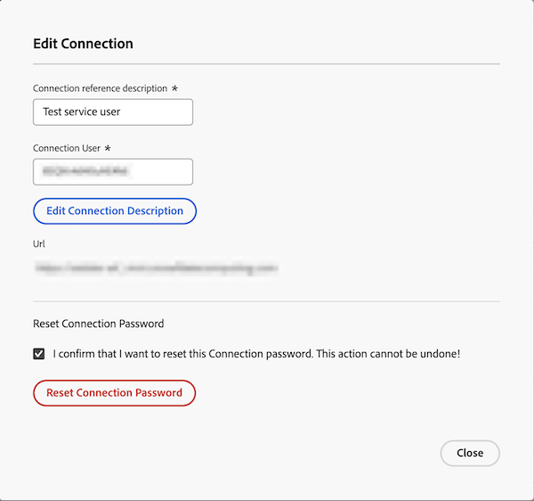

# L’outil Power BI ne peut pas se connecter avec le mot de passe fourni

## Problème

Lorsque vous tentez de vous connecter à Data Connect à partir de votre outil Power BI, le message d’erreur suivant s’affiche :

`Cannot connect from BI tool with provided password`

## Cause

Lors de la création de la connexion JDBC, Workfront fournit un mot de passe temporaire pour Data Connect.

Avant d’accéder à Data Connect via Power BI, vous devez d’abord vous connecter à l’aide des détails de connexion fournis, mettre à jour le mot de passe temporaire, puis procéder à votre connexion.

## Solution

Réinitialisez le mot de passe de connexion dans Workfront, puis créez un nouveau mot de passe avec le lien fourni dans la boîte de dialogue Modifier la connexion .

### Réinitialiser le mot de passe de connexion dans Workfront

1. Accédez à Workfront > Configuration > Système > Data Connect.
1. Recherchez et ouvrez la connexion à partir de la liste.
1. Sous **Réinitialiser le mot de passe de connexion**, cochez la case pour confirmer que vous souhaitez réinitialiser le mot de passe.
1. Cliquez sur **Réinitialiser le mot de passe de connexion**.
   
1. Passez à la section ci-dessous.

### Créer un nouveau mot de passe pour la connexion

1. Copiez l’URL et collez-la dans un nouvel onglet du navigateur.
1. Dans Workfront, copiez et collez le Nom d’utilisateur de la connexion et le Mot de passe par défaut dans le nouvel onglet du navigateur.
   
1. Cliquez sur **Se connecter**.
1. Saisissez un nouveau mot de passe, puis cliquez sur **Envoyer**.
1. Accédez à l’outil Power BI et connectez-vous avec le nouveau mot de passe.

