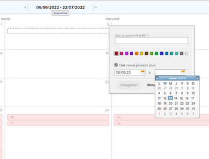

# Ajouter des événements ad hoc à un rapport de calendrier

Vous pouvez ajouter des événements ad hoc à un calendrier. Un événement ad hoc sert simplement de rappel dans votre calendrier et n’est pas associé à un projet, une tâche ou un problème.

## Conditions d’accès

Vous devez disposer des accès suivants pour effectuer les étapes de cet article :

<table style="table-layout:auto"> 
 <col> 
 </col> 
 <col> 
 </col> 
 <tbody> 
  <tr> 
   <td role="rowheader"><strong>[!DNL Adobe Workfront plan*]</strong></td> 
   <td> 
N’importe quelle
 </td> 
  </tr> 
  <tr> 
   <td role="rowheader"><strong>[!DNL Adobe Workfront] licence*</strong></td> 
   <td> 
[!UICONTROL Plan] 
 </td> 
  </tr> 
  <tr> 
   <td role="rowheader"><strong>Configurations des niveau d’accès*</strong></td> 
   <td> 
Accès à [!UICONTROL Modifier] aux [!UICONTROL Rapports], aux [!UICONTROL Tableaux de bord] et aux [!UICONTROL Calendriers]
 
Remarque : Si vous n’avez toujours pas accès à , demandez à votre administrateur [!DNL Workfront] s’il définit des restrictions supplémentaires à votre niveau d’accès. Pour plus d’informations sur la manière dont un administrateur ou une administratrice [!DNL Workfront] peut modifier votre niveau d’accès, voir <a href="../../../administration-and-setup/add-users/configure-and-grant-access/create-modify-access-levels.md" class="MCXref xref">Créer ou modifier des niveaux d’accès personnalisés</a>.
 </td> 
  </tr> 
  <tr> 
   <td role="rowheader"><strong>Autorisations d’objet</strong></td> 
   <td> 
[!UICONTROL Gérer] l’accès au rapport Calendrier
 
Pour plus d’informations sur la demande d’accès supplémentaire, voir <a href="../../../workfront-basics/grant-and-request-access-to-objects/request-access.md" class="MCXref xref">Demander l’accès aux objets</a>.
 </td> 
  </tr> 
 </tbody> 
</table>

&#42;Pour connaître le plan, le type de licence ou l’accès dont vous disposez, contactez votre administrateur ou administratrice [!DNL Workfront].

## Ajouter des événements ad hoc à un rapport de calendrier

1. Dans le calendrier, accédez à la date à laquelle vous souhaitez ajouter un événement ad hoc, puis cliquez sur la date [!UICONTROL de début] de votre événement.
1. Saisissez le nom de l’événement et, si vous le souhaitez, sélectionnez une couleur pour l’événement.
1. (Conditionnel) Si votre événement ad hoc s’étend sur plusieurs jours, sélectionnez **[!UICONTROL Il s’étend sur plusieurs jours]**, puis sélectionnez la date de fin dans le calendrier contextuel.

   

1. Cliquer sur **[!UICONTROL Enregistrer]**.
1. (Facultatif) Pour modifier un événement ad hoc :

   1. Cliquez sur l’événement dans le calendrier pour ouvrir la page de détails de l’événement.
   1. Cliquez sur l’icône de modification (crayon), modifiez l’événement, puis cliquez sur **[!UICONTROL Enregistrer]**.

1. (Facultatif) Pour supprimer un événement ad hoc :

   1. Cliquez sur l’événement dans le calendrier pour ouvrir la page de détails de l’événement.
   1. Cliquez sur l&#39;icône de corbeille, puis sur **[!UICONTROL Oui, Supprimer]**.
