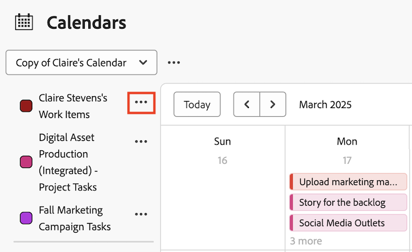

# Modifier un rapport de calendrier existant

Les informations mises en surbrillance sur cette page font référence à des fonctionnalités qui ne sont pas encore disponibles de manière générale. Cette option n’est disponible que dans l’environnement de prévisualisation de sandbox.

Vous pouvez modifier un calendrier existant en ajoutant ou en supprimant un lien vers un projet. Vous pouvez également modifier les regroupements de calendrier associés à un rapport de calendrier.

>[!NOTE]
>
>Les regroupements sont limités à 15 dans un rapport de calendrier.

## Conditions d’accès

+++ Développez pour afficher les exigences d’accès aux fonctionnalités de cet article.

Vous devez disposer des accès suivants pour effectuer les étapes de cet article :

<table style="table-layout:auto"> 
 <col> 
 </col> 
 <col> 
 </col> 
 <tbody> 
  <tr> 
   <td role="rowheader">[!DNL Adobe Workfront plan]</td> 
   <td> 
Tous
 </td> 
  </tr> 
  <tr> 
   <td role="rowheader">[!DNL Adobe Workfront] licence</td> 
   <td>
Nouveau : Standard

       
ou

       
Actuel : formule
</td> 
  </tr> 
  <tr> 
   <td role="rowheader">Configurations des niveaux d’accès</td> 
   <td> 
Accès [!UICONTROL Edit] aux [!UICONTROL Reports], [!UICONTROL Dashboards] et [!UICONTROL Calendars]
</td> 
  </tr> 
  <tr> 
   <td role="rowheader">Autorisations d’objet</td> 
   <td>[!UICONTROL Manage] l’accès au rapport de calendrier</td> 
  </tr> 
 </tbody> 
</table>

Pour plus de détails sur les informations contenues dans ce tableau, consultez [Conditions d’accès préalables dans la documentation Workfront](/help/quicksilver/administration-and-setup/add-users/access-levels-and-object-permissions/access-level-requirements-in-documentation.md).

+++

## Modifier un rapport de calendrier existant dans l’environnement de production

{{step1-to-calendars}}

1. (Facultatif) Pour modifier le nom du rapport de calendrier, cliquez sur le champ [!UICONTROL nom du calendrier], puis apportez les modifications souhaitées. Nous vous recommandons d’utiliser uniquement des caractères UTF-8 pour éviter des problèmes de compatibilité.

   

   Si vous avez partagé le rapport du calendrier avec d’autres utilisateurs ou utilisatrices ou d’autres équipes, le nom du calendrier modifié est automatiquement mis à jour dans la vue Calendrier.

1. (Facultatif) Pour ajouter un projet au rapport de calendrier :

   1. Cliquez sur **[!UICONTROL Ajouter au calendrier].**
   1. Dans le champ **[!UICONTROL Nom du projet]**, commencez à saisir le nom d’un projet à partir duquel vous souhaitez ajouter des événements de calendrier, puis cliquez sur le nom lorsqu’il s’affiche dans la liste déroulante.

      
Les éléments du projet, ainsi que les tâches et problèmes associés, sont ajoutés au rapport de calendrier.

1. (Facultatif) Pour ajouter un regroupement de calendriers ou modifier un regroupement de calendriers existant :

   1. Pointez sur le nom du projet, cliquez sur la flèche déroulante en regard du nom du projet, puis cliquez sur **[!UICONTROL Modifier]**.

      

   1. Choisissez le mode de regroupement de vos éléments :

      * [Utiliser des [!UICONTROL dates planifiées] dans un rapport de calendrier](../../../reports-and-dashboards/reports/calendars/use-planned-dates.md)
      * [Utiliser les [!UICONTROL dates prévisionnelles] dans un rapport de calendrier](../../../reports-and-dashboards/reports/calendars/use-projected-dates.md)
      * [Utiliser les champs de date personnalisés dans un rapport de calendrier](../../../reports-and-dashboards/reports/calendars/use-custom-dates.md)

## Modifier un rapport de calendrier existant dans la Prévisualisation

{{step1-to-calendars}}

1. (Facultatif) Pour modifier le nom du rapport de calendrier, cliquez sur le menu **Plus** et sélectionnez **Modifier**.
   
Si vous avez partagé le rapport de calendrier avec d’autres utilisateurs ou équipes, le nom de calendrier modifié est automatiquement mis à jour dans leur vue de calendrier.

1. (Facultatif) Pour ajouter un projet au rapport de calendrier :
   1. Cliquez sur **[!UICONTROL Ajouter au calendrier].**
   1. Commencez à saisir le nom d’un projet à partir duquel vous souhaitez ajouter des événements de calendrier, puis cliquez sur le nom lorsqu’il s’affiche dans la liste déroulante.
   1. Cliquez sur **Ajouter**.
      

1. (Facultatif) Pour ajouter un regroupement de calendriers ou modifier un regroupement de calendriers existant :
   1. Cliquez sur le menu **Plus** en regard du nom du projet, puis cliquez sur **Modifier**.
      e

   1. Choisissez le mode de regroupement de vos éléments :

      * [Utiliser des [!UICONTROL dates planifiées] dans un rapport de calendrier](../../../reports-and-dashboards/reports/calendars/use-planned-dates.md)
      * [Utiliser les [!UICONTROL dates prévisionnelles] dans un rapport de calendrier](../../../reports-and-dashboards/reports/calendars/use-projected-dates.md)
      * [Utiliser les champs de date personnalisés dans un rapport de calendrier](../../../reports-and-dashboards/reports/calendars/use-custom-dates.md)

      
