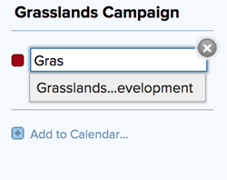
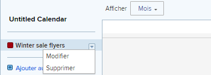

# Modifier un rapport de calendrier existant

Vous pouvez modifier un calendrier existant en ajoutant ou en supprimant un lien vers un projet. Vous pouvez également modifier les regroupements de calendrier associés à un rapport de calendrier.

>[!NOTE]
>
>Les regroupements sont limités à 15 dans un rapport de calendrier.

## Conditions d’accès

Vous devez disposer des accès suivants pour effectuer les étapes décrites dans cet article :

<table style="table-layout:auto"> 
 <col> 
 </col> 
 <col> 
 </col> 
 <tbody> 
  <tr> 
   <td role="rowheader"><strong>[!DNL Adobe Workfront plan*]</strong></td> 
   <td> 
Tous
 </td> 
  </tr> 
  <tr> 
   <td role="rowheader"><strong>[!DNL Adobe Workfront] licence*</strong></td> 
   <td> 
[!UICONTROL Plan] 
 </td> 
  </tr> 
  <tr> 
   <td role="rowheader"><strong>Configurations du niveau d’accès*</strong></td> 
   <td> 
[!UICONTROL Edit] l’accès aux [!UICONTROL Reports], aux [!UICONTROL Dashboards] et aux [!UICONTROL Calendars]
 
Remarque : si vous n’avez toujours pas accès, demandez à votre administrateur ou à votre administratrice [!DNL Workfront] si des restrictions supplémentaires ont été définies pour votre niveau d’accès. Pour plus d’informations sur la manière dont l’administration [!DNL Workfront] peut modifier votre niveau d’accès, consultez la section <a href="../../../administration-and-setup/add-users/configure-and-grant-access/create-modify-access-levels.md" class="MCXref xref">Créer ou modifier les niveaux d’accès personnalisés</a>.
 </td> 
  </tr> 
  <tr> 
   <td role="rowheader"><strong>Autorisations d’objet</strong></td> 
   <td> 
[!UICONTROL Manage] l’accès au rapport de calendrier
 
Pour plus d’informations sur la demande d’accès supplémentaire, voir <a href="../../../workfront-basics/grant-and-request-access-to-objects/request-access.md" class="MCXref xref">Demander l’accès aux objets </a>.
 </td> 
  </tr> 
 </tbody> 
</table>

&#42;Pour connaître le forfait, le type de licence ou l’accès dont vous disposez, contactez votre administrateur ou votre administratrice [!DNL Workfront].

## Modifier un rapport de calendrier existant

1. Cliquez sur l’icône **[!UICONTROL Menu principal]** dans le coin supérieur droit d’[!DNL Adobe Workfront], puis sur **[!UICONTROL Calendriers]**.

1. (Facultatif) Pour modifier le nom du rapport du calendrier, cliquez sur le champ [!UICONTROL nom du calendrier], puis apportez les modifications souhaitées.\
   \
   Si vous avez partagé le rapport du calendrier avec d’autres utilisateurs ou utilisatrices ou d’autres équipes, le nom du calendrier modifié est automatiquement mis à jour dans la vue Calendrier.

1. (Facultatif) Pour ajouter un projet au rapport de calendrier :

   1. Cliquez sur **[!UICONTROL Ajouter au calendrier].**
   1. Dans le champ **[!UICONTROL Nom du projet]**, commencez à saisir le nom d’un projet à partir duquel vous souhaitez ajouter des événements de calendrier, puis cliquez sur le nom qui s’affiche dans la liste déroulante.\

      
Les éléments du projet, ainsi que les tâches et problèmes associés, sont ajoutés au rapport de calendrier.

1. (Facultatif) Pour ajouter un regroupement de calendriers ou modifier un regroupement de calendriers existant :

   1. Passez la souris sur le nom du projet, cliquez sur la flèche de liste déroulante à côté de son nom, puis sur **[!UICONTROL Modifier]**.\

      

   1. Choisissez le mode de regroupement de vos éléments :

      * [Utiliser des [!UICONTROL dates planifiées] dans un rapport de calendrier](../../../reports-and-dashboards/reports/calendars/use-planned-dates.md)
      * [Utiliser les [!UICONTROL dates prévisionnelles] dans un rapport de calendrier](../../../reports-and-dashboards/reports/calendars/use-projected-dates.md)
      * [Utiliser les champs de date personnalisés dans un rapport de calendrier](../../../reports-and-dashboards/reports/calendars/use-custom-dates.md)
