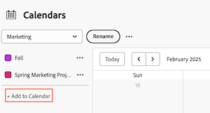
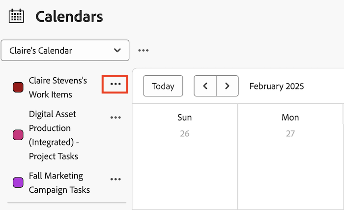

# Modifier un rapport de calendrier existant

Vous pouvez modifier un calendrier existant en ajoutant ou en supprimant un lien vers un projet. Vous pouvez également modifier les regroupements de calendrier associés à un rapport de calendrier.

>[!NOTE]
>
>Les regroupements sont limités à 15 dans un rapport de calendrier.

## Conditions d’accès

+++ Développez pour afficher les exigences d’accès aux fonctionnalités de cet article.

<table style="table-layout:auto"> 
 <col> 
 </col> 
 <col> 
 </col> 
 <tbody> 
  <tr> 
   <td role="rowheader">Package Adobe Workfront</td> 
   <td> 
Tous
 </td> 
  </tr> 
  <tr> 
   <td role="rowheader">Licence Adobe Workfront</td> 
   <td>
Standard

       
Plan
</td> 
  </tr> 
  <tr> 
   <td role="rowheader">Configurations des niveaux d’accès</td> 
   <td> 
 Modifier l’accès aux rapports, tableaux de bord et calendriers
</td> 
  </tr> 
  <tr> 
   <td role="rowheader">Autorisations d’objet</td> 
   <td>Gérer l’accès au rapport de calendrier</td> 
  </tr> 
 </tbody> 
</table>

Pour plus de détails sur les informations contenues dans ce tableau, consultez [Conditions d’accès préalables dans la documentation Workfront](/help/quicksilver/administration-and-setup/add-users/access-levels-and-object-permissions/access-level-requirements-in-documentation.md).

+++

## Modifier un rapport de calendrier existant

{{step1-to-calendars}}

1. (Facultatif) Pour modifier le nom du rapport de calendrier, cliquez sur le **Renommer** en regard du menu déroulant Calendrier.
Si vous avez partagé le rapport de calendrier avec d’autres utilisateurs ou équipes, le nom de calendrier modifié est automatiquement mis à jour dans leur vue de calendrier.

1. (Facultatif) Pour ajouter un projet au rapport de calendrier :
   1. Cliquez sur **[!UICONTROL Ajouter au calendrier].**
   1. Commencez à saisir le nom d’un projet à partir duquel vous souhaitez ajouter des événements de calendrier, puis cliquez sur le nom lorsqu’il s’affiche dans la liste déroulante.
   1. Cliquez sur **Ajouter**.
      

1. (Facultatif) Pour ajouter un regroupement de calendriers ou modifier un regroupement de calendriers existant :
   1. Cliquez sur le menu **Plus** en regard du nom du projet, puis cliquez sur **Modifier**.
      

   1. Choisissez le mode de regroupement de vos éléments :

      * [Utiliser des [!UICONTROL dates planifiées] dans un rapport de calendrier](../../../reports-and-dashboards/reports/calendars/use-planned-dates.md)
      * [Utiliser les [!UICONTROL dates prévisionnelles] dans un rapport de calendrier](../../../reports-and-dashboards/reports/calendars/use-projected-dates.md)
      * [Utiliser les champs de date personnalisés dans un rapport de calendrier](../../../reports-and-dashboards/reports/calendars/use-custom-dates.md)

