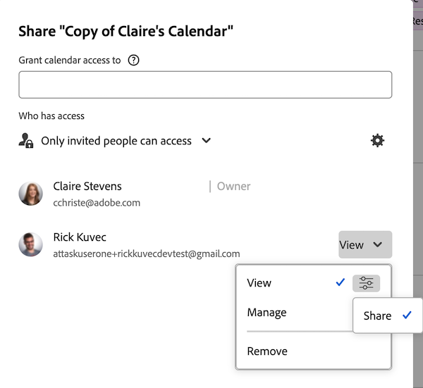

# Partager un rapport de calendrier

Vous pouvez partager un calendrier avec d’autres utilisateurs et utilisatrices et le rendre public, ce qui permet à une personne sans licence [!DNL Adobe Workfront] de l’afficher.

## Conditions d’accès

+++ Développez pour afficher les exigences d’accès aux fonctionnalités de cet article.

<table style="table-layout:auto"> 
 <col> 
 </col> 
 <col> 
 </col> 
 <tbody> 
  <tr> 
   <td role="rowheader">Package Adobe Workfront</td> 
   <td> 
Tous
 </td> 
  </tr> 
  <tr> 
   <td role="rowheader">Licence Adobe Workfront</td> 
   <td>
Léger

       
Vérifier
</td> 
  </tr> 
  <tr> 
   <td role="rowheader">Configurations des niveaux d’accès</td> 
   <td> 
 Accès supérieur ou égal à Rapports, Tableaux de bord et Calendriers
</td> 
  </tr> 
  <tr> 
   <td role="rowheader">Autorisations d’objet</td> 
   <td>Autorisations d’affichage ou supérieures pour le rapport de calendrier, avec accès au partage</td> 
  </tr> 
 </tbody> 
</table>

Pour plus de détails sur les informations contenues dans ce tableau, consultez [Conditions d’accès préalables dans la documentation Workfront](/help/quicksilver/administration-and-setup/add-users/access-levels-and-object-permissions/access-level-requirements-in-documentation.md).

+++

## Partager un calendrier avec des utilisateurs ou utilisatrices [!DNL Workfront] {#share-a-calendar-with-workfront-users}

Le partage d’un calendrier est similaire au partage d’autres objets. Pour plus d’informations sur le partage d’objets dans [!DNL Adobe Workfront], voir [Vue d’ensemble des autorisations de partage sur les objets](../../../workfront-basics/grant-and-request-access-to-objects/sharing-permissions-on-objects-overview.md).

Les calendriers qui ont été partagés avec vous s’affichent avec un astérisque (&#42;) en regard de leur nom.

Pour partager un calendrier dans [!DNL Workfront] :

1. Accédez au calendrier que vous souhaitez partager.
1. Cliquez sur le menu **Plus** en regard du nom du calendrier, puis cliquez sur **Partage**.
   
1. Dans le champ **[!UICONTROL Accorder l’accès au calendrier à]**, commencez à saisir le nom de l’utilisateur ou de l’utilisatrice, de l’équipe, du rôle, du groupe ou de la société dont vous souhaitez partager le calendrier, puis cliquez sur le nom qui s’affiche dans la liste déroulante.\
   Pour en savoir plus sur la définition des autorisations, voir la section [Vue d’ensemble des autorisations de partage sur les objets](../../../workfront-basics/grant-and-request-access-to-objects/sharing-permissions-on-objects-overview.md).

1. (Facultatif) Répétez l’étape 3 pour chaque utilisateur ou utilisatrice, équipe, rôle ou groupe à qui vous souhaitez accorder l’accès au calendrier.
1. Spécifiez les autorisations pour chaque utilisateur ou utilisatrice, équipe, rôle, groupe ou société que vous avez ajouté à l’étape 3 en cliquant sur le menu déroulant, puis sélectionnez le niveau d’autorisation à accorder :

   * **[!UICONTROL Affichage] :** la personne peut consulter et partager le calendrier.

     

   * **[!UICONTROL Gestion] :** les utilisateurs et utilisatrices disposent d’un accès complet au calendrier, moins les droits d’administration, qui sont accordés au niveau de l’accès, plus toutes les autorisations d’affichage.

     

     >[!NOTE]
     >
     >L’administrateur ou l’administratrice [!DNL Workfront] et le créateur ou la créatrice du calendrier peuvent supprimer des autorisations de ces entités.

1. (Facultatif) Selon le rôle de l’utilisateur, vous pouvez cliquer sur **[!UICONTROL Options avancées]**, puis sur **[!UICONTROL Partager]**&#x200B; pour permettre à l’utilisateur de partager le calendrier avec d’autres utilisateurs.

   Pour plus d’informations sur les niveaux d’autorisation, voir la section [Vue d’ensemble des autorisations de partage sur les objets](../../../workfront-basics/grant-and-request-access-to-objects/sharing-permissions-on-objects-overview.md).

1. (Facultatif) Pour mettre le calendrier à la disposition de tous les utilisateurs et utilisatrices de [!DNL Workfront], cliquez sur l’icône d’engrenage, puis, dans le menu déroulant, cliquez sur **[!UICONTROL Rendre visible à l’échelle du système]** pour mettre l’objet à la disposition de tous les utilisateurs et utilisatrices de [!DNL Workfront].\
   Tous les utilisateurs et utilisatrices peuvent voir l’objet en fonction des autorisations que vous avez définies.

1. Cliquer sur **[!UICONTROL Enregistrer]**.

## Partager un calendrier avec un lien public

Vous pouvez rendre un calendrier public et partager un lien avec des personnes qui n’ont pas de licence [!DNL Workfront].

1. Accédez au calendrier que vous souhaitez partager.
1. Cliquez sur **[!UICONTROL Actions du calendrier]**, puis sur **[!UICONTROL Partager]**.
1. Cliquez sur le menu **Plus** en regard du nom du calendrier.
   
Cliquez sur **Copier le lien public**.
1. Cliquer sur **[!UICONTROL Enregistrer]**.

## Partager un calendrier avec un lien privé

Vous pouvez partager un lien de calendrier privé avec les utilisateurs et utilisatrices de [!DNL Workfront]. Les utilisateurs et utilisatrices doivent se connecter pour afficher le calendrier lorsqu’ils utilisent le lien.

1. Accédez au calendrier que vous souhaitez partager.
1. Cliquez sur le menu **Plus** en regard du nom du calendrier, puis cliquez sur **[!UICONTROL Obtenir un lien partageable]**.
   

   >[!NOTE]
   >
   >Les utilisateurs et utilisatrices de [!DNL Workfront] doivent avoir accès au calendrier pour pouvoir y accéder à l’aide du lien. Pour accorder l’accès, voir la section [Partager un calendrier avec les utilisateurs et utilisatrices de  [!DNL Workfront] &#x200B;](#share-a-calendar-with-workfront-users).\
   >Si les utilisateurs et utilisatrices ne disposent d’aucun accès, ils peuvent le demander après avoir collé le lien dans leur navigateur.
