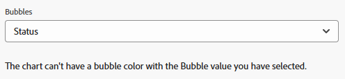

# Ajouter un graphique à un rapport

<!--Audited: 11/2024-->

Vous pouvez améliorer vos rapports en ajoutant un graphique. Vous pouvez ajouter des graphiques aux rapports existants ou aux rapports que vous créez.

Avant d’ajouter un graphique à un rapport, vous devez créer un « Affichage » et un « Regroupement » pour le rapport.

Vous ne pouvez pas ajouter de graphiques à la plupart des rapports, sauf si vous commencez par regrouper les informations dans le rapport. Le seul graphique qui peut être ajouté sans regroupement est un graphique de jauge.

Pour plus d’informations sur les vues, consultez la section [Vue d’ensemble des vues dans Adobe Workfront](../../../reports-and-dashboards/reports/reporting-elements/views-overview.md).

Pour plus d’informations sur les regroupements, consultez la section [Vue d’ensemble des regroupements dans Adobe Workfront](../../../reports-and-dashboards/reports/reporting-elements/groupings-overview.md).

Si votre rapport affiche trop d’éléments, aucun graphique n’est créé. Dans ce cas, ajoutez un filtre au rapport pour réduire le nombre de résultats dans votre rapport.

Pour plus d’informations sur les filtres, consultez la section [Vue d’ensemble des filtres](../../../reports-and-dashboards/reports/reporting-elements/filters-overview.md).

## Conditions d’accès

+++ Développez pour afficher les exigences d’accès aux fonctionnalités de cet article.

Vous devez disposer des accès suivants pour effectuer les étapes décrites dans cet article :

<table style="table-layout:auto"> 
 <col> 
 <col> 
 <tbody> 
  <tr> 
   <td role="rowheader">Formule Adobe Workfront</td> 
   <td> 
Tous
 </td> 
  </tr> 
  <tr> 
   <td role="rowheader">Licence Adobe Workfront*</td> 
   <td> 
      
Nouveau :

         <ul>
         <li>
Standard
</li>
         </ul>
      
Actuel :

         <ul>
         <li>
Plan
</li>
         </ul>
   </td>
  </tr> 
  <tr> 
   <td role="rowheader">Configuration du niveau d’accès</td> 
   <td> 
Accès en modification aux rapports, tableaux de bord et calendriers
 
Modifier l’accès aux filtres, vues et groupes
 </td> 
  </tr> 
  <tr> 
   <td role="rowheader">Autorisations d’objet</td> 
   <td> 
Gérer les autorisations d’un rapport
  </td> 
  </tr> 
 </tbody> 
</table>

*Pour plus d’informations, voir [Conditions d’accès dans la documentation de Workfront](/help/quicksilver/administration-and-setup/add-users/access-levels-and-object-permissions/access-level-requirements-in-documentation.md).

+++

## Ajouter un graphique à un rapport

1. Accédez à un rapport existant ou créez-en un nouveau. Pour plus d’informations sur la création d’un rapport, consultez la section [Créer un rapport personnalisé](../../../reports-and-dashboards/reports/creating-and-managing-reports/create-custom-report.md).

1. (Le cas échéant) Si vous avez déjà eu accès à un rapport existant, cliquez sur **Actions de rapport** > **Modifier**.

1. Vérifiez que l’onglet **Colonnes (Affichage)** a été mis à jour pour afficher les informations que vous voulez voir sous forme de graphique dans le rapport.

   Pour plus d’informations sur la création ou la modification de l’affichage d’un rapport, consultez la section [Créer ou modifier les affichages dans Adobe Workfront](/help/quicksilver/reports-and-dashboards/reports/reporting-elements/create-edit-views.md).

1. Cliquez sur l’onglet **Regroupements** et ajoutez un regroupement.

   >[!TIP]
   >
   >* Pour ajouter un graphique à un rapport, les résultats doivent être regroupés.
   >* Les regroupements en mode texte ne sont pas pris en charge dans les graphiques. Pour plus d’informations sur les regroupements en mode texte, voir [Modifier un regroupement à l’aide du mode texte](../../../reports-and-dashboards/reports/text-mode/edit-text-mode-in-grouping.md).
   >* Lorsque vous créez un unique regroupement pour une mesure, tous les graphiques, à l’exception du graphique en secteurs, utiliseront la même couleur pour afficher chaque résultat du regroupement.

   Pour plus d’informations sur la création de regroupements, consultez la section [Créer des regroupements dans Adobe Workfront](/help/quicksilver/reports-and-dashboards/reports/reporting-elements/create-groupings.md).

1. Sélectionnez l’onglet **Graphique**.

1. Cliquez sur un type de graphique pour le sélectionner.\
   

1. Sélectionnez-en un parmi les types suivants :

   * [Graphique en colonnes](#column-chart)
   * [Graphique à barres](#bar-chart)
   * [Graphique en secteurs](#pie-chart)
   * [Graphique en courbes](#line-chart)
   * [Graphique à jauge](#gauge-chart)
   * [Graphique à bulle](#bubble-chart)

1. Cliquez sur **Enregistrer et fermer** pour enregistrer le graphique et le rapport.

### Graphique en colonnes {#column-chart}

Pour ajouter un graphique en **colonnes** à votre rapport, procédez comme suit :

1. Ajoutez un graphique à votre rapport, comme décrit dans la section [Ajouter un graphique à un rapport](#add-a-chart-to-a-report).

1. Dans le champ **Axe de gauche (Y)**, sélectionnez les valeurs à inclure sur l&#39;axe Y du graphique, puis sélectionnez la manière dont vous souhaitez que les informations soient résumées dans le champ **Résumer par**.

1. (Facultatif) Cliquez sur **Couleurs personnalisées** pour attribuer les couleurs préférées à chacune des colonnes.\
   Pour plus d’informations sur la personnalisation des couleurs des graphiques, voir [Personnaliser les couleurs des graphiques](#customize-chart-colors).

1. Dans le champ **Axe inférieur (X)**, sélectionnez le regroupement que vous souhaitez inclure dans le graphique.

1. (Facultatif) Cliquez sur **Afficher en 3D** pour afficher le graphique dans une vue 3D.

1. (Facultatif) **Colonnes de groupe** : sélectionnez cette option pour définir le mode de regroupement des colonnes.\
   Sélectionnez l’une des options suivantes :

   * Cliquez sur l’une des options suivantes pour sélectionner l’affichage des colonnes regroupées :

      * **Côte à côte**
      * **Empilé**
      * **Empilé jusqu’à 100 %**

   * Sélectionnez le regroupement que vous souhaitez inclure dans le graphique depuis le menu déroulant **Grouper les données par**.
   * (Facultatif) Cliquez sur **Couleurs personnalisées** pour personnaliser les couleurs des colonnes.\
     Pour plus d’informations sur la personnalisation des couleurs des graphiques, voir [Personnaliser les couleurs des graphiques](#customize-chart-colors).

1. (Facultatif) Cliquez sur **Graphique combiné** pour inclure une valeur supplémentaire dans le graphique, ainsi que la manière dont vous souhaitez que les informations soient résumées.\
   Tenez compte des options suivantes :

   * **Tracer sur l’axe secondaire** : sélectionnez cette option pour tracer les données sur le côté droit du graphique.
   * **Type de graphique** : choisissez si vous souhaitez que cette valeur supplémentaire s’affiche sous forme d’une ligne ou d’une troisième colonne.

1. Cliquez sur **Enregistrer et fermer** pour enregistrer le graphique et le rapport.

### Graphique à barres {#bar-chart}

Pour ajouter un graphique à **barres** à votre rapport, procédez comme suit :

1. Commencez à ajouter un graphique à votre rapport, comme décrit dans [Ajouter un graphique à un rapport](#add-a-chart-to-a-report).

1. Dans le champ **Bas de l&#39;axe (X)**, sélectionnez les valeurs à inclure sur l&#39;axe X du graphique, puis choisissez la manière dont vous souhaitez que les informations soient résumées dans le champ **Résumé par**.

1. (Facultatif) Cliquez sur **Couleurs personnalisées** pour personnaliser les couleurs des barres.\
   Pour plus d’informations sur la personnalisation des couleurs des graphiques, voir [Personnaliser les couleurs des graphiques](#customize-chart-colors).

1. Dans le champ **Axe gauche (Y)**, sélectionnez le regroupement que vous souhaitez inclure dans le graphique.

1. (Facultatif) Cliquez sur **Afficher en 3D** pour afficher le graphique dans une vue 3D.

1. (Facultatif) Cliquez sur **Regrouper les barres** pour définir la manière dont vous souhaitez regrouper les barres.\
   Sélectionnez l’une des options suivantes :

   * Cliquez sur l’une des options suivantes pour sélectionner l’affichage des barres regroupées :

      * **Côte à côte**
      * **Empilé**
      * **Empilés jusqu’à 100 %**

   * Sélectionnez le mode de regroupement des informations dans le graphique depuis le menu déroulant **Grouper les données par**.
   * (Facultatif) Cliquez sur **Couleurs personnalisées** pour personnaliser les couleurs de vos colonnes.\
     Pour plus d’informations sur la personnalisation des couleurs des graphiques, voir [Personnaliser les couleurs des graphiques](#customize-chart-colors).

1. (Facultatif) Cliquez sur **Graphique combiné** pour inclure une valeur supplémentaire dans le graphique, ainsi que la manière dont vous souhaitez que les informations soient résumées.

1. Cliquez sur **Enregistrer et fermer** pour enregistrer le graphique et le rapport.

>[!IMPORTANT]
>
>Les diagrammes à barres ne doivent pas comporter plus de 23 barres, sinon les libellés des barres ne s’afficheront pas correctement.

### Graphique en secteurs {#pie-chart}

Pour ajouter un graphique en **secteurs** à votre rapport, procédez comme suit :

1. Commencez à ajouter un graphique à votre rapport, comme décrit dans la section [Ajouter un graphique à un rapport](#add-a-chart-to-a-report).

1. Dans le champ **Valeurs**, sélectionnez les valeurs à afficher dans le rapport, puis sélectionnez la manière dont vous souhaitez que les informations soient résumées dans le champ **Résumé par**.\
   Dans le champ **Tranches**, sélectionnez le regroupement que vous souhaitez inclure dans le graphique. Le regroupement est représenté par les tranches du graphique.

1. (Facultatif) Cliquez sur **Couleurs personnalisées** pour personnaliser les couleurs des coins du graphique.\
   Pour plus d’informations sur la personnalisation des couleurs des graphiques, voir [Personnaliser les couleurs des graphiques](#customize-chart-colors).

1. (Facultatif) Cliquez sur **Afficher en 3D** pour afficher le graphique dans une vue 3D.

1. Dans le champ **Afficher les résultats en tant que**, sélectionnez le mode d’affichage des résultats dans le graphique. Tenez compte des options suivantes :

   * **Pourcentage** : les résultats des graphiques sont affichés sous forme de pourcentage.
   * **Nombres** : les résultats des graphiques sont affichés sous forme d’un nombre.

1. Cliquez sur **Enregistrer et fermer** pour enregistrer le graphique et le rapport.

### Graphique en courbes {#line-chart}

Pour ajouter un graphique en **courbes** à votre rapport, procédez comme suit :

1. Commencez à ajouter un graphique à votre rapport, comme décrit dans [Ajouter un graphique à un rapport](#add-a-chart-to-a-report).

1. Dans le champ **Axe de gauche (Y)**, sélectionnez les valeurs à inclure sur l&#39;axe Y du graphique, puis sélectionnez la manière dont vous souhaitez que les informations soient résumées dans le champ **Résumer par**.

1. Dans le champ **Axe inférieur (X)**, sélectionnez le regroupement que vous souhaitez inclure dans le graphique.

1. (Facultatif) Cliquez sur **Regrouper les lignes** pour sélectionner un regroupement supplémentaire pour le graphique.\
   (Facultatif) Cliquez sur **Couleurs personnalisées** pour personnaliser les couleurs de votre nouveau regroupement.\
   Pour plus d’informations sur la personnalisation des couleurs des graphiques, voir [Personnaliser les couleurs des graphiques](#customize-chart-colors).

1. (Facultatif) Cliquez sur **Graphique combiné** pour combiner vos lignes par une valeur supplémentaire.\
   Tenez compte des options suivantes :

   * Sélectionnez la valeur que vous souhaitez inclure dans le graphique, ainsi que la manière dont vous souhaitez que les informations soient résumées.
   * Cliquez sur le champ **Tracer sur l&#39;axe Secondaire** pour tracer les données dans la partie droite du graphique.

1. Cliquez sur **Enregistrer et fermer** pour enregistrer le graphique et le rapport.

### Graphique à jauge {#gauge-chart}

Un graphique de type **Jauge** affiche le nombre d’enregistrements qui répondent à un certain critère sous forme de jauge. L’indicateur de la jauge pointe vers le nombre d’enregistrements répondant aux critères sélectionnés dans l’affichage et le regroupement du rapport. Un regroupement de rapports n’est pas nécessaire pour configurer un graphique à jauge.

Pour ajouter un graphique de type **Jauge** à votre rapport :

1. Commencez par ajouter un graphique à votre rapport comme décrit dans la section [Ajouter un graphique à un rapport](#add-a-chart-to-a-report).

1. Dans le champ **Valeurs**, sélectionnez les valeurs à afficher dans le rapport, puis sélectionnez la manière dont vous souhaitez que les informations soient résumées dans le champ **Résumé par**. Si vous sélectionnez **Nombre d’enregistrements**, les valeurs affichées sont l’objet du rapport.

1. Dans le champ **Indicateurs**, sélectionnez le regroupement que vous souhaitez inclure dans le graphique. Le regroupement est représenté par la ligne d’indicateur sur le graphique.\
   Si un regroupement contient deux éléments, deux indicateurs sont affichés sur le graphique.\
   Par exemple, si vous disposez d’un regroupement du statut du projet et qu’il existe deux statuts du projet (Actuel et Suspendu), votre graphique à jauge contiendra deux indicateurs de jauge. Ils indiquent le nombre de projets qui se trouvent dans ce statut.\
   (Facultatif) Sélectionnez **Total** dans le champ **Indicateurs** pour afficher le total des objets sélectionnés dans le champ **Valeurs**.

1. (Facultatif) Cliquez sur **Ajouter une autre plage de valeurs** pour ajouter une plage de valeurs au graphique.

1. (Facultatif) Dans le champ **Plage de valeurs**, spécifiez la plage de valeurs et la couleur à utiliser pour représenter ces valeurs dans le graphique Jauge.

1. Cliquez sur **Enregistrer et fermer** pour enregistrer le graphique et le rapport.

### Graphique à bulle {#bubble-chart}

Vous pouvez afficher jusqu’à trois champs d’un objet dans un graphique à **bulle**. Cela signifie que vous pouvez afficher jusqu’à quatre points de données dans un graphique à bulle. Chaque entité ayant trois champs associés s’affiche sous la forme d’un cercle qui exprime deux des champs de son emplacement dans les axes X et Y. Le troisième champ est représenté par la taille du cercle.

Pour ajouter un graphique à **bulle** à votre rapport :

1. Commencez par ajouter un graphique à votre rapport, comme décrit dans la section [Ajouter un graphique à un rapport](#add-a-chart-to-a-report).

1. Dans le champ **Axe gauche (Y)**, sélectionnez les valeurs à inclure sur l’axe Y du graphique. Les valeurs proviennent de l’affichage du rapport. Indiquez comment vous souhaitez que les informations soient résumées dans le champ **Résumé par**.

1. Dans le **champ Axe inférieur (X)**, sélectionnez les valeurs à inclure sur l’axe X du graphique. Les valeurs proviennent de l’affichage du rapport. Indiquez le mode de résumé des informations.

   >[!NOTE]
   >
   >Assurez-vous qu’au moins une colonne est résumée pour que ce champ soit actif.\
   >Pour plus d’informations sur la synthèse des informations dans une colonne de rapport, consultez la section [Créer un rapport personnalisé](../../../reports-and-dashboards/reports/creating-and-managing-reports/create-custom-report.md).

1. Dans le champ **Taille de la bulle**, sélectionnez les valeurs que vous souhaitez représenter par la taille des bulles du graphique. Les valeurs proviennent de l’affichage du rapport. Indiquez le mode de résumé des informations.

   >[!NOTE]
   >
   >Assurez-vous qu’au moins une colonne est résumée pour que ce champ soit actif.\
   >Pour plus d’informations sur la synthèse des informations dans une colonne de rapport, consultez la section [Créer un rapport personnalisé](../../../reports-and-dashboards/reports/creating-and-managing-reports/create-custom-report.md).

1. Dans le champ **Bulles**, sélectionnez le regroupement que vous souhaitez inclure dans le graphique. Le regroupement est représenté par le positionnement des bulles sur le graphique.

1. Dans le champ **Couleur de bulle**, sélectionnez le champ que vous souhaitez représenter par les couleurs des bulles.

   La **Couleur des bulles** peut être un regroupement que vous définissez dans le rapport, mais cette option n&#39;est disponible que si vous choisissez un regroupement dans le champ **Bulles** qui contient le **Nom** d&#39;un objet parent par rapport à l&#39;objet du rapport, par exemple **Nom du projet** pour un rapport de tâche ou **Nom du programme** pour un rapport de projet.

   Par exemple, si vous avez sélectionné **Nom du projet** dans un rapport de tâche, vous pouvez ajouter **Statut de la tâche** comme champ **Couleur de bulle**.

   

   Toutefois, si vous avez sélectionné **Statut de la tâche** pour le champ **Bulles**, vous ne pouvez pas sélectionner un champ **Couleur de bulle**. En outre, vous ne pouvez pas sélectionner **Nom du projet** pour le champ **Couleur des bulles**, même si vous sélectionnez **Nom du projet** pour le champ **Bulles**.

   

1. Cliquez sur **Enregistrer et Fermer** pour enregistrer les modifications apportées au créateur d’interface.

## Personnaliser les couleurs des graphiques {#customize-chart-colors}

Vous pouvez laisser Workfront sélectionner les couleurs des éléments de votre graphique ou les personnaliser lorsque vous ajoutez un graphique à vos rapports. Si votre graphique contient un seul regroupement qui représente une mesure (un rapport des tâches qui indique le nombre de tâches regroupées par date d’achèvement effective, par exemple), chaque résultat du regroupement est affiché dans la même couleur.

Vous ne pouvez choisir qu’une seule couleur pour les champs affichés dans la Vue du rapport. Vous pouvez choisir plusieurs couleurs, une pour chaque option, pour les champs affichés dans le Regroupement du rapport.

>[!IMPORTANT]
>
>Pour les champs de date, vous ne pouvez sélectionner qu’une seule couleur pour les éléments de votre graphique.

Pour personnaliser les couleurs du graphique :

1. Lors de la création d’un rapport, accédez à l’onglet **Graphique** dans le créateur de rapports.

1. Sélectionnez un type de graphique à ajouter à votre rapport.\
   Pour plus d’informations sur l’ajout d’un graphique à votre rapport, voir [Ajouter un graphique à un rapport](#add-a-chart-to-a-report).

1. Cliquez sur **Couleurs personnalisées** lorsque ce champ est disponible.\
   La boîte de dialogue Couleurs personnalisées s’affiche.\
   

   >[!NOTE]
   >
   >Vous pouvez associer des couleurs personnalisées à n’importe quel champ que vous pouvez regrouper et à certains champs pouvant être affichés dans une vue, y compris les champs personnalisés. Les champs personnalisés ou les options personnalisées des champs que vous choisissez dans la boîte de dialogue Couleurs personnalisées sont sensibles à la casse.

1. Envisagez de sélectionner l’une des options suivantes :

   * **Utiliser une couleur** : tous les éléments du graphique s’affichent dans la couleur sélectionnée.
   * **Ajouter une couleur** : ajoutez une couleur personnalisée pour une valeur possible du champ sélectionné.
   * **Supprimer tout** : sélectionnez cette option pour supprimer toutes les valeurs de champ et couleurs spécifiées ci-dessus.
   * **Aucune valeur** : sélectionnez ce champ et une couleur personnalisée pour afficher la colonne du graphique qui regroupe les éléments « aucune valeur ». Il s’agit d’éléments qui ne peuvent pas être regroupés par l’une des options du champ sélectionné dans votre regroupement.
   * **Toutes les autres valeurs** : sélectionnez ce champ et une couleur personnalisée pour afficher tous les autres éléments du graphique dont les options ne sont pas définies ci-dessus.

     >[!NOTE]
     >
     >Les couleurs que vous avez modifiées le plus récemment s’affichent à droite du bouton **Couleurs personnalisées**. Lorsque vous placez le pointeur de la souris sur une couleur, le nom du champ qui lui est associé s’affiche. Vous pouvez également cliquer sur une couleur pour la modifier sans rouvrir **Couleurs personnalisées**.

1. Pour choisir une couleur :
Cliquez à l’intérieur du sélecteur de couleurs pour sélectionner une couleur.
SOIT
Spécifiez une valeur de couleur hexadécimale pour votre couleur.

1. Cliquez n’importe où en dehors de la boîte de dialogue Couleurs personnalisées pour la fermer. Les couleurs sélectionnées sont automatiquement enregistrées.

1. Cliquez sur **Enregistrer et Fermer** pour enregistrer le graphique et exécuter le rapport.

## Exporter un graphique

Vous pouvez exporter un graphique dans un fichier .pdf.

Pour exporter un graphique :

1. Dans l’onglet graphique d’un rapport, cliquez sur **Exporter** pour exporter le graphique au format .pdf.\
   Un fichier .pdf est téléchargé sur votre ordinateur.

1. Ouvrez le fichier .pdf.\
   Le fichier exporté comprend les informations suivantes :

   * Une image du graphique
   * Un titre correspondant au nom du rapport.
   * Nom de fichier unique basé sur le nom du rapport.
   * Un pied de page avec la date et l’heure d’export du rapport et le numéro de page

## Supprimer un graphique d’un rapport

Pour supprimer un graphique d’un rapport :

1. Ouvrez l’onglet **Graphique** du créateur de rapports.

1. Cliquez sur le bouton « x » à droite des types de graphiques pour supprimer le graphique.

1. Cliquez sur **Enregistrer + Fermer**.

## Limites lors de l’utilisation de graphiques

Tenez compte des limites suivantes lorsque vous utilisez des graphiques :

* La section **Prévisualisation du graphique** à droite du Report Builder ne contient pas de données réelles provenant de votre rapport. Vous devez enregistrer le graphique et l’afficher à partir de l’onglet **Graphique** afin d’afficher le graphique avec vos données.

* Certains éléments du graphique ne sont pas modifiables :

   * Il n’est pas possible de modifier le type de police ni la taille sur les valeurs de chaque élément.
   * Il n’est pas possible de modifier les noms des axes dans le graphique.

* Il n’est pas possible de modifier la légende du graphique.
* Lorsque vous utilisez des champs calculés pour vos regroupements, il n’est pas possible de cliquer sur les éléments du graphique.
* Le plus grand nombre de points de données qu’il est possible d’afficher dans un graphique à bulle est de 4. Tous les autres types de graphique affichent deux points de données ou un maximum de trois.
