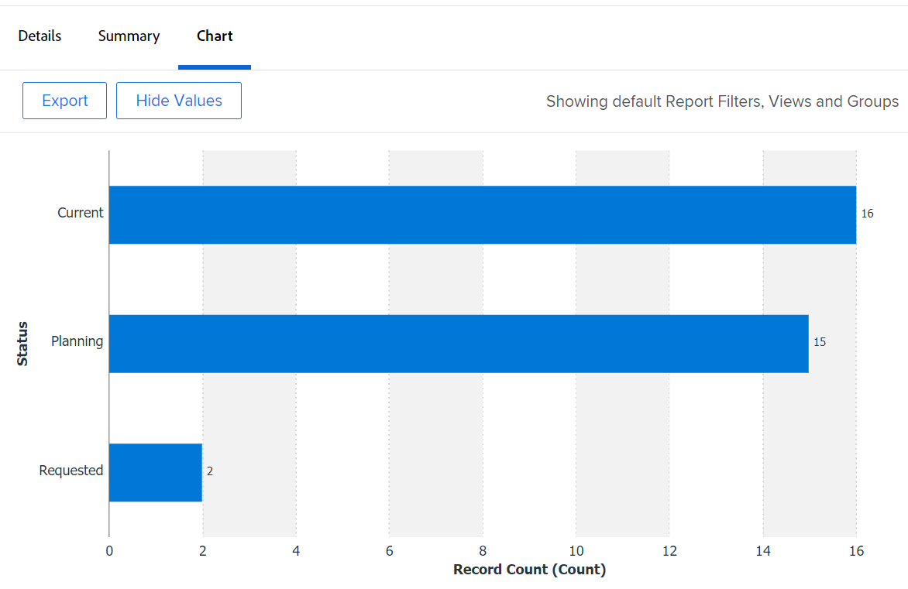

# Ajout d’un graphique à un rapport

Vous pouvez améliorer vos rapports en ajoutant un graphique. Vous pouvez ajouter des graphiques aux rapports existants ou aux rapports que vous créez.

Avant d’ajouter un graphique à un rapport, vous devez créer une Vue et un Groupement pour le rapport. La plupart des graphiques ne peuvent pas être ajoutés si les informations ne sont pas regroupées dans le rapport. Le seul graphique qui peut être ajouté sans groupement est un graphique à jauge.\
Pour plus d’informations sur la création d’une vue, voir [Présentation des vues dans Adobe Workfront](../../../reports-and-dashboards/reports/reporting-elements/views-overview.md).\
Pour plus d’informations sur les regroupements, voir [Présentation des regroupements dans Adobe Workfront](../../../reports-and-dashboards/reports/reporting-elements/groupings-overview.md).

Si votre rapport affiche trop d’éléments, aucun graphique n’est créé. Dans ce cas, vous devez également ajouter un filtre au rapport pour réduire le nombre de résultats dans votre rapport.\
Pour plus d’informations sur les filtres, voir [Présentation des filtres dans Adobe Workfront](../../../reports-and-dashboards/reports/reporting-elements/filters-overview.md).

## Exigences d’accès

Vous devez disposer des accès suivants pour effectuer les étapes de cet article :

<table style="table-layout:auto"> 
 <col> 
 <col> 
 <tbody> 
  <tr> 
   <td role="rowheader">Formule Adobe Workfront*</td> 
   <td> 
Tous
 </td> 
  </tr> 
  <tr> 
   <td role="rowheader">Licence Adobe Workfront*</td> 
   <td> 
Plan 
 </td> 
  </tr> 
  <tr> 
   <td role="rowheader">Paramétrages du niveau d'accès*</td> 
   <td> 
Modification de l’accès aux rapports, tableaux de bord et calendriers
 
Modifier l’accès aux filtres, vues et groupes
 
Remarque : Si vous n’avez toujours pas accès à , demandez à votre administrateur Workfront s’il définit des restrictions supplémentaires à votre niveau d’accès. Pour plus d’informations sur la façon dont un administrateur Workfront peut modifier votre niveau d’accès, voir <a href="../../../administration-and-setup/add-users/configure-and-grant-access/create-modify-access-levels.md" class="MCXref xref">Création ou modification de niveaux d’accès personnalisés</a>.
 </td> 
  </tr> 
  <tr> 
   <td role="rowheader">Autorisations d’objet</td> 
   <td> 
Gestion des autorisations d’un rapport
 
Pour plus d’informations sur la demande d’accès supplémentaire, voir <a href="../../../workfront-basics/grant-and-request-access-to-objects/request-access.md" class="MCXref xref">Demande d’accès aux objets </a>.
 </td> 
  </tr> 
 </tbody> 
</table>

&#42;Pour connaître le plan, le type de licence ou l’accès dont vous disposez, contactez votre administrateur Workfront.

## Ajout d’un graphique à un rapport

1. Accédez à un rapport existant ou créez-en un nouveau. Pour plus d’informations sur la création d’un rapport, voir [Création d’un rapport personnalisé](../../../reports-and-dashboards/reports/creating-and-managing-reports/create-custom-report.md).
1. (Conditionnel) Si vous êtes allé à un rapport existant, cliquez sur **Actions de rapport** > **Modifier**.

1. Assurez-vous que la variable **Colonnes (affichage)** a été mis à jour pour répondre aux besoins du rapport.\
   Pour plus d’informations sur la création ou la modification de l’affichage du rapport, voir [Présentation des vues dans Adobe Workfront](../../../reports-and-dashboards/reports/reporting-elements/views-overview.md).

1. Cliquez sur le bouton **Groupements** et ajoutez un groupement.

   >[!TIP]
   >
   >* Vous ne pouvez ajouter un graphique à un rapport que lorsque les résultats du rapport sont regroupés.
   >* Les regroupements en mode texte ne sont pas pris en charge dans les graphiques. Pour plus d’informations sur les regroupements en mode texte, voir [Mode d’édition de texte dans un groupement](../../../reports-and-dashboards/reports/text-mode/edit-text-mode-in-grouping.md).
   >* Si vous ajoutez un groupement unique qui représente une mesure, tous les graphiques, à l’exception d’un graphique circulaire, affichent chaque résultat du groupement avec la même couleur.

   Pour plus d’informations sur les regroupements, voir [Présentation des regroupements dans Adobe Workfront](../../../reports-and-dashboards/reports/reporting-elements/groupings-overview.md).

1. Sélectionnez la **Graphique** .
1. Cliquez sur un type de graphique pour le sélectionner.\
   

1. Vous pouvez ajouter les types de graphiques suivants à un rapport Adobe Workfront :

   * [Graphique en colonnes](#column-chart)
   * [Graphique en barres](#bar-chart)
   * [Graphique circulaire](#pie-chart)
   * [Graphique en courbes](#line-chart)
   * [Graphique d’évaluation](#gauge-chart)
   * [Graphique à bulles](#bubble-chart)

1. Cliquez sur **Enregistrer + Fermer** pour enregistrer le graphique et le rapport.

### Graphique en colonnes {#column-chart}

Pour ajouter une **Colonne** à votre rapport :

1. Commencez à ajouter un graphique à votre rapport, comme décrit dans la section [Ajout d’un graphique à un rapport](#add-a-chart-to-a-report).
1. Dans le **Axe gauche (Y)** , sélectionnez les valeurs à inclure sur l’axe Y du graphique, ainsi que la manière dont vous souhaitez que les informations soient résumées.
1. Dans le **Axe inférieur (X)** Sélectionnez le Groupement que vous souhaitez inclure dans le graphique.
1. (Facultatif) Sélectionnez **Couleurs personnalisées** pour attribuer les couleurs de votre choix à chacune des colonnes.\
   Pour plus d’informations sur la personnalisation des couleurs des graphiques, voir [Personnalisation des couleurs des graphiques](#customize-chart-colors).

1. (Facultatif) Sélectionnez **Afficher en 3D** pour afficher le graphique en 3 dimensions.
1. (Facultatif) **Colonnes de groupe**: Sélectionnez cette option pour définir le mode de regroupement des colonnes.\
   Sélectionnez l’une des options suivantes :

   * Cliquez sur l&#39;une des options suivantes pour sélectionner l&#39;affichage des colonnes regroupées :\
      **- côte à côte**

      **- Empilées**
      **- Empilé à 100 %**

   * Sélectionnez le Groupement que vous souhaitez inclure dans le graphique.
   * (Facultatif) Sélectionnez **Couleurs personnalisées** pour personnaliser les couleurs des colonnes.\
      Pour plus d’informations sur la personnalisation des couleurs des graphiques, voir [Personnalisation des couleurs des graphiques](#customize-chart-colors).

1. (Facultatif) Sélectionnez **Graphique en combinaison** pour inclure une valeur supplémentaire dans le graphique, ainsi que la manière dont vous souhaitez que les informations soient résumées.\
   Tenez compte des options suivantes :

   * **Graphique sur l’axe Secondaire**: Sélectionnez cette option pour tracer les données sur le côté droit du graphique.
   * **Type de graphique**: Indiquez si vous souhaitez que cette valeur supplémentaire s’affiche sous forme d’une ligne ou d’une troisième colonne.\
      

1. Cliquez sur **Enregistrer + Fermer** pour enregistrer le graphique et le rapport.

### Graphique en barres {#bar-chart}

Pour ajouter une **Barre** à votre rapport :

1. Commencez à ajouter un graphique à votre rapport, comme décrit dans la section [Ajout d’un graphique à un rapport](#add-a-chart-to-a-report).
1. Dans le **Axe inférieur (X)** , sélectionnez les valeurs à inclure sur l’axe X du graphique, ainsi que la manière dont vous souhaitez que les informations soient résumées.
1. Dans le **Axe gauche (Y)** Sélectionnez le Groupement que vous souhaitez inclure dans le graphique.
1. (Facultatif) Sélectionnez **Couleurs personnalisées** pour personnaliser les couleurs des barres.\
   Pour plus d’informations sur la personnalisation des couleurs des graphiques, voir [Personnalisation des couleurs des graphiques](#customize-chart-colors).

1. (Facultatif) Sélectionnez **Afficher en 3D** pour afficher le graphique en 3 dimensions.
1. (Facultatif)**Barres de groupe**: Sélectionnez cette option pour définir le mode de regroupement des barres.\
   Sélectionnez l’une des options suivantes :

   * Cliquez sur l’une des options suivantes pour sélectionner l’affichage des barres regroupées :\
      **- côte à côte**

      **- Empilées**
      **- Empilé à 100 %**

   * Sélectionnez le Groupement que vous souhaitez inclure dans le graphique.
   * (Facultatif) Sélectionnez **Couleurs personnalisées** pour personnaliser les couleurs de vos colonnes.\
      Pour plus d’informations sur la personnalisation des couleurs des graphiques, voir [Personnalisation des couleurs des graphiques](#customize-chart-colors).

1. (Facultatif) Sélectionnez **Graphique en combinaison** pour inclure une valeur supplémentaire dans le graphique, ainsi que la manière dont vous souhaitez que les informations soient résumées.\
   

1. Cliquez sur **Enregistrer + Fermer** pour enregistrer le graphique et le rapport.

### Graphique circulaire {#pie-chart}

Pour ajouter une **Diagramme** à votre rapport :

1. Commencez à ajouter un graphique à votre rapport, comme décrit dans la section [Ajout d’un graphique à un rapport](#add-a-chart-to-a-report).
1. Dans le **Valeurs** , sélectionnez les valeurs à afficher dans le rapport, ainsi que la manière dont vous souhaitez les résumer.\
   Dans le **Ponts** Sélectionnez le Groupement que vous souhaitez inclure dans le graphique. Le Regroupement est représenté par les contours du graphique.

1. (Facultatif) Sélectionnez **Couleurs personnalisées** pour personnaliser les couleurs des contours sur le graphique.\
   Pour plus d’informations sur la personnalisation des couleurs des graphiques, voir [Personnalisation des couleurs des graphiques](#customize-chart-colors).

1. (Facultatif) Sélectionnez **Afficher en 3D** pour afficher le graphique en 3 dimensions.
1. Dans le **Afficher les résultats sous** , sélectionnez le mode d’affichage des résultats dans le graphique. Tenez compte des options suivantes :

   * **Pourcentage**: Les résultats du graphique s’affichent sous forme de pourcentage.
   * **Nombres**: Les résultats du graphique s’affichent sous la forme d’un nombre.\
      

1. Cliquez sur **Enregistrer + Fermer** pour enregistrer le graphique et le rapport.

### Graphique en courbes {#line-chart}

Pour ajouter une **Ligne** à votre rapport :

1. Commencez à ajouter un graphique à votre rapport, comme décrit dans la section [Ajout d’un graphique à un rapport](#add-a-chart-to-a-report).
1. Dans le **Axe gauche (Y)** , sélectionnez les valeurs à inclure sur l’axe Y du graphique, ainsi que la manière dont vous souhaitez que les informations soient résumées.
1. Dans le **Axe inférieur (X)** Sélectionnez le Groupement que vous souhaitez inclure dans le graphique.
1. (Facultatif) Sélectionnez une couleur pour personnaliser la couleur de la ligne.
1. (Facultatif) Sélectionnez **Lignes de groupe**, pour sélectionner un groupement supplémentaire pour le graphique.\
   (Facultatif) Sélectionnez **Couleurs personnalisées** pour personnaliser les couleurs de votre nouveau regroupement.\
   Pour plus d’informations sur la personnalisation des couleurs des graphiques, voir [Personnalisation des couleurs des graphiques](#customize-chart-colors).

1. (Facultatif) Sélectionnez **Graphique en combinaison** pour combiner vos lignes par une valeur supplémentaire.\
   Tenez compte des options suivantes :

   * Sélectionnez la valeur que vous souhaitez inclure dans le graphique, ainsi que la manière dont vous souhaitez que les informations soient résumées.
   * Sélectionnez la **Graphique sur l’axe Secondaire** pour tracer les données sur le côté droit du graphique.\
      

1. Cliquez sur **Enregistrer + Fermer** pour enregistrer le graphique et le rapport.

### Graphique d’évaluation {#gauge-chart}

A **Jauge** Le graphique affiche le nombre d’enregistrements qui répondent à certains critères dans un format de jauge. L&#39;indicateur de la jauge pointe vers le nombre d&#39;enregistrements répondant aux critères sélectionnés dans la vue et le regroupement du rapport. Un regroupement de rapports n’est pas nécessaire pour configurer un graphique à jauge.

Pour ajouter une **Jauge** à votre rapport :

1. Commencez à ajouter un graphique à votre rapport, comme décrit dans la section [Ajout d’un graphique à un rapport](#add-a-chart-to-a-report).
1. Dans le **Valeurs** , sélectionnez les valeurs à afficher dans le rapport, ainsi que la manière dont vous souhaitez les résumer. Si vous sélectionnez **Record Count**, les valeurs affichées sont l’objet du rapport.

1. Dans le **Indicateurs** Sélectionnez le Groupement que vous souhaitez inclure dans le graphique. Le Regroupement est représenté par la ligne d&#39;indicateur sur le graphique.\
   Si un Groupement contient deux éléments, deux indicateurs sont affichés sur le graphique.\
   Par exemple, si vous disposez d’un regroupement de l’état du projet et qu’il existe deux états du projet (actuel et en attente), votre graphique Évaluation contient deux indicateurs de jauge. Ils indiquent le nombre de projets qui se trouvent dans cet état.\
   (Facultatif) Sélectionnez **Total** dans le **Indicateurs** pour afficher le total des objets sélectionnés dans le **Valeurs** champ .

1. Dans le **Plage de valeurs** , indiquez la plage de valeurs et la couleur à utiliser pour représenter les valeurs à afficher sur le graphique Jauge .
1. (Facultatif) Cliquez sur **Ajouter une plage de valeurs** pour ajouter des plages de valeurs supplémentaires au graphique.\
   

1. Cliquez sur **Enregistrer + Fermer** pour enregistrer le graphique et le rapport.

### Graphique à bulles {#bubble-chart}

Vous pouvez afficher jusqu’à trois champs d’un objet dans une **Bulle** graphique. Cela signifie que vous pouvez afficher jusqu’à quatre points de données dans un graphique à bulles. Chaque entité ayant trois champs associés s’affiche sous la forme d’un cercle qui exprime deux des champs de son emplacement dans les axes X et Y. Le troisième champ est représenté par la taille du cercle.

Pour ajouter une **Bulle** à votre rapport :

1. Commencez à ajouter un graphique à votre rapport, comme décrit dans la section [Ajout d’un graphique à un rapport](#add-a-chart-to-a-report).
1. Dans le **Axe gauche (Y)** sélectionnez les valeurs à inclure sur l’axe Y du graphique. Les valeurs proviennent de la vue du rapport. Indiquez le mode de résumé des informations.
1. Dans le **Champ Axe inférieur (X)**, sélectionnez les valeurs à inclure sur l’axe X du graphique. Les valeurs proviennent de la vue du rapport. Indiquez le mode de résumé des informations.

   >[!NOTE]
   >
   >Assurez-vous qu’au moins une colonne est résumée pour que ce champ soit principal.\
   >Pour plus d’informations sur la synthèse des informations dans une colonne de rapport, voir [Création d’un rapport personnalisé](../../../reports-and-dashboards/reports/creating-and-managing-reports/create-custom-report.md).

1. Dans le **Taille de la bulle** , sélectionnez les valeurs que vous souhaitez représenter par la taille des bulles du graphique. Les valeurs proviennent de la vue du rapport. Indiquez le mode de résumé des informations.

   >[!NOTE]
   >
   >Assurez-vous qu’au moins une colonne est résumée pour que ce champ soit principal.\
   >Pour plus d’informations sur la synthèse des informations dans une colonne de rapport, voir [Création d’un rapport personnalisé](../../../reports-and-dashboards/reports/creating-and-managing-reports/create-custom-report.md).

1. Dans le **Bulles** Sélectionnez le Groupement que vous souhaitez inclure dans le graphique. Le Regroupement est représenté par le positionnement des bulles sur le graphique.
1. Dans le **Couleur de bulle** , sélectionnez le champ que vous souhaitez représenter par les couleurs des bulles. Le **Couleur de bulle** Il peut s’agir d’un groupement que vous définissez dans le rapport, mais il ne peut s’agir que de champs de l’objet que vous avez sélectionné en tant que **Bulles**. Par exemple, si vous avez sélectionné Nom de la tâche, vous pouvez ajouter État de la tâche, mais pas État du projet en tant que **Couleur de bulle**.\
   

1. Cliquez sur **Enregistrer + Fermer** pour enregistrer les modifications apportées au créateur d’interface.

## Exporter un graphique

Vous pouvez exporter un graphique dans un fichier .pdf.

Pour exporter un graphique :

1. Cliquez sur **Exporter** pour exporter le graphique au format .pdf.\
   Un fichier .pdf est téléchargé sur votre ordinateur.

1. Ouvrez le fichier .pdf .\
   Le fichier exporté comprend les informations suivantes :

   * Image du graphique.
   * Titre qui correspond au nom du rapport.
   * Nom de fichier unique qui correspond au nom du rapport.
   * Un pied de page avec la date et l’heure d’export du rapport et le numéro de page.

## Personnalisation des couleurs des graphiques {#customize-chart-colors}

Vous pouvez laisser Workfront sélectionner les couleurs des éléments de votre graphique ou les personnaliser lorsque vous ajoutez un graphique à vos rapports. Si votre graphique contient un seul groupement qui représente une mesure (un rapport de tâche qui indique le nombre de tâches regroupées par date d’achèvement réelle, par exemple), chaque résultat du groupement est affiché dans la même couleur.

Vous ne pouvez choisir qu&#39;une seule couleur pour les champs affichés dans la Vue du rapport. Vous pouvez choisir plusieurs couleurs, une pour chaque option, pour les champs affichés dans le Groupement du rapport.

>[!IMPORTANT]
>
>Pour les champs de date, vous ne pouvez sélectionner qu’une seule couleur pour les éléments de graphique.

Pour personnaliser les couleurs des graphiques :

1. Lors de la création d’un rapport, accédez au **Graphique** dans le créateur de rapports.
1. Sélectionnez un type de graphique à ajouter à votre rapport.\
   Pour plus d’informations sur l’ajout d’un graphique à votre rapport, voir [Ajout d’un graphique à un rapport](#add-a-chart-to-a-report).

1. Cliquez sur **Couleurs personnalisées** lorsque ce champ est disponible.\
   La boîte de dialogue Couleurs personnalisées s’affiche.\
   

   >[!NOTE]
   >
   >Vous pouvez associer des couleurs personnalisées à n’importe quel champ que vous pouvez regrouper et à certains champs pouvant être affichés dans une vue, y compris les champs personnalisés. Les champs personnalisés ou les options personnalisées des champs que vous choisissez dans la boîte de dialogue Couleur personnalisée sont sensibles à la casse.

1. Choisissez l’une des options suivantes :

   * **Utiliser une couleur**: Tous les éléments du graphique s&#39;affichent dans la couleur sélectionnée.

      1. Commencez à saisir le nom d’une option du champ sélectionné, puis sélectionnez une couleur. Cette option s’affiche dans la couleur sélectionnée sur le graphique.
      1. (Facultatif) Spécifiez une valeur hexadécimale de couleur pour votre couleur, au lieu d’en sélectionner une parmi les échantillons de couleurs disponibles.\
         Ou\
         Cliquez sur le sélecteur de couleurs qui s’affiche après avoir cliqué sur le code hexadécimal, puis sélectionnez une autre couleur.
   * **Ajouter une couleur**: Continuez à ajouter des couleurs personnalisées pour toutes les autres options possibles du champ sélectionné.
   * **Tout supprimer**: Sélectionnez cette option pour supprimer toutes les couleurs et options du champ sélectionné ci-dessus.
   * **Options avancées**: Sélectionnez l’une des options suivantes :

      * **Aucune valeur**: Sélectionnez ce champ et une couleur personnalisée pour afficher la colonne du graphique qui regroupe les éléments &quot;aucune valeur&quot;. Il s’agit d’éléments qui ne peuvent pas être regroupés par l’une des options du champ sélectionné dans votre groupement.
      * **Toutes les autres valeurs**: Sélectionnez ce champ et une couleur personnalisée pour afficher tous les autres éléments du graphique dont les options ne sont pas sélectionnées ci-dessus.

         >[!NOTE]
         >
         >Les couleurs que vous avez utilisées le plus récemment s’affichent en haut de la boîte de dialogue Couleurs personnalisées . Lorsque vous passez la souris sur une couleur qui a été récemment utilisée, le nom du champ qui lui est associé s’affiche.

1. Cliquez sur le &quot;x&quot; dans le coin supérieur droit de l’option Couleurs personnalisées pour fermer la boîte de dialogue Couleurs personnalisées . Les couleurs sélectionnées sont automatiquement enregistrées.
1. Cliquez sur **Enregistrer + Fermer** pour enregistrer le graphique et exécuter le rapport.

## Suppression d’un graphique d’un rapport

Pour supprimer un graphique d’un rapport :

1. Ouvrez le **Graphique** du créateur de rapports.
1. Placez le pointeur de la souris sur l’icône du type de graphique que vous avez choisi et un bouton &quot;x&quot; s’affiche dans le coin supérieur droit de l’icône.
1. Cliquez sur le &quot;x&quot; pour supprimer le graphique.
1. Cliquez sur **Enregistrer + Fermer**.

## Limites lors de l’utilisation de graphiques

Tenez compte des limites suivantes lorsque vous utilisez des graphiques :

* Le **Aperçu du graphique** à droite du créateur de rapports ne contient pas de données réelles provenant de votre rapport. Vous devez enregistrer le graphique et le visualiser à partir de la **Graphique** afin d’afficher le graphique avec vos données.

* Certains éléments de graphique ne sont pas modifiables :

   * Vous ne pouvez pas modifier le type de police ni la taille sur les valeurs de chaque élément.
   * Vous ne pouvez pas modifier les noms de vos axes dans le graphique.

* Vous ne pouvez pas modifier la légende du graphique.
* Lorsque vous utilisez des champs calculés pour vos groupements, vous ne pouvez pas cliquer sur les éléments du graphique.
* Le plus grand nombre de points de données que vous pouvez afficher dans un graphique est de quatre, dans un graphique à bulles. Tous les autres types de graphique affichent deux points de données ou un maximum de trois.
