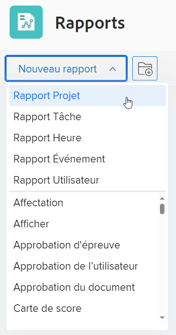

# Créer un rapport personnalisé

<!--Audited: 10/2024-->

Vous pouvez donner accès aux informations dont votre entreprise a besoin dans Adobe Workfront en créant des rapports. Vous pouvez utiliser n’importe lequel des rapports intégrés disponibles dans Workfront, ou vous pouvez créer vos propres rapports à partir de zéro.

Pour plus d’informations sur les rapports intégrés, consultez la section [Utiliser les rapports intégrés d’Adobe Workfront](../../../reports-and-dashboards/reports/using-built-in-reports/use-workfront-built-in-reports.md).

Pour plus d’informations sur la création d’un rapport en le copiant, consultez [Créer une copie d’un rapport](../../../reports-and-dashboards/reports/creating-and-managing-reports/create-copy-report.md).

Pour plus d’informations sur la création et la gestion de rapports, y compris des cours, des vidéos et des tutoriels, consultez la section Adobe Experience League.

## Conditions d’accès

+++ Développez pour afficher les exigences d’accès aux fonctionnalités de cet article.

Vous devez disposer des éléments suivants :

<table style="table-layout:auto"> 
 <col> 
 <col> 
 <tbody> 
  <tr> 
   <td role="rowheader">Formule Adobe Workfront</td> 
   <td> 
Tous
 </td> 
  </tr> 
  <tr> 
   <td role="rowheader">Licence Adobe Workfront</td> 
   <td> 
Nouveau : Standard 

   ou
   
Actuel : formule 
 </td> 
  </tr> 
  <tr> 
   <td role="rowheader">Configurations des niveaux d’accès</td> 
   <td> 
Accès en modification aux rapports, tableaux de bord et calendriers
 
Modifier l’accès aux filtres, vues et groupes
</td> 
  </tr> 
  <tr> 
   <td role="rowheader">Autorisations d’objet</td> 
   <td> 
Vous obtenez des autorisations de gestion pour les rapports que vous créez.
</td> 
  </tr> 
 </tbody> 
</table>

Pour plus d’informations, voir [Conditions d’accès requises dans la documentation Workfront](/help/quicksilver/administration-and-setup/add-users/access-levels-and-object-permissions/access-level-requirements-in-documentation.md).

+++

## Créer un rapport {#create-a-report}

{{step1-to-reports}}

1. Cliquez sur **Nouveau rapport**, puis sélectionnez le type d’objet que vous souhaitez pour le rapport.

   Report Builder se charge.

   Pour des informations spécifiques sur les rapports d’objets disponibles, consultez la section [Rapport sur les objets](../../../workfront-basics/navigate-workfront/workfront-navigation/understand-objects.md#reporting-on-objects) dans l’article [Comprendre les objets dans Adobe Workfront](../../../workfront-basics/navigate-workfront/workfront-navigation/understand-objects.md).

   

   >[!TIP]
   >
   >Vous pouvez également créer un rapport en faisant une copie d’un rapport existant. Pour plus d’informations, consultez la section [Créer une copie d’un rapport](../../../reports-and-dashboards/reports/creating-and-managing-reports/create-copy-report.md).

1. (Facultatif) Pour modifier le titre de votre nouveau rapport, saisissez le titre du rapport de votre choix dans le champ de texte situé dans le coin supérieur gauche du Report Builder. Nous vous recommandons d’utiliser uniquement des caractères UTF-8 pour éviter des problèmes de compatibilité.

1. Dans le générateur de rapports, ajoutez les éléments suivants à votre rapport :

   <table style="table-layout:auto"> 
    <col> 
    <col> 
    <thead> 
     <tr> 
      <th>Fonctionnalité</th> 
      <th>Description</th> 
     </tr> 
    </thead> 
    <tbody> 
     <tr> 
      <td>Colonnes (Affichage)</td> 
      <td> 
L’ajout de colonnes à votre rapport détermine les informations qu’il contient.
 
Pour savoir comment ajouter une colonne, consultez la section <a href="#add-columns-view-to-a-report" class="MCXref xref">Ajouter des colonnes (vue) à un rapport</a>. 
 </td> 
     </tr> 
     <tr> 
      <td>Regroupements</td> 
      <td> 
L’ajout de regroupements à votre rapport détermine la manière dont il est organisé.
 
Pour savoir comment ajouter un regroupement, consultez la section <a href="#add-groupings-to-a-report" class="MCXref xref">Ajouter des regroupements à un rapport</a>.
 </td> 
     </tr> 
     <tr> 
      <td>Filtres</td> 
      <td> 
L’ajout de règles de filtrage à votre rapport détermine les informations que vous voyez dans votre rapport.
 
Pour savoir comment ajouter un filtre, consultez la section <a href="#add-filters-to-a-report" class="MCXref xref">Ajouter des filtres à un rapport</a>.
 </td> 
     </tr> 
     <tr> 
      <td>Graphique</td> 
      <td> 
L’ajout d’un graphique à votre rapport détermine la manière dont les informations contenues dans votre rapport sont présentées visuellement.
 
Pour savoir comment ajouter un graphique, consultez la section <a href="#add-a-chart-to-a-report" class="MCXref xref">Ajouter un graphique à un rapport</a>.
 </td> 
     </tr> 
    </tbody> 
   </table>

1. À tout moment au cours du processus de création du rapport, cliquez sur **Appliquer** pour enregistrer vos modifications.
1. Lorsque vous avez terminé, cliquez sur **Enregistrer et fermer**.

### Ajouter des colonnes (vue) à un rapport {#add-columns-view-to-a-report}

1. Commencez à créer un rapport comme décrit dans la section [Créer un rapport](#create-a-report) de cet article.
1. Dans le Report Builder, sélectionnez l’onglet **Colonnes (Vue)** pour identifier les colonnes qui apparaîtront dans le rapport.
1. (Facultatif) Cliquez sur **Appliquer une vue existante** et cliquez sur le nom d’une vue dans le menu déroulant pour utiliser une vue existante.

   Pour plus d’informations sur la création d’une vue, consultez la section [Vue d’ensemble des vues dans Adobe Workfront](../../../reports-and-dashboards/reports/reporting-elements/views-overview.md).

1. (Facultatif) Pour supprimer une colonne existante, cliquez sur la colonne que vous souhaitez supprimer, puis cliquez sur le bouton **x** à côté du nom actuel dans l’en-tête de la colonne.

1. Pour ajouter une nouvelle colonne, cliquez sur **Ajouter une colonne**.

   Ou

   Pour modifier une colonne existante, cliquez dessus, puis sur l’icône **Supprimer**  à droite du champ actif dans la zone **Afficher dans cette colonne** dans le coin supérieur gauche du Report Builder, et commencez à saisir un nouveau champ, puis cliquez dessus lorsqu’il s’affiche dans la liste.

   Pour plus d’informations sur les champs que vous voyez dans les colonnes, consultez [Glossaire de la terminologie Adobe Workfront](../../../workfront-basics/navigate-workfront/workfront-navigation/workfront-terminology-glossary.md).

   

1. (Facultatif) Dans la zone **Paramètres d’une colonne**, sélectionnez **Trier sur la base de cette colonne** pour trier les valeurs de la colonne par ordre alphabétique croissant ou décroissant, puis indiquez si la liste doit utiliser cette colonne comme premier tri.

   Vous pouvez avoir plusieurs niveaux de tri dans une vue de rapport si vous souhaitez trier d’abord la valeur d’une colonne, puis la valeur d’une deuxième colonne, etc.

   Si plusieurs résultats sont identiques selon le premier critère de tri, ils sont triés dans l’ordre du deuxième critère de tri. Si plusieurs résultats sont identiques selon les premier et deuxième critères de tri, ils sont triés selon le troisième critère, etc.

   >[!NOTE]
   >
   >Si vous ajoutez un champ qui fait référence à un objet trop éloigné de l’objet sur lequel vous établissez un rapport, il se peut que vous ne puissiez pas trier par ce champ.\
   >Par exemple, un rapport de problème ne peut pas être trié en fonction du champ Personne propriétaire du projet parce qu’il fait référence à trois objets supplémentaires : Projet, Personne propriétaire et Nom. Cependant, vous pouvez toujours ajouter ce champ à un rapport de problème et voir les informations correspondantes.

   <!--outdated: To learn more about cross-object references in reports, see the section "Advanced Reporting Part 1 of 3" in the [Reports and Dashboards Learning Path](https://one.workfront.com/s/learningpath2/workfront-reporting-MC7MZT2BOL2ZC2LMJ4MA3EMHOCNY?tabset-dc70e=2).-->

1. (Facultatif) Si vous utilisez des regroupements et que vous souhaitez résumer (agréger) les informations d’une colonne, cliquez sur la liste déroulante **Résumer cette colonne par** dans la zone **Paramètres des colonnes**, puis sélectionnez l’option que vous souhaitez utiliser pour agréger les informations de la colonne.

   Les informations agrégées s’affichent dans la colonne des lignes de regroupement.

   

   Pour plus d’informations sur le résumé des données dans une colonne, consultez la section [Vue d’ensemble des vues dans Adobe Workfront](../../../reports-and-dashboards/reports/reporting-elements/views-overview.md).

   >[!NOTE]
   >
   >Les exceptions suivantes s’appliquent aux objets parent (par exemple, les tâches parent) lorsque vous agrégez des valeurs pour les champs suivants en regroupements :
   >
   >* Tous les champs numériques et monétaires, à l’exception des heures effectives (par exemple, Coût prévu ou réel de main d’œuvre, Coût prébu ou réel des dépenses, Coût prévu ou réel, Nombre d’heures prévues) n’agrègent que les valeurs des tâches enfants et des tâches autonomes. Ils n’agrègent pas les valeurs des tâches parent ou des parents des parents.
   >* Les heures effectives agrègent les valeurs principales des tâches parent et des tâches autonomes. Elles n’agrègent pas les nombres pour les parents des tâches parent ou des tâches enfant.
   >* Les champs de données personnalisées de valeurs numériques et de devise regroupent toutes les tâches : parents, enfants, parents de parents et tâches autonomes.

   Pour plus d’informations sur l’utilisation des regroupements dans un rapport, consultez la section [Vue d’ensemble des regroupements dans Adobe Workfront](../../../reports-and-dashboards/reports/reporting-elements/groupings-overview.md).

1. (Facultatif) Cliquez sur **Options avancées** pour spécifier les informations suivantes pour la colonne :

   <table style="table-layout:auto"> 
    <col> 
    <col> 
    <tbody> 
     <tr> 
      <td role="rowheader">Personnaliser le libellé de colonne</td> 
      <td> 
Spécifiez un libellé personnalisé pour la colonne. Ce libellé remplace le libellé par défaut.
 </td> 
     </tr> 
     <tr> 
      <td role="rowheader">Format du champ</td> 
      <td> 
Sélectionnez le format dans lequel vous souhaitez que les valeurs soient affichées pour les champs de la colonne.
 </td> 
     </tr> 
     <tr> 
      <td role="rowheader">Afficher cette colonne lorsque le graphique est visible sur un tableau de bord.</td> 
      <td> 
Sélectionnez cette option pour afficher cette colonne dans un tableau de bord, lorsque le rapport est affiché côte à côte avec un autre rapport. Lorsque cette option n’est pas sélectionnée, cette colonne n’apparaît pas lorsque le rapport est affiché sur un tableau de bord où les rapports sont affichés côte à côte.
 </td> 
     </tr> 
     <tr> 
      <td role="rowheader">Règles de la colonne</td> 
      <td> 
Cliquez sur <strong>Ajouter une règle pour cette colonne</strong> pour ajouter une mise en forme conditionnelle à la colonne. Après avoir ajouté une règle, vous pouvez définir des styles de champ et de texte définissant le mode d’affichage des champs correspondant à cette règle. Cliquez sur <strong>Ajouter une règle</strong> lorsque vous avez fini de définir la règle. Pour plus d’informations sur la mise en forme conditionnelle dans une vue, consultez la section <a href="../../../reports-and-dashboards/reports/reporting-elements/use-conditional-formatting-views.md" class="MCXref xref">Utiliser la mise en forme conditionnelle dans les vues</a>.
 </td> 
     </tr> 
    </tbody> 
   </table>

1. Cliquez sur **Appliquer** pour appliquer les modifications apportées jusqu’à présent et continuer à modifier le rapport avec les options suivantes.

   Cliquez sur **Enregistrer et fermer** si vous avez fini de modifier les colonnes du rapport et que vous souhaitez enregistrer le rapport.

### Ajouter des regroupements à un rapport {#add-groupings-to-a-report}

1. Commencez à créer un rapport comme décrit dans la section de cet article [Créer un rapport](#create-a-report).
1. Dans le Report Builder, sélectionnez l’onglet **Regroupements** pour identifier la manière dont vous souhaitez regrouper les éléments dans le rapport.
1. Cliquez sur **Ajouter un regroupement** pour ajouter un nouveau regroupement.

   Ou

   Choisissez **Appliquer un regroupement existant** pour sélectionner un regroupement existant lorsqu’il s’affiche dans la liste.

   

1. Commencez à saisir le champ que vous souhaitez ajouter en tant que regroupement. Si le champ est disponible, il est renseigné pour chaque objet auquel il peut être associé. Cliquez sur le nom du champ pour l’ajouter à ce regroupement.
1. (Facultatif) Vous pouvez choisir de créer un regroupement en mode texte en cliquant sur **Basculer en mode texte**. Pour plus d’informations sur l’utilisation du mode texte, voir [Vue d’ensemble du mode texte](../../../reports-and-dashboards/reports/text-mode/understand-text-mode.md).

   Pour plus d’informations sur la création de nouveaux regroupements, voir [Vue d’ensemble des regroupements dans Adobe Workfront](../../../reports-and-dashboards/reports/reporting-elements/groupings-overview.md).

1. (Facultatif) Sélectionnez **Réduire ce regroupement par défaut** si vous souhaitez que les résultats de ce regroupement s’affichent réduits plutôt que développés.

   Ce paramètre est désactivé par défaut et les résultats du regroupement s’affichent toujours dans une liste développée.

   >[!TIP]
   >
   >* Lorsque vous ajustez manuellement les regroupements lors de l’affichage d’une liste, Workfront mémorise vos préférences manuelles jusqu’à ce que vous vous déconnectiez. Lorsque vous vous reconnectez, la liste s’affiche en fonction de ce paramètre.
   >* Les résultats d’un regroupement s’affichent toujours développés après que l’on y a accédé à partir d’un élément de graphique.

1. (Facultatif) Cliquez sur **Basculer au regroupement par matrice**, pour créer un regroupement de matrices et afficher vos résultats sous forme de grille.

   Pour plus d’informations sur la création d’un rapport matriciel, voir [Créer un rapport matriciel](../../../reports-and-dashboards/reports/creating-and-managing-reports/create-matrix-report.md).

1. Cliquez sur **Appliquer** pour appliquer les modifications apportées jusqu’à présent et continuer à modifer le rapport avec les options suivantes.

   Cliquez sur **Enregistrer et fermer** si vous avez fini de modifier les regroupements dans le rapport et que vous souhaitez enregistrer le rapport.

### Ajouter des filtres à un rapport {#add-filters-to-a-report}

1. Commencez à créer un rapport comme décrit dans la section [Créer un rapport](#create-a-report) de cet article.
1. Dans le Report Builder, sélectionnez l’onglet **Filtres** pour identifier la quantité d’informations que vous souhaitez inclure dans le rapport.
1. Cliquez sur **Ajouter une règle de filtre** pour ajouter un filtre personnalisé.\
   Ou\
   Choisissez **Appliquer un filtre existant** pour utiliser un filtre existant.

   

1. Si vous avez cliqué sur **Ajouter une règle de filtre**, commencez à saisir le champ que vous voulez ajouter comme filtre. Si le champ est disponible, il est renseigné pour chaque objet auquel il peut être associé. Cliquez sur le nom du champ pour l’ajouter à ce filtre.\
   Utilisez les modificateurs de filtre pour créer votre filtre. Pour plus d’informations sur les modificateurs de filtre, voir [Modificateurs de filtre et de condition](../../../reports-and-dashboards/reports/reporting-elements/filter-condition-modifiers.md).

   Pour plus d’informations sur la création de filtres, voir [Vue d’ensemble des filtres](../../../reports-and-dashboards/reports/reporting-elements/filters-overview.md).

1. (Facultatif) Vous pouvez choisir de créer un filtre en mode texte en cliquant sur **Basculer en mode texte**.

   Pour plus d’informations sur l’utilisation du mode texte, voir [Vue d’ensemble du mode texte](../../../reports-and-dashboards/reports/text-mode/understand-text-mode.md).

1. Cliquez sur **Appliquer** lorsque vous avez fini de modifier les filtres du rapport pour appliquer les modifications apportées jusqu’à présent et poursuivre la modifcation du rapport avec les options suivantes.

   Cliquez sur **Enregistrer et fermer** si vous avez fini de modifier le rapport et que vous souhaitez l’enregistrer.

### Ajouter un graphique à un rapport {#add-a-chart-to-a-report}

1. Commencez à créer un rapport comme décrit dans la section [Créer un rapport](#create-a-report) de cet article.
1. Dans le Report Builder, sélectionnez l’onglet **Graphique**, puis sélectionnez le type de graphique que vous souhaitez ajouter.

   

   Pour plus d’informations sur la création d’un graphique dans un rapport, voir [Ajouter un graphique à un rapport](../../../reports-and-dashboards/reports/creating-and-managing-reports/add-chart-report.md).

1. Cliquez sur **Appliquer** pour appliquer les modifications que vous avez apportées jusqu’à présent et continuer à modifier le rapport avec les options suivantes.

   Cliquez sur **Enregistrer et fermer** si vous avez fini de modifier le rapport et que vous souhaitez l’enregistrer.
