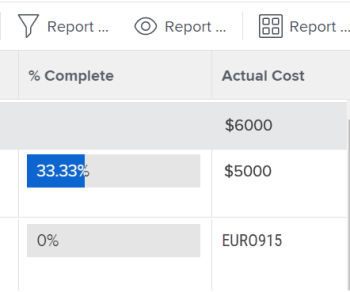

# Créer des rapports de données financières avec des taux de change uniques

Si plusieurs taux de change ont été configurés dans Adobe Workfront, vous pouvez définir des valeurs financières dans les rapports et les listes pour les afficher dans une autre devise que celle par défaut.

>[!IMPORTANT]
>
>Si vous sélectionnez une devise autre que celle par défaut dans une vue, les liens **Ajouter d’autres tâches** et **Ajouter d’autres problèmes** ne s’affichent plus au bas de la liste d’un projet.

Pour plus d’informations sur la modification de la devise par défaut d’un projet donné, voir [Modifier la devise d’un projet](../../../manage-work/projects/project-finances/change-project-currency.md).

Si le rapport contient des projets à devise unique, les sommes des regroupements sont également affichées dans la devise par défaut du système.

## Conditions d’accès

Vous devez disposer des accès suivants pour effectuer les étapes décrites dans cet article :

<table style="table-layout:auto"> 
 <col> 
 <col> 
 <tbody> 
  <tr> 
   <td role="rowheader">Formule Adobe Workfront*</td> 
   <td> 
Tous
 </td> 
  </tr> 
  <tr> 
   <td role="rowheader">Licence Adobe Workfront*</td> 
   <td> 
Plan 
 </td> 
  </tr> 
  <tr> 
   <td role="rowheader">Configurations du niveau d’accès*</td> 
   <td> 
Modifier l’accès aux rapports, tableaux de bord et calendriers
 
Modifier l’accès aux filtres, vues et regroupements
 
Remarque : si vous n’avez toujours pas d’accès, demandez à votre équipe d’administration Workfront s’il existe des restrictions supplémentaires à votre niveau d’accès. Pour plus d’informations sur la façon dont un administrateur ou une administratrice Workfront peut modifier votre niveau d’accès, voir <a href="../../../administration-and-setup/add-users/configure-and-grant-access/create-modify-access-levels.md" class="MCXref xref">Créer ou modifier des niveaux d’accès personnalisés</a>.
 </td> 
  </tr> 
  <tr> 
   <td role="rowheader">Autorisations d’objet</td> 
   <td> 
Gérer les autorisations d’un rapport
 
Pour plus d’informations sur la demande d’accès supplémentaire, voir <a href="../../../workfront-basics/grant-and-request-access-to-objects/request-access.md" class="MCXref xref">Demander l’accès aux objets </a>.
 </td> 
  </tr> 
 </tbody> 
</table>

&#42;Pour connaître le forfait, le type de licence ou l’accès dont vous disposez, contactez votre administrateur ou administratrice Workfront.

## Conditions préalables

Avant de pouvoir afficher d’autres devises, comme décrit dans cette section, l’administrateur ou l’administratrice de Workfront doit d’abord activer et configurer plusieurs devises dans la zone Configuration de Workfront. Pour plus d’informations, voir [Configurer les taux de change](../../../administration-and-setup/manage-workfront/exchange-rates/set-up-exchange-rates.md).

## Appliquer des valeurs financières à un rapport {#apply-financial-values-to-a-report}

Pour convertir des valeurs financières entre plusieurs devises lors de l’utilisation de rapports, procédez comme suit :

1. Accédez au rapport dans lequel vous souhaitez convertir des valeurs financières dans une autre devise.
1. Cliquez sur la liste déroulante **Vue**, cliquez sur **Modifier la devise**, puis sélectionnez parmi les devises suivantes celle dans laquelle vous souhaitez afficher les valeurs financières :

   * Devise originale du projet
   * Une des autres devises

     >[!TIP]
     >
     >Vous ne pouvez choisir que les devises précédemment sélectionnées dans Configuration.

   Cette option permet de convertir rapidement les valeurs financières d’un rapport entre les valeurs de taux.

   

   <!--
   
(NOTE: drafted this tip because I think this is confusing; this is in the step above.)

   -->

   <!--
   <note type="tip">
   You can also select the Change Currency option to convert financial values in other lists.
    
   
    
    
   </note>
   -->

## Afficher la devise par défaut sur plusieurs projets avec des devises différentes

Lorsque vous personnalisez la devise à l’échelle du projet et que vous souhaitez afficher les informations de tous les projets dans le même rapport, les scénarios suivants se présentent :

* Si vous créez un rapport qui contient des informations financières provenant de plusieurs projets dans lesquels des devises différentes sont appliquées, le résumé du regroupement reflète alors la devise par défaut du système sélectionnée par l’administrateur ou l’administratrice de Workfront.
* Si vous créez un rapport pour au moins deux projets partageant la même devise, mais que celle-ci diffère de la devise par défaut du système, les sommes contenues dans les regroupements sont affichées dans la devise par défaut.
* Si vous créez un rapport pour au moins deux projets dont des affectations de fonctions sont associées à un remplacement de devise, Workfront convertit les informations financières des taux de change remplacés de la fonction dans la devise du projet (lorsque vous sélectionnez la devise d’origine du projet dans la vue) ou dans toute autre devise que vous sélectionnez lors de l’affichage du rapport. Pour plus d’informations sur le remplacement de la devise d’une fonction, voir [Créer et gérer des fonctions](../../../administration-and-setup/set-up-workfront/organizational-setup/create-manage-job-roles.md).

Pour afficher deux projets avec des devises personnalisées dans un rapport, procédez comme suit :

1. Créez deux projets avec des devises différentes appliquées.

   

1. Consignez des heures sur les deux projets.

   Pour plus d’informations sur la consignation des heures, voir [Consigner des heures](../../../timesheets/create-and-manage-timesheets/log-time.md).

1. Cliquez sur l’icône **Menu principal** , puis cliquez sur **Création de rapports**.
1. Cliquez sur **Nouveau rapport**, puis **Rapport de projet**.
1. Dans l’onglet **Colonnes (Affichage)**, ajoutez une colonne **Coût réel** et résumez-la par **Somme**.

   Pour plus d’informations sur la création d’une colonne, voir [Vue d’ensemble des vues dans Adobe Workfront](../../../reports-and-dashboards/reports/reporting-elements/views-overview.md).

1. Dans l’onglet **Regroupements**, appliquez un regroupement **Date d’achèvement prévue**.

   Pour plus d’informations sur la création d’un regroupement, voir [Vue d’ensemble des regroupements dans Adobe Workfront](../../../reports-and-dashboards/reports/reporting-elements/groupings-overview.md).

1. Dans l’onglet **Filtres**, ajoutez un filtre pour le **nom du projet** et sélectionnez les deux projets avec des devises différentes.

   Pour plus d’informations sur la création d’un filtre, voir [Vue d’ensemble des filtres](../../../reports-and-dashboards/reports/reporting-elements/filters-overview.md).

1. Cliquez sur **Enregistrer + Fermer**.

   Les **coûts réesl** totaux s’affichent dans le regroupement avec la devise par défaut du système, quelle que soit la devise des projets du rapport.

   

   Si les deux projets ont des devises différentes, la devise par défaut du système s’affiche également dans le regroupement du rapport.

## Afficher la devise du projet dans un rapport à l’échelle du projet

Si un regroupement est appliqué sur une liste de tâches ou d’heures au sein d’un projet, les sommes contenues dans le regroupement sont affichées dans la devise du projet.

1. Créez un projet avec une devise personnalisée différente de celle par défaut du système.
1. Accédez au projet et assurez-vous qu’il comprend les heures consignées pour les tâches.

   Pour plus d’informations sur la consignation des heures, voir [Consigner des heures](../../../timesheets/create-and-manage-timesheets/log-time.md).

   >[!NOTE]
   >
   >Les tâches doivent être affectées à des utilisateurs et utilisatrices ou à des fonctions avec des taux de coût horaire.

1. Cliquez sur **Tâches**.
1. Développez le menu déroulant **Vue** et sélectionnez **Nouvelle vue**.
1. Ajoutez **Coût réel** dans la nouvelle vue en tant que nouvelle colonne, puis résumez-la par **Somme**.
1. Cliquez sur **Terminé**, puis cliquez sur **Enregistrer l’affichage**.
1. Développez le menu déroulant **Regroupement** et sélectionnez **Nouveau regroupement**.
1. Ajouter **Date d’achèvement effective** dans le nouveau regroupement comme nouveau champ, puis cliquez sur **Enregistrer le regroupement**.

   La colonne **Coût réel** récapitule le nouveau regroupement et affiche le total dans la devise du projet.

## Modifier des rapports avec des devises uniques

Les champs financiers d’un rapport ne sont pas modifiables tant que vous n’avez pas modifié le paramètre du rapport pour afficher la devise d’origine des projets.

Pour modifier en ligne un champ financier dans un rapport, procédez comme suit :

1. Accédez à un rapport.

   >[!NOTE]
   >
   >Si la devise par défaut ne s’affiche pour une liste dans une autre zone, vous pouvez modifier la vue pour afficher la devise par défaut.\
   >Pour plus d’informations sur la modification de la devise dans une vue, consultez la section de l’article [Appliquer des valeurs financières à un rapport](#apply-financial-values-to-a-report).

1. Cliquez sur **Actions de rapport**, puis sélectionnez **Modifier**.
1. Cliquez sur **Paramètres des rapports**.
1. Cliquez sur la liste déroulante **Devise par défaut**, puis sélectionnez **Devise d’origine du projet**.

   

1. Cliquez sur **Terminé**.
