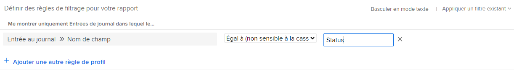

# Rapport sur la zone Mises à jour avec un rapport Entrée du journal

<!-- Audited: 11/2024 -->

Le rapport Entrée du journal présente les mises à jour du système à partir de la zone Mises à jour des projets, tâches, problèmes et autres objets qui n’étaient auparavant disponibles que par le biais de l’API Adobe Workfront. Bien qu’il s’agisse d’un rapport avancé destiné à des cas d’utilisation spécifiques, le format plus digeste vous permet de créer plus facilement un rapport sur l’activité du projet et des mises à jour du système dans Workfront.

>[!TIP]
>
>Le rapport Entrée du journal ne contient que les mises à jour du système issues de la zone d’objets Mises à jour. Pour créer un rapport sur les commentaires laissés dans la zone Mises à jour, vous devez utiliser le rapport de notes.\
>Pour plus d’informations sur le rapport de notes, voir [Afficher toutes les mises à jour dans un rapport de notes](../../../workfront-basics/updating-work-items-and-viewing-updates/view-all-updates-in-a-report.md).

Le rapport Entrée du journal peut afficher les éléments suivants :

* Combien de changements de statut ont eu lieu.
* Quand la suppression d’une tâche ou d’un problème est survenue.
* Comment les valeurs des champs personnalisés importants ont changé au cours du cycle de vie d’un projet.
* Quelles dates importantes ont changées au cours du cycle de vie d’un projet.
* Si la personne propriétaire d’un projet a changé.

## Conditions d’accès

+++ Développez pour afficher les exigences d’accès aux fonctionnalités de cet article.

Vous devez disposer des accès suivants pour effectuer les étapes décrites dans cet article :

<table style="table-layout:auto"> 
 <col> 
 <col> 
 <tbody> 
  <tr> 
   <td role="rowheader">Formule Adobe Workfront</td> 
   <td> 
Tous
 </td> 
  </tr> 
  <tr> 
   <td role="rowheader">Licence Adobe Workfront</td> 
      <td> 
      
Nouveau :

         <ul>
         <li>
Standard
</li>
         </ul>
      
Actuel :

         <ul>
         <li>
Plan
</li>
         </ul>
   </td> 
  </tr> 
  <tr> 
   <td role="rowheader">Configurations des niveaux d’accès</td> 
   <td> 
Modifier l’accès aux rapports, tableaux de bord et calendriers
 
Modifier l’accès aux filtres, vues et regroupements
 </td> 
  </tr> 
  <tr> 
   <td role="rowheader">Autorisations d’objet</td> 
   <td> 
Afficher des autorisations pour les objets contenant les entrées du journal affichées dans le rapport
 
Vous obtiendrez les autorisations de gestion du rapport après l’avoir créé.
 </td> 
  </tr> 
 </tbody> 
</table>

*Pour plus d’informations, voir [Conditions d’accès dans la documentation de Workfront](/help/quicksilver/administration-and-setup/add-users/access-levels-and-object-permissions/access-level-requirements-in-documentation.md).

+++

## Conditions préalables

Avant de pouvoir effectuer les actions décrites dans cet article, vous devez vous assurer des points suivants :

* Tous les champs (y compris les champs personnalisés) sur lesquels vous souhaitez créer des rapports sont suivis dans Workfront. Vous ne pouvez créer un rapport que sur les données de la zone Mises à jour qui est suivie.

  Pour savoir comment ajouter les champs que vous voulez que Workfront suive, voir [Configurer les mises à jour système](../../../administration-and-setup/set-up-workfront/system-tracked-update-feeds/configure-system-updates.md).

## Vue d’ensemble du rapport Entrée du journal

Grâce aux mises à jour du système de requêtes du rapport Entrée du journal, cette fonctionnalité peut renvoyer un nombre important de résultats. Par conséquent, nous vous recommandons de filtrer des objets spécifiques (projets, programmes, portfolios, groupes, etc.) lors de la création du rapport.

Pour en savoir plus sur les différents types d’objets dans Workfront, voir [Comprendre les objets dans Adobe Workfront](../../../workfront-basics/navigate-workfront/workfront-navigation/understand-objects.md).

>[!NOTE]
>
>Compte tenu de la quantité de données renvoyées par le rapport Entrée du journal, l’export et la diffusion des rapports planifiés ne sont pas pris en charge.

La vue par défaut de ce rapport contient les colonnes suivantes :

<table style="table-layout:auto"> 
 <col> 
 <col> 
 <thead> 
  <tr> 
   <th>champ</th> 
   <th>Explication</th> 
  </tr> 
 </thead> 
 <tbody> 
  <tr> 
   <td><strong>Nom du champ</strong> </td> 
   <td> 
Nom du champ affecté. Selon la façon dont vous avez configuré le rapport, cette colonne peut contenir le statut, l’identifiant de la personne propriétaire, le nom de la tâche, la date d’achèvement prévue ou d’autres champs. 
 
Lorsque <strong>DE</strong>: s’affiche dans cette colonne, cela indique que le champ répertorié est un champ personnalisé.
 </td> 
  </tr> 
  <tr> 
   <td><strong>Modifier le type</strong> </td> 
   <td> 
Type de modification apportée au champ affecté. En fonction des règles de filtrage que vous avez définies et des actions entreprises par les utilisateurs et utilisatrices, les éléments suivants peuvent apparaître dans ce champ :
 
    <ul> 
     <li> 
Ajouter
 </li> 
     <li> 
Audit
 </li> 
     <li> 
Supprimer
 </li> 
     <li> 
Synthèse
 </li> 
     <li> 
Modifier
 </li> 
     <li> 
Restaurer
 </li> 
    </ul> </td> 
  </tr> 
  <tr> 
   <td><strong>Code objet supérieur</strong> </td> 
   <td> 
Objet parent le plus élevé dans la hiérarchie.
 </td> 
  </tr> 
  <tr> 
   <td><strong>Portée</strong> </td> 
   <td> 
Type d’objet qui a été modifié.
 </td> 
  </tr> 
  <tr> 
   <td><strong>Date d’entrée</strong> </td> 
   <td> 
Date de modification du champ.
 </td> 
  </tr> 
  <tr> 
   <td><strong>Modifié par Nom</strong> </td> 
   <td> 
Utilisateur ou utilisatrice qui a modifié le champ.
 </td> 
  </tr> 
 </tbody> 
</table>

Pour organiser les informations dans ce rapport, vous pouvez utiliser le regroupement intégré appelé Projet. Le regroupement Projet vous donne un regroupement primaire de noms de projet et un regroupement secondaire de dates d’entrée. Vous pouvez appliquer ce regroupement existant lors de la création ou de la la visualisation du rapport.

Pour savoir comment configurer les vues, les filtres et les regroupements que vous souhaitez intégrer à votre rapport, voir la section correspondante :

<!--

(NOTE: from&nbsp;Luke: Take this for what it's worth, but part of me wonders if all of these subsections should be separate articles.

The biggest reason for breaking these up would be searchability, in my mind. For example, as a user, I might want to know how to see if the owner of a project changed. If I search the help site for that, I would be a lot more likely to find a separate article called "See if the owner of a project changed" vs an article titled "Create a Journal Entry report" because "Journal Entry" might mean nothing to me.) 

-->

* [Voir les modifications de statut effectuées](#see-what-status-changes-occurred)
* [Voir quand la suppression d’une tâche ou d’un problème est survenue.](#see-when-a-task-or-issue-was-deleted)
* [Voir les modifications apportées aux champs personnalisés du cycle de vie d’un projet](#see-how-custom-fields-changed-over-the-course-of-a-project-s-life-cycle)
* [Voir les modifications apportées à la date d’achèvement prévue au cours du cycle de vie d’un projet](#see-how-the-planned-completion-date-changed-over-the-course-of-a-project-s-life-cycle)
* [Voir si la personne propriétaire d’un projet a changé.](#see-if-the-owner-of-a-project-changed)

## Voir les modifications de statut effectuées {#see-what-status-changes-occurred}

Vous pouvez configurer le rapport d’entrée du journal de manière à ce qu’il affiche les éléments suivants :

* Combien de modifications de statut ont été effectuées pour un projet, une tâche ou un problème.

* Quel était le statut précédent avant la modification ?
* Qui a modifié le statut ?
* Date de modification du statut

Si vous souhaitez connaître l’état de santé d’un projet, vous pouvez également configurer le rapport pour qu’il affiche ces mêmes informations à l’aide du champ **Condition** du projet.

Ces informations peuvent servir à faciliter les audits et illustrer la qualité de votre planification et de celle de votre organisation.

1. Cliquez sur l’icône de **[!UICONTROL Menu principal]**  dans le coin supérieur droit d’Adobe Workfront, ou (si disponible), cliquez sur l’icône de **[!UICONTROL Menu principal]**  dans le coin supérieur gauche, puis cliquez sur **Rapports**.
1. Cliquez sur **Nouveau rapport**, puis sélectionnez **Entrée du journal**.

   

   Report Builder se charge.

1. Dans l’onglet **Colonnes (Vue)**, ajoutez les colonnes suivantes :

   <table style="table-layout:auto"> 
    <col> 
    <col> 
    <thead> 
     <tr> 
      <th>Colonnes</th> 
      <th>Explication</th> 
     </tr> 
    </thead> 
    <tbody> 
     <tr> 
      <td> 
Nom du champ
 </td> 
      <td> 
Nom du champ concerné. Dans ce cas, le <strong>statut</strong> doit s’afficher dans cette colonne.
 </td> 
     </tr> 
     <tr> 
      <td> 
Modifier le type
 </td> 
      <td> 
Le type de modification apportée au champ affecté, par exemple <strong>Ajouter</strong>, <strong>Supprimer</strong>, ou <strong>Modifier</strong>.
 </td> 
     </tr> 
     <tr> 
      <td> 
Modifié par Nom
 </td> 
      <td> 
Le nom de l’utilisateur ou de l’utilisatrice qui a modifié le statut.
 </td> 
     </tr> 
     <tr> 
      <td> 
Date d’entrée
 </td> 
      <td> 
La date de modification du statut.
 </td> 
     </tr> 
     <tr> 
      <td> 
Ancienne valeur du texte
 </td> 
      <td> 
La clé du statut précédent. Voici les clés de statut des statuts par défaut du projet :
 
       <ul> 
        <li> 
 <strong>CUR</strong> : actuel
 </li> 
        <li> 
<strong>DED</strong> : obsolète
 </li> 
        <li> 
<strong>ONH</strong> : en attente
 </li> 
        <li> 
<strong>PLN</strong> : en planification
 </li> 
        <li> 
<strong>CPL</strong> : terminé
 </li> 
        <li> 
<strong>REQ</strong> : demandé
 </li> 
        <li> 
<strong>APR</strong> : approuvé
 </li> 
        <li> 
<strong>REJ</strong> : rejeté
 </li> 
        <li> 
<strong>IDA</strong> : idée
 </li> 
       </ul> 
Si votre organisation a défini des statuts personnalisés, d’autres clés de statut peuvent apparaître dans cette colonne. Pour savoir quel statut personnalisé est lié à une clé de statut, contactez votre équipe d’administration Workfront ou votre administrateur ou administratrice de groupes.
 </td> 
     </tr> 
     <tr> 
      <td> 
Nouvelle valeur de texte
 </td> 
      <td> 
Clé du statut mis à jour.
 </td> 
     </tr> 
     <tr> 
      <td> 
Code objet supérieur
 </td> 
      <td> 
Objet parent de plus haut niveau du champ dont le statut a été modifié.
 </td> 
     </tr> 
     <tr> 
      <td> 
Étendue
 </td> 
      <td> 
Type d’objet dont le statut a été modifié.
 </td> 
     </tr> 
     <tr> 
      <td> 
Nom du problème (facultatif)
 </td> 
      <td> 
Nom du problème dont le statut a été modifié.
 </td> 
     </tr> 
     <tr> 
      <td> 
Nom de la tâche  (facultatif)
 </td> 
      <td> 
Nom de la tâche dont le statut a été modifié.
 </td> 
     </tr> 
    </tbody> 
   </table>

   Pour plus d’informations sur l’ajout de colonnes, voir [Vue d’ensemble des vues dans Adobe Workfront](../../../reports-and-dashboards/reports/reporting-elements/views-overview.md).

1. Dans l’onglet **Filtres**, cliquez sur **Ajouter une règle de filtre**, puis ajoutez la règle de filtre **Nom du champ** > **Égal** > **statut**.

   

   >[!TIP]
   >
   >Pour générer un rapport sur les changements de conditions, vous pouvez plutôt ajouter la règle de filtrage suivante : **Nom du champ** > **Égal à** > **Condition**.

   Pour plus d’informations sur l’ajout de filtres, voir [Vue d’ensemble des filtres](../../../reports-and-dashboards/reports/reporting-elements/filters-overview.md).

1. (Facultatif) Pour limiter le thème du rapport et réduire les temps de chargement, ajoutez une invite.

   Ou

   Créez des règles de filtrage supplémentaires pour inclure des projets, des tâches ou des problèmes spécifiques.

   >[!IMPORTANT]
   >
   >La création d’une règle de filtrage qui utilise le modificateur **Contient** peut augmenter les temps de chargement. Pour cette raison, nous recommandons d’utiliser un modificateur différent, tel qu’**Égal à**, lorsque cela est possible pour filtrer un projet spécifique ou un ID d’objet de niveau supérieur.

   Pour savoir comment ajouter une invite, voir [Ajouter une invite à un rapport](../../../reports-and-dashboards/reports/creating-and-managing-reports/add-prompt-report.md).

1. Dans l’onglet **Regroupements**, cliquez sur le menu **Appliquer un regroupement existant** et sélectionnez **Projet**.

   Pour plus d’informations sur l’ajout de regroupements, voir [Vue d’ensemble des regroupements dans Adobe Workfront](../../../reports-and-dashboards/reports/reporting-elements/groupings-overview.md).

1. Cliquez sur **Enregistrer + Fermer**.

   Votre nouveau rapport se charge.

## Voir quand la suppression d’une tâche ou d’un problème est survenue. {#see-when-a-task-or-issue-was-deleted}

Vous pouvez configurer le rapport d’entrée du journal de manière à ce qu’il affiche les éléments suivants :

* Tâches ou problèmes qui ont fait l’objet d’une suppression.
* Qui a supprimé une tâche ou un problème.

Pour savoir quand la suppression d’une tâche ou d’un problème est survenue :

1. Cliquez sur l’icône du **[!UICONTROL Menu principal]**  dans le coin supérieur droit d’Adobe Workfront, ou (si disponible), cliquez sur l’icône du **[!UICONTROL Menu principal]**  dans le coin supérieur gauche, puis cliquez sur **Rapports**.
1. Cliquez sur **Nouveau rapport**, puis sélectionnez **Entrée du journal**.

   

   Report Builder se charge.

1. Dans l’onglet **Colonnes (Vue)**, ajoutez les colonnes suivantes :

   <table style="table-layout:auto"> 
    <col> 
    <col> 
    <thead> 
     <tr> 
      <th>Colonnes</th> 
      <th>Explication</th> 
     </tr> 
    </thead> 
    <tbody> 
     <tr> 
      <td> 
Étendue
 </td> 
      <td> 
Type d’objet qui a été supprimé.
 </td> 
     </tr> 
     <tr> 
      <td> 
Modifier le type
 </td> 
      <td> 
Type de modification qui a été réalisée. La modification <strong>Supprimer</strong> s’affiche dans cette colonne.
 </td> 
     </tr> 
     <tr> 
      <td> 
Date d’entrée
 </td> 
      <td> 
Date de la suppression de la tâche ou du problème.
 </td> 
     </tr> 
     <tr> 
      <td> 
Modifié par Nom
 </td> 
      <td> 
Nom de l’utilisateur ou de l’utilisatrice qui a supprimé la tâche ou le problème.
 </td> 
     </tr> 
     <tr> 
      <td> 
Nom du projet
 </td> 
      <td> 
Nom du projet dont les tâches ou les problèmes ont fait l’objet d’une suppression.
 </td> 
     </tr> 
    </tbody> 
   </table>

   Pour plus d’informations sur l’ajout de colonnes, voir [Vue d’ensemble des vues dans Adobe Workfront](../../../reports-and-dashboards/reports/reporting-elements/views-overview.md).

1. Dans l’onglet **Filtres**, cliquez sur **Ajouter une règle de filtrage**, puis ajoutez les filtres suivants :

   * **Type de modification** > **Égal à** > **Supprimer**
   * **Identifiant du projet** > **Égal** > **&lt; nom du projet >**

     <!--WRITER check link; this png file has spaces
     -->

   Pour plus d’informations sur l’ajout de filtres, voir [Vue d’ensemble des filtres](../../../reports-and-dashboards/reports/reporting-elements/filters-overview.md).

1. (Facultatif) Pour limiter le thème du rapport et réduire les temps de chargement, ajoutez une invite.

   Ou

   Créez des règles de filtrage supplémentaires pour inclure des projets, des tâches ou des problèmes spécifiques.

   >[!IMPORTANT]
   >
   >La création d’une règle de filtrage qui utilise le modificateur **Contient** peut augmenter les temps de chargement. Pour cette raison, nous recommandons d’utiliser un modificateur différent, tel qu’**Égal à**, lorsque cela est possible pour filtrer un projet spécifique ou un ID d’objet de niveau supérieur.

   Pour découvrir comment ajouter une invite, voir [Ajouter une invite à un rapport](../../../reports-and-dashboards/reports/creating-and-managing-reports/add-prompt-report.md).

1. (Facultatif) Dans l’onglet **Regroupements**, cliquez sur le menu **Appliquer un regroupement existant** et sélectionnez **Projet**.

   Pour plus d’informations sur l’ajout de regroupements, voir [Vue d’ensemble des regroupements dans Adobe Workfront](../../../reports-and-dashboards/reports/reporting-elements/groupings-overview.md).

1. Cliquez sur **Enregistrer + Fermer**.

   Votre nouveau rapport se charge.

## Observer comment des champs personnalisés ont évolué au cours du cycle de vie d’un projet. {#see-how-custom-fields-changed-over-the-course-of-a-project-s-life-cycle}

Vous pouvez suivre les modifications importantes des champs au cours du projet. Pour ce faire, vous pouvez configurer l’entrée du journal pour effectuer un suivi des éléments suivants :

* Si certains champs personnalisés ont été ajoutés, mis à jour ou modifiés.
* Quand ces modifications ont été effectuées.
* Qui a effectué les modifications.

Pour observer comment des champs personnalisés ont évolué au cours du cycle de vie d’un projet :

1. Cliquez sur l’icône **[!UICONTROL Menu principal]**  dans le coin supérieur droit d’Adobe Workfront, ou (si celle-ci est disponible), cliquez sur l’icône **[!UICONTROL Menu principal]**  dans le coin supérieur gauche, puis cliquez sur **Rapports**.
1. Cliquez sur **Nouveau rapport**, puis sélectionnez **Entrée du journal**.

   

   Report Builder se charge.

1. Dans l’onglet **Colonnes (Affichage)** vérifiez que vous avez ou cliquez sur **Ajouter une colonne** pour ajouter les colonnes suivantes :

   <table style="table-layout:auto"> 
    <col> 
    <col> 
    <thead> 
     <tr> 
      <th>Colonnes</th> 
      <th>Explication</th> 
     </tr> 
    </thead> 
    <tbody> 
     <tr> 
      <td> 
Nom du champ
 </td> 
      <td> 
Nom du champ personnalisé affecté.
 
Lorsque <strong>DE</strong>: s’affiche dans cette colonne, cela indique que le champ répertorié est un champ personnalisé.
 </td> 
     </tr> 
     <tr> 
      <td> 
Modifier le type
 </td> 
      <td> 
Le type de modification apportée au champ affecté, par exemple <strong>Ajouter</strong>, <strong>Supprimer</strong>, ou <strong>Modifier</strong>.
 </td> 
     </tr> 
     <tr> 
      <td> 
Modifié par Nom
 </td> 
      <td> 
Nom de l’utilisateur ou de l’utilisatrice qui a mis à jour le champ personnalisé.
 </td> 
     </tr> 
     <tr> 
      <td> 
Date d’entrée
 </td> 
      <td> 
Date à laquelle la valeur du champ personnalisé a été modifiée.
 
Vous devez trier ce champ par ordre décroissant.
 </td> 
     </tr> 
     <tr> 
      <td> 
Ancienne valeur numérique
 </td> 
      <td> 
Valeur numérique précédente du champ personnalisé.
 </td> 
     </tr> 
     <tr> 
      <td> 
Nouvelle valeur numérique
 </td> 
      <td> 
Valeur numérique actuelle du champ personnalisé.
 </td> 
     </tr> 
     <tr> 
      <td> 
Ancienne valeur de la date
 </td> 
      <td> 
Valeur de date précédente du champ personnalisé.
 </td> 
     </tr> 
     <tr> 
      <td> 
Nouvelle valeur de date
 </td> 
      <td> 
Valeur de date actuelle du champ personnalisé.
 </td> 
     </tr> 
     <tr> 
      <td> 
Ancienne valeur du texte
 </td> 
      <td> 
Valeur de texte précédente du champ personnalisé.
 </td> 
     </tr> 
     <tr> 
      <td> 
Nouvelle valeur de texte
 </td> 
      <td> 
Valeur de texte actuelle du champ personnalisé.
 
Si le champ personnalisé est un champ de saisie semi-automatique, la colonne <strong>Nouvelle valeur de texte</strong> affiche l’ID de l’objet.
 </td> 
     </tr> 
    </tbody> 
   </table>

   Pour plus d’informations sur l’ajout de colonnes, voir [Vue d’ensemble des vues dans Adobe Workfront](../../../reports-and-dashboards/reports/reporting-elements/views-overview.md).

1. Dans l&#39;onglet **Filtres**, cliquez sur **Ajouter une règle de filtrage** puis ajoutez les filtres suivants :

   * **Nom du champ de l’entrée du journal** > **Contient** > **DE**

     >[!TIP]
     >
     >Pour limiter ce rapport à des champs personnalisés spécifiques, ajoutez la règle de filtrage **Nom du champ de saisie du journal** > **Égal** > **&lt; nom du champ personnalisé>**.

   * **Identifiant du projet** > **Égal** > **&lt; projet >**.

   

   Pour plus d’informations sur l’ajout de filtres, voir [Vue d’ensemble des filtres](../../../reports-and-dashboards/reports/reporting-elements/filters-overview.md).

1. (Facultatif) Pour limiter le thème du rapport et réduire les temps de chargement, ajoutez une invite.

   Ou

   Créez des règles de filtrage supplémentaires pour inclure des projets, des tâches ou des problèmes spécifiques.

   >[!IMPORTANT]
   >
   >La création d’une règle de filtrage qui utilise le modificateur **Contient** peut augmenter les temps de chargement. Pour cette raison, nous recommandons d’utiliser un modificateur différent, tel qu’**Égal à**, lorsque cela est possible pour filtrer un projet spécifique ou un ID d’objet de niveau supérieur.

   Pour savoir comment ajouter une invite, voir [Ajouter une invite à un rapport](../../../reports-and-dashboards/reports/creating-and-managing-reports/add-prompt-report.md).

1. Dans l’onglet **Regroupements**, cliquez sur le menu **Appliquer un regroupement existant** et sélectionnez **Projet**.

   Pour plus d’informations sur l’ajout de regroupements, voir [Vue d’ensemble des regroupements dans Adobe Workfront](../../../reports-and-dashboards/reports/reporting-elements/groupings-overview.md).

1. Cliquez sur **Enregistrer + Fermer**.

   Votre nouveau rapport se charge.

## Découvrir comment la date d’achèvement prévue a évolué au cours du cycle de vie d’un projet. {#see-how-the-planned-completion-date-changed-over-the-course-of-a-project-s-life-cycle}

Vous pouvez paramétrer le rapport d’entrée du journal pour montrer à quelle fréquence la date d’achèvement prévue change au cours de la vie d’un projet.

1. Cliquez sur l’icône de **[!UICONTROL Menu principal]**  dans le coin supérieur droit d’Adobe Workfront, ou (si disponible), cliquez sur l’icône de **[!UICONTROL Menu principal]**  dans le coin supérieur gauche, puis cliquez sur **Rapports**.
1. Cliquez sur **Nouveau rapport**, puis sélectionnez **Entrée du journal**.

   

   Report Builder se charge.

1. Dans l’onglet **Colonnes (Vue)**, ajoutez les colonnes suivantes :

   <table style="table-layout:auto"> 
    <col> 
    <col> 
    <thead> 
     <tr> 
      <th>Colonnes</th> 
      <th>Explication</th> 
     </tr> 
    </thead> 
    <tbody> 
     <tr> 
      <td> 
Nom du champ
 </td> 
      <td> 
Nom du champ concerné.
 
Lorsque <strong>DE</strong>: s’affiche dans cette colonne, cela indique que le champ répertorié est un champ personnalisé.
 </td> 
     </tr> 
     <tr> 
      <td> 
Modifier le type
 </td> 
      <td>Type de changement qui s’est produit, tel que <strong>Ajouter</strong>, <strong>Supprimer</strong>, ou <strong>Modifier</strong>.</td> 
     </tr> 
     <tr> 
      <td> 
Modifié par Nom
 </td> 
      <td> 
Nom de l’utilisateur ou de l’utilisatrice qui a mis à jour la date d’achèvement prévue du projet.
 </td> 
     </tr> 
     <tr> 
      <td> 
Date d’entrée
 </td> 
      <td> 
Date à laquelle la date d’achèvement prévue du projet a été modifiée.
 
Vous devez trier ce champ par ordre décroissant.
 </td> 
     </tr> 
     <tr> 
      <td> 
Code objet supérieur
 </td> 
      <td> 
Objet parent de plus haut niveau du champ dont la date d’achèvement prévue a été modifiée.
 </td> 
     </tr> 
     <tr> 
      <td> 
Étendue
 </td> 
      <td> 
Objet dont la date d’achèvement prévue a été modifiée.
 </td> 
     </tr> 
     <tr> 
      <td> 
Ancienne valeur de la date
 </td> 
      <td> 
Valeur précédente de la date d’achèvement prévue.
 </td> 
     </tr> 
     <tr> 
      <td> 
Nouvelle valeur de date
 </td> 
      <td> 
Valeur actuelle de la date d’achèvement prévue.
 </td> 
     </tr> 
     <tr> 
      <td> 
Nom du projet
 
(Facultatif)
 </td> 
      <td> 
Nom du projet dont la date d’achèvement prévue a été modifiée.
 </td> 
     </tr> 
     <tr> 
      <td> 
Nom de la tâche
 
(Facultatif)
 </td> 
      <td> 
Nom des tâches du projet dont la date d’achèvement prévue a été modifiée.
 </td> 
     </tr> 
     <tr> 
      <td> 
Nom de l’événement
 
(Facultatif)
 </td> 
      <td>Nom des problèmes du projet dont la date d’achèvement prévue a été modifiée.</td> 
     </tr> 
    </tbody> 
   </table>

   Pour plus d’informations sur l’ajout de colonnes, voir [Vue d’ensemble des vues dans Adobe Workfront](../../../reports-and-dashboards/reports/reporting-elements/views-overview.md).

1. Dans l&#39;onglet **Filtres**, cliquez sur **Ajouter une règle de filtrage** puis ajoutez ce qui suit :

   * **Nom du champ** > **Égal à** > **Date**
   * **Identifiant du projet** > **Égal** > **&lt; nom du projet >**.

   

   Pour plus d’informations sur l’ajout de filtres, voir [Vue d’ensemble des filtres](../../../reports-and-dashboards/reports/reporting-elements/filters-overview.md).

1. (Facultatif) Pour limiter le thème du rapport et réduire les temps de chargement, ajoutez une invite.

   Ou

   Créez des règles de filtrage supplémentaires pour inclure des projets, des tâches ou des problèmes spécifiques.

   >[!IMPORTANT]
   >
   >La création d’une règle de filtrage qui utilise le modificateur **Contient** peut augmenter les temps de chargement. Pour cette raison, nous recommandons d’utiliser un modificateur différent, tel qu’**Égal à**, lorsque cela est possible pour filtrer un projet spécifique ou un ID d’objet de niveau supérieur.

   Pour savoir comment ajouter une invite, voir [Ajouter une invite à un rapport](../../../reports-and-dashboards/reports/creating-and-managing-reports/add-prompt-report.md).

1. Dans l’onglet **Regroupements**, cliquez sur le menu **Appliquer un regroupement existant** et sélectionnez **Projet**.

   Pour plus d’informations sur l’ajout de regroupements, voir [Vue d’ensemble des regroupements dans Adobe Workfront](../../../reports-and-dashboards/reports/reporting-elements/groupings-overview.md).

1. Cliquez sur **Enregistrer + Fermer**.

   Votre nouveau rapport se charge.

## Voir si la personne propriétaire d’un projet a changé. {#see-if-the-owner-of-a-project-changed}

Vous pouvez configurer le rapport d’entrée du journal pour montrer combien de fois la personne propriétaire du projet, ou la personne chargée de la gestion du projet, change au cours de la vie d’un projet.

1. Cliquez sur l’icône de **[!UICONTROL Menu principal]**  dans le coin supérieur droit d’Adobe Workfront, ou (si disponible), cliquez sur l’icône de **[!UICONTROL Menu principal]**  dans le coin supérieur gauche, puis cliquez sur **Rapports**.
1. Cliquez sur **Nouveau rapport**, puis sélectionnez **Entrée du journal**.

   

   Report Builder se charge.

1. Dans l’onglet **Colonnes (Vue)**, ajoutez les colonnes suivantes :

   <table style="table-layout:auto"> 
    <col> 
    <col> 
    <thead> 
     <tr> 
      <th>Colonnes</th> 
      <th>Explication</th> 
     </tr> 
    </thead> 
    <tbody> 
     <tr> 
      <td> 
Nom du champ
 </td> 
      <td>Nom du champ concerné. La valeur <strong>ownerID</strong> s’affiche dans cette colonne.</td> 
     </tr> 
     <tr> 
      <td> 
Modifier le type
 </td> 
      <td> 
Type de changement qui s’est produit, tel que <strong>Ajouter</strong>, <strong>Supprimer</strong>, ou <strong>Modifier</strong>.
 </td> 
     </tr> 
     <tr> 
      <td> 
Code objet supérieur
 </td> 
      <td> 
Objet parent de plus haut niveau du projet dont la personne propriétaire a été mise à jour.
 </td> 
     </tr> 
     <tr> 
      <td> 
Date d’entrée
 </td> 
      <td>Date à laquelle la personne propriétaire du projet a été modifiée. Vous devez trier ce champ par ordre décroissant.</td> 
     </tr> 
     <tr> 
      <td> 
Modifié par Nom
 </td> 
      <td> 
Nom de l’utilisateur ou de l’utilisatrice qui a mis à jour la personne propriétaire du projet.
 </td> 
     </tr> 
     <tr> 
      <td> 
Infos supplémentaires 1
 </td> 
      <td> 
Personne propriétaire actuelle du projet.
 </td> 
     </tr> 
     <tr> 
      <td> 
Infos supplémentaires 2
 </td> 
      <td> 
Précédente personne propriétaire du projet.
 </td> 
     </tr> 
     <tr> 
      <td> 
Nom du projet
 </td> 
      <td> 
Projet dont le champ Personne propriétaire a été mis à jour.
 </td> 
     </tr> 
    </tbody> 
   </table>

   Pour plus d’informations sur l’ajout de colonnes, voir [Vue d’ensemble des vues dans Adobe Workfront](../../../reports-and-dashboards/reports/reporting-elements/views-overview.md).

1. Dans l’onglet **Filtres**, cliquez sur **Ajouter une règle de filtrage**, puis ajoutez ce qui suit :

   * **Nom du champ** > **Égal à** > **ownerID**
   * **Identifiant du projet** > **Égal** > **&lt; nom du projet >**.

   

   Pour plus d’informations sur l’ajout de filtres, voir [Vue d’ensemble des filtres](../../../reports-and-dashboards/reports/reporting-elements/filters-overview.md).

1. (Facultatif) Pour limiter le thème du rapport et réduire les temps de chargement, ajoutez une invite.

   Ou

   Créez des règles de filtrage supplémentaires pour inclure des projets, des tâches ou des problèmes spécifiques.

   >[!IMPORTANT]
   >
   >La création d’une règle de filtrage qui utilise le modificateur **Contient** peut augmenter les temps de chargement. Pour cette raison, nous recommandons d’utiliser un modificateur différent, tel qu’**Égal à**, lorsque cela est possible pour filtrer un projet spécifique ou un ID d’objet de niveau supérieur.

   Pour découvrir comment ajouter une invite, voir [Ajouter une invite à un rapport](../../../reports-and-dashboards/reports/creating-and-managing-reports/add-prompt-report.md).

1. (Facultatif) Dans l’onglet **Regroupements**, cliquez sur le menu **Appliquer un regroupement existant** et sélectionnez **Projet**.

   Pour plus d’informations sur l’ajout de regroupements, voir [Vue d’ensemble des regroupements dans Adobe Workfront](../../../reports-and-dashboards/reports/reporting-elements/groupings-overview.md).

1. Cliquez sur **Enregistrer + Fermer**.

   Le nouveau rapport d&#39;entrée de journal s&#39;affiche.
