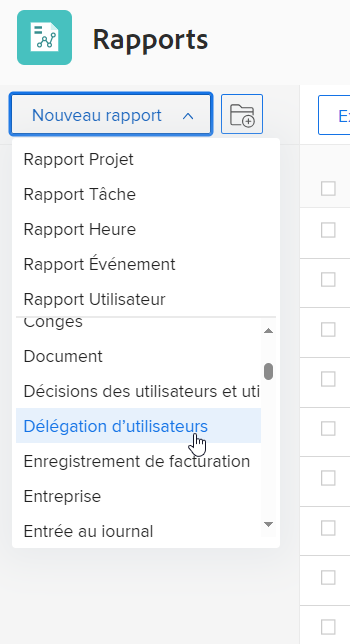

# Créer un rapport sur la délégation d’utilisateurs et d’utilisatrices

<!--

(NOTE: consider moving this to the Custom&nbsp;View, Filter, Grouping Samples section as an example of a report)

-->

Adobe Workfront permet aux utilisateurs et utilisatrices de déléguer les approbations de projets, de tâches et d’émissions à d’autres personnes, pour s’assurer que leurs approbations sont gérées lorsqu’ils ne sont pas au travail. Les personnes disposant d’une licence Plan peuvent créer un rapport sur la délégation d’utilisateurs et d’utilisatrices pour afficher :

* Qui a délégué à une autre personne l’approbation de ses tâches, problèmes et projets
* Personnes auxquelles ont été déléguées des approbations de tâches, de problèmes et de projets.

* Dates de début et de fin des délégations

Pour en savoir plus sur la délégation des approbations, voir [Déléguer une demande d’approbation](../../../review-and-approve-work/manage-approvals/delegate-approval-requests.md).

<!--

DRAFTED: To learn more about delegating work, see <a href="../../../workfront-basics/manage-your-account-and-profile/manage-time-off/personal-time-off.md" class="MCXref xref">Log personal time off and delegate your work</a>.

-->

<!--

DRAFTED: To learn how to manage delegated work in Home, see [future link here].

-->

## Conditions d’accès

Vous devez disposer des accès suivants pour effectuer les étapes décrites dans cet article :

<table style="table-layout:auto"> 
 <col> 
 <col> 
 <tbody> 
  <tr> 
   <td role="rowheader">Formule Adobe Workfront*</td> 
   <td> 
Tous
 </td> 
  </tr> 
  <tr> 
   <td role="rowheader">Licence Adobe Workfront*</td> 
   <td> 
Plan 
 </td> 
  </tr> 
  <tr> 
   <td role="rowheader">Configurations du niveau d’accès*</td> 
   <td> 
Modifier l’accès aux rapports, tableaux de bord et calendriers
 
Modifier l’accès aux filtres, vues et regroupements
 
Remarque : si vous n’avez toujours pas d’accès, demandez à votre équipe d’administration Workfront s’il existe des restrictions supplémentaires à votre niveau d’accès. Pour plus d’informations sur la façon dont un administrateur ou une administratrice Workfront peut modifier votre niveau d’accès, voir <a href="../../../administration-and-setup/add-users/configure-and-grant-access/create-modify-access-levels.md" class="MCXref xref">Créer ou modifier des niveaux d’accès personnalisés</a>.
 </td> 
  </tr> 
  <tr> 
   <td role="rowheader">Autorisations d’objet</td> 
   <td> 
Autorisations d’affichage des éléments dont les approbations sont déléguées et des personnes impliquées dans la délégation.
 
Pour plus d’informations sur la demande d’accès supplémentaire, voir <a href="../../../workfront-basics/grant-and-request-access-to-objects/request-access.md" class="MCXref xref">Demander l’accès aux objets </a>.
 </td> 
  </tr> 
 </tbody> 
</table>

&#42;Pour connaître le forfait, le type de licence ou l’accès dont vous disposez, contactez votre administrateur ou administratrice Workfront.

## Créer un rapport sur la délégation d’utilisateurs et d’utilisatrices

1. Cliquez sur l’icône **Menu principal**  dans le coin supérieur droit d’Adobe Workfront, puis cliquez sur **Rapports**.

1. Cliquez sur **Nouveau rapport**, puis sélectionnez **Délégation d’utilisateurs et d’utilisatrices**.\
   

   Les champs suivants s’affichent par défaut dans ce rapport :

   | champ | Description |
   |---|---|
   | **De Utilisateur ou utilisatrice** | Personne qui délègue ses approbations de tâches, de problèmes et de projets à une autre personne. |
   | **À Utilisateur ou utilisatrice** | Personne à laquelle sont déléguées les approbations de tâches, de problèmes et de projets. |
   | **Début** | Début de l’heure d’absence du bureau pour la personne qui a effectué les délégations. |
   | **Fin** | Fin de l’heure d’absence du bureau pour la personne qui a effectué les délégations. |

   {style="table-layout:auto"}

1. (Facultatif) Dans le générateur de rapports, modifiez les éléments suivants :

   * Colonnes
   * Regroupements
   * Filtres
   * Graphique

   Pour en savoir plus sur ces fonctionnalités, voir [Créer un rapport personnalisé](../../../reports-and-dashboards/reports/creating-and-managing-reports/create-custom-report.md).

1. Une fois le rapport terminé, cliquez sur **Enregistrer et fermer**.

1. Saisissez un nouveau nom dans le champ **Nom du rapport**, puis cliquez sur **Enregistrer le rapport**.

   Le rapport s’affiche.
