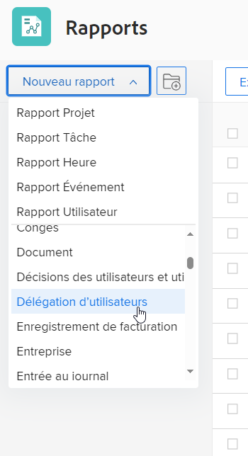

# Créer un rapport sur la délégation d’utilisateurs et d’utilisatrices

<!--Audited: 10/2024-->

<!--

(NOTE: consider moving this to the Custom&nbsp;View, Filter, Grouping Samples section as an example of a report)

-->

Adobe Workfront permet aux utilisateurs et utilisatrices de déléguer les approbations de projets, de tâches et d’émissions à d’autres personnes, pour s’assurer que leurs approbations sont gérées lorsqu’ils ne sont pas au travail. Les utilisateurs disposant d’une licence Standard ou Plan peuvent créer un rapport de délégation des utilisateurs pour afficher les éléments suivants :

* Qui a délégué à une autre personne l’approbation de ses tâches, problèmes et projets
* Personnes auxquelles ont été déléguées des approbations de tâches, de problèmes et de projets.

* Dates de début et de fin des délégations

Pour en savoir plus sur la délégation des approbations, voir [Déléguer une demande d’approbation](../../../review-and-approve-work/manage-approvals/delegate-approval-requests.md).

<!--

DRAFTED: To learn more about delegating work, see <a href="../../../workfront-basics/manage-your-account-and-profile/manage-time-off/personal-time-off.md" class="MCXref xref">Log personal time off and delegate your work</a>.

-->

<!--

DRAFTED: To learn how to manage delegated work in Home, see [future link here].

-->

## Conditions d’accès

+++ Développez pour afficher les exigences d’accès aux fonctionnalités de cet article. 

<table style="table-layout:auto"> 
 <col> 
 <col> 
 <tbody> 
  <tr> 
   <td role="rowheader">Package Adobe Workfront</td> 
   <td> 
Tous
 </td> 
  </tr> 
  <tr> 
   <td role="rowheader">Licence Adobe Workfront</td> 
   <td> 
      
Standard

      
Plan

   </td>
  </tr> 
  <tr> 
   <td role="rowheader">Configuration du niveau d’accès</td> 
   <td> 
Accès en modification aux rapports, tableaux de bord et calendriers
 
Modifier l’accès aux filtres, vues et groupes
 </td> 
  </tr> 
  <tr> 
   <td role="rowheader">Autorisations d’objet</td> 
 <td> 
Autorisations d’affichage des éléments dont les approbations sont déléguées et des personnes impliquées dans la délégation.
</td>  
  </tr> 
 </tbody> 
</table>

Pour plus de détails sur les informations contenues dans ce tableau, consultez [Conditions d’accès préalables dans la documentation Workfront](/help/quicksilver/administration-and-setup/add-users/access-levels-and-object-permissions/access-level-requirements-in-documentation.md).

+++

## Créer un rapport sur la délégation d’utilisateurs et d’utilisatrices

1. Cliquez sur l’icône **Menu principal**  dans le coin supérieur droit d’Adobe Workfront, puis cliquez sur **Rapports**.

1. Cliquez sur **Nouveau rapport**, puis sélectionnez **Délégation d’utilisateurs et d’utilisatrices**.

   

   Les champs suivants s’affichent par défaut dans ce rapport :

   | champ | Description |
   |---|---|
   | **De Utilisateur ou utilisatrice** | Personne qui délègue ses approbations de tâches, de problèmes et de projets à une autre personne. |
   | **À Utilisateur ou utilisatrice** | Personne à laquelle sont déléguées les approbations de tâches, de problèmes et de projets. |
   | **Date de début** | Début de l’heure d’absence du bureau pour la personne qui a effectué les délégations. |
   | **Date de fin** | Fin de l’heure d’absence du bureau pour la personne qui a effectué les délégations. |

   {style="table-layout:auto"}

1. (Facultatif) Dans le générateur de rapports, modifiez les éléments suivants :

   * Colonnes (Affichage)
   * Regroupements
   * Filtres
   * Graphique

   Pour en savoir plus sur ces fonctionnalités, voir [Créer un rapport personnalisé](../../../reports-and-dashboards/reports/creating-and-managing-reports/create-custom-report.md).

1. Une fois le rapport terminé, cliquez sur **Enregistrer et fermer**.

   Le rapport s’affiche.
