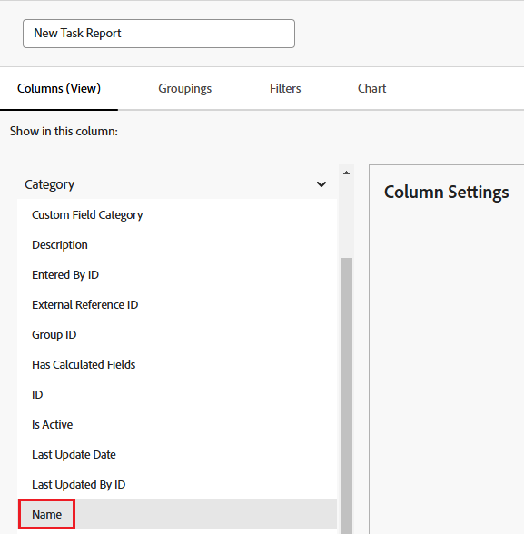
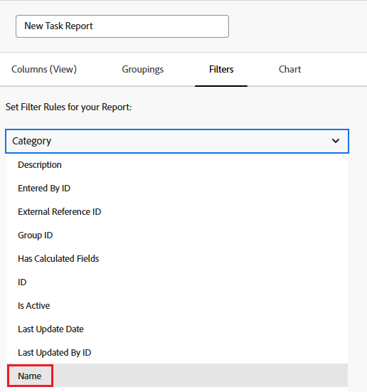

# Référencer un formulaire personnalisé dans un rapport

Vous pouvez référencer les formulaires personnalisés d’un objet dans les options Vues, Filtres et Groupements d’un rapport pour cet objet.

Vous pouvez référencer le contenu des formulaires personnalisés à inclure dans un rapport ou vous pouvez référencer des informations sur les formulaires personnalisés à inclure dans un rapport.

## Conditions d’accès

Vous devez disposer des accès suivants pour effectuer les étapes de cet article :

<table style="table-layout:auto"> 
 <col> 
 <col> 
 <tbody> 
  <tr> 
   <td role="rowheader">Forfait Adobe Workfront*</td> 
   <td> 
N’importe quelle
 </td> 
  </tr> 
  <tr> 
   <td role="rowheader">Licence Adobe Workfront*</td> 
   <td> 
Plan 
 </td> 
  </tr> 
  <tr> 
   <td role="rowheader">Configurations des niveau d’accès*</td> 
   <td> 
Modification de l’accès aux rapports, tableaux de bord et calendriers
 
Modifier l’accès aux filtres, vues et groupes
 
Remarque : si vous n’avez toujours pas d’accès, demandez à votre équipe d’administration Workfront s’il existe des restrictions supplémentaires à votre niveau d’accès. Pour plus d’informations sur la façon dont un administrateur ou une administratrice Workfront peut modifier votre niveau d’accès, voir <a href="../../../administration-and-setup/add-users/configure-and-grant-access/create-modify-access-levels.md" class="MCXref xref">Créer ou modifier les niveaux d’accès personnalisés</a>.
 </td> 
  </tr> 
  <tr> 
   <td role="rowheader">Autorisations d’objet</td> 
   <td> 
Gérer les autorisations d’un rapport
 
Pour plus d’informations sur la demande d’accès supplémentaire, voir <a href="../../../workfront-basics/grant-and-request-access-to-objects/request-access.md" class="MCXref xref">Demander l’accès aux objets</a>.
 </td> 
  </tr> 
 </tbody> 
</table>

&#42;Pour connaître le forfait, le type de licence ou l’accès dont vous disposez, contactez votre administrateur ou administratrice Workfront.

## Conditions préalables

Le formulaire personnalisé doit exister avant de pouvoir le référencer dans un rapport.

Pour plus d’informations sur la création de formulaires personnalisés, voir [Concevoir un formulaire avec le concepteur de formulaires](/help/quicksilver/administration-and-setup/customize-workfront/create-manage-custom-forms/form-designer/design-a-form/design-a-form.md).

## Référence au contenu des formulaires personnalisés

Vous pouvez référencer des champs dans des formulaires personnalisés. Après l’application d’un formulaire personnalisé à un objet, tous les champs associés à ce formulaire personnalisé peuvent être référencés dans un rapport, comme le serait tout autre champ de l’objet.

>[!NOTE]
>
>Pour les champs comportant plusieurs options, toutes les options sont disponibles dans les Filtres et invites du rapport, y compris celles qui sont masquées.\
>Pour plus d’informations sur le masquage de choix à partir d’un champ personnalisé avec plusieurs options, consultez l’article [Concevoir un formulaire avec le concepteur de formulaire](/help/quicksilver/administration-and-setup/customize-workfront/create-manage-custom-forms/form-designer/design-a-form/design-a-form.md).

Lors de la création du rapport, il vous suffit d’utiliser le type d’objet du formulaire comme source du champ et d’utiliser le nom du champ personnalisé comme nom du champ.

Par exemple, un formulaire personnalisé peut être appliqué à tous les projets qui incluent le champ personnalisé **Consultant**. Pour créer un rapport qui répertorie tous les projets pour lesquels Olivia Kim est consultant, utilisez le type d’objet **Project** comme source de champ et utilisez **Consultant** comme nom de champ. Définissez le qualificateur de filtre sur **Equal**, puis saisissez Olivia Kim.

Pour plus d’informations sur la création d’un rapport, consultez l’article [Créer un rapport personnalisé](../../../reports-and-dashboards/reports/creating-and-managing-reports/create-custom-report.md).

## Informations de référence sur les formulaires personnalisés

Vous pouvez référencer des informations sur des formulaires personnalisés, tels que le nom de tout formulaire personnalisé associé à un objet.

&#x200B; Selon l’élément (Affichage, Filtre ou Groupement), vous pouvez référencer :

* Le formulaire personnalisé principal appliqué à un objet :

  Il s’agit du formulaire qui s’affiche en premier sur la page Détails de l’objet.

* Tous les formulaires personnalisés (si plusieurs formulaires personnalisés sont appliqués à un objet)

Vous pouvez référencer des formulaires personnalisés sur des vues, des filtres et des regroupements :

* [Référence des formulaires personnalisés dans une vue de rapport (colonne)](#reference-custom-forms-in-a-report-view-column)
* [Référence aux formulaires personnalisés dans un filtre de rapport](#reference-custom-forms-in-a-report-filter)
* [Référencer des formulaires personnalisés dans un groupement de rapports](#reference-custom-forms-in-a-report-grouping)

### Référencer des formulaires personnalisés dans une vue de rapport (colonne) {#reference-custom-forms-in-a-report-view-column}

Pour afficher tous les formulaires personnalisés associés à un objet :

1. Commencez à créer un rapport comme décrit dans l’article [Créer un rapport personnalisé](../../../reports-and-dashboards/reports/creating-and-managing-reports/create-custom-report.md).
1. Sur l’onglet **Colonnes** , développez le type d’objet auquel le formulaire personnalisé à référencer est appliqué, puis cliquez sur **Nom de catégorie**.\
   Par exemple, pour afficher tous les formulaires personnalisés associés à une tâche, développez la source de champ **Tâche**, puis cliquez sur le nom du champ **Nom de catégorie**.\
   

Pour afficher uniquement le formulaire personnalisé principal associé à l’objet :

1. Commencez à créer un rapport comme décrit dans l’article [Créer un rapport personnalisé](../../../reports-and-dashboards/reports/creating-and-managing-reports/create-custom-report.md).
1. Dans l’onglet **Colonnes**, développez la source de champ **Catégorie**, puis cliquez sur le nom du champ **Nom**.\
   

### Référence aux formulaires personnalisés dans un filtre de rapport {#reference-custom-forms-in-a-report-filter}

Pour filtrer tous les formulaires personnalisés associés au type d’objet :

1. Commencez à créer un rapport comme décrit dans l’article [Créer un rapport personnalisé](../../../reports-and-dashboards/reports/creating-and-managing-reports/create-custom-report.md).
1. Dans l’onglet **Filtres**, développez **Catégories**, puis cliquez sur **Nom**.\
   

1. Sélectionnez le qualificateur de condition à utiliser :

   * Vide
   * Non vide
   * Contient
   * Ne contient pas
   * Égal à (non sensible à la casse)
   * Non égal à (non sensible à la casse)

   Pour plus d’informations sur chaque qualificateur, consultez l’article [Modificateurs de condition et de filtre](../../../reports-and-dashboards/reports/reporting-elements/filter-condition-modifiers.md).

   >[!NOTE]
   >
   >Si le champ que vous filtrez comporte plusieurs options et que vous utilisez les qualificateurs **Not Equal** ou **Does Not Contain** , cela filtre les résultats qui contiennent uniquement le choix que vous spécifiez. Si le champ contient des options supplémentaires, y compris celle spécifiée, ces résultats ne sont pas filtrés à partir du rapport. Cela inclut le filtrage de plusieurs Forms personnalisées si elles sont jointes au même objet.

1. Commencez à saisir le nom du formulaire personnalisé sur lequel vous souhaitez filtrer les données, puis cliquez sur le nom lorsqu’il apparaît dans la liste déroulante.
1. (Facultatif) Cliquez sur **Ajouter une autre règle de filtrage**, puis répétez les étapes 2 à 4 pour créer des règles de filtrage supplémentaires.
1. Cliquez sur **Enregistrer+Fermer**.

Pour filtrer uniquement le formulaire personnalisé principal associé au type d’objet :

1. Commencez à créer un rapport comme décrit dans l’article [Créer un rapport personnalisé](../../../reports-and-dashboards/reports/creating-and-managing-reports/create-custom-report.md).
1. Dans l’onglet **Filtres**, développez la source de champ **Catégorie**, puis cliquez sur le nom du champ **Nom**.\
   

1. Sélectionnez le qualificateur de condition à utiliser :

   * Vide
   * Non vide
   * Contient
   * Ne contient pas
   * Égal à (non sensible à la casse)
   * Non égal à (non sensible à la casse)

   Pour plus d’informations sur chaque qualificateur, consultez l’article [Modificateurs de condition et de filtre](../../../reports-and-dashboards/reports/reporting-elements/filter-condition-modifiers.md).

1. Commencez à saisir le nom du formulaire personnalisé sur lequel vous souhaitez filtrer les données, puis cliquez sur le nom lorsqu’il apparaît dans la liste déroulante.
1. (Facultatif) Cliquez sur **Ajouter une autre règle de filtrage**, puis répétez les étapes 2 à 4 pour créer des règles de filtrage supplémentaires.
1. Cliquez sur **Enregistrer+Fermer**.

### Référencer des formulaires personnalisés dans un groupement de rapports {#reference-custom-forms-in-a-report-grouping}

>[!NOTE]
>
>Vous ne pouvez regrouper les éléments que par le formulaire personnalisé principal associé à l’objet ; vous ne pouvez pas regrouper les éléments selon tous les formulaires associés à l’objet.

1. Commencez à créer un rapport comme décrit dans l’article [Créer un rapport personnalisé](../../../reports-and-dashboards/reports/creating-and-managing-reports/create-custom-report.md).
1. Dans l’onglet **Groupings**, développez **Category**, puis cliquez sur **Name**.\
   
