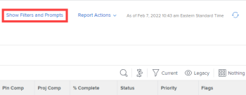

# Exécution d’un rapport

Vous pouvez exécuter n’importe quel rapport ayant accès à Afficher.

<!--
NOTE: ***Linked to Getting Started with Reporting.***This information is obsolete, because asynchronous timeline is not enabled for all customers (used to be included in the "Viewing a Cached Report" section): Some reports in Workfront can take a significant time to load. If your report takes longer than 30 seconds to load, your report is cached after it is finished loading, and a message is displayed in the upper-right corner of the page indicating that the report being viewed is a saved report from a specific time.

After a report is cached, it is available for the next 12 hours. Any user who runs the report (as described in "Running a Report") sees the cached report.)
-->

## Exigences d’accès

Vous devez disposer des accès suivants pour effectuer les étapes de cet article :

<table style="table-layout:auto"> 
 <col> 
 </col> 
 <col> 
 </col> 
 <tbody> 
  <tr> 
   <td role="rowheader">Formule Adobe Workfront*</td> 
   <td> 
Tous
 </td> 
  </tr> 
  <tr> 
   <td role="rowheader">Licence Adobe Workfront*</td> 
   <td> 
Plan 
 </td> 
  </tr> 
  <tr> 
   <td role="rowheader">Paramétrages du niveau d'accès*</td> 
   <td> 
Afficher l’accès aux rapports, tableaux de bord, calendriers
 
Remarque : Si vous n’avez toujours pas accès à , demandez à votre administrateur Workfront s’il définit des restrictions supplémentaires à votre niveau d’accès. Pour plus d’informations sur la façon dont un administrateur Workfront peut modifier votre niveau d’accès, voir <a href="../../../administration-and-setup/add-users/configure-and-grant-access/create-modify-access-levels.md" class="MCXref xref">Création ou modification de niveaux d’accès personnalisés</a>.
 </td> 
  </tr> 
  <tr> 
   <td role="rowheader">Autorisations d’objet</td> 
   <td> 
Affichage des autorisations pour un rapport
 
Pour plus d’informations sur la demande d’accès supplémentaire, voir <a href="../../../workfront-basics/grant-and-request-access-to-objects/request-access.md" class="MCXref xref">Demande d’accès aux objets </a>.
 </td> 
  </tr> 
 </tbody> 
</table>

&#42;Pour connaître le plan, le type de licence ou l’accès dont vous disposez, contactez votre administrateur Workfront.

## Exécution d’un rapport

1. Cliquez sur le bouton **Menu Principal** icon  dans le coin supérieur droit d’Adobe Workfront, puis cliquez sur **Rapports**.

1. Sélectionnez l’une des options suivantes :

   * **Mes rapports :** Rapports que vous avez créés.
   * **Partagé avec moi :** Rapports que d’autres utilisateurs ont partagés avec vous.
   * **Tous les rapports :** Tous les rapports du système auxquels vous avez accès.

1. Cliquez sur le nom du rapport à exécuter.\
   Ou\
   Si le rapport a été créé à l&#39;aide d&#39;invites, sélectionnez les informations appropriées dans les menus déroulants, puis cliquez sur **Exécuter le rapport**.\
   Pour plus d’informations sur les invites, voir [Ajout d’une invite à un rapport](../../../reports-and-dashboards/reports/creating-and-managing-reports/add-prompt-report.md).\
   Le contenu du rapport s’affiche avec un horodatage dans le coin supérieur droit du rapport, qui inclut la date, l’heure et le fuseau horaire lorsque le rapport a été exécuté à partir du contexte de l’utilisateur qui l’a exécuté.

1. (Facultatif) Cliquez sur le **Icône Recharger**  pour actualiser les résultats dans un rapport si le rapport a été affiché dans votre navigateur pendant un certain temps.

1. (Conditionnel) Si le rapport utilise des filtres ou des invites, cliquez sur **Afficher les filtres et les invites** pour afficher la liste des filtres et des invites utilisés sur le rapport que vous consultez. Si le rapport ne contient que des filtres ou uniquement des invites, **Afficher les filtres** ou **Afficher les invites** apparaît à la place.

   

   Les informations s’affichent sous le nom du rapport sur le côté gauche de la page. Pour les invites, il s’agit d’informations sur les sélections rapides effectuées au moment de l’exécution du rapport, comme décrit à l’étape 4.

1. Si vous utilisez des invites personnalisées, elles ne s’affichent pas. Seules les invites du système s’affichent. Les filtres personnalisés s’affichent toujours.

## Affichage d’un rapport mis en cache

Votre rapport peut être mis en cache s’il a été affiché dans votre navigateur pendant un certain temps. Vous pouvez forcer un rapport mis en cache à se recharger lorsque vous effectuez l’une des actions suivantes :

* Modifiez les paramètres du rapport et enregistrez-le.
* Modifiez l’affichage, le groupe ou le filtre.
* Cliquez sur le bouton **Icône Recharger**
Cette option est disponible dans le coin supérieur droit de la page, dans la zone de message, pour indiquer l’heure d’enregistrement du rapport ou dans le coin supérieur droit du tableau de bord sur lequel le rapport est placé. Pour plus d’informations sur le rechargement des tableaux de bord, consultez la section &quot;Tableaux de bord d’affichage&quot; de l’article. [Prise en main des tableaux de bord](../../../reports-and-dashboards/dashboards/understanding-dashboards/get-started-dashboards.md).

* Accédez à n’importe quelle page du rapport au-delà de la première page en accédant aux onglets Résumé, Matrice ou Graphique .
