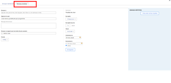

# Présentation de la diffusion des rapports

<!--

(NOTE: This is linked to the UI in the Send Report box inside the Preview sandbox. If you change title, log bug for Dev to fix the link) 

-->

Vous pouvez planifier la remise automatique des rapports aux utilisateurs selon un calendrier défini ou envoyer les rapports ponctuellement, manuellement. Lorsque vous envoyez un rapport d’Adobe Workfront, l’utilisateur reçoit un courrier électronique contenant le rapport Workfront en pièce jointe distincte.

Pour plus d’informations sur la configuration d’un rapport pour la diffusion, reportez-vous à l’article [Planifier la remise automatique d’un rapport](../../../reports-and-dashboards/reports/creating-and-managing-reports/set-up-automatic-report-delivery.md).

Vous ne pouvez pas planifier de remise de rapports, ni les diffuser manuellement dans l’environnement Aperçu d’un environnement de test. Pour plus d’informations sur l’aperçu de l’environnement de test, voir l’article [Environnement Adobe Workfront Preview Sandbox](../../../administration-and-setup/set-up-workfront/workfront-testing-environments/wf-preview-sandbox-environment.md).\
Pour plus d’informations sur la diffusion de rapports dans l’environnement de prévisualisation Sandbox, consultez l’article . [Envoi d’un rapport dans l’environnement Aperçu d’un environnement Sandbox](../../../reports-and-dashboards/reports/creating-and-managing-reports/send-report-preview-sandbox-environment.md).

## Limites de diffusion des rapports

<!--

(NOTE: [! This information is shared between "Exporting Data" and "Setting Up Report Deliveries."])

-->

Tenez compte des points suivants lors de la planification des rapports pour la remise :

* Vous pouvez planifier jusqu’à 10 diffusions de rapports répétitives pour un rapport donné.
* Vous pouvez planifier la remise d’un rapport uniquement si vous en êtes l’auteur. Si vous devez envoyer un rapport que vous n’avez pas créé, vous pouvez l’envoyer manuellement.

## Limites d’exportation

Plusieurs limites de taille affectent la manière dont les rapports s’affichent dans Workfront et dont ils sont exportés au moyen d’une exportation manuelle, d’un rapport remis ou via l’API :

* **Taille de fichier de 5 Mo :** Limite de taille de fichier pour tout rapport exporté planifié pour diffusion. Si un fichier exporté joint à un email dépasse 5 Mo, un lien où le fichier peut être téléchargé est envoyé par courrier électronique au lieu du rapport exporté joint. 

  >[!NOTE]
  >
  >Les fichiers Excel .xlsx de plus de 5 Mo ne génèrent pas d’email. Vous pouvez exporter manuellement le rapport dans ce format. Pour plus d’informations sur l’exportation de rapports, voir [Exporter des données](../../../reports-and-dashboards/reports/creating-and-managing-reports/export-data.md).

* **50 000 lignes :** Nombre de lignes de données autorisées dans un rapport exporté pour les fichiers .pdf et délimités par des onglets.

  Pour les fichiers .xls Excel, cette limite est **65 000 lignes**.

  Pour les fichiers Excel .xlsx, cette limite est **100 000 lignes**.

  Ces limites excluent les en-têtes de colonne, ainsi que les lignes pour les regroupements dans le rapport. Par exemple, si un rapport comporte 6 groupements et 50 000 lignes de données, le fichier exporté en contiendra 50 000.

  Si votre rapport comporte plus d’éléments que ces limites, vous recevez un message d’erreur indiquant que l’exportation et la remise du rapport échouent. Réduisez le nombre d’éléments que vous voyez à l’écran pour qu’il soit inférieur ou égal à ces limites afin de diffuser les résultats. Si vous souhaitez exporter toutes les données, nous vous suggérons d’utiliser des filtres pour obtenir de plus petites charges de données, puis effectuer plusieurs exports. Pour plus d’informations, voir [Présentation des filtres](../../../reports-and-dashboards/reports/reporting-elements/filters-overview.md).

  Ces limites s’appliquent à :

   * Exportation manuelle d’un rapport.
   * Rapport planifié.
   * Exportation via une intégration API.
   * Données exportées par le biais d’un démarrage rapide.

     Pour plus d’informations sur l’exportation de données par démarrage rapide, consultez l’article . [Exporter des données d’Adobe Workfront par le biais de Démarrages de session](../../../administration-and-setup/manage-workfront/using-kick-starts/export-data-from-wf-via-kick-starts.md).

     >[!NOTE]
     >
     Vous pouvez exporter 50 000 lignes dans un fichier de démarrage rapide, mais uniquement vers un fichier au format Excel. 

   * Exportation des informations d’utilisation pour un projet.

     Pour plus d’informations sur l’exportation des informations d’utilisation pour un projet, voir [Présentation du rapport Utilisation des ressources](../../../reports-and-dashboards/reports/using-built-in-reports/resource-utilization-report.md).

* **65 530 liens hypertexte :** Il s’agit d’une limite imposée par Excel aux documents qui contiennent plus de 65 530 liens hypertexte. Ces documents ne peuvent pas être ouverts lorsqu’ils sont exportés manuellement ou envoyés dans un rapport remis. Notez qu’un document Excel ne peut contenir que 200 lignes de données, mais s’il existe plus de 65 530 liens dans le document, celui-ci ne s’ouvre pas. Cette limite existe uniquement pour les fichiers Excel et non pour les autres formats pris en charge. 
* **256 colonnes**: il s’agit d’une limite imposée par Excel pour les documents qui contiennent plus de 256 colonnes. Ces documents ne peuvent pas être exportés manuellement ou envoyés dans un rapport remis. Cette limite existe uniquement pour les fichiers Excel et non pour les autres formats pris en charge. 

Si vous tentez d’exporter des données au-delà de cette limite, il se peut que vous ne receviez pas toutes les données attendues dans l’exportation. Au contraire, un rapport modifié est produit dans la limite autorisée. 

En outre, les rapports qui durent plus de 60 minutes seront arrêtés.

Si vous rencontrez des problèmes concernant votre limite, contactez le support technique de Workfront.

## Comprendre les horodatages des rapports distribués

<!--

(NOTE: Note about if this is delivered at a time based on the user's time zone settings?)

-->

Lors de la réception d’un rapport par courrier électronique, l’horodatage et le format d’heure du rapport peuvent ne pas correspondre à ceux de Workfront, si vous deviez afficher le rapport dans Workfront au même moment que sa remise. 

Tenez compte des points suivants : 

* Lors de l’affichage d’un rapport dans le navigateur, l’horodatage et le format du rapport correspondent aux paramètres régionaux et au fuseau horaire de votre navigateur, comme défini dans les paramètres de votre navigateur.
* Lorsque le rapport est envoyé par courriel, il est envoyé avec l’horodatage et le format correspondant aux paramètres régionaux de l’utilisateur et au fuseau horaire spécifiés dans votre profil Workfront.\
  Pour plus d’informations sur les paramètres régionaux de l’utilisateur et le fuseau horaire dans Workfront, consultez l’article . [Modification du profil d’un utilisateur](../../../administration-and-setup/add-users/create-and-manage-users/edit-a-users-profile.md).

## Rapports avec une vue spéciale {#reports-with-a-special-view}

Lorsque vous appliquez une vue spéciale à un rapport, la vue spéciale s’affiche dans l’onglet Détails du rapport dans Workfront.

Lorsque vous planifiez l&#39;envoi d&#39;un rapport avec une vue spéciale, l&#39;onglet Détails par défaut est livré dans la pièce jointe de l&#39;email envoyé, au lieu de la vue spéciale.

Les vues spéciales sont les suivantes :

* Vue Milestone sur un rapport de projet
* Vue Gantt sur un rapport de projet ou de tâche
* Rapports avec un graphique comme onglet par défaut

>[!NOTE]
>
S&#39;il existe également un onglet Matrice sur le rapport en plus de l&#39;onglet par défaut avec une vue spéciale, le rapport est livré tel qu&#39;il s&#39;affiche dans l&#39;onglet Matrice.

Pour plus d’informations sur l’application d’une vue spéciale à un rapport, consultez l’article [Création d’un rapport personnalisé](../../../reports-and-dashboards/reports/creating-and-managing-reports/create-custom-report.md).

## Utiliser le fichier livré

 Lorsque vous envoyez un rapport depuis Workfront, l’utilisateur reçoit un courrier électronique contenant le rapport en pièce jointe. 

* [Objet, nom de la pièce jointe et titre du rapport](#subject-line-attachment-name-and-report-title)
* [Horodatages](#timestamps)
* [Marques](#branding)
* [Formatage](#formatting)
* [Liens](#links)

### Objet, nom de la pièce jointe et titre du rapport {#subject-line-attachment-name-and-report-title}

Pour plus d’informations sur l’objet de l’e-mail de rapport envoyé, voir [Planifier la remise automatique d’un rapport](../../../reports-and-dashboards/reports/creating-and-managing-reports/set-up-automatic-report-delivery.md).

Le nom du rapport joint est : *The_Name_Of_The_Report* suivi du format de fichier exporté. 

Si vous avez planifié le formatage du rapport remis en tant que fichier de PDF ou de HTML, le titre du rapport sera :

*Nom du rapport.*

Les rapports programmés pour être livrés au format Excel, Excel (.xlsx) ou TSV n’ont pas de titre.

>[!NOTE]
>
Si le rapport comporte une description, il sera inclus dans le fichier exporté, si le fichier est formaté en tant que fichier PDF ou HTML.

### Horodatages {#timestamps}

Un horodatage est affiché sur le fichier joint uniquement si le format du fichier est .pdf. L’horodatage se trouve dans le pied de page du fichier joint.

L’horodatage comprend :

* Date
* Heure
* Fuseau horaire d’envoi du rapport

### Branding {#branding}

Si votre administrateur Workfront a ajouté une valorisation de marque personnalisée à votre instance Workfront, les rapports envoyés au format .pdf incluent également votre logo personnalisé.

Les rapports envoyés dans tous les autres formats ne peuvent pas être personnalisés avec votre logo.

Pour plus d’informations sur l’identité graphique de votre instance Workfront, voir l’article [Marque votre instance Adobe Workfront](../../../administration-and-setup/customize-workfront/brand-workfront/brand-your-workfront-instance.md).

### Formatage {#formatting}

Vous recevez toujours l&#39;onglet par défaut d&#39;un rapport lorsqu&#39;un rapport est envoyé ou planifié pour une diffusion, sauf si le rapport a une vue spéciale.

Si votre rapport présente une mise en forme spécifique dans l’application web, elle doit être fournie avec la mise en forme spéciale lorsque les onglets Détails et Matrice sont fournis pour les fichiers .pdf et Excel uniquement.

Le filtre, la vue ou le regroupement du rapport ne sont pas inclus dans le fichier livré. La description du rapport est incluse uniquement lorsque vous envoyez le rapport sous la forme d’un fichier de PDF.

Pour plus d’informations sur la réception de rapports avec une vue spéciale, consultez l’article [Rapports avec une vue spéciale](#reports-with-a-special-view).\
Pour plus d’informations sur la sélection de l’onglet par défaut d’un rapport et sur la mise en forme spéciale, voir [Création d’un rapport personnalisé](../../../reports-and-dashboards/reports/creating-and-managing-reports/create-custom-report.md).

### Liens {#links}

Lorsque vous envoyez un rapport de Workfront au format PDF ou Excel, tous les liens de travail existant dans le document d’origine restent actifs dans le fichier envoyé. Les liens peuvent pointer vers n’importe quel objet de Workfront prenant en charge la liaison.

Le nom du rapport dans le courriel est également un lien.

## Rapport sur les rapports planifiés

Vous pouvez déterminer si un rapport a été configuré pour être diffusé en créant ce qui suit :

* **Une vue** pour l’objet Rapport dans une liste ou un rapport pour les rapports : créez une vue sur une liste de rapports ou dans un rapport pour les rapports, puis ajoutez la colonne suivante à la vue :\
  *Nom du rapport planifié.\
  *Les noms de toutes les diffusions planifiées pour ce rapport sont répertoriés dans la colonne d’une liste à puces.\
  

* **Un filtre** pour l’objet de rapport : créez un filtre sur une liste de rapports ou dans un rapport sur les rapports avec l’instruction suivante : *L’ID de rapport planifié n’est pas vierge*.\
  Seuls les rapports qui ont été planifiés dans votre liste ou votre rapport s’affichent.\
  \
  Pour plus d’informations sur la création de rapports, voir [Création d’un rapport personnalisé](../../../reports-and-dashboards/reports/creating-and-managing-reports/create-custom-report.md). Pour plus d’informations sur la création d’un rapport sur les rapports, voir [Créer un rapport sur les activités de reporting](../../../reports-and-dashboards/reports/report-usage/create-report-reporting-activities.md).

<!--
<h2 data-mc-conditions="QuicksilverOrClassic.Draft mode">Scheduling a Repeating&nbsp;Report Delivery</h2>
-->

<!--

You can schedule up to 10 repeating report deliveries for any given report.

-->

<!--

You can schedule a report to be delivered only if you are the creator of the report. If you need to send a report that you did not create, you can send it on a manual basis.

-->

<!--

To schedule&nbsp;a report for automatic delivery or to edit an existing report delivery:&nbsp;​

-->

<!--
   <li value="1" data-mc-conditions="QuicksilverOrClassic.Draft mode">Navigate to and click the name of the report for which you want to schedule delivery.&nbsp;</li>
   -->

<!--
   <li value="2" data-mc-conditions="QuicksilverOrClassic.Draft mode">Click <strong>Report Actions</strong>, then&nbsp;<strong>Send Report</strong>.  The <strong>Send Report</strong> dialog box is displayed.</li>
   -->

<!--
   <li value="3" data-mc-conditions="QuicksilverOrClassic.Draft mode">Select the <strong>Repeating Deliveries</strong>&nbsp;tab. </li>
   -->

<!--
   <li value="4" data-mc-conditions="QuicksilverOrClassic.Draft mode">(Conditional)&nbsp;To modify an existing repeating report delivery, select the report delivery in the <strong>Repeating Deliveries</strong>&nbsp;section.</li>
   -->

<!--
   <li value="5" data-mc-conditions="QuicksilverOrClassic.Draft mode">Specify the following information:
   <ul>
   <li data-mc-conditions="QuicksilverOrClassic.Draft mode"><strong>Send to:</strong> Begin typing the name of the user, group, team, or role who you want to send&nbsp;the report to, then click the name when it appears in the drop-down list. Or Specify the email address of a person external to the Workfront system who you want to have access to the report.  Repeat this process to send the report to multiple users, groups, teams, or roles.</li>
   <li data-mc-conditions="QuicksilverOrClassic.Draft mode"><strong>Email Subject:</strong> Specify a subject for the email notification.  By default, the email subject is: <em>Workfront Report: <Name of the report> Date of the Export</em>.<strong></strong></li>
   <li data-mc-conditions="QuicksilverOrClassic.Draft mode"><strong>Email Message:</strong> Specify a message to include in the email. By default, the email message is:&nbsp;<em>Attached is the <report frequency> report <Name of the report> generated by Workfront on <Date>.</em> 
   <note type="note">
   For reports delivered as an Excel file only, the following message is also added to the email: "Please be aware that with MS Excel (XLS) file types, there is a limit (65,530) on the number of hyperlinks these file types support. If you exceed those limits, your file will not open and it is recommended to resend without the hyperlinks.&nbsp;Please go back to the report scheduler&nbsp;to remove hyperlinks and resend the report." The "please go back to the report scheduler" phrase is a link back to the report.&nbsp;
   </note>
   </li>
   <li data-mc-conditions="QuicksilverOrClassic.Draft mode"><strong>Deliver this report with the Access Rights of:</strong>&nbsp;Begin typing the name of a user who has access to the report, then click the name when it appears&nbsp;in the drop-down list. Users who receive the report will be granted the same level of access to the report as the user that you specify&nbsp;here.  For more information, see <a href="../../../reports-and-dashboards/reports/creating-and-managing-reports/run-deliver-report-access-rights-another-user.md" class="MCXref xref">Run and deliver a report with the access rights of another user</a>
   <note type="note">
   This field does not support wildcards. For example, using the wildcard $$User.ID does not run the report with the access rights of the user who is receiving the report.
   </note>
   </li>
   <li data-mc-conditions="QuicksilverOrClassic.Draft mode"><strong>Format:</strong> Select in which of the following formats you want the report to be delivered:
   <ul>
   <li data-mc-conditions="QuicksilverOrClassic.Draft mode"> HTML</li>
   <li data-mc-conditions="QuicksilverOrClassic.Draft mode">PDF</li>
   <li data-mc-conditions="QuicksilverOrClassic.Draft mode">MS&nbsp;Excel</li>
   <li data-mc-conditions="QuicksilverOrClassic.Draft mode">MS Excel (.xlsx)</li>
   <li data-mc-conditions="QuicksilverOrClassic.Draft mode">TSV &nbsp;</li>
   </ul></li>
   <li data-mc-conditions="QuicksilverOrClassic.Draft mode"><strong>Include Links:</strong>&nbsp;This option is available&nbsp;only when <strong>MS Excel</strong> is selected in the <strong>Format</strong> drop-down menu. When this option is enabled, any hyperlinks are included in the exported Excel document.  Documents that contain more than 65,530 links cannot be opened. If the exported document will contain more than 65,530 links, deselect this option. This option is enabled by default.&nbsp;</li>
   <li data-mc-conditions="QuicksilverOrClassic.Draft mode"><strong>Summary:</strong> Displays a summary of when the delivery repeats.</li>
   <li data-mc-conditions="QuicksilverOrClassic.Draft mode"><strong>Repeats:</strong> Select whether the report should be delivered daily, weekly, monthly, or yearly.</li>
   <li data-mc-conditions="QuicksilverOrClassic.Draft mode"><strong>Repeats Every:</strong> Select the frequency with which you want&nbsp;the delivery to repeat. The value you select for this option is&nbsp;based on the option that is selected in the <strong>Repeats</strong>&nbsp;drop-down list.</li>
   <li data-mc-conditions="QuicksilverOrClassic.Draft mode"><strong>Time:</strong> Select the time of day for the delivery to be sent.</li>
   
<strong>Repeats On:</strong>&nbsp;This option is available when the <strong>Repeats</strong>&nbsp;option is set to either <strong>Weekly</strong>&nbsp;or <strong>Monthly</strong>.

   <li data-mc-conditions="QuicksilverOrClassic.Draft mode">When the <strong>Repeats</strong>&nbsp;option is set to <strong>Weekly</strong>: Select the days of the week that the delivery is sent.</li>
   <li data-mc-conditions="QuicksilverOrClassic.Draft mode">When the <strong>Repeats</strong>&nbsp;option is set to <strong>Monthly</strong>: Select whether the delivery is sent on the day of the month, day of the week, or last day of the month (these options leverage the date that you select in the <strong>Starts On</strong>&nbsp;field).</li>
   <li data-mc-conditions="QuicksilverOrClassic.Draft mode"><strong>Starts On:</strong> Select the date for the scheduled delivery to begin.</li>
   <li data-mc-conditions="QuicksilverOrClassic.Draft mode"><strong>Ends On:</strong> Select a date for the scheduled delivery to end.  Or</li>
   <li data-mc-conditions="QuicksilverOrClassic.Draft mode">Select <strong>Never</strong>&nbsp;if you want the scheduled delivery to last indefinitely.</li>
   -->

<!--
   <li value="6" data-mc-conditions="QuicksilverOrClassic.Draft mode">Click <strong>Save</strong>&nbsp;to save the report delivery.  The report is saved in the <strong>Repeating Deliveries</strong>&nbsp;section&nbsp;(in the <strong>Send Report</strong> dialog box).  The report will be sent at the schedule time Or To manually send the report, click <strong>Send Now</strong>. For more information about sending the report instantly or manually, see&nbsp;.</li>
   -->

<!--
<h2 data-mc-conditions="QuicksilverOrClassic.Draft mode">Deleting a Scheduled Report Delivery</h2>
-->

<!--
   <li value="1" data-mc-conditions="QuicksilverOrClassic.Draft mode">Go to the report with the delivery you want to delete.</li>
   -->

<!--
   <li value="2" data-mc-conditions="QuicksilverOrClassic.Draft mode">Click <strong>Report Actions</strong>, then <strong>Send Report</strong>.&nbsp;</li>
   -->

<!--
   <li value="3" data-mc-conditions="QuicksilverOrClassic.Draft mode">Click <strong>Repeating Deliveries</strong>.&nbsp;</li>
   -->

<!--
   <li value="4" data-mc-conditions="QuicksilverOrClassic.Draft mode">Click the name of the scheduled delivery you want to delete, then click <strong>Delete</strong>. The report is no longer set up for the scheduled delivery.&nbsp;</li>
   -->

<!--
<h2 data-mc-conditions="QuicksilverOrClassic.Draft mode">Sending a Report Manually, on a One-Time Basis</h2>
-->

<!--

You can manually send a report&nbsp;that has been previously scheduled, or you can create a single-use report delivery.​

-->

<!--
  <li data-mc-conditions="QuicksilverOrClassic.Draft mode"><a title="Setting Up Report Deliveries" href="#sending-a-scheduled-report-now" class="MCXref xref">Sending a Scheduled Report Now</a> </li>
  -->

<!--
  <li data-mc-conditions="QuicksilverOrClassic.Draft mode"><a title="Setting Up Report Deliveries" href="#sending-a-report-one-time-only" class="MCXref xref">Sending a Report (One Time Only)</a> </li>
  -->

<!--
<h3 data-mc-conditions="QuicksilverOrClassic.Draft mode" id="sending-a-scheduled-report-now">Sending a Scheduled Report Now</h3>
-->

<!--

After a scheduled report has been set up, you can manually send the report rather than&nbsp;waiting until the scheduled time.

-->

<!--
   <li value="1" data-mc-conditions="QuicksilverOrClassic.Draft mode">Navigate to and click the name of the report that you want to send now.</li>
   -->

<!--
   <li value="2" data-mc-conditions="QuicksilverOrClassic.Draft mode">Click <strong>Report Actions</strong>, then&nbsp;<strong>Send Report</strong>.  The Send Report dialog box is displayed.</li>
   -->

<!--
   <li value="3" data-mc-conditions="QuicksilverOrClassic.Draft mode">Click the <strong>Repeating Deliveries</strong> tab.</li>
   -->

<!--
   <li value="4" data-mc-conditions="QuicksilverOrClassic.Draft mode">In the <strong>Repeating Deliveries</strong>&nbsp;section, select the report delivery that was previously created. </li>
   -->

<!--
   <li value="5" data-mc-conditions="QuicksilverOrClassic.Draft mode">Click <strong>Send Now</strong>.  The report is sent to all users identified in the scheduled delivery.</li>
   -->

<!--
<h3 data-mc-conditions="QuicksilverOrClassic.Draft mode" id="sending-a-report-one-time-only">Sending a Report (One Time Only)</h3>
-->

<!--

You can manually send a report at any time. When you send a report in this way, delivery information (such as&nbsp;the users you are sending to and&nbsp;the email subject) are not saved. If you want to create a report delivery that you can save for later use, create a repeating scheduled report.&nbsp;

-->

<!--

To send a report to users (one time only):

-->

<!--
   <li value="1" data-mc-conditions="QuicksilverOrClassic.Draft mode">Navigate to and click the name of the report that you want to send now.</li>
   -->

<!--
   <li value="2" data-mc-conditions="QuicksilverOrClassic.Draft mode">Click <strong>Report Actions</strong>, then&nbsp;<strong>Send Report</strong>.  The <strong>Send Report</strong> dialog box is displayed. </li>
   -->

<!--
   <li value="3" data-mc-conditions="QuicksilverOrClassic.Draft mode">On the <strong>Send Now</strong>&nbsp;tab, specify the following information:
   <ul>
   <li data-mc-conditions="QuicksilverOrClassic.Draft mode"><strong>Send to:</strong> Begin typing the name of the user, group, team, or role who you want to send&nbsp;the report to, then click the name when it appears in the drop-down list.&nbsp;Or, specify the email address of a person external to the Workfront system who you want to have access to the report.  Repeat this process to send the report to multiple users, groups, teams, or roles.</li>
   <li data-mc-conditions="QuicksilverOrClassic.Draft mode"><strong>Email Subject:</strong> Specify a subject for the email notification.  By default, the email subject is: <em>Workfront Report: <Name of the report> Date of the Export</em>.</li>
   <li data-mc-conditions="QuicksilverOrClassic.Draft mode"><strong>Email Message:</strong> Specify a message to include in the email. By default, the email message is:&nbsp;<em>Attached is the <report frequency> report <Name of the report> generated by Workfront on <Date>.</em> 
   <note type="note">
   For reports delivered as an Excel file only, the following message is also added to the email: "Please be aware that with MS Excel (XLS) file types, there is a limit (65,530) on the number of hyperlinks these file types support. If you exceed those limits, your file will not open and it is recommended to resend without the hyperlinks.&nbsp;Please go back to the report scheduler&nbsp;to remove hyperlinks and resend the report." The "please go back to the report scheduler" phrase is a link back to the report.&nbsp;
   </note>
   </li>
   <li data-mc-conditions="QuicksilverOrClassic.Draft mode"><strong>Deliver this report with the Access Rights of:</strong>&nbsp;Begin typing the name of a user who has access to the report, then click the name when it appears&nbsp;in the drop-down list. Users who receive the report will be granted the same level of access to the report as the user that you specify&nbsp;here.  For more information, see <a href="../../../reports-and-dashboards/reports/creating-and-managing-reports/run-deliver-report-access-rights-another-user.md" class="MCXref xref">Run and deliver a report with the access rights of another user</a>.
   <note type="note">
   This field does not support wildcards. For example, using the wildcard $$User.ID does not run the report with the access rights of the user who is receiving the report.
   </note>
   </li>
   <li data-mc-conditions="QuicksilverOrClassic.Draft mode"><strong>Format:</strong> Select in which of the following formats you want the report to be delivered:
   <ul>
   <li data-mc-conditions="QuicksilverOrClassic.Draft mode"> HTML</li>
   <li data-mc-conditions="QuicksilverOrClassic.Draft mode">PDF</li>
   <li data-mc-conditions="QuicksilverOrClassic.Draft mode">MS Excel</li>
   <li data-mc-conditions="QuicksilverOrClassic.Draft mode">MS&nbsp;Excel (.xlsx)</li>
   <li data-mc-conditions="QuicksilverOrClassic.Draft mode">TSV</li>
   </ul></li>
   <li data-mc-conditions="QuicksilverOrClassic.Draft mode"><strong>Include Links:</strong>&nbsp;This option is available&nbsp;only when <strong>MS Excel</strong> is selected in the <strong>Format</strong> drop-down menu. When this option is enabled, any hyperlinks are included in the exported Excel document.  Documents that contain more than 65,000 links cannot be opened. If the exported document will contain more than 65,000 links, deselect this option. This option is enabled by default.</li>
   </ul></li>
   -->

<!--
   <li value="4" data-mc-conditions="QuicksilverOrClassic.Draft mode">Click <strong>Send Now</strong>.  The report is sent to all users that you identified.  Or  Click <strong>Make Repeating Delivery</strong>&nbsp;if you want to set up&nbsp;a scheduled delivery with this same information, then complete the additional information regarding the frequency of when the report is sent.</li>
   -->
