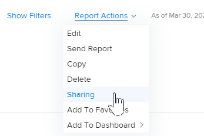

# Partage d’un rapport dans Adobe Workfront

Votre administrateur Adobe Workfront permet aux utilisateurs d’afficher ou de modifier des rapports lorsqu’ils attribuent des niveaux d’accès. Pour plus d’informations sur l’octroi de l’accès aux problèmes, voir [Accorder l’accès aux rapports, aux tableaux de bord et aux calendriers](../../../administration-and-setup/add-users/configure-and-grant-access/grant-access-reports-dashboards-calendars.md).

Outre le niveau d’accès qui est accordé aux utilisateurs, vous pouvez leur accorder des autorisations pour Afficher ou Gérer des rapports spécifiques que vous avez accès au partage. Pour plus d’informations sur les niveaux d’accès et les autorisations, voir [Fonctionnement des niveaux d’accès et des autorisations](../../../administration-and-setup/add-users/access-levels-and-object-permissions/how-access-levels-permissions-work-together.md).

Les autorisations sont spécifiques à un élément dans Workfront et définissent les actions que vous pouvez effectuer sur cet élément.

>[!NOTE]
>
>Un administrateur Workfront peut ajouter ou supprimer des autorisations à n’importe quel élément du système, pour tous les utilisateurs, sans en être le propriétaire.

## Exigences d’accès

Pour partager des objets, vous devez disposer des éléments suivants :

<table style="table-layout:auto"> 
 <col> 
 <col> 
 <tbody> 
  <tr> 
   <td role="rowheader">Formule Adobe Workfront*</td> 
   <td> 
Tous 
 </td> 
  </tr> 
  <tr> 
   <td role="rowheader">Licence Adobe Workfront*</td> 
   <td> 
Révision ou version ultérieure
 </td> 
  </tr> 
  <tr> 
   <td role="rowheader">Paramétrages du niveau d'accès*</td> 
   <td> 
Afficher l’accès ou une version ultérieure aux Rapports, tableaux de bord et calendriers
 
Remarque : Si vous n’avez toujours pas accès à , demandez à votre administrateur Workfront s’il définit des restrictions supplémentaires à votre niveau d’accès. Pour plus d’informations sur la façon dont un administrateur Workfront peut modifier votre niveau d’accès, voir <a href="../../../administration-and-setup/add-users/configure-and-grant-access/create-modify-access-levels.md" class="MCXref xref">Création ou modification de niveaux d’accès personnalisés</a>.
 </td> 
  </tr> 
  <tr> 
   <td role="rowheader">Autorisations d’objet</td> 
   <td> 
Afficher les autorisations ou une version ultérieure du rapport
 
Pour plus d’informations sur la demande d’accès supplémentaire, voir <a href="../../../workfront-basics/grant-and-request-access-to-objects/request-access.md" class="MCXref xref">Demande d’accès aux objets </a>.
 </td> 
  </tr> 
 </tbody> 
</table>

&#42;Pour connaître le plan, le type de licence ou l’accès dont vous disposez, contactez votre administrateur Workfront.

## Observations relatives au partage de rapports

Outre les considérations ci-dessous, reportez-vous également à la section [Partage de rapports, de tableaux de bord et de calendriers](../../../workfront-basics/grant-and-request-access-to-objects/permissions-reports-dashboards-calendars.md).

* Vous pouvez partager des rapports que vous créez avec d’autres personnes, équipes, groupes, rôles de travail ou entreprises. Vous pouvez également partager des rapports que d’autres utilisateurs ont créés et qui ont été partagés avec vous.
* Vous pouvez également les partager avec l’ensemble de votre organisation ou les rendre publiques. Rendre un rapport public génère une URL qui peut être partagée avec d’autres personnes.
* Vous pouvez partager un rapport individuel ou plusieurs rapports à partir d’une liste de rapports.

## Méthodes de partage des rapports

Vous pouvez partager des rapports dans Workfront de la manière suivante :

* Manuellement, comme décrit dans la section [Partage d’un rapport](#share-a-report) ci-dessous.
* Automatiquement, en héritant des autorisations Afficher d’un tableau de bord qui contient le rapport qui a été partagé. Pour plus d’informations sur l’affichage des autorisations héritées sur les objets, voir [Affichage des autorisations héritées sur les objets](../../../workfront-basics/grant-and-request-access-to-objects/view-inherited-permissions-on-objects.md).

## Partage d’un rapport {#share-a-report}

Partager un ou plusieurs rapports d&#39;une liste est identique.

1. Dans la liste des rapports, sélectionnez un ou plusieurs rapports, puis cliquez sur **Partager**.

   Ou

   Cliquez sur le nom d’un rapport, puis sur **Actions de rapport >****Partage**.

   

1. Dans la zone qui s’affiche, dans la variable **Ajoutez des personnes, des équipes, des rôles, des groupes ou des entreprises...** commencez à saisir le nom de l’utilisateur, de l’équipe, du rôle de tâche, du groupe ou de la société avec lequel vous souhaitez partager le rapport, puis appuyez sur **Entrée** lorsque le nom s’affiche.

1. Pour ajuster le niveau d’accès d’un nom que vous avez ajouté, cliquez sur le menu déroulant à droite du nom, puis sélectionnez l’une des options ci-dessous.

   <table style="table-layout:auto"> 
    <col> 
    <col> 
    <tbody> 
     <tr> 
      <td role="rowheader">L'afficher</td> 
      <td> 
Permet à votre destinataire d’accéder à l’affichage du rapport dans la variable <strong>Rapports</strong>  et exécutez-la.
 
Vous pouvez cliquer sur <strong>Paramètres avancés</strong> pour indiquer si vous souhaitez que l’utilisateur ou les utilisateurs puissent <strong>Partager</strong> avec n'importe qui dans le système.
 </td> 
     </tr> 
     <tr> 
      <td role="rowheader">Le gérer</td> 
      <td> 
Permet à votre destinataire d'accéder intégralement aux modifications du rapport.
 
Vous pouvez cliquer sur <strong>Paramètres avancés</strong> pour indiquer si vous souhaitez que l’utilisateur ou les utilisateurs puissent <strong>Supprimer</strong> le rapport du système et <strong>Partager</strong> avec n'importe qui dans le système.
 </td> 
     </tr> 
    </tbody> 
   </table>

1. (Facultatif) Répétez les 2 étapes précédentes pour ajouter d’autres noms à la liste et configurer leurs options.
1. (Facultatif) Cliquez sur le **Gear** icon  dans le coin supérieur droit de la boîte de partage, sélectionnez l’une des options suivantes :

   * **Rendre cette information publique aux utilisateurs externes :** Sélectionnez cette option pour générer une URL qui peut être partagée avec d’autres personnes. Toute personne disposant de l’URL peut accéder au rapport, sans disposer d’une licence Adobe Workfront.

      >[!CAUTION]
      >
      >Nous vous recommandons d’être prudent lors du partage d’un objet contenant des informations confidentielles avec des utilisateurs externes. Cela leur permet d’afficher des informations sans être un utilisateur Workfront ou un membre de votre entreprise.

      >[!NOTE]
      >
      >Si le rapport comporte une invite que vous partagez publiquement, les utilisateurs qui l’exécutent doivent être connectés à Workfront pour pouvoir exécuter le rapport à l’aide de l’invite. S’ils ne peuvent pas se connecter à Workfront, le rapport s’affiche sans l’invite qui lui est appliquée. Pour plus d’informations sur les limites du partage des rapports avec les invites, consultez la section . [Limites du partage des rapports demandés](../../../reports-and-dashboards/reports/creating-and-managing-reports/add-prompt-report.md#limitations-of-running-public-prompted-reports) dans l’article [Ajout d’une invite à un rapport](../../../reports-and-dashboards/reports/creating-and-managing-reports/add-prompt-report.md).

   * **Rendez visible à l’échelle du système :** Sélectionnez cette option pour que tous les utilisateurs de Workfront ayant accès aux rapports puissent voir le rapport.

1. Cliquer sur **Enregistrer**.
