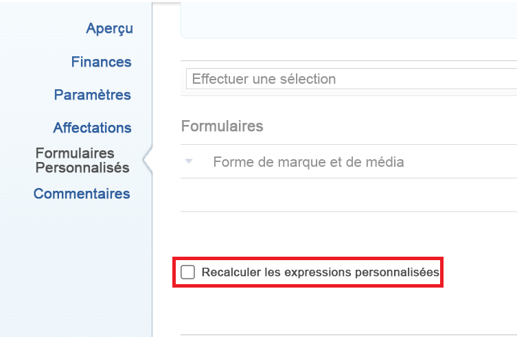
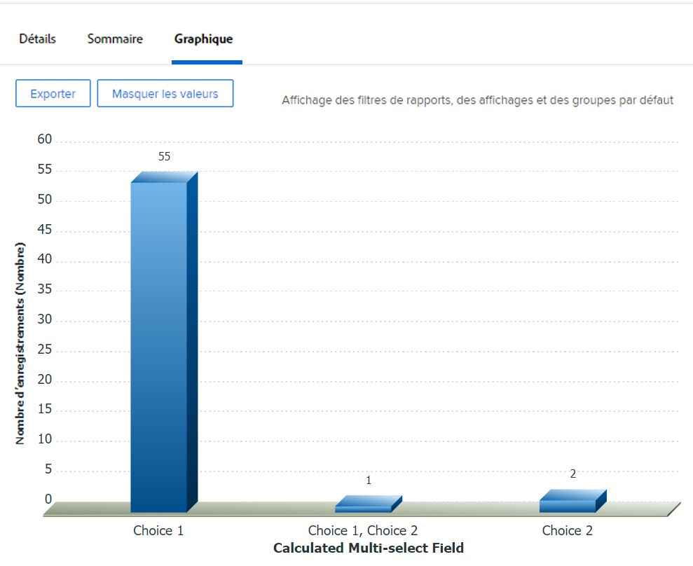

# Représentation graphique d’un rapport en fonction d’un champ personnalisé à sélection multiple

<!--The highlighted information on this page refers to functionality not yet generally available. It is available for all customers in the Preview environment and for a select group of customers in the Production environment.-->

Plutôt que de créer un graphique à l’aide d’un champ personnalisé à sélection multiple, nous vous recommandons de créer des champs distincts pour chaque option d’un champ personnalisé à sélection multiple.

Voici quelques exemples de champs personnalisés à sélection multiple :

* Cases à cocher
* Menus déroulants à sélection multiple

Pour plus d’informations sur l’utilisation du mode texte, consultez l’article [Présentation du mode texte](../../../reports-and-dashboards/reports/text-mode/understand-text-mode.md).

Cependant, s’il n’est pas possible de séparer les champs pour chaque option d’un champ à sélection multiple, vous pouvez créer un graphique pour un rapport selon un champ personnalisé à sélection multiple en utilisant des champs personnalisés calculés pour regrouper d’abord les choix à partir du champ à sélection multiple. Vous pouvez ensuite afficher le rapport en fonction des champs calculés.

>[!NOTE]
>
>Les éléments pour lesquels l’un des choix est sélectionné ne sont comptabilisés qu’une seule fois.
>
>Par exemple, si vous disposez d’un champ personnalisé Case à cocher avec les options Choix 1 et Choix 2 et que vous joignez le formulaire aux tâches, les tâches dont le Choix 1 et le Choix 2 s’affichent dans un élément de graphique distinct des tâches pour lesquelles seul Choix 1 ou Choix 2 sont sélectionnés.
>
>Les tâches pour lesquelles Choix 1 est sélectionné ne s’affichent pas dans le même élément de graphique que les tâches pour lesquelles Choix 1 et Choix 2 sont sélectionnées.

## Conditions d’accès

Vous devez disposer des accès suivants pour effectuer les étapes de cet article :

<table style="table-layout:auto"> 
 <col> 
 <col> 
 <tbody> 
  <tr> 
   <td role="rowheader">Forfait Adobe Workfront*</td> 
   <td> 
N’importe quelle
 </td> 
  </tr> 
  <tr> 
   <td role="rowheader">Licence Adobe Workfront*</td> 
   <td> 
Plan 
 </td> 
  </tr> 
  <tr> 
   <td role="rowheader">Configurations des niveau d’accès*</td> 
   <td> 
Modification de l’accès aux rapports, tableaux de bord et calendriers
 
Modifier l’accès aux filtres, vues et groupes
 
Remarque : si vous n’avez toujours pas d’accès, demandez à votre équipe d’administration Workfront s’il existe des restrictions supplémentaires à votre niveau d’accès. Pour plus d’informations sur la façon dont un administrateur ou une administratrice Workfront peut modifier votre niveau d’accès, voir <a href="../../../administration-and-setup/add-users/configure-and-grant-access/create-modify-access-levels.md" class="MCXref xref">Créer ou modifier les niveaux d’accès personnalisés</a>.
 </td> 
  </tr> 
  <tr> 
   <td role="rowheader">Autorisations d’objet</td> 
   <td> 
Gérer les autorisations d’un rapport
 
Pour plus d’informations sur la demande d’accès supplémentaire, voir <a href="../../../workfront-basics/grant-and-request-access-to-objects/request-access.md" class="MCXref xref">Demander l’accès aux objets</a>.
 </td> 
  </tr> 
 </tbody> 
</table>

&#42;Pour connaître le forfait, le type de licence ou l’accès dont vous disposez, contactez votre administrateur ou administratrice Workfront.

## Conditions préalables

Avant de commencer, vous devez créer un champ personnalisé calculé qui affiche les valeurs sélectionnées à partir du champ personnalisé à sélection multiple. Pour plus d’informations, voir la section [Créer un champ personnalisé calculé qui référence un champ personnalisé à sélection multiple](#build-a-calculated-custom-field-that-references-a-multi-select-custom-field) de cet article.

## Créer un rapport selon des champs personnalisés à sélection multiple

<!--

(NOTE: this moved to its own article, linked in the Note above!)

-->

Vous ne pouvez pas créer de graphique dans un rapport en référençant un champ personnalisé à sélection multiple. Vous pouvez plutôt créer un champ calculé qui enregistre les valeurs du champ personnalisé à sélection multiple sur un objet et un groupe donné par le champ calculé. 

* [ Créez un champ personnalisé calculé qui référence un champ personnalisé à sélection multiple ](#build-a-calculated-custom-field-that-references-a-multi-select-custom-field)
* [Créer un graphique qui référence un champ personnalisé calculé](#build-a-chart-that-references-a-calculated-custom-field)

### Créez un champ personnalisé calculé qui référence un champ personnalisé à sélection multiple. {#build-a-calculated-custom-field-that-references-a-multi-select-custom-field}

Pour créer un champ calculé qui référence un champ personnalisé à sélection multiple, les prérequis suivants doivent être remplis :

* Champ personnalisé à sélection multiple dans un formulaire personnalisé.\
  Pour plus d’informations sur la création de formulaires personnalisés et l’ajout de champs personnalisés, reportez-vous à l’article [Concevoir un formulaire avec le concepteur de formulaires](/help/quicksilver/administration-and-setup/customize-workfront/create-manage-custom-forms/form-designer/design-a-form/design-a-form.md).

* Un formulaire personnalisé avec un champ personnalisé à sélection multiple attaché aux objets.
* Valeurs du champ personnalisé à sélection multiple pour chaque objet.

Pour créer le champ personnalisé calculé qui référence le champ personnalisé à sélection multiple :

1. Créez un formulaire personnalisé ou modifiez un formulaire existant.

   Pour plus d’informations sur la création de formulaires personnalisés, voir [Concevoir un formulaire avec le concepteur de formulaires](/help/quicksilver/administration-and-setup/customize-workfront/create-manage-custom-forms/form-designer/design-a-form/design-a-form.md).

1. Sélectionnez le ou les objets que vous prévoyez d’utiliser avec le formulaire personnalisé.
1. Cliquez sur **Ajouter un champ**, puis sur **Calculé** pour ajouter le champ personnalisé à sélection multiple au formulaire.

1. Dans la zone **Label**, nommez le nouveau champ calculé pour indiquer qu’il fait référence au champ personnalisé à sélection multiple.

   Par exemple : &quot;Champ à sélection multiple calculé&quot;.

1. Dans la zone **Calcul**, saisissez le code suivant :

   `{DE:Multi-select Custom Field}`

   Les choix sélectionnés dans le champ personnalisé à sélection multiple sont ainsi ajoutés au champ personnalisé calculé. Par exemple, si le formulaire est joint aux tâches et que Choix 1 est sélectionné dans le champ personnalisé à sélection multiple, le champ personnalisé calculé affiche la valeur &quot;Choix 1&quot;. Si Choix 1 et Choix 2 sont sélectionnés pour une autre tâche, le champ personnalisé calculé affiche la valeur &quot;Choix 1, Choix 2&quot;.

1. Remplacez &quot;Champ personnalisé à sélection multiple&quot; par le nom réel de votre champ personnalisé à sélection multiple, tel qu’il apparaît dans Workfront.

   

1. (Facultatif) Si le champ personnalisé à sélection multiple figure déjà sur ce formulaire et si ce formulaire est déjà joint aux objets, activez l’option **Mettre à jour les calculs précédents (en arrière-plan)** .

   Ainsi, le nouveau champ calculé est automatiquement renseigné avec la valeur du champ personnalisé à sélection multiple, car il est ajouté aux formulaires déjà attachés aux objets.

1. Cliquez sur **Terminé**.
1. Cliquez sur **Enregistrer + Fermer**.

   Le champ personnalisé calculé est ajouté au formulaire personnalisé et, si le formulaire est actuellement associé à des objets, le champ est renseigné avec les informations du champ personnalisé à sélection multiple.

### Créer un graphique qui référence un champ personnalisé calculé {#build-a-chart-that-references-a-calculated-custom-field}

1. (Facultatif) Pour vous assurer que tous les champs calculés à partir desquels vous souhaitez effectuer un graphique sont renseignés par des valeurs, dans l’onglet Détails du rapport, sélectionnez tous les objets qui contiennent le formulaire personnalisé avec le champ personnalisé à sélection multiple et le champ personnalisé calculé, puis cliquez sur **Modifier**.
1. (Facultatif et conditionnel) Sélectionnez le champ **Recalculer les expressions personnalisées** , puis cliquez sur **Enregistrer les modifications**.\
   

   >[!NOTE]
   >
   >Cette option a été supprimée de la modification des projets en bloc.  Vous pouvez toujours recalculer les expressions pour les projets en masse en cliquant sur l’icône **Plus**  en haut de la liste des projets, puis **Recalculer les expressions**.

1. Accédez au rapport dans lequel vous souhaitez ajouter le graphique pour le champ calculé qui référence le champ personnalisé à sélection multiple.
1. Cliquez sur **Actions de rapport**, puis sur **Modifier**.

1. Sélectionnez l’onglet <strong>Groupings</strong> , puis cliquez sur <strong>Ajouter un groupement</strong>.
1. Ajoutez le <strong>Champ à sélection multiple calculé</strong> que vous avez créé comme regroupement.
1. Sélectionnez l&#39;onglet <strong>Graphique</strong> et ajoutez un graphique à votre rapport.

   Par exemple, choisissez un graphique **Column**.
    Pour plus d’informations sur l’ajout d’un graphique à un rapport, reportez-vous à la section <a href="../../../reports-and-dashboards/reports/creating-and-managing-reports/create-custom-report.md#add-a-chart" class="MCXref xref"> Ajout d’un graphique à un rapport</a> de l’article <a href="../../../reports-and-dashboards/reports/creating-and-managing-reports/create-custom-report.md" class="MCXref xref">Créer un rapport personnalisé</a>.
1. Dans le champ **Axe inférieur (X)** , sélectionnez le <strong>Champ à sélection multiple calculé</strong> à afficher dans le graphique.
1. Cliquez sur <strong>Enregistrer + Fermer</strong>.

   Le rapport affiche les résultats regroupés par champ à sélection multiple calculé dans un graphique.

   