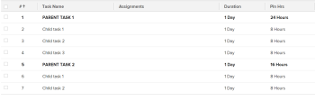

# Afficher : afficher le nom des tâches parentes sous forme de majuscules ;

Vous pouvez ajouter cette colonne à une vue de tâche pour afficher le nom des tâches parentes dans toutes les majuscules.

## Exigences d’accès

Vous devez disposer des accès suivants pour effectuer les étapes de cet article :

<table style="table-layout:auto"> 
 <col> 
 <col> 
 <tbody> 
  <tr> 
   <td role="rowheader">Formule Adobe Workfront*</td> 
   <td> 
Tous
 </td> 
  </tr> 
  <tr> 
   <td role="rowheader">Licence Adobe Workfront*</td> 
   <td> 
Plan 
 </td> 
  </tr> 
  <tr> 
   <td role="rowheader">Paramétrages du niveau d'accès*</td> 
   <td> 
Modification de l’accès aux rapports, tableaux de bord et calendriers
 
Modifier l’accès aux filtres, vues et groupes
 
Remarque : Si vous n’avez toujours pas accès à , demandez à votre administrateur Workfront s’il définit des restrictions supplémentaires à votre niveau d’accès. Pour plus d’informations sur la façon dont un administrateur Workfront peut modifier votre niveau d’accès, voir <a href="../../../administration-and-setup/add-users/configure-and-grant-access/create-modify-access-levels.md" class="MCXref xref">Création ou modification de niveaux d’accès personnalisés</a>.
 </td> 
  </tr> 
  <tr> 
   <td role="rowheader">Autorisations d’objet</td> 
   <td> 
Gestion des autorisations d’un rapport
 
Pour plus d’informations sur la demande d’accès supplémentaire, voir <a href="../../../workfront-basics/grant-and-request-access-to-objects/request-access.md" class="MCXref xref">Demande d’accès aux objets </a>.
 </td> 
  </tr> 
 </tbody> 
</table>

&#42;Pour connaître le plan, le type de licence ou l’accès dont vous disposez, contactez votre administrateur Workfront.

## Afficher le nom des tâches parentes sous forme de majuscules

Pour créer cette colonne dans une vue de tâche :

1. Accédez à une liste de tâches.
1. Dans la **Affichage** menu déroulant, sélectionnez **Vue Personnaliser**.\
   Ou\
   Dans la **Affichage** menu déroulant, sélectionnez **Nouvelle vue**.

1. Dans le **Aperçu des colonnes** , cliquez sur l’en-tête de la colonne qui indique le nom de la tâche dans la liste.
1. Cliquez sur **Passer en mode Texte**.
1. Placez le pointeur de la souris sur la zone de mode de texte, puis cliquez sur **Cliquer pour modifier le texte**.
1. Supprimez le texte que vous trouvez dans la **Mode texte** et remplacez-le par le code suivant : <pre>descriptionkey=name displayname=Task Name textmode=true valueexpression=IF({numberOfChildren}>&quot;0&quot;,UPPER({name}),{name}) valueformat=HTML width=150 </pre>

1. Cliquez sur **Enregistrer la vue**.
