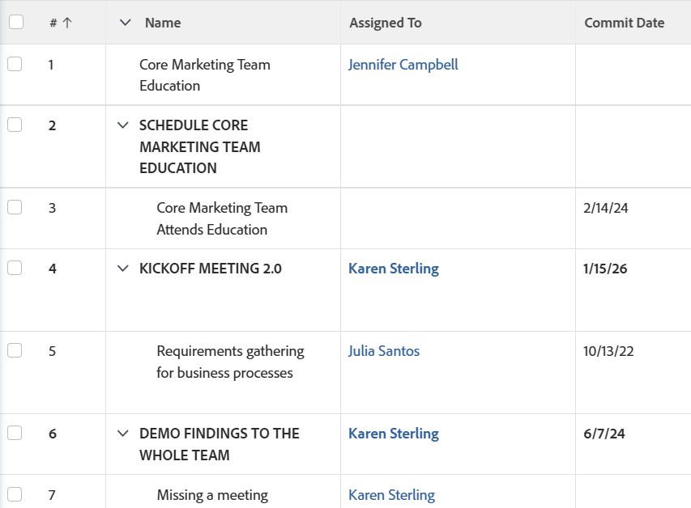

# Vue : afficher le nom des tâches parent en majuscules

<!--Audited: 10/2024-->

Vous pouvez ajouter cette colonne à une vue de tâche pour afficher le nom des tâches parent en majuscules.



## Conditions d’accès

+++ Développez pour afficher les exigences d’accès aux fonctionnalités de cet article. 

<table style="table-layout:auto"> 
 <col> 
 <col> 
 <tbody> 
  <tr> 
   <td role="rowheader">Package Adobe Workfront</td> 
   <td> <p>Tous</p> </td> 
  </tr> 
  <tr> 
   <td role="rowheader">Licence Adobe Workfront</td> 
   <td> 
   <p>Contributeur ou demande de modification d’un filtre </p>
   <p>Standard ou Plan pour modifier un rapport</p>
  </tr> 
  <tr> 
   <td role="rowheader">Configurations des niveaux d’accès</td> 
   <td> <p>Modifier l’accès aux rapports, tableaux de bord et calendriers pour modifier un rapport</p> <p>Modifier l’accès aux filtres, aux vues et aux regroupements pour modifier un filtre</p> </td> 
  </tr> 
  <tr> 
   <td role="rowheader">Autorisations d’objet</td> 
   <td> <p>Gérer les autorisations d’un rapport</p>  </td> 
  </tr> 
 </tbody> 
</table>

Pour plus de détails sur les informations contenues dans ce tableau, consultez l’article [Conditions d’accès dans la documentation Workfront](/help/quicksilver/administration-and-setup/add-users/access-levels-and-object-permissions/access-level-requirements-in-documentation.md).

+++

## Afficher le nom des tâches parent en majuscules

Pour créer cette colonne dans une vue de tâche :

1. Accédez à une liste de tâches.
1. Dans le menu déroulant **Vue**, sélectionnez une vue, puis cliquez sur l&#39;icône **Modifier** .
Ou\
   Dans le menu déroulant **Vue**, sélectionnez **Nouvelle vue**.

1. Dans la zone **Aperçu de la colonne**, cliquez sur l’en-tête de la colonne qui affiche le nom de la tâche dans la liste.
1. Cliquez sur **Basculer en mode texte** puis sur **Modifier le mode texte**.
1. Supprimez le texte qui se trouve dans la zone **Mode texte** et remplacez-le par le code suivant :

   ```
   linkedname=direct
   namekey=name
   querysort=name
   styledef.case.0.comparison.icon=false
   styledef.case.0.comparison.leftmethod=numberOfChildren
   styledef.case.0.comparison.lefttext=numberOfChildren
   styledef.case.0.comparison.operator=gt
   styledef.case.0.comparison.operatortype=int
   styledef.case.0.comparison.righttext=0
   styledef.case.0.comparison.trueproperty.0.name=fontstyle
   styledef.case.0.comparison.trueproperty.0.value=bold
   valueexpression=IF({numberOfChildren}>"0",UPPER({name}),{name})
   valueformat=HTML
   ```

1. Cliquez sur **Terminé**, puis cliquez sur **Enregistrer l’affichage**.
