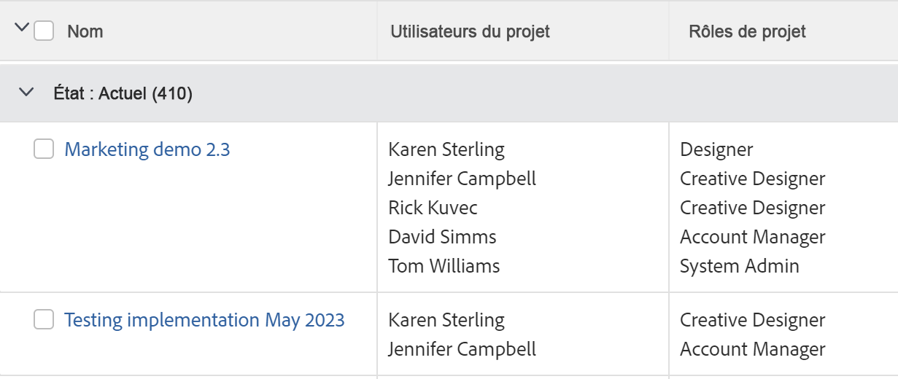

# Rapports ou listes : afficher les utilisateurs et utilisatrices associés à un objet

Vous pouvez afficher les utilisateurs et les utilisatrices, les fonctions et les équipes associés aux objets dans les rapports ou les listes, et les référencer dans les filtres. Vous ne pouvez pas les regrouper par utilisateurs et utilisatrices, fonctions ou équipes associés à des objets.

Vous pouvez afficher ou filtrer par utilisateurs et utilisatrices, fonctions ou équipes associés aux objets suivants :

<table style="table-layout:auto"> 
 <col> 
 <col> 
 <tbody> 
  <tr> 
   <td role="rowheader">Objet</td> 
   <td>Utilisateurs et utilisatrices ou fonctions associés</td> 
  </tr> 
  <tr> 
   <td role="rowheader">Projet</td> 
   <td> 
Vous pouvez afficher l’ensemble des utilisateurs et des utilisatrices ainsi que les fonctions exercées dans le cadre d’un projet dans un rapport sur les projets. Vous ne pouvez pas filtrer en utilisant les utilisateurs et les utilisatrices ou les fonctions qui leur sont associées dans un rapport sur les projets. 
 </td> 
  </tr> 
  <tr> 
   <td role="rowheader">Tâches</td> 
   <td>Vous pouvez afficher et filtrer par l’ensemble des utilisateurs et des utilisatrices ainsi que par les fonctions et équipes associés à une tâche dans un rapport sur les tâches.</td> 
  </tr> 
  <tr> 
   <td role="rowheader">Problèmes</td> 
   <td>Vous pouvez afficher et filtrer par l’ensemble des utilisateurs et des utilisatrices ainsi que par les fonctions et équipes associés à un problème dans un rapport sur les problèmes.</td> 
  </tr> 
  <tr> 
   <td role="rowheader">Portefeuilles</td> 
   <td>Vous pouvez afficher l’ensemble des utilisateurs et des utilisatrices ainsi que les fonctions exercées dans le cadre d’un projet dans un rapport sur les projets et regrouper le rapport par portfolio. Vous ne pouvez pas filtrer en utilisant les utilisateurs et les utilisatrices ou les fonctions qui leur sont associées dans un rapport sur les projets.</td> 
  </tr> 
  <tr> 
   <td role="rowheader">Programmes</td> 
   <td>Vous pouvez afficher l’ensemble des utilisateurs et des utilisatrices ainsi que les fonctions exercées dans le cadre d’un projet dans un rapport sur les projets et regrouper le rapport par programme. Vous ne pouvez pas filtrer en utilisant les utilisateurs et les utilisatrices ou les fonctions qui leur sont associées dans un rapport sur les projets.</td> 
  </tr> 
 </tbody> 
</table>

## Afficher l’ensemble des utilisateurs et des utilisatrices ainsi que les fonctions associés à un projet

Vous pouvez afficher l’ensemble des utilisateurs et des utilisatrices associés au projet dans une vue de liste de projets ou de rapport. Cela inclut tous les utilisateurs et utilisatrices que la section « Personnes » du projet répertorie. Dans un rapport sur les projets, vous pouvez également afficher les fonctions qui leur sont associées lorsque des tâches ou des problèmes de projet leur sont également affectés.

Pour plus d’informations sur la création d’un rapport sur les projets afin d’afficher l’ensemble des utilisateurs et des utilisatrices ainsi que leurs fonctions sur le projet, consultez la section [Vue : liste des utilisateurs et des utilisatrices du projet avec leurs fonctions](../../../reports-and-dashboards/reports/custom-view-filter-grouping-samples/view-project-user-list.md).

Vous ne pouvez pas filtrer les personnes ou les fonctions associées aux projets dans un filtre de projet.

## Afficher l’ensemble des utilisateurs et utilisatrices, fonctions ou équipes affectés à une tâche

Dans la vue d’une liste de tâches ou d’un rapport, vous pouvez afficher l’ensemble des utilisateurs et utilisatrices, fonctions ou équipes affectés à une tâche en y ajoutant le champ « Affectations ».

Vous pouvez filtrer par utilisateurs et utilisatrices, fonctions ou équipes affectés à des tâches en référençant les champs suivants dans un filtre de tâche :

* Utilisateurs de l’affectation
* Rôles pour l’affectation
* Equipe

## Afficher l’ensemble des utilisateurs et utilisatrices, fonctions ou équipes affectés à un problème

Dans la vue d’une liste de problèmes ou d’un rapport, vous pouvez afficher l’ensemble des utilisateurs et utilisatrices, fonctions ou équipes affectés à un problème en y ajoutant le champ « Affectations ».

Vous pouvez filtrer par utilisateurs et utilisatrices, fonctions ou équipes affectés à des problèmes en référençant les champs suivants dans un filtre de problème :

* Utilisateurs de l’affectation
* Rôles pour l’affectation
* Equipe

## Afficher l’ensemble des utilisateurs et utilisatrices, fonctions ou équipes affectés à un portfolio

Dans un rapport sur les projets, vous pouvez afficher l’ensemble des utilisateurs et utilisatrices et fonctions affectés à un portfolio en les affichant, puis en regroupant le rapport par portfolio.

Pour plus d’informations sur la création d’un rapport sur les projets afin d’afficher l’ensemble des utilisateurs et des utilisatrices et leurs fonctions sur le projet, consultez la section [Vue : liste des utilisateurs et des utilisatrices de projet avec leurs fonctions](../../../reports-and-dashboards/reports/custom-view-filter-grouping-samples/view-project-user-list.md).

Vous ne pouvez pas filtrer les utilisateurs et utilisatrices ou les fonctions affectés aux projets d’un portfolio ou d’un filtre de projet.

## Afficher l’ensemble des utilisateurs et utilisatrices et fonctions affectés à un programme

Vous pouvez afficher l’ensemble des utilisateurs et utilisatrices et fonctions affectés à un programme en les affichant dans un rapport sur les projets, puis en regroupant le rapport par programme.

Pour plus d’informations sur la création d’un rapport sur les projets afin d’afficher l’ensemble des utilisateurs et utilisatrices et leurs fonctions sur le projet, consultez la section [Vue : liste des utilisateurs et utilisatrices de projet avec leurs fonctions](../../../reports-and-dashboards/reports/custom-view-filter-grouping-samples/view-project-user-list.md).

Vous ne pouvez pas filtrer par utilisateurs et utilisatrices ou fonctions affectés aux projets dans un programme ou un filtre de projet.
