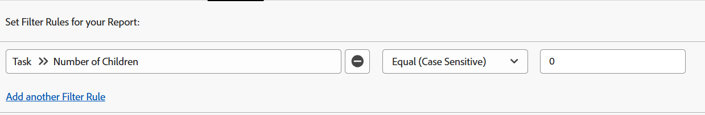
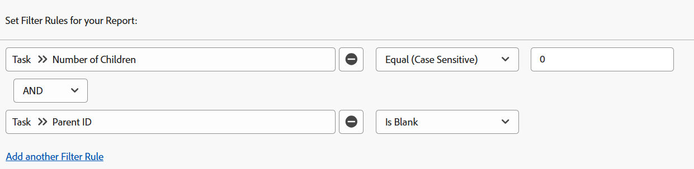

# Filtre : afficher les tâches parents

<!--Audited: 10/2024-->

Vous pouvez appliquer les filtres de tâches ci-dessous pour afficher les tâches opérationnelles. Les tâches opérationnelles sont des tâches qui peuvent être accomplies de manière indépendante et qui ne sont pas des tâches parents d’autres tâches. Dans un exemple, un filtre identifie les tâches enfants qui pourraient être elles-mêmes des parents. Dans ce cas, il ne s’agit pas de tâches opérationnelles.

>[!TIP]
>
>* Si vous envisagez d’ajouter plusieurs filtres à un rapport, nous vous recommandons d’ajouter tous vos filtres à l’aide de l’interface du Report Builder, puis de cliquer sur Basculer en mode texte après avoir ajouté toutes les autres règles de filtrage. Vous pouvez ensuite ajouter le code du filtre de tâche parent comme indiqué ci-dessus. 
>* Nous vous recommandons également d’ajouter un regroupement pour le nom du projet afin de faciliter la lecture du rapport. Pour plus d’informations sur l’ajout de regroupements à vos rapports, consultez l’article [Vue d’ensemble des regroupements dans Adobe Workfront](../../../reports-and-dashboards/reports/reporting-elements/groupings-overview.md).
>

## Conditions d’accès

+++ Développez pour afficher les exigences d’accès aux fonctionnalités de cet article. 

<table style="table-layout:auto"> 
 <col> 
 <col> 
 <tbody> 
  <tr> 
   <td role="rowheader">Package Adobe Workfront</td> 
   <td> <p>Tous</p> </td> 
  </tr> 
  <tr> 
   <td role="rowheader">Licence Adobe Workfront</td> 
   <td> 
   <p>Contributeur ou demande de modification d’un filtre </p>
   <p>Standard ou Plan pour modifier un rapport</p>
  </tr> 
  <tr> 
   <td role="rowheader">Configurations des niveaux d’accès</td> 
   <td> <p>Modifier l’accès aux rapports, tableaux de bord et calendriers pour modifier un rapport</p> <p>Modifier l’accès aux filtres, aux vues et aux regroupements pour modifier un filtre</p> </td> 
  </tr> 
  <tr> 
   <td role="rowheader">Autorisations d’objet</td> 
   <td> <p>Gérer les autorisations d’un rapport</p>  </td> 
  </tr> 
 </tbody> 
</table>

Pour plus de détails sur les informations contenues dans ce tableau, consultez l’article [Conditions d’accès dans la documentation Workfront](/help/quicksilver/administration-and-setup/add-users/access-levels-and-object-permissions/access-level-requirements-in-documentation.md).

+++

## Afficher les tâches sans enfants (elles peuvent avoir un parent)

Vous pouvez appliquer le filtre suivant à un rapport de tâches pour afficher les tâches sans enfants. Ils pourraient avoir leurs propres parents et être les enfants d&#39;autres tâches.

1. À partir de l&#39;icône **Menu principal**  dans le coin supérieur droit, ou des lignes **Menu principal**  dans le coin supérieur gauche, cliquez sur **Rapports**.

1. Cliquez sur **Nouveau rapport**.
1. Sélectionnez un **Rapport de tâche**.
1. Cliquez sur **Filtres**.
1. Cliquez sur **Ajouter une règle de filtre**.
1. Dans la ligne **Commencer à saisir le nom du champ...**, commencez à saisir **Nombre d’enfants**, puis cliquez sur **Tâche >> Nombre d’enfants** lorsqu’elle s’affiche dans la liste.

1. Sélectionnez **Égal (sensible à la casse)** pour votre modificateur, puis saisissez **0** pour le nombre d’enfants.\
   

   Ou

   Cliquez sur **Passer en mode texte**, puis, dans la fenêtre d’édition de texte, copiez et collez le texte suivant :

   ```
   numberOfChildren=0
   numberOfChildren_Mod=eq
   ```


1. Cliquez sur **Enregistrer + Fermer**.

   Cela permet d’obtenir un rapport pour toutes les tâches qui sont des tâches opérationnelles dans votre système. Certaines de ces tâches peuvent avoir un parent, mais elles ne sont pas elles-mêmes des tâches parents.

## Afficher les tâches avec des parents (elles peuvent avoir des enfants)

Vous pouvez appliquer le filtre suivant à un rapport de tâche pour afficher les tâches avec des parents, ce qui signifie qu’il s’agit de tâches enfants. Toutefois, ces tâches peuvent également avoir des enfants, car le filtre n’exclut pas leurs enfants. Les tâches enfants qui sont également des parents d’autres tâches ne sont pas considérées comme des tâches opérationnelles.

1. À partir de l&#39;icône **Menu principal**  dans le coin supérieur droit, ou des lignes **Menu principal**  dans le coin supérieur gauche, cliquez sur **Rapports**.

1. Cliquez sur **Nouveau rapport**.
1. Sélectionnez un **Rapport de tâche**.
1. Cliquez sur **Filtres**.
1. Cliquez sur **Ajouter une règle de filtre**.
1. Sur la ligne **Commencer à saisir le nom du champ...**, commencez à saisir **ID parent**, puis sélectionnez **Tâche >> ID parent** lorsqu’il s’affiche dans la liste.
1. Sélectionnez **N’est pas vide** pour votre modificateur.

   

   Ou

   Cliquez sur **Passer en mode texte**, et dans la fenêtre d’édition de texte, copiez et collez le texte suivant : 

   `parentID_Mod=notblank`

1. Cliquez sur **Enregistrer + Fermer**.

   Cela permet d’obtenir un rapport pour toutes les tâches de votre système qui ont des parents et qui sont des tâches enfants de ces mêmes parents. Certaines de ces tâches peuvent également être elles-mêmes parents.

## Afficher les tâches sans enfants ni parents (tâches indépendantes)

Vous pouvez appliquer le filtre suivant à un rapport de tâches pour afficher les tâches de travail autonomes. Ces tâches n&#39;ont pas de parent et n&#39;ont pas d&#39;enfant.

1. À partir de l&#39;icône **Menu principal**  dans le coin supérieur droit, ou des lignes **Menu principal**  dans le coin supérieur gauche, cliquez sur **Rapports**.

1. Cliquez sur **Nouveau rapport**.
1. Sélectionnez un **Rapport de tâche**.
1. Cliquez sur **Filtres**.
1. Cliquez sur **Ajouter une règle de filtre**.
1. Dans la liste **Commencer à saisir le nom du champ...** ligne, commencez à saisir **Nombre d’enfants**, puis sélectionnez **Tâche >> Nombre d’enfants**.
1. Sélectionnez **Égal (sensible à la casse)** pour votre modificateur, puis saisissez **0** pour le nombre d’enfants.
1. Cliquez sur **Ajouter une autre règle de filtre**.
1. Dans la ligne **Commencer à saisir le nom du champ...**, commencez à saisir **ID parent**, puis sélectionnez **Tâche >> ID parent** dans la liste.
1. Sélectionnez **Vide** pour le modificateur.

   

   Ou

   Au lieu des étapes 6 à 10 <!--ensure steps above stay accurate-->, cliquez sur **Passer en mode texte** et dans la fenêtre d’édition de texte, copiez et collez le texte suivant :

   ```
   numberOfChildren=0
   numberOfChildren_Mod=eq
   parentID_Mod=isblank
   ```

1. Cliquez sur **Enregistrer + Fermer**.

   Cela permet d’obtenir un rapport sur toutes les tâches de votre système qui n’ont ni parents ni enfants. Il s’agit de tâches opérationnelles indépendantes.
