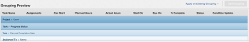

# Regroupement : ajouter un quatrième regroupement à une liste

Vous pouvez avoir 4 regroupements dans un rapport de matrice. Pour plus d’informations sur les rapports de matrice, voir [Créer un rapport de matrice](../../../reports-and-dashboards/reports/creating-and-managing-reports/create-matrix-report.md).

Vous ne pouvez avoir que 3 regroupements dans un rapport standard via l’interface standard. Pour ajouter un 4ème regroupement dans un rapport standard, vous devez utiliser le mode texte.



Par exemple, vous pouvez avoir un rapport de tâche qui est regroupé par Nom du projet, Statut de la progression et Date d’achèvement prévue, mais vous souhaitez également regrouper le rapport par Affecté au nom.

## Conditions d’accès

Vous devez disposer des accès suivants pour effectuer les étapes décrites dans cet article :

<table style="table-layout:auto"> 
 <col> 
 <col> 
 <tbody> 
  <tr> 
   <td role="rowheader">Formule Adobe Workfront*</td> 
   <td> <p>Tous</p> </td> 
  </tr> 
  <tr> 
   <td role="rowheader">Licence Adobe Workfront*</td> 
   <td> <p>Demander à modifier un regroupement </p>
   <p>Prévoir de modifier un rapport</p> </td> 
  </tr> 
  <tr> 
   <td role="rowheader">Configurations du niveau d’accès*</td> 
   <td> <p>Modifier l’accès aux rapports, tableaux de bord et calendriers pour modifier un rapport</p> <p>Modifier l’accès aux filtres, vues et regroupements pour modifier un regroupement</p> <p><b>NOTE</b>

Si vous n’avez toujours pas accès, demandez à votre administrateur ou administratrice Workfront si votre niveau d’accès est soumis à des restrictions supplémentaires. Pour plus d’informations sur la façon dont l’administration Workfront peut modifier votre niveau d’accès, consultez la section <a href="../../../administration-and-setup/add-users/configure-and-grant-access/create-modify-access-levels.md" class="MCXref xref">Créer ou modifier des niveaux d’accès personnalisés</a>.</p> </td>
</tr>  
  <tr> 
   <td role="rowheader">Autorisations d’objet</td> 
   <td> <p>Gérer les autorisations d’un rapport</p> <p>Pour plus d’informations sur la demande d’accès supplémentaire, voir <a href="../../../workfront-basics/grant-and-request-access-to-objects/request-access.md" class="MCXref xref">Demander l’accès aux objets </a>.</p> </td> 
  </tr> 
 </tbody> 
</table>

&#42;Pour connaître le plan, le type de licence ou l’accès dont vous disposez, contactez votre équipe d’administration Workfront.

## Ajouter un quatrième regroupement à une liste

Pour ajouter un quatrième regroupement :

1. Accédez à une liste de tâches.
1. Dans le menu déroulant **Regroupement**, sélectionnez **Nouveau regroupement**.

1. Cliquez sur **Basculer en mode texte**.
1. Dans l’espace disponible, ajoutez le code suivant :

   ```
   group.0.linkedname=project<br>group.0.namekey=view.relatedcolumn<br>group.0.namekeyargkey.0=project<br>group.0.namekeyargkey.1=name<br>group.0.valuefield=project:name<br>group.0.valueformat=string<br>group.1.enumclass=com.attask.common.constants.ProgressStatusEnum<br>group.1.enumtype=TASK<br>group.1.linkedname=direct<br>group.1.namekey=progressStatus<br>group.1.type=enum<br>group.1.valuefield=progressStatus<br>group.1.valueformat=val<br>group.2.groupdatesby=WY<br>group.2.linkedname=direct<br>group.2.namekey=plannedCompletionDate<br>group.2.notime=false<br>group.2.valuefield=plannedCompletionDate<br>group.2.valueformat=atDateAsWeekString<br><strong>group.3.valuefield=assignedTo:name</strong><br style="font-weight: bold;"><strong>group.3.valueformat=HTML</strong><br>textmode=true
   ```

1. Cliquez sur **Terminé**, puis sur **Enregistrer le regroupement**.
