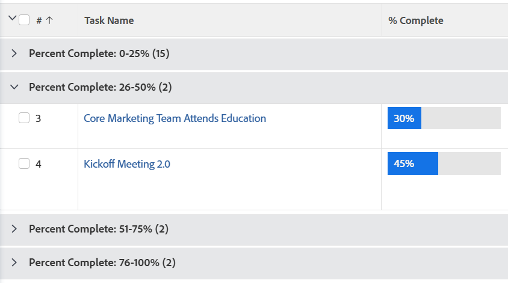

# Regroupement : organise les résultats de la liste en fonction d’une valeur calculée commune à tous les objets du regroupement.

<!--Audited: 10/2024-->

Vous pouvez afficher vos tâches groupées par « Pourcentage d’achèvement » dans des fourchettes de 0 à 25, 26 à 50, 51 à 75, 75 à 99 et 100. Pour ce faire, vous pouvez créer un regroupement en mode texte.



## Conditions d’accès

+++ Développez pour afficher les exigences d’accès aux fonctionnalités de cet article.

Vous devez disposer des accès suivants pour effectuer les étapes décrites dans cet article :

<table style="table-layout:auto"> 
 <col> 
 <col> 
 <tbody> 
  <tr> 
   <td role="rowheader">Formule Adobe Workfront</td> 
   <td> <p>Tous</p> </td> 
  </tr> 
  <tr> 
   <td role="rowheader">Licence Adobe Workfront*</td> 
   <td> 
    <p>Nouveau :</p>
   <ul><li><p>Contributeur pour modifier un filtre </p></li>
   <li><p>Standard pour modifier un rapport</p></li> </ul>

<p>Actuel :</p>
   <ul><li><p>Demande de modification d’un filtre </p></li>
   <li><p>Prévoir de modifier un rapport</p></li> </ul></td> 
  </tr> 
  <tr> 
   <td role="rowheader">Configurations des niveaux d’accès</td> 
   <td> <p>Modifier l’accès aux rapports, tableaux de bord et calendriers pour modifier un rapport</p> <p>Modifier l’accès aux filtres, aux vues et aux regroupements pour modifier un filtre</p> </td> 
  </tr> 
  <tr> 
   <td role="rowheader">Autorisations d’objet</td> 
   <td> <p>Gérer les autorisations d’un rapport</p>  </td> 
  </tr> 
 </tbody> 
</table>

*Pour plus d’informations, voir [Conditions d’accès dans la documentation de Workfront](/help/quicksilver/administration-and-setup/add-users/access-levels-and-object-permissions/access-level-requirements-in-documentation.md).

+++

## Organiser les résultats d’une liste en fonction d’une valeur calculée commune à tous les objets du regroupement

Pour appliquer ce regroupement à une liste de tâches :

1. Accédez à une liste de tâches.
1. Dans le menu déroulant **Regroupement**, sélectionnez **Nouveau regroupement**.

1. Cliquez sur **Basculer en mode texte**.
1. Dans l’espace disponible, ajoutez le code suivant :

   ```
   textmode=true
   group.0.valueexpression=IF({percentComplete}>=0&&{percentComplete}<=25,'0-25%',IF({percentComplete}>25&&{percentComplete}<=50,'26-50%',IF({percentComplete}>50&&{percentComplete}<=75,'51-75%',IF({percentComplete}>75&&{percentComplete}<=100,'76-100%',''))))
   group.0.linkedname=direct
   group.0.valueformat=doubleAsString
   group.0.namekey=percentComplete
   ```

1. Cliquez sur **Terminé**, puis sur **Enregistrer le regroupement**.
1. (Facultatif) Mettez à jour le nom du regroupement, puis cliquez sur **Enregistrer le regroupement**.
